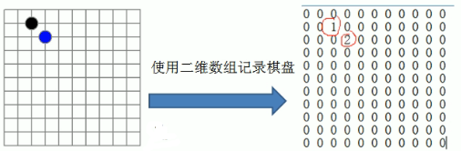
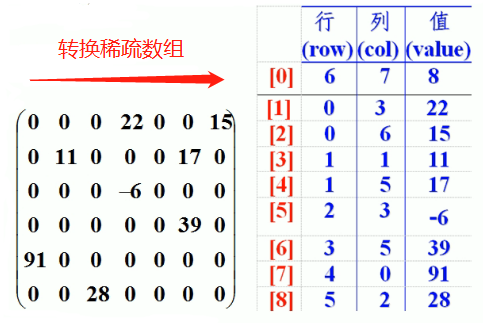
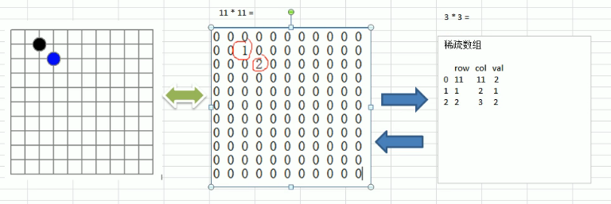
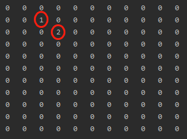
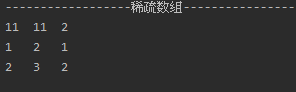
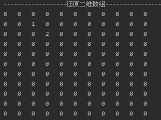

<!-- TOC -->

- [1. 稀疏数组 sparse array 实际应用场景](#1-稀疏数组-sparse-array-实际应用场景)
  - [1.1. 需求](#11-需求)
  - [1.2. 方案](#12-方案)
  - [1.3. 讨论](#13-讨论)
- [2. 稀疏数组基本介绍](#2-稀疏数组基本介绍)
  - [2.1. 定义](#21-定义)
  - [2.2. 处理方法](#22-处理方法)
  - [2.3. 转换实例](#23-转换实例)
  - [2.4. 实例分析](#24-实例分析)
- [3. 稀疏数组应用实例分析](#3-稀疏数组应用实例分析)
  - [3.1. 要求](#31-要求)
  - [3.2. 转换思路分析](#32-转换思路分析)
    - [3.2.1. 二维数组 转 稀疏数组的思路](#321-二维数组-转-稀疏数组的思路)
    - [3.2.2. 稀疏数组 转 二维数组的思路](#322-稀疏数组-转-二维数组的思路)
  - [3.3. 代码实现](#33-代码实现)
  - [3.4. 全篇完整代码实现](#34-全篇完整代码实现)

<!-- /TOC -->

****
[博主的 Github 地址](https://github.com/leon9dragon)
****

## 1. 稀疏数组 sparse array 实际应用场景

### 1.1. 需求  
在五子棋程序中, 要能随时对棋盘进行存档和加载.

  
****

### 1.2. 方案  
将棋盘转换成二维数组, 并按棋子种类进行区分,   
0 代表该点没有落子,  
1 代表改点放的是黑子,  
2 代表改点放的是蓝子.
****

### 1.3. 讨论
最后得出了如上图右边的数组,  
可以看到由于该二维数组很多值默认是 0,  
记录了很多没有意义的数据, 因此可用稀疏数组进行存储.
****

## 2. 稀疏数组基本介绍

### 2.1. 定义
当一个数组中大部分元素为 0, 或者为同一个值的数组时,  
可以用稀疏数组来保存该数组.
****

### 2.2. 处理方法
1. 记录数组一共有几行几列, 有多少个不同的值.  
2. 把具有不同值的元素的行列及值记录在一个小规模数组中,  
   从而缩小程序的规模. 
****

### 2.3. 转换实例
  
****

### 2.4. 实例分析  
如上图所示, 右边的就是转换后的稀疏数组,   
稀疏数组的第一行和下面行的内容有所区别:  
- 第一行存储的内容分别是:  
  - 原数组的行数
  - 原数组的列数
  - 原数组中不同值元素的数量
- 下面行存储的内容分别是:
  - 不同值元素所在的行号
  - 不同值元素所在的列号
  - 不同值元素自身的数值

因此, 数组由原来的 `6*7` 大小变成了 `9*3` 的大小.  
一定程度上节省了空间, 将数组规模变小.


****

## 3. 稀疏数组应用实例分析

### 3.1. 要求
1) 用稀疏数组来保存类似之前的二维数组(棋盘, 地图等)
2) 将稀疏数组存盘, 并可重新恢复原来的二维数组
****

### 3.2. 转换思路分析
- 以前面的棋盘为例, 进行转换  



#### 3.2.1. 二维数组 转 稀疏数组的思路
1) 遍历原始的二维数组, 得到有效数据的个数 sum  
   有效数据的个数决定了稀疏数组的行数, 行数为 sum+1
   
2) 根据 sum 创建稀疏数组 `sparseArr = int[sum+1][3]`  
   稀疏数组固定为 3 列, 每列对应的是 row col 和 val  
   注意第一行和后面行的数据的意义是不一样的.  
   第一行存的是原始数组的行数列数以及有效元素个数,  
   后面行存的是有效元素在原数组中的行号列号及数值.

3) 将二维数组的有效数据存入稀疏数组中

</br>

#### 3.2.2. 稀疏数组 转 二维数组的思路
1) 先读取稀疏数组的第一行,  
   根据第一行的数据创建原始的二维数组,  
   比如上面的棋盘数组 `chessArr = int[11][11]`

2) 再读取稀疏数组后面行的数据, 并赋给原始数组
****


### 3.3. 代码实现
**(1)首先创建棋盘数组, 并进行输出棋盘数组**
  
```java
/**
* 创建一个原始二维数组, 11*11大小的棋盘
* 0表示没有落子. 1表示黑子, 2表示蓝子
*/
//1. 创建棋盘并记录棋子位置
int[][] chessArr1 = new int[11][11];
chessArr1[1][2] = 1;
chessArr1[2][3] = 2;
//2.输出原始棋盘数组
System.out.println("------------------原始二维数组-------------------");
for(int[] rows : chessArr1){
    for(int data : rows){
        System.out.printf("%d\t", data);
    }
    System.out.println();
}
```

****
**输出结果**  
如下图所示, 这就是原始的二维棋盘数组  


****
**(2)然后将棋盘数组转化为稀疏数组, 并输出稀疏数组**

```java
/**
* 将二维数组转换成稀疏数组
*/

//1. 定义非0数据的个数sum, 默认为0
//2. 遍历数组取的 sum 的个数
int sum = 0;
for (int i = 0; i < 11; i++) {
    for (int j = 0; j < 11; j++) {
        if (chessArr1[i][j] != 0 ) {
            sum++;
        }
    }
}
System.out.println("非零值的个数为: " + sum);

//3.创建稀疏数组
int[][] sparseArr2 = new int[sum+1][3];

//4.给稀疏数组第一行赋值
sparseArr2[0][0] = 11;
sparseArr2[0][1] = 11;
sparseArr2[0][2] = sum;

//5.再次遍历原始二维数组, 并设定计数器计算非零值个数, 默认为 0
int count = 0;
for (int i = 0; i < 11; i++) {
    for (int j = 0; j < 11; j++) {
        if (chessArr1[i][j] != 0 ) {
            count++;
            sparseArr2[count][0] = i;
            sparseArr2[count][1] = j;
            sparseArr2[count][2] = chessArr1[i][j];
        }
        //count等于有效值的个数就终止循环
        if(count == sum){
            break;
        }
    }
}

//6.输出稀疏数组
System.out.println("------------------稀疏数组-------------------");
for(int[] rows : sparseArr2){
    for(int data : rows){
        System.out.printf("%d\t", data);
    }
    System.out.println();
}
```

****
**输出结果**  


****
**(3)最后将稀疏数组还原成原始二维数组**
```java
/**
    * 将稀疏数组转换回原始二维数组
    */

//1.获取原始数组行数列数
int row_count = sparseArr2[0][0];
int col_count = sparseArr2[0][1];

//2.定义原始数组
int[][] chessArr3 = new int[row_count][col_count];

//3.获取有效数据的数量
int ele_count = sparseArr2[0][2];

//4.给原始数组进行赋值, 重新存放有效值
for (int i = 0; i < ele_count; i++) {
    //获取有效数值所在行和列
    int the_row = sparseArr2[i+1][0];
    int the_col = sparseArr2[i+1][1];
    //将有效元素放入原始数组
    chessArr3[the_row][the_col] = sparseArr2[i+1][2];
}

//5.输出还原的二维数组
System.out.println("------------------还原二维数组-------------------");
for(int[] rows : chessArr3){
    for(int data : rows){
        System.out.printf("%d\t", data);
    }
    System.out.println();
}
```

****
**输出结果**  


****

### 3.4. 全篇完整代码实现
```java
package com.leo9.dc01.sparse_array;

public class SparseArray {
    public static void main(String[] args) {
        /**
        * 创建一个原始二维数组, 11*11大小的棋盘
        * 0表示没有落子. 1表示黑子, 2表示蓝子
        */

        //1. 创建棋盘并记录棋子位置
        int[][] chessArr1 = new int[11][11];
        chessArr1[1][2] = 1;
        chessArr1[2][3] = 2;

        //2.输出原始棋盘数组
        System.out.println("------------------原始二维数组-------------------");
        for(int[] rows : chessArr1){
            for(int data : rows){
                System.out.printf("%d\t", data);
            }
            System.out.println();
        }

        /**
        * 将二维数组转换成稀疏数组
        **/

        //1. 定义非0数据的个数sum, 默认为0
        //2. 遍历数组取的 sum 的个数
        int sum = 0;
        for (int i = 0; i < 11; i++) {
            for (int j = 0; j < 11; j++) {
                if (chessArr1[i][j] != 0 ) {
                    sum++;
                }
            }
        }
        System.out.println("非零值的个数为: " + sum);

        //3.创建稀疏数组
        int[][] sparseArr2 = new int[sum+1][3];

        //4.给稀疏数组第一行赋值
        sparseArr2[0][0] = 11;
        sparseArr2[0][1] = 11;
        sparseArr2[0][2] = sum;

        //5.再次遍历原始二维数组, 并设定计数器计算非零值个数, 默认为 0
        int count = 0;
        for (int i = 0; i < 11; i++) {
            for (int j = 0; j < 11; j++) {
                if (chessArr1[i][j] != 0 ) {
                    count++;
                    sparseArr2[count][0] = i;
                    sparseArr2[count][1] = j;
                    sparseArr2[count][2] = chessArr1[i][j];
                }
                //count等于有效值的个数就终止循环
                if(count == sum){
                    break;
                }
            }
        }

        //6.输出稀疏数组
        System.out.println("------------------稀疏数组-------------------");
        for(int[] rows : sparseArr2){
            for(int data : rows){
                System.out.printf("%d\t", data);
            }
            System.out.println();
        }

        /**
         * 将稀疏数组转换回原始二维数组
         */

        //1.获取原始数组行数列数
        int row_count = sparseArr2[0][0];
        int col_count = sparseArr2[0][1];

        //2.定义原始数组
        int[][] chessArr3 = new int[row_count][col_count];

        //3.遍历稀疏数组, 给二维数组还原有效值
        for(int i = 1; i < sparseArr2.length; i++){
            chessArr3[sparseArr2[i][0]][sparseArr2[i][1]] = sparseArr2[i][2];
        }

        //4.输出还原的二维数组
        System.out.println("------------------还原二维数组-------------------");
        for(int[] rows : chessArr3){
            for(int data : rows){
                System.out.printf("%d\t", data);
            }
            System.out.println();
        }
    }
}

```