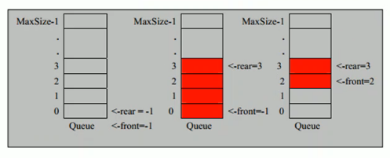
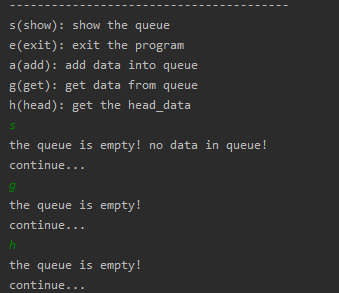
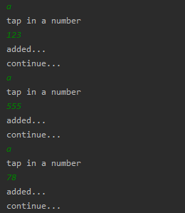
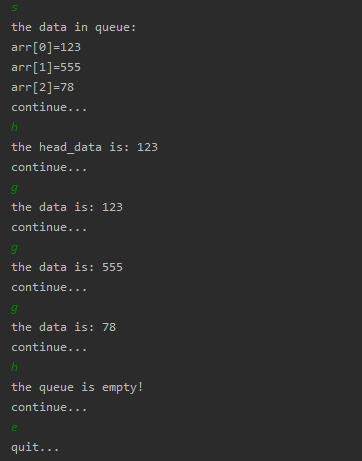

<!-- TOC -->

- [1. 队列实际应用场景](#1-队列实际应用场景)
- [2. 队列基本介绍](#2-队列基本介绍)
  - [2.1. 定义](#21-定义)
- [3. 数组模拟队列](#3-数组模拟队列)
  - [3.1. 基本概要](#31-基本概要)
  - [3.2. 操作分析](#32-操作分析)
  - [3.3. 数组模拟队列代码实现](#33-数组模拟队列代码实现)
    - [3.3.1. 创建队列数组类模拟队列](#331-创建队列数组类模拟队列)
    - [3.3.2. 创建一个测试类](#332-创建一个测试类)
  - [3.4. 数组模拟队列测试](#34-数组模拟队列测试)
  - [3.5. 数组模拟队列的弊端](#35-数组模拟队列的弊端)

<!-- /TOC -->

****
[博主的 Github 地址](https://github.com/leon9dragon)
****

## 1. 队列实际应用场景
银行排队的案例, 先进先出.

## 2. 队列基本介绍

### 2.1. 定义
- 队列是一个有序列表, 可以用数组或者链表来实现  
  数组实现则为顺序存储, 链表实现则为链式存储  
- 遵循先入先出的原则, 即:  
  先存入队列的数据要先取出, 后存入的数据后取出   
- 示意图: (使用数组模拟队列示意图)  
    
  - 有一个队列 Queue, 里面存在两个指针,  
    指针分别为 rear 和 front, 指代队尾和队首,  
    两个指针的初始指向都为 -1  
  - 当有数据加入的时候, rear 向上移动, front 不会变化
  - 当有数据减少的时候, front 向上移动, rear 不会变化

****

## 3. 数组模拟队列

### 3.1. 基本概要
队列本身是有序列表, 若使用数组的结构来存储队列的数据   
则队列的声明如下图, 其中 maxSize 为队列的最大容量   
   

因为队列的输出, 输入是分别从前后端来处理,  
因此用两个变量 front 和 rear 分别记录队列前后端的下标:  
- front 会随着数据输出而改变, 即数据取出时向上移动.   
- rear 则是随着数据输入而改变, 即数据存入时向上移动.  

****

### 3.2. 操作分析
将数据存入队列时的操作称为 addQueue,  
数据加入时将尾部指针向后移动: rear + 1,  
addQueue的处理有三种情况:  
1) 当 front == rear 时, 队列为空, 可以添加数据.  
   
2) 当尾指针 rear 小于队列的最大下标 maxSize-1,  
   表明队列尚未占满, 能向队列继续添加数据,  
   则将数据存入 rear 所指的数组元素中;   
   
3) 当 rear == maxSize - 1 时, 队列占满,  
   无法继续增加数据.

****

### 3.3. 数组模拟队列代码实现

#### 3.3.1. 创建队列数组类模拟队列
```java
package com.leo9.dc02.queue_array;
/**
 * 使用数组模拟队列编写一个QueueArray类
 * */
public class QueueArray {
    //定义队列数组的最大容量
    private int max_size;
    //定义队首指针
    private int front;
    //定义队尾指针
    private int rear;
    //定义队列本身, 用以存放数据模拟队列.
    private int[] arr;

    //创建队列的构造器
    public QueueArray(int arr_max_size){
        max_size = arr_max_size;
        arr = new int[max_size];
        //front指向队列头部, 但是是队列头的前一个位置,
        //就是第一个数据前面, 而非这个数据本身.
        this.front = -1;
        //rear指向队列尾部, 指向队列尾的数据, 就是队列最后一个数据本身.
        this.rear = -1;
    }

    //判断队列是否占满
    public boolean isFull(){
        return rear == max_size - 1;
    }

    //判断队列是否为空
    public boolean isEmpty(){
        return rear == front;
    }

    //添加数据到队列, 数据入列
    public void addQueue(int data){
        //先判断队列是否占满
        if (isFull()){
            System.out.println("the queue is full!");
            return;
        }
        //队列还有位置则, 队尾后移一位, 再增加数据
        rear++;
        arr[rear] = data;
    }

    //取出队列的数据, 数据出列
    public int getQueue(){
        //先判断队列是否为空
        if(isEmpty()){
            throw new RuntimeException("the queue is empty!");
        }
        //队列内有数据, 队首后移一位, 再取出数据
        front ++;
        return arr[front];
    }

    //显示队列的所有数据, 实际是遍历数组
    public void showQueue(){
        //先判断非空
        if(isEmpty()){
            System.out.println("the queue is empty! no data in queue!");
            return;
        }
        System.out.println("the data in queue:");
        for (int i = 0; i < arr.length; i++) {
            System.out.printf("arr[%d]=%d\n", i, arr[i]);
        }
    }

    //显示队列的头数据, 并非取出数据
    public int headQueue(){
        //先判断队列是否为空
        if(isEmpty()){
            throw new RuntimeException("the queue is empty!");
        }
        return arr[front+1];
    }
}

```

#### 3.3.2. 创建一个测试类
```java
package com.leo9.dc02.queue_array;
import java.util.Scanner;

public class TestDemo {
    public static void main(String[] args) {
        //创建并初始化队列
        QueueArray queue = new QueueArray(3);

        //创建一个字符变量用以接收用户输入
        char key = ' ';
        Scanner scanner = new Scanner(System.in);
        boolean loop = true;

        //输出一个菜单
        System.out.println("----------------------------------------");
        System.out.println("s(show): show the queue");
        System.out.println("e(exit): exit the program");
        System.out.println("a(add): add data into queue");
        System.out.println("g(get): get data from queue");
        System.out.println("h(head): get the head_data");
        while (loop){
            //接受一个字符
            key = scanner.next().charAt(0);
            switch (key){
                case 's':
                    queue.showQueue();
                    System.out.println("continue...");
                    break;
                case 'a':
                    System.out.println("tap in a number");
                    int val = scanner.nextInt();
                    queue.addQueue(val);
                    System.out.println("added...");
                    System.out.println("continue...");
                    break;
                case 'g':
                    try{
                        int result = queue.getQueue();
                        System.out.println("the data is: " + result);
                    }catch(Exception ex){
                        System.out.println(ex.getMessage());
                    }
                    System.out.println("continue...");
                    break;
                case 'h':
                    try{
                        int result = queue.headQueue();
                        System.out.println("the head_data is: " + result);
                    }catch (Exception ex){
                        System.out.println(ex.getMessage());
                    }
                    System.out.println("continue...");
                    break;
                case 'e':
                    scanner.close();
                    loop = false;
                    System.out.println("quit...");
                    break;
                default:
                    break;
            }
        }
    }
}

```

### 3.4. 数组模拟队列测试

**队列数组没有加入任何数据时**  
- 对队列数组进行展示, 取出下一个元素, 以及显示当前头元素操作

- 运行结果如下:  
  显而易见的, 全部提示都是队列数组为空  
  

****
**向队列数组内添加元素**  
- 往队列数组中加入 3 个元素, 数组初始化默认最大长度为 3
- 加入的元素数值分别为 123, 555, 78

- 运行结果如下  
  

****
**再对队列数组进行操作**  
- 运行结果如下  
  


****

### 3.5. 数组模拟队列的弊端
- 这种队列不是环形队列, 只能用一次就不能再用, 不能复用  
- 需要将数组使用算法改进成环形数组, 用取模的方式实现.

****