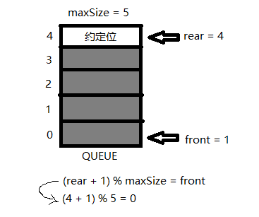
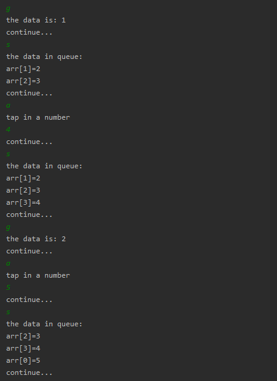

<!-- TOC -->

- [1. 数组模拟环形队列](#1-数组模拟环形队列)
  - [1.1. 基本概述](#11-基本概述)
  - [1.2. 分析说明](#12-分析说明)
  - [1.3. 具体思路](#13-具体思路)
  - [1.4. 数组模拟环形队列代码实现](#14-数组模拟环形队列代码实现)
    - [1.4.1. 创建环形队列类](#141-创建环形队列类)
    - [1.4.2. 创建测试类](#142-创建测试类)
  - [1.5. 数组模拟环形队列测试结果](#15-数组模拟环形队列测试结果)
    - [1.5.1. 测试过程](#151-测试过程)
    - [1.5.2. 测试结果分析](#152-测试结果分析)
- [2. 数组模拟环形队列无判断位做法](#2-数组模拟环形队列无判断位做法)
  - [2.1. 基本分析](#21-基本分析)
  - [2.2. 优化思路](#22-优化思路)

<!-- /TOC -->

****
[博主的 Github 地址](https://github.com/leon9dragon)
****

## 1. 数组模拟环形队列

### 1.1. 基本概述
对前面的数组模拟队列的优化, 实现充分利用数组.  
因此要将数组看作一个环形结构, 通过取模的方式进行实现.

****

### 1.2. 分析说明
1) 尾指针的下一个为头指针表示队列占满  
2) 即将队列容量空出一位作为约定,  
   这个在判断队列满的时候需要注意,
   当 `(rear + 1) % maxSize == front` 时,  
   此时表示队列占满.
3) 当 `rear == front` 时, 队列为空.
   
****

### 1.3. 具体思路
   

**(1) front 变量含义做调整** 

>front 的指向由指向队列的第一个元素前一个位置,   
修改为指向队列的第一个元素本身.


**(2) rear 变量的含义做调整**  

>rear 的指向由指向队列的最后一个元素本身,  
修改为指向队列最后一个元素的后一个位置.  
因为需要队列空出一位来作为约定.  

**(3) front 和 rear 的初始值都修改为 0**  

>front 在有数据取出时 `front = (front +1) % maxSize`  
rear 在有数据加入时 `rear = (rear +1) % maxSize`  

**(4) 当队列满时, 判断条件变化**  

>此时条件为 `(rear + 1) % maxSize = front`  

如下图所示:  
- 这是队列第一次被占满的情况  
  
 
- 在上面情况下, 取出一位数据再加入一位  
   约定位会发生移位, 会按照环形队列顺移   


- 因此, 队列被占满时, rear 永远指向约定位.


**(5) 当队列为空时, 判断条件不变**  

>依旧是 `rear == front`,  
此时 rear 和 front 都指向约定位.  

如下图所示:  
- 在队列占满的第二种情况下, 取出所有的数据  


**(6) 队列中的有效数据的个数**  

有效数据的个数设置为 num,  
`num = (rear + maxSize - front) % maxSize`

****

### 1.4. 数组模拟环形队列代码实现

#### 1.4.1. 创建环形队列类

```java
package com.leo9.dc03.round_queue_array;

public class RoundQueueArray {
    //定义队列数组的最大容量
    private int max_size;
    //定义队首指针
    private int front;
    //定义队尾指针
    private int rear;
    //定义队列本身, 用以存放数据模拟队列.
    private int[] arr;

    //创建队列的构造器
    public RoundQueueArray(int arr_max_size){
        max_size = arr_max_size;
        arr = new int[max_size];
        //front 和 rear 的初始值都为 0
        //front指向队列头部第一个元素本身
        front = 0;
        //rear指向队列尾部最后一个元素的后一个位置.
        rear = 0;
    }

    //判断队列是否占满
    public boolean isFull(){
        return (rear + 1) % max_size == front;
    }

    //判断队列是否为空
    public boolean isEmpty(){
        return rear == front;
    }

    //添加数据到队列, 数据入列
    public void addQueue(int data){
        //先判断队列是否占满
        if (isFull()){
            System.out.println("the queue is full!");
            return;
        }
        //若队列仍未占满, 则可以加入数据
        //由于rear指向的就是尾部元素的下一位, 直接加入即可
        arr[rear] = data;
        //加入数据后rear再后移一位, 但要取模, 防止溢出
        rear = (rear + 1) % max_size;
    }

    //取出队列的数据, 数据出列
    public int getQueue(){
        //先判断队列是否为空
        if(isEmpty()){
            throw new RuntimeException("the queue is empty!");
        }
        //队列内有数据, 可以取出数据
        //由于front的指向就是当前队首的数据, 因此可以直接取出
        int data = arr[front];
        //取出后front向后移动一位, 取模防止溢出
        front = (front + 1) % max_size;
        return data;
    }

    //获取队列内有效数据的个数
    public int getNum(){ return (rear + max_size - front) % max_size; }

    //显示队列的所有数据, 实际是遍历数组, 且只输出有效数据
    public void showQueue(){
        //先判断非空
        if(isEmpty()){
            System.out.println("the queue is empty! no data in queue!");
            return;
        }
        System.out.println("the data in queue:");
        //有效数据的个数
        int num = getNum();
        //输出有效数据, 从当前的front指向元素开始输出
        for(int i = 0; i < num; i++){
            //成员的数组内编号, 要取模防止溢出
            int the_sign = (front + i) % max_size;
            System.out.printf("arr[%d]=%d\n", the_sign, arr[the_sign]);
        }

    }

    //显示队列的头数据, 并非取出数据
    public int headQueue(){
        //先判断队列是否为空
        if(isEmpty()){
            throw new RuntimeException("the queue is empty!");
        }
        return arr[front];
    }
}

```

#### 1.4.2. 创建测试类

```java
package com.leo9.dc03.round_queue_array;

import java.util.Scanner;

public class TestDemoR {
    public static void main(String[] args) {
        //创建并初始化队列
        RoundQueueArray queue = new RoundQueueArray(4);

        //创建一个字符变量用以接收用户输入
        char key = ' ';
        Scanner scanner = new Scanner(System.in);
        boolean loop = true;

        //输出一个菜单
        System.out.println("----------------------------------------");
        System.out.println("-------the length of the queue is 3------");

        System.out.println("s(show): show the queue");
        System.out.println("e(exit): exit the program");
        System.out.println("a(add): add data into queue");
        System.out.println("g(get): get data from queue");
        System.out.println("h(head): get the head_data");
        while (loop){
            //接受一个字符
            key = scanner.next().charAt(0);
            switch (key){
                case 's':
                    queue.showQueue();
                    System.out.println("continue...");
                    break;
                case 'a':
                    System.out.println("tap in a number");
                    int val = scanner.nextInt();
                    queue.addQueue(val);
                    System.out.println("continue...");
                    break;
                case 'g':
                    try{
                        int result = queue.getQueue();
                        System.out.println("the data is: " + result);
                    }catch(Exception ex){
                        System.out.println(ex.getMessage());
                    }
                    System.out.println("continue...");
                    break;
                case 'h':
                    try{
                        int result = queue.headQueue();
                        System.out.println("the head_data is: " + result);
                    }catch (Exception ex){
                        System.out.println(ex.getMessage());
                    }
                    System.out.println("continue...");
                    break;
                case 'e':
                    scanner.close();
                    loop = false;
                    System.out.println("quit...");
                    break;
                default:
                    break;
            }
        }
    }
}

```

### 1.5. 数组模拟环形队列测试结果

#### 1.5.1. 测试过程
**初始化队列, 并执行操作**  

- 实际上队列的最大容量是 maxSize - 1
- 图略, 跟之前的一样

****
**向队列加入数据**  

- 运行结果如下:  
  


****
**取出和加入数据, 演示两次**  

- 运行结果如下:  
  


****

#### 1.5.2. 测试结果分析

- 显而易见的实现了环形队列, 队列可以多次复用
- 但这个方法需要留一个空位作判断, 浪费了少许空间
- 但也因为留空位, 因此 0 也可以作为有效数据存入

****

## 2. 数组模拟环形队列无判断位做法

### 2.1. 基本分析

- 上一种方法需要用到一个预留位来做判断位,  
  因而造成空间不能被充分使用.  
  但用判断位可以让 int 支持的数都能作为有效数字.
- 但通常来说实际应用中队列都要输入大于 0 的正整数,  
  因此可以用 0 来表示当前位为空.


### 2.2. 优化思路

**(0) 队列位置中默认值都为 0 表示空**

**(1) front 和 rear 的含义均作调整**  

- front 的调整:  
  front 的初始值为 0,  
  front 的指向是当前队首的元素本身.

- rear 的调整:  
  rear 的初始值为 0,  
  rear 的指向是当前队尾的元素本身.


**(2) 队列满的时候的判断**  

- 在队列占满的时候, 首尾指针必定相邻
- 且首指针必定在顺时针方向(即脚标递增的方向)在尾指针右边  
  (注: 这是在队列满时才有的情况)
- 如下示例两种队列占满的情况
  - **情况 1:** `front + max_size = rear + 1`   

  - **情况 2:** `front = rear + 1`    


- **因此, 总结出判断公式为** `(front - rear + max_size) % max_size = 1`

****

**(3) 队列为空时候的判断**  

- 当队列为空时, 首尾指针必定指在同一位置
- 但也会出现两种情况,  
  一种是真的为空即当前位数值为 0,  
  另一种是该位置实际上存在数据.
- 如下图所示   
  

- **因此, 判断公式为** `if(front == rear && Queue[front] == 0)`

****
**(4) 队列中的有效数据个数**

- 必须先判断是否为空才能执行该操作
- 由于尾指针在数据增加的时候往前移动一位,  
  因此 `(rear - front + max_size) + 1` 就是其间隔的数据个数  
- `+ max_size` 是因为有可能出现负数, 要保证在 max_size 的范围内
- `+ 1` 是因为脚标是从 0 开始计算的
- 同时 `(rear - front + max_size)` 这一块有可能会超出范围, 因此要取模
- 最终得出的结果是  
  `(rear - front + max_size) % max_size + 1`