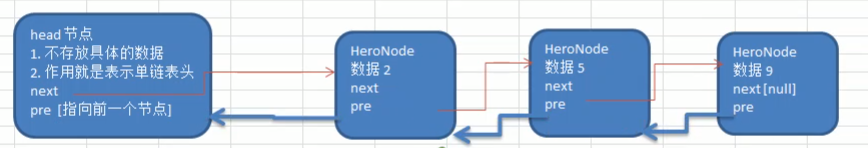
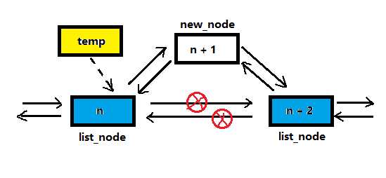

<!-- TOC -->

- [1. 双向链表 double link list 的基本介绍](#1-双向链表-double-link-list-的基本介绍)
  - [1.1. 单向链表和双向链表的比较](#11-单向链表和双向链表的比较)
  - [1.2. 双向链表示意图](#12-双向链表示意图)
  - [1.3. 双向链表的操作分析](#13-双向链表的操作分析)
    - [1.3.1. 双向链表的遍历](#131-双向链表的遍历)
    - [1.3.2. 双向链表的添加结点(默认添加到表最后)](#132-双向链表的添加结点默认添加到表最后)
    - [1.3.3. 双向链表的结点修改](#133-双向链表的结点修改)
    - [1.3.4. 双向链表的结点删除](#134-双向链表的结点删除)
    - [1.3.5. 双向链表的顺序插入](#135-双向链表的顺序插入)
- [2. 双向链表的代码实现](#2-双向链表的代码实现)
  - [2.1. 改写结点类](#21-改写结点类)
  - [2.2. 改写链表类](#22-改写链表类)
  - [2.3. 运行结果](#23-运行结果)

<!-- /TOC -->

****
[博主的 Github 地址](https://github.com/leon9dragon)
****

## 1. 双向链表 double link list 的基本介绍

### 1.1. 单向链表和双向链表的比较
1) 单向链表查找的方向只能是一个方向;  
   双向链表可以向前或者向后查找.
2) 单向链表不能自我删除, 需要靠辅助结点;   
   双向链表则可以自我删除  
   (单向链表删除时需找到目标结点的前一个结点才能进行删除操作)    

****

### 1.2. 双向链表示意图
- 每个结点中除了有 next 指针, 用来指向下一结点外
- 每个结点中还有 pre 指针, 用来指向前一个结点


****

### 1.3. 双向链表的操作分析

#### 1.3.1. 双向链表的遍历
- 遍历和单链表思路一样, 但双向链表既可以向前也可以向后遍历

#### 1.3.2. 双向链表的添加结点(默认添加到表最后)
1. 通过遍历先找到双向链表最后的结点
2. 用临时指针指向链表最后一个结点 `temp = last_node`
3. 让临时指针的 next 域指向新结点 `temp.next = new_node` 
4. 让新结点的 pre 域指向 temp 结点 `new_node.pre = temp`

#### 1.3.3. 双向链表的结点修改
- 和单链表的思路一样

#### 1.3.4. 双向链表的结点删除
1. 假设目标删除结点为 del_node
2. 令目标结点的上一结点的 next 域指向目标结点的下一结点  
   `del_node.pre.next = del_node.next`
3. 令目标结点的下一结点的 pre 域指向目标结点的上一结点  
   `del_node.next.pre = del_node.pre`

#### 1.3.5. 双向链表的顺序插入
- **图解**   
    

  - 为了防止插入结点的编号大于所有结点的编号,  
    即要插入的结点会排在链表最尾端,   
    因此 temp 指针指向的是要插入位置的前一个结点,  
    防止指针向后移位后出现空指针异常

  - 找到要插入位置的前一位的结点后,  
    开始进行结点插入,  因为 temp 结点已经被定位,  
    首要处理的是 temp 的下一位结点

  - 处理顺序为:  
    - 先对 temp.next 是否为空进行判断, 防止空指针异常,  
      如果为空前两步操作可以跳过, 因为插入的结点在链表尾端.
    - `temp.next.pre = new_node`
    - `new_node.next = temp.next`
    - `new_node.pre = temp`
    - `temp.next = new_node`

****

## 2. 双向链表的代码实现

### 2.1. 改写结点类
```java
package com.leo9.dc05.double_link_list;

import com.leo9.dc04.singly_link_list.TheNode;

public class TheNodeD {
    public int no;
    public String name;
    public String nick_name;
    //结点的next域
    public TheNodeD next;
    //结点的pre域
    public TheNodeD pre;

    //定义构造器
    public TheNodeD(int no, String name, String nick_name){
        this.no = no;
        this.name = name;
        this.nick_name = nick_name;
    }

    //重写toString方法

    @Override
    public String toString() {
        return "TheNodeD{" +
                "no=" + no +
                ", name='" + name + '\'' +
                ", nick_name='" + nick_name + '\'' +
                '}';
    }
}

```

### 2.2. 改写链表类
```java
package com.leo9.dc05.double_link_list;


public class DoubleLinkList {
    //初始化头结点,不存放具体数据
    private TheNodeD head_node = new TheNodeD(0,"","");


    //region 添加结点到链表尾部
    //当不需要考虑编号顺序直接插入链表时
    //1.找到当前链表最后的结点
    //2.将最后这个结点的next指向新的结点
    public void addNode(TheNodeD new_node){
        //因为head结点不能动, 因此需要一个辅助指针temp
        TheNodeD temp = head_node;
        //开始遍历链表, 找到最后一个结点
        while (true){
            //如果找到了最后一个结点,则跳出循环
            if(temp.next == null){
                break;
            }
            //如果没有找到最后一个结点,指针后移
            temp = temp.next;
        }
        //当退出循环时,此时temp就指向了链表最后
        //因此将最后结点的next域指向当前新增结点
        //因此将新增结点的pre域指向原先的最后结点
        temp.next = new_node;
        new_node.pre = temp;
    }
    //endregion

    //排序添加结点
    //首先找出正确的位置

    public void addNodeOrder(TheNodeD new_node){
        //编号不能小于等于0
        if(new_node.no <= 0){
            System.out.println("the no cant be 0 or less than 0 !");
            return;
        }

        //因为head结点不能动, 因此需要一个辅助指针temp
        //找出要插入位置的前一个结点
        TheNodeD temp = head_node;
        while(true){
            //当前结点为空直接跳出
            if(temp.next == null){
                break;
            }

            if(temp.next.no > new_node.no){
                break;
            }
            temp = temp.next;
        }

        //插入结点, 防止空指针异常, 先对插入结点是否插入到队列尾部进行判断
        if(temp.next != null){
            temp.next.pre = new_node;
            new_node.next = temp.next;
        }
        new_node.pre = temp;
        temp.next = new_node;
    }

    //修改结点, 根据no来寻找结点, 因此no不能被修改
    public void editNode(int edit_no, String new_name, String new_nick_name){
        //因为head结点不能动, 因此需要一个辅助指针temp
        TheNodeD temp = head_node;
        while (true){
            if(temp.no == edit_no){
                temp.name = new_name;
                temp.nick_name = new_nick_name;
                break;
            }

            if(temp.next == null){
                System.out.println("this node:" + edit_no + " is not existed!");
                break;
            }
            temp = temp.next;
        }
    }

    //删除结点, 根据no来进行查找
    public void delNode(int del_no){
        //因为head结点不能动, 因此需要一个辅助指针temp
        //因为是双向链表, 结点可以自删除, 因此可以从第一个有效结点开始查找
        TheNodeD temp = head_node.next;
        while(true){
            if(temp == null){
                System.out.println("this node: " + del_no + " is not existed!");
                break;
            }

            //因为是双向链表, 因此直接找到当前结点即可
            if(temp.no == del_no){
                temp.pre.next = temp.next;
                //若要删除的是最后一个结点,防止出现空指针异常,先判断当前结点next域是否为空
                if(temp.next != null){
                    temp.next.pre = temp.pre;
                }
                break;
            }

            //指针后移
            temp = temp.next;
        }
    }

    //显示链表
    public void showList(){
        //先判断链表是否为空
        if(head_node.next == null){
            System.out.println("the list is empty!");
        }
        //因为头结点不能动,因此需要辅助指针
        //因为头结点next域不为空,因此至少有一个数据
        TheNodeD temp = head_node.next;
        while (true){
            //判断链表是否走到最后
            if(temp == null){
                break;
            }
            //输出当前结点
            System.out.println(temp);
            //结点后移
            temp = temp.next;
        }
    }

}

```

### 2.3. 运行结果
- 已经检验, 正常运行, 截图不再放出, 跟单链表结果是一样的