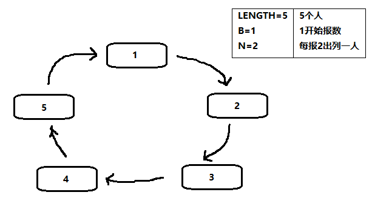
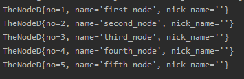
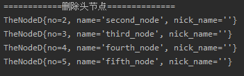
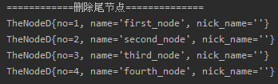
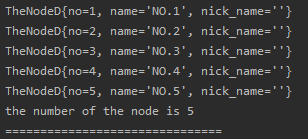
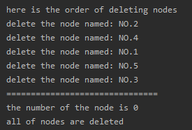
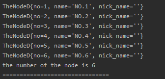
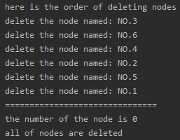

<!-- TOC -->

- [1. 约瑟夫问题(Josephus problem)](#1-约瑟夫问题josephus-problem)
  - [1.1. 问题描述](#11-问题描述)
  - [1.2. 解决方案](#12-解决方案)
  - [1.3. 实例图示](#13-实例图示)
- [2. 构建无头结点的单向环形链表思路](#2-构建无头结点的单向环形链表思路)
  - [2.1. 结点类的构建](#21-结点类的构建)
  - [2.2. 单向环链表类需要的成员](#22-单向环链表类需要的成员)
- [3. 无头结点的单向环形链表操作分析](#3-无头结点的单向环形链表操作分析)
  - [3.1. 增加结点](#31-增加结点)
    - [3.1.1. 操作思路](#311-操作思路)
    - [3.1.2. 方法代码](#312-方法代码)
  - [3.2. 删除结点](#32-删除结点)
    - [3.2.1. 操作思路](#321-操作思路)
    - [3.2.2. 方法代码](#322-方法代码)
  - [3.3. 测试结果](#33-测试结果)
    - [3.3.1. 新建链表并加入结点](#331-新建链表并加入结点)
    - [3.3.2. 删除链表的头结点](#332-删除链表的头结点)
    - [3.3.3. 删除链表的尾结点](#333-删除链表的尾结点)
- [4. 单向环形链表解决约瑟夫环问题](#4-单向环形链表解决约瑟夫环问题)
  - [4.1. 定义结点类](#41-定义结点类)
  - [4.2. 定义链表类](#42-定义链表类)
  - [4.3. 定义测试类(类中包含约瑟夫环循环)](#43-定义测试类类中包含约瑟夫环循环)
  - [4.4. 测试结果](#44-测试结果)
    - [4.4.1. (1)循环增加结点(5 个结点)](#441-1循环增加结点5-个结点)
    - [4.4.2. (2)约瑟夫环循环(报数为 2)](#442-2约瑟夫环循环报数为-2)
    - [4.4.3. (3)循环增加结点(6 个结点)](#443-3循环增加结点6-个结点)
    - [4.4.4. (4)约瑟夫环循环(报数为 3)](#444-4约瑟夫环循环报数为-3)

<!-- /TOC -->

****
[博主的 Github 地址](https://github.com/leon9dragon)
****

## 1. 约瑟夫问题(Josephus problem)

### 1.1. 问题描述
设编号为 1,2,...,n 的 n 个人围坐一圈,  
约定编号为 k (1 <= k <= n) 的人从 1 开始报数,  
数到 m 的那个人出列, 他的下一位又从 1 开始报数,  
数到 m 的那个人又出列, 以此类推,  
直到所有人出列为止, 由此产生一个出列编号的序列.

****

### 1.2. 解决方案
用一个不带头结点的循环链表来处理约瑟夫问题  
先构成一个有 n 个结点的单循环链表,  
然后由 k 结点起从 1 开始计数,  
计到 m 时, 对应结点从链表中删除,  
然后再从被删除结点的下一个结点起从 1 开始计数,  
直到最后一个结点从链表中删除为止.

****

### 1.3. 实例图示
- 假设有 5 个结点  
  

- 从编号为 1 的结点开始报数, 报数到 2 的人出列  
  即当前结点后 N-1 个结点出列  
  因此第一次出列的结点编号为 2

- 然后再从出列的结点的下一位开始继续报数,  
  依次类推, 最后可得出列顺序为 `2 - 4 - 1 - 5 - 3`

****

## 2. 构建无头结点的单向环形链表思路

### 2.1. 结点类的构建
- 与单链表的结点类一致, 需要有 next 域即可

****

### 2.2. 单向环链表类需要的成员
- 必须要有一个头指针 head_pointer
  - 头指针的作用在于可以定位无头结点的链表,   
    若环形链表没有头结点需要头指针定位
    
- 如果需要判断链尾, 则需要加入尾指针 tail_pointer  
  - 尾指针的作用在于定位链表尾端, 方便新结点插入

- 构造函数可以选择带参数的 如下:   
  ```java
  public CircleLinkList(TheNode first_node){
    head_pointer = first_node;
    tail_pointer = first_node;
    first_node.next = first_node;
    //TODO...   
  }
  ```
  - 带参数的构造函数可以直接在初始化的时候就让头尾指针初始化  
    不需要在后续增加结点的方法中判断头尾指针是否为空


## 3. 无头结点的单向环形链表操作分析

### 3.1. 增加结点

#### 3.1.1. 操作思路
- 首先判断链表是否为空, 为空重新初始化链表
- 若链表不为空, 则按照如下流程进行插入结点
  - 首先将尾指针指向结点的 next 域定位到新结点  
    `tail_pointer.next = new_node;`  
  - 然后将尾指针指向到新结点  
    `tail_pointer = new_node;`  
  - 最后新结点成为了尾结点后, 将其 next 域指向头指针指向的结点  
    `new_node.next = head_pointer;`  

#### 3.1.2. 方法代码
```java
    // region 增加结点到链表尾部
    public void addNode(TheNodeC new_node){
        //当链表为空的时候, 重新初始化
        if(head_pointer == null && tail_pointer == null){
            head_pointer = new_node;
            tail_pointer = new_node;
            new_node.next = new_node;
        }

        //链表有结点的时候, 直接加入到链表尾部
        tail_pointer.next = new_node;
        tail_pointer = new_node;
        new_node.next = head_pointer;
    }
    // endregion
```

****

### 3.2. 删除结点

#### 3.2.1. 操作思路
- 先进行结点的遍历, 从头指针开始,   
  因为是单向链表, 所以要找到删除结点的上一结点  
  定义一个临时指针指向头结点再开始循环遍历
  
- 判断当前结点下一结点`temp.next`是否为目标结点
  - 如果是目标结点
    - 判断头尾指针是否相等
      - 如果相等, 说明链表只剩一个结点, 将头尾指针置空即可, 然后跳出循环.
    - 判断是否为头结点
      - 如果为头结点, 则头指针后移一位再去删除当前结点.  
        因为如果当前结点的下一位是头结点,  
        头指针后移则指向当前结点下一位的下一位.  
        `head_pointer = temp.next.next`

    - 判断是否为尾结点
      - 如果是尾结点, 则尾指针前移一位再去删除当前结点.   
        因为如果当前结点的下一位是尾结点,  
        尾指针前移则指向当前结点.  
        `tail_pointer = temp`
        
    - 既不是头结点也不是尾结点则直接删除即可, 然后跳出循环  
      `temp.next = temp.next.next`
  
  - 如果不是目标结点
    - 结点后移, 直到结点找到目标结点或回到头结点为止


#### 3.2.2. 方法代码
```java
    //region 删除选中结点, 根据编号进行删除
    public void delNode(int num){
        //遍历结点
        TheNodeC temp = head_pointer;
        while (true){
            //判断当前结点下一结点是否为目标结点
            if(temp.next.no == num){
                //链表只剩最后一个结点, 则头尾指针置空, 跳出循环
                if(head_pointer == tail_pointer){
                    head_pointer = null;
                    tail_pointer = null;
                    break;
                }

                //删除的是头结点
                if(temp.next == head_pointer){
                    head_pointer = temp.next.next;
                }

                //删除的是尾结点
                if(temp.next == tail_pointer){
                    tail_pointer = temp;
                }

                //删除目标结点, 并跳出循环
                temp.next = temp.next.next;
                break;
            }

            //结点后移
            temp = temp.next;

            //循环一圈最后回到头结点, 则视为找不到目标结点
            if(temp == head_pointer){
                System.out.println("the node is not existed!");
                break;
            }
        }
    }
    //endregion
```

### 3.3. 测试结果

#### 3.3.1. 新建链表并加入结点
- 代码如下   
```java
  CircleLinkList crlist = new CircleLinkList(new TheNodeC(1,"first_node",""));
  crlist.addNode(new TheNodeC(2,"second_node",""));
  crlist.addNode(new TheNodeC(3,"third_node",""));
  crlist.addNode(new TheNodeC(4,"fourth_node",""));
  crlist.addNode(new TheNodeC(5,"fifth_node",""));
  crlist.showList();
```

- 运行截图  


****

#### 3.3.2. 删除链表的头结点
- 代码如下
```java
  System.out.println("============删除头结点==============");
  crlist.delNode(1);
  crlist.showList();
```

- 运行截图  


****

#### 3.3.3. 删除链表的尾结点
- 代码如下  
```java
  System.out.println("============删除尾结点==============");
  crlist.delNode(5);
  crlist.showList();
```

- 运行截图  


****

- 其他结果不再展示, 经测试并无发现问题

****

## 4. 单向环形链表解决约瑟夫环问题

### 4.1. 定义结点类
```java
package com.leo9.dc06.circle_link_list;

public class TheNodeC {
    public int no;
    public String name;
    public String nick_name;
    //结点的next域
    public TheNodeC next;


    //定义构造器
    public TheNodeC(int no, String name, String nick_name){
        this.no = no;
        this.name = name;
        this.nick_name = nick_name;
    }

    //重写toString方法

    @Override
    public String toString() {
        return "TheNodeD{" +
                "no=" + no +
                ", name='" + name + '\'' +
                ", nick_name='" + nick_name + '\'' +
                '}';
    }
}

```

****

### 4.2. 定义链表类  
```java
package com.leo9.dc06.circle_link_list;


public class CircleLinkList {
    //定义头尾指针
    private TheNodeC head_pointer;
    private TheNodeC tail_pointer;

    //定义链表的结点数
    private int num_of_node;

    //构造函数, 带参数
    public CircleLinkList(TheNodeC first_node){
        head_pointer = first_node;
        tail_pointer = first_node;
        first_node.next = first_node;
    }

    //构造函数, 不带参数
    public CircleLinkList(){}

    //获取结点数
    public int getNum_of_node() {
        return num_of_node;
    }

    //获取头指针
    public TheNodeC getHead_pointer() {
        return head_pointer;
    }

    //获取尾指针
    public TheNodeC getTail_pointer() {
        return tail_pointer;
    }

    //region 输出链表
    public void showList(){
        //先判断链表是否为空
        if(head_pointer == null){
            System.out.println("the list is empty!");
        }

        //设置辅助指针指向当前链表的头指针指向结点
        TheNodeC temp = head_pointer;
        while (true){
            //输出当前结点
            System.out.println(temp);

            //结点后移
            temp = temp.next;

            //判断链表是否循环一圈
            if(temp == head_pointer){
                break;
            }
        }
    }
    //endregion

    // region 增加结点到链表尾部
    public void addNode(TheNodeC new_node){
        //当链表为空的时候, 重新初始化
        if(head_pointer == null && tail_pointer == null){
            head_pointer = new_node;
            tail_pointer = new_node;
            new_node.next = new_node;
        }

        //链表有结点的时候, 直接加入到链表尾部
        tail_pointer.next = new_node;
        tail_pointer = new_node;
        new_node.next = head_pointer;

        //结点数+1
        num_of_node ++;
    }
    // endregion

    //region 删除选中结点, 根据编号进行删除
    public void delNode(int num){
        //判断链表是否为空
        if(num_of_node == 0){
            System.out.println("list is empty!");
            return;
        }

        //定义临时指针
        TheNodeC temp = head_pointer;

        //遍历结点
        while (true){
            //判断当前结点下一结点是否为目标结点
            if(temp.next.no == num){
                //链表只剩最后一个结点, 则头尾指针置空, 跳出循环
                if(head_pointer == tail_pointer){
                    head_pointer = null;
                    tail_pointer = null;
                    break;
                }

                //删除的是头结点
                if(temp.next == head_pointer){
                    head_pointer = temp.next.next;
                }

                //删除的是尾结点
                if(temp.next == tail_pointer){
                    tail_pointer = temp;
                }

                //删除目标结点, 并跳出循环
                temp.next = temp.next.next;
                break;
            }

            //结点后移
            temp = temp.next;

            //循环一圈最后回到头结点, 则视为找不到目标结点
            if(temp == head_pointer){
                System.out.println("the node is not existed!");
                break;
            }
        }
        //结点数-1
        num_of_node --;
    }
    //endregion
}
```

****

### 4.3. 定义测试类(类中包含约瑟夫环循环)
```java
package com.leo9.dc06.circle_link_list;


public class TestDemoCLL {
    public static void main(String[] args) {
        //region 约瑟夫环实现

        //创建链表
        CircleLinkList crlist = new CircleLinkList();

        //循环增加结点
        for(int i = 1; i < 6; i++){
            crlist.addNode(new TheNodeC(i,"NO." + i,""));
        }

        crlist.showList();
        System.out.println("the number of the node is " + crlist.getNum_of_node());
        System.out.println("===============================");

        //开始报数
        System.out.println("here is the order of deleting nodes");
        //定义临时结点,并指向第一个结点
        TheNodeC temp = crlist.getHead_pointer();
        while(crlist.getNum_of_node() != 0){
            //若设定报数为2出列,则当前结点的下一结点则为出列结点
            int del_no = temp.next.no;
            System.out.println("delete the node named: NO." + del_no);

            //删除目标结点
            crlist.delNode(del_no);

            //temp指针后移
            temp = temp.next;
        }

        System.out.println("===============================");
        System.out.println("the number of the node is " + crlist.getNum_of_node());
        System.out.println("all of nodes are deleted");
        //endregion
    }

}

```

### 4.4. 测试结果

#### 4.4.1. (1)循环增加结点(5 个结点)
如下所示, 无参构造器生成空链表并循环加入结点后, 正确输出  
- 运行截图  



#### 4.4.2. (2)约瑟夫环循环(报数为 2)
如下所示, 输出顺序为 2-4-1-5-3, 是正确顺序  
- 运行截图   

****


#### 4.4.3. (3)循环增加结点(6 个结点)
如下所示, 无参构造器生成空链表并循环加入结点后, 正确输出  
- 运行截图  



#### 4.4.4. (4)约瑟夫环循环(报数为 3)
如下所示, 输出顺序为 3-6-4-2-5-1, 是正确顺序  
- 运行截图   
