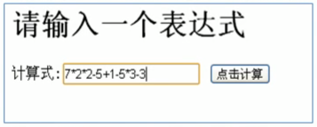
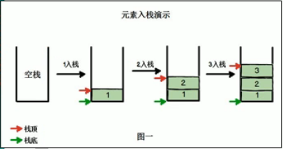
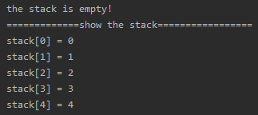
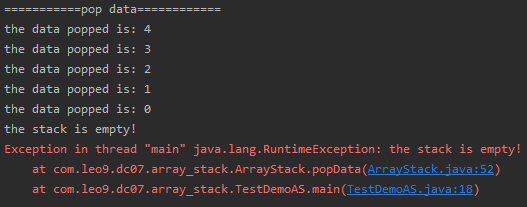

<!-- TOC -->

- [1. 栈的应用场景](#1-栈的应用场景)
  - [1.1. 栈的一个实际需求](#11-栈的一个实际需求)
  - [1.2. 栈的应用](#12-栈的应用)
- [2. 栈的介绍](#2-栈的介绍)
  - [2.1. 栈的概述](#21-栈的概述)
  - [2.2. 入栈和出栈的概念](#22-入栈和出栈的概念)
    - [2.2.1. 入栈(push)](#221-入栈push)
    - [2.2.2. 出栈(pop)](#222-出栈pop)
- [3. 栈的快速实现](#3-栈的快速实现)
  - [3.1. 使用数组模拟栈](#31-使用数组模拟栈)
  - [3.2. 实现思路分析](#32-实现思路分析)
- [4. 栈的代码实现](#4-栈的代码实现)
  - [4.1. 创建数组栈类模拟栈结构](#41-创建数组栈类模拟栈结构)
  - [4.2. 创建测试类](#42-创建测试类)
  - [4.3. 测试结果](#43-测试结果)
    - [4.3.1. 入栈测试](#431-入栈测试)
    - [4.3.2. 出栈测试](#432-出栈测试)

<!-- /TOC -->

****
[博主的 Github 地址](https://github.com/leon9dragon)
****

## 1. 栈的应用场景

### 1.1. 栈的一个实际需求
- 输入表达式进行计算, 如下图所示  
  

- 对于计算机而言, 是收到了一串字符串`"7*2*2-5+1-5+3-3"`.  
  计算机应该怎么理解这个算式, 才能得到计算结果.

****

### 1.2. 栈的应用
1. 子程序的调用:  
   在跳往子程序前, 会先将下一个指令的地址存到堆栈中,  
   直到子程序执行完后再将地址取出, 以回到原来的程序中.

2. 处理递归调用:  
   和子程序的调用类似, 只是除了储存下一个指令的地址外,  
   也将参数, 区域变量等数据存入堆栈中.

3. 表达式的转换与求值(中缀表达式转后缀表达式)

4. 二叉树的遍历

5. 图形的深度优先搜索法(depth-first)

## 2. 栈的介绍

### 2.1. 栈的概述
- 栈的英文为 stack
- 栈是一个先进后出的有序列表(FILO- First In Last Out)
- 栈是限制元素的插入和删除只能在线性表的同一端进行的一种特殊线性表.   
  - 允许插入和删除的一端为变化的一端, 成为栈顶(top)  
  - 另一端为固定的一端, 称为栈底(bottom)
- 根据栈的定义可知:  
  - 插入元素时, 最先入栈的元素在栈底, 最后入栈的元素在栈顶
  - 删除元素时, 最后入栈的元素最先删除, 最先入栈的最后删除

****

### 2.2. 入栈和出栈的概念

#### 2.2.1. 入栈(push)
- 假设有两个指针, 分别为栈顶和栈底指针, 指向栈顶和栈底.
- 当元素入栈时, 栈顶指针会向上移动
- 栈底指针只会一直保持指向栈底 



#### 2.2.2. 出栈(pop)
- 元素出栈时, 栈顶指针向下移动
- 栈底指针依旧是指向栈底, 并不会发生变化  


## 3. 栈的快速实现

### 3.1. 使用数组模拟栈
用数组模拟栈的使用, 由于栈是一种有序列表,  
可以使用数组的结构来存储栈的数据内容.

****

### 3.2. 实现思路分析
1. 使用数组模拟栈
2. 定义一个变量 top 表示栈顶指针, 初始值为 -1
3. 入栈的操作:  
   当有数据加入到栈的时候,  
   ```java
   //指针上移  
   top++;
   //给当前栈空间赋值
   stack[top] = data;
   ``` 

4. 出栈的操作:  
   当数据出栈的时候,  
   ```java
   //定义一个临时变量取的栈顶数据值
   int val = stack[top];
   //指针下移
   top--;
   //返回数据
   return val;
   ```

****

## 4. 栈的代码实现

### 4.1. 创建数组栈类模拟栈结构
```java
package com.leo9.dc07.array_stack;

/*
* 定义一个数组栈的类表示栈结构
* */
public class ArrayStack {
    //定义栈的最大大小
    private int maxSize;
    //定义一个数组, 模拟栈的结构, 数据存放于数组中
    private int[] stack;
    //定义栈顶指针, 初始值为 -1, 没有数据时就是 -1 表示没有数据
    private int top = -1;

    //定义构造器
    public ArrayStack(int maxSize){
        //定义数组的最大存储位
        this.maxSize = maxSize;
        //初始化数组
        stack = new int[maxSize];
    }

    //判断栈是否为满
    public Boolean isFull(){
        //当栈顶指针+1等于栈最大存储位时, 栈满
        return top + 1 == maxSize;
    }

    //判断栈是否为空
    public Boolean isEmpty(){
        //当栈顶指针变回-1的时候, 栈空
        return top == -1;
    }

    //数据入栈
    public void pushData(int data){
        //判断栈是否存满
        if(isFull()){
            System.out.println("the stack is full!");
            return;
        }

        //栈顶指针上移
        top++;
        //存入数据
        stack[top] = data;
    }

    //数据出栈
    public int popData(){
        //判断栈是否为空
        if(isEmpty()){
            throw new RuntimeException("the stack is empty!");
        }

        //取得数据
        int val = stack[top];
        //指针下移
        top--;
        //返回数据
        return val;
    }

    //遍历栈
    public void showStack(){
        if(isEmpty()){
            System.out.println("the stack is empty!");
            return;
        }
        for(int i = 0; i <= top; i++){
            System.out.println("stack[" + i + "] = " + stack[i]);
        }
    }
}


```

### 4.2. 创建测试类
```java
package com.leo9.dc07.array_stack;

public class TestDemoAS {
    public static void main(String[] args) {
        ArrayStack stack = new ArrayStack(5);
        stack.showStack();
        for(int i = 0; i < 5; i++){
            stack.pushData(i);
        }
        System.out.println("=============show the stack=================");
        stack.showStack();

        System.out.println("===========pop data============");
        for(int i = 4; i >=0; i--){
            System.out.println("the data popped is: " + stack.popData());
        }
        stack.showStack();
        stack.popData();
    }
}

```

### 4.3. 测试结果

#### 4.3.1. 入栈测试
- 建立空栈后进行输出测试, 提示为空   
- 循环入栈后, 进行栈数组循环, 输出栈结构   


#### 4.3.2. 出栈测试
- 循环出栈, 将栈清空   
- 清空后再输出栈结构, 提示栈为空   
- 再进行出栈操作, 抛出空栈异常  
