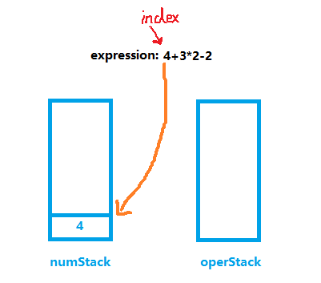
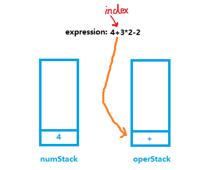
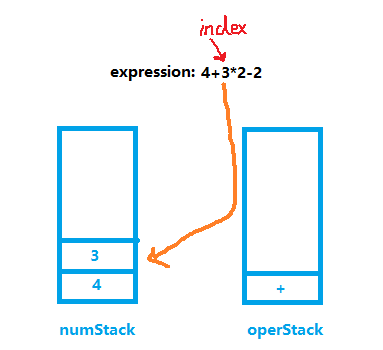
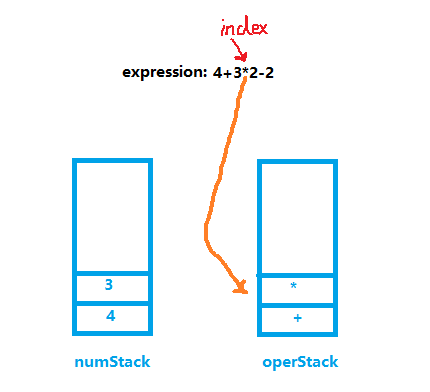
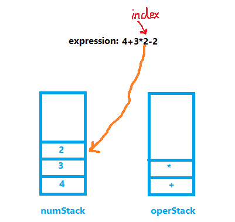
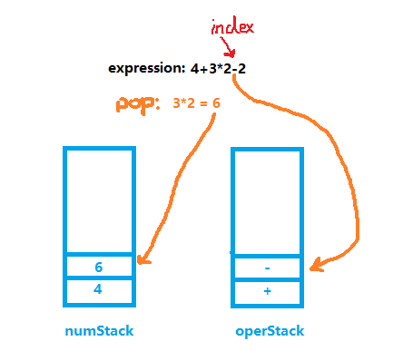
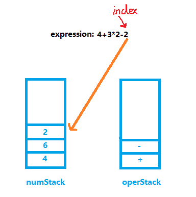
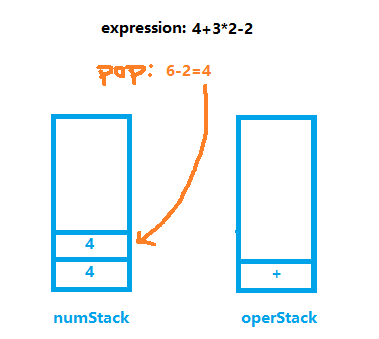
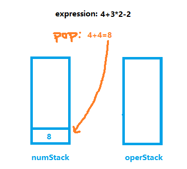
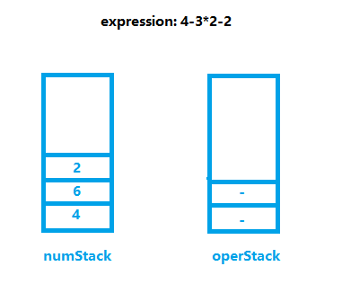

<!-- TOC -->

- [1. 使用栈完成计算表达式结果](#1-使用栈完成计算表达式结果)
  - [1.1. 实现思路](#11-实现思路)
  - [1.2. 思路图例](#12-思路图例)
  - [1.3. 缺陷问题和解决方案](#13-缺陷问题和解决方案)
    - [1.3.1. 减法/除法失误](#131-减法除法失误)
    - [1.3.2. 多位数入栈错误](#132-多位数入栈错误)
- [2. 代码实现计算器](#2-代码实现计算器)
  - [2.1. 数组栈类](#21-数组栈类)
  - [2.2. 主方法](#22-主方法)

<!-- /TOC -->

****
[博主的 Github 地址](https://github.com/leon9dragon)
****

## 1. 使用栈完成计算表达式结果

### 1.1. 实现思路
- 创建两个栈. 一个是数栈, 一个是符号栈.
  - 数栈(numStack): 存放数
  - 符号栈(operStack): 存放运算符

- 创建一个 index 指针, 对表达式字符串进行遍历
  - 扫描结果是数字, 直接将值压入数栈
  - 扫描结果是操作符, 分如下情况:  
    1. 如果当前符号栈为空, 直接将符号压入符号栈
    2. 如果如果符号栈有操作符, 就进行比较.  
       - 如果当前的操作符优先级小于或等于栈中操作符,  
         就需要从数栈中出栈两个数, 从符号栈中出栈一个符号,  
         进行运算得出结果, 将结果入数栈, 再将当前操作符入符号栈.
       - 如果当前的符号优先级大于栈中操作符, 直接入栈.

- 当表达式扫描完毕后, 按顺序从数栈和符号栈中进行出栈,  
  将相应的数和符号进行运算, 并将结果压入数栈.  
- 最后数栈只有一个数字, 就是表达式的结果

### 1.2. 思路图例
**拿算式 4+3*2-2 来说明流程**
- 首先创建 index 指针, 用来一位位的截取表达式中的字符
- 创建两个栈, 分别为数栈和符号栈
- 然后开始扫描表达式

****
**STEP1**  
- index 第一步指向 "4", 因为 4 是数字, 所以直接入栈  
  

****
**STEP2**  
- index 下一步指向的是 "+", "+" 是符号  
- 此时符号栈为空, 因此也是直接入栈即可  
  

****
**STEP3**  
- index 下一步指向的是 "3", 3 是数字, 直接入栈  
  

****
**STEP4**  
- index 下一步指向 "*", 是符号, 要比较优先级  
- 因为 "*" 的优先级高于 "+", 因此直接入栈  
  

****
**STEP5**  
- index 下一步指向 "2", 直接入栈即可  
  

****
**STEP6**  
- index 下一步指向 "-", 要比较优先级
- "-" 的优先级低于 "*", 因此要先进行运算操作
- 数字栈出栈 2 位数字, 符号栈出栈 1 位符号, 进行运算 
- 最后将运算结果 "6" 和 "-" 分别压入数字栈和符号栈   
  

****
**STEP7**  
- index 最后指向的是数字 "2", 直接入栈  
  

****
**STEP8**  
- 表达式扫描完毕后, 两个栈开始出栈
- 直到符号栈为空时, 数字栈只剩最终运算结果  
  
  

### 1.3. 缺陷问题和解决方案

#### 1.3.1. 减法/除法失误
- 当表达式为 4-3*2-2 的时候, 该式正确结果为 -4
- 表达式扫描完时, 两个栈存储如下
    
- 因此在出栈运算的时候会出现 4-(6-2) 的问题, 导致结果为 0
- 除法符号也会出现类似的问题

**解决方案**
- 需要在符号第一次比较完优先级后, 再比较一次优先级, 但要先判断符号栈非空
  - 第一次比较的时候, 如果当前指针指向的运算符优先级小于等于栈顶运算符,  
    符号栈出栈一位, 并进行运算
  - 第二次再进行比较, 若当前指向运算符优先级依旧小于等于栈顶运算符,  
    符号栈再出栈一位, 并进行运算
- 这种操作能让符号栈的占位始终不超过两位, 且解决减号除号运算错误的缺陷

****

#### 1.3.2. 多位数入栈错误
- 当表达式出现不是个位数的时候, 会拆分数字每一位存储, 导致存储错误

**解决方案**  
- 处理多位数时, 不能立即入栈, 要先判断后一位是否为符号再决定入栈
- 循环扫描直到下一位为符号位才停止

****

## 2. 代码实现计算器

### 2.1. 数组栈类
```java
package com.leo9.dc07.array_stack;

/*
* 定义一个数组栈的类表示栈结构
* */
public class ArrayStack {
    //定义栈的最大大小
    private int maxSize;
    //定义一个数组, 模拟栈的结构, 数据存放于数组中
    private int[] stack;
    //定义栈顶指针, 初始值为 -1, 没有数据时就是 -1 表示没有数据
    private int top = -1;

    //定义构造器
    public ArrayStack(int maxSize){
        //定义数组的最大存储位
        this.maxSize = maxSize;
        //初始化数组
        stack = new int[maxSize];
    }

    //判断栈是否为满
    public Boolean isFull(){
        //当栈顶指针+1等于栈最大存储位时, 栈满
        return top + 1 == maxSize;
    }

    //判断栈是否为空
    public Boolean isEmpty(){
        //当栈顶指针变回-1的时候, 栈空
        return top == -1;
    }

    //数据入栈
    public void pushData(int data){
        //判断栈是否存满
        if(isFull()){
            System.out.println("the stack is full!");
            return;
        }

        //栈顶指针上移
        top++;
        //存入数据
        stack[top] = data;
    }

    //数据出栈
    public int popData(){
        //判断栈是否为空
        if(isEmpty()){
            throw new RuntimeException("the stack is empty!");
        }

        //取得数据
        int val = stack[top];
        //指针下移
        top--;
        //返回数据
        return val;
    }

    //遍历栈
    public void showStack(){
        if(isEmpty()){
            System.out.println("the stack is empty!");
            return;
        }
        for(int i = 0; i <= top; i++){
            System.out.println("stack[" + i + "] = " + stack[i]);
        }
    }

    //返回运算符优先级, 优先级由user决定, 用数字表示
    //数字越大优先级越高
    public int priority(int oper){
        if(oper == '*' || oper == '/'){
            return 1;
        }
        else if(oper == '+' || oper == '-'){
            return 0;
        }
        else {
            //假定运算式只有四则运算符号,若出现四则运算符外的符号, 返回-1
            return -1;
        }
    }

    //判断是否为运算符
    public boolean isOper(char val){
        return val == '+' || val == '-' || val == '*' || val == '/';
    }

    //运算方法
    public int calculate(int num1, int num2, int oper){
        //定义变量用于接收计算结果
        int res = 0;

        //判断操作符
        switch (oper){
            case '+':
                res = num2 + num1;
                break;
            case '-':
                //num2是后出栈的那一位
                res = num2 - num1;
                break;
            case '*':
                res = num2 * num1;
                break;
            case '/':
                res = num2 / num1;
                break;
            default:
                break;
        }
        return res;
    }

    //获取栈顶
    public int getTopData(){
        return stack[top];
    }
}


```

### 2.2. 主方法
- 这里并未实现多位数判断, 后续再补充, 只需要加一个简单循环判断即可

```java
package com.leo9.dc07.array_stack;

public class TestDemoAS {
    public static void main(String[] args) {
        //region 测试栈操作
        /*
        ArrayStack stack = new ArrayStack(5);
        stack.showStack();
        for(int i = 0; i < 5; i++){
            stack.pushData(i);
        }
        System.out.println("=============show the stack=================");
        stack.showStack();

        System.out.println("===========pop data============");
        for(int i = 4; i >=0; i--){
            System.out.println("the data popped is: " + stack.popData());
        }
        stack.showStack();
        stack.popData();

         */
        //endregion

        //region 表达式的运算

        //定义一个表达式进行测试
        String expression = "4+6/2-2";

        //创建两个栈, 一个数栈一个符号栈
        ArrayStack numStack = new ArrayStack(10);
        ArrayStack operStack = new ArrayStack(10);

        //定义需要的相关变量, 索引, 操作数1和操作数2,
        //操作符接收字符, 运算结果, 临时操作符
        int index = 0;
        int num1 = 0;
        int num2 = 0;
        int oper = 0;
        int res = 0;
        char ch = ' ';

        //开始循环扫描表达式语句
        while (true){
            //依次获取expression中的每个字符, 每次从字符串中截取一位
            ch = expression.substring(index, index+1).charAt(0);
            //判断ch是什么,然后做相应的处理
            if(operStack.isOper(ch)){
                //如果是运算符
                //判断当前的符号栈是否为空
                if(!operStack.isEmpty()){
                    //如果符号栈有操作符, 就进行比较
                    //如果当前的操作符的优先级小于或者等于栈中的操作符
                    if(operStack.priority(ch) <= operStack.priority(operStack.getTopData())){
                        num1 = numStack.popData();
                        num2 = numStack.popData();
                        oper = operStack.popData();
                        res = numStack.calculate(num1,num2,oper);
                        //把运算结果入数栈
                        numStack.pushData(res);
                        //令符号栈最多只有2个操作符, 防止出现减法/除法失误
                        //把当前操作符入符号栈, 入栈前先判断当前操作符优先级是否小于或者等于栈中的操作符
                        if(operStack.priority(ch) <= operStack.priority(operStack.getTopData())){
                            num1 = numStack.popData();
                            num2 = numStack.popData();
                            oper = operStack.popData();
                            res = numStack.calculate(num1,num2,oper);
                            //把运算结果入数栈
                            numStack.pushData(res);
                        }
                        operStack.pushData(ch);
                    }
                    //如果当前的操作符的优先级大于栈中的操作符
                    else{
                        operStack.pushData(ch);
                    }
                }
                else{
                    //如果为空直接入栈
                    operStack.pushData(ch);
                }
            }
            else{
                //如果是数字,则直接入数栈
                //数字对应ASCII码和实际码数相差48
                //比如1这个字符对应ASCII码为49, 因此需要减48
                numStack.pushData(ch - 48);

                //当处理多位数时, 不能立即入栈, 要先判断后一位是否为符号再决定入栈

            }
            //让index+1,并判断是否扫描到expression最后
            index++;
            //当扫描到表达式最后一位的后一位, 即为空的时候, 跳出循环
            if(index >= expression.length()){
                break;
            }
        }

        //表达式扫描完毕,顺序的从数栈和符号栈中出栈相应的数和符号, 并运行
        while(true){
            //若符号栈为空, 则计算到最后的结果
            //此时数栈只剩一个数字, 即为最终结果
            if(operStack.isEmpty()){
                break;
            }
            //开始计算
            num1 = numStack.popData();
            num2 = numStack.popData();
            oper = operStack.popData();
            res = numStack.calculate(num1,num2,oper);
            //把运算结果入数栈
            numStack.pushData(res);
        }

        //循环结束后数栈只剩结果, 进行输出
        System.out.println("the result of '"+ expression +"' is: " + numStack.popData());

        //endregion
    }
}

```