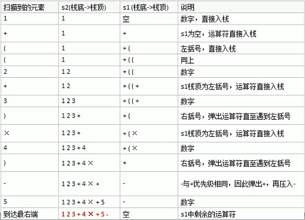
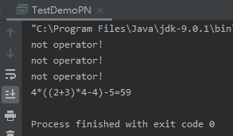
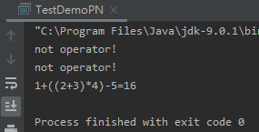
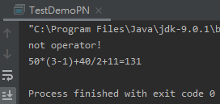

<!-- TOC -->

- [1. 中缀表达式转后缀表达式思路分析](#1-中缀表达式转后缀表达式思路分析)
  - [1.1. 转换步骤](#11-转换步骤)
  - [1.2. 转换实例](#12-转换实例)
- [2. 中缀转后传表达式代码实现](#2-中缀转后传表达式代码实现)
  - [2.1. 定义操作符优先级比较类](#21-定义操作符优先级比较类)
  - [2.2. 定义逆波兰计算器类(包含主方法)](#22-定义逆波兰计算器类包含主方法)
  - [2.3. 测试结果](#23-测试结果)
    - [2.3.1. 表达式 1](#231-表达式-1)
    - [2.3.2. 表达式2](#232-表达式2)
    - [2.3.3. 表达式3](#233-表达式3)

<!-- /TOC -->

****
[博主的 Github 地址](https://github.com/leon9dragon)
****

## 1. 中缀表达式转后缀表达式思路分析
- 后缀表达式易于计算机计算, 但人类却不容易写出来
- 因此在开发中需要将中缀表达式转换为后缀表达式

### 1.1. 转换步骤
1) 初始化两个栈: 符号栈 s1 和储存中间结果的栈 s2
   
2) 从左到右扫描中缀表达式
   
3) 遇到操作数时, 将其压入 s2
   
4) 遇到运算符时, 比较其与 s1 栈顶运算符的优先级:  
   
   - 若 s1 栈为空,   
     或栈顶运算符为左括号 "(",  
     或当前运算符优先级比 s1 栈顶运算符的高,    
     则直接将此运算符入栈 s1.
   - 若当前运算符优先级小于等于 s1 栈顶运算符,   
     将 s1 栈顶的运算符弹出并压入到 s2 中,  
     再回到第 4 步与 s1 中新的栈顶运算符相比较

5) 遇到括号时:  
   - 如果是左括号 "(", 则直接压入 s1
   - 如果是右括号 ")", 则依次弹出 s1 栈顶的运算符,  
     并压入 s2, 直到遇到左括号为止,  
     然后将当前左括号舍弃.

6) 重复步骤 2 到 5, 直到扫描到中缀表达式的最右边

7) 将 s1 中剩余的运算符依次弹出并压入 s2

8) 依次弹出 s2 中的元素并输出, 并将输出结果进行逆序,  
   得到的表达式就是后缀表达式

### 1.2. 转换实例
- 以中缀表达式 "1 + ((2 + 3) * 4) - 5" 转换过程进行示例
- 转换过程如下图, 转换后的结果为 "1 2 3 + 4 * + 5 -"   
  


****

## 2. 中缀转后传表达式代码实现

### 2.1. 定义操作符优先级比较类
```java
package com.leo9.dc08.poland_notation;

public class Operation {
    //定义各运算符所对应的优先级
    private static int ADD = 1;
    private static int SUB = 1;
    private static int MUL = 2;
    private static int DIV = 2;

    //写一个方法, 返回对应的优先级数字
    public static int getValue(String operation){
        int result = 0;
        switch (operation){
            case "+":
                result = ADD;
                break;
            case "-":
                result = SUB;
                break;
            case "*":
                result = MUL;
                break;
            case "/":
                result = DIV;
                break;
            default:
                System.out.println("not operator!");
                break;
        }
        return result;
    }
}

```

****

### 2.2. 定义逆波兰计算器类(包含主方法)
```java
package com.leo9.dc08.poland_notation;

import java.util.*;

//完成一个将中缀表达式转成后缀表达式并算出后缀表达式结果的功能
/*思路说明
0.以中缀表达式 "1 + ((2 + 3) * 4) - 5" 示例, 将其转换成 "1 2 3 + 4 * + 5 -"
1.直接对字符串进行操作不方便, 因此先将字符串表达式转换成中缀表达式对应的List
  即将字符串进行分割遍历, 将其存入一个ArrayList中
2.将得到的一个中缀表达式对应的list转换成一个后缀表达式对应的list, 运算符优先级比较需要自己定义Operation类写对应的方法
3.完成对后缀表达式的list的计算并返回结果
*/
public class TestDemoPN {
    //开始计算
    public static void main(String[] args) {
        //定义中缀表达式
        //String expression = "1+((2+3)*4)-5";
        String expression = "4*((2+3)*4-4)-5";
        //转换中缀表达式为list
        List<String> infix_expression_list = toInfixExpressionList(expression);
        //将中缀表达式的list转为后缀表达式的list
        List<String> suffix_expression_list = parseSuffixExpressionList(infix_expression_list);
        //计算并获取后缀表达式的结果
        int result = calculateList(suffix_expression_list);
        //输出结果
        System.out.println(expression + "=" + result);
    }

    //region 1.将中缀表达式转换成对应的ArrayList
    public static List<String> toInfixExpressionList(String expression){
        //创建一个ArrayList,存放中缀表达式对应的内容
        List<String> list = new ArrayList<String>();
        //创建一个索引指针, 用于遍历中缀表达式的字符串
        int i = 0;
        //创建一个字符串变量用来进行多位数拼接
        String str;
        //每遍历到一个字符,就放入到c中
        char c;
        //遍历字符串表达式
        do{
            //如果c是非数字, 就加入到list
            if((c = expression.charAt(i)) < 48 || (c = expression.charAt(i)) > 57){
                list.add("" + c);
                //指针后移
                i++;
            }
            //如果是一个数字, 则需要进行拼接可能出现的多位数
            else{
                //每次大循环将str置空刷新
                str = "";
                while (i < expression.length() && (c = expression.charAt(i)) >= 48 && (c = expression.charAt(i)) <= 57){
                    //拼接多位数
                    str += c;
                    //指针后移
                    i++;
                }
                list.add(str);
            }
        }while (i < expression.length());
        return list;
    }
    //endregion

    //region 2.将中缀表达式的list转换成后缀表达式对应的list
    public static List<String> parseSuffixExpressionList(List<String> ls){
        //定义两个栈, 符号栈s1和中间结果栈s2
        Stack<String> s1 =  new Stack<String>();
        //由于中间结果栈s2在转换过程中没有出栈操作, 只是一直在入栈只有到最后才一次将结果输出,
        //输出完后还要逆序, 但用List直接输出不需要逆序, 因此s2可以用ArrayList来替代
        List<String> s2 =  new ArrayList<String>();

        //遍历ls
        for(String item: ls){
            //如果是一个数, 直接加入s2
            if(item.matches("\\d+")){
                s2.add(item);
            }
            //如果是左括号, 直接入栈s1
            else if(item.equals("(")){
                s1.push(item);
            }
            //如果是右括号, 依次弹出 s1 栈顶的运算符并压入 s2, 直到遇到左括号为止, 此时将这一对括号舍弃
            else if(item.equals(")")){
                while(!s1.peek().equals("(")){
                    s2.add(s1.pop());
                }
                //消除左括号
                s1.pop();
            }
            else{
                //当item的优先级小于等于s1栈顶的优先级, 将 s1 栈顶的运算符弹出并加入到 s2 中,
                //再次转到步骤 4-1 与 s1 中新的栈顶运算符相比较
                //运算符优先级比较使用自己定义的Operation类中的方法
                while(s1.size() != 0 && Operation.getValue(s1.peek()) >= Operation.getValue(item)){
                    s2.add(s1.pop());
                }
                //还需要将item压入栈中
                s1.push(item);
            }
        }

        //将s1中剩余的运算符依次弹出并加入s2
        while(s1.size() != 0){
            s2.add(s1.pop());
        }

        //返回后缀表达式对应的list
        return s2;
    }
    //endregion

    //region 3.完成对后缀表达式的运算
    /*
    1. 从左到右扫描表达式
    2. 遇到数字时, 将数字压入堆栈
    3. 遇到运算符时, 弹出栈顶的两个数,用运算符对它们做计算, 并将结果入栈.
    4. 重复上述过程直到表达式最右端,最后得到的运算结果就是表达式的最终结果.
    */

    public static int calculateList(List<String> ls){
        //创建一个栈, 且只需要一个栈即可
        Stack<String> stack = new Stack<String>();
        //遍历ArrayList
        for(String item: ls){
            //使用正则表达式来取出数
            if(item.matches("\\d+")){
                //匹配的是多位数, 入栈
                stack.push(item);
            }
            else{
                //pop出两个数, 并运算, 再入栈
                int num2 = Integer.parseInt(stack.pop());
                int num1 = Integer.parseInt(stack.pop());
                int res = 0;
                if(item.equals("+")){
                    res = num1 + num2;
                }
                else if(item.equals("-")){
                    res = num1 - num2;
                }
                else if(item.equals("*")){
                    res = num1 * num2;
                }
                else if(item.equals("/")){
                    res = num1/num2;
                }
                else {
                    throw new RuntimeException("error!");
                }
                //把res入栈
                stack.push("" + res);
            }
        }
        //最后留在Stack中的数据是运算结果
        return Integer.parseInt(stack.pop());
    }
    //endregion
}

```

****

### 2.3. 测试结果

#### 2.3.1. 表达式 1
- 表达式 "4*((2+3)*4-4)-5"   



#### 2.3.2. 表达式2
- 表达式 "1+((2+3)*4)-5"



#### 2.3.3. 表达式3
- 表达式 "50*(3-1)+40/2+11"

