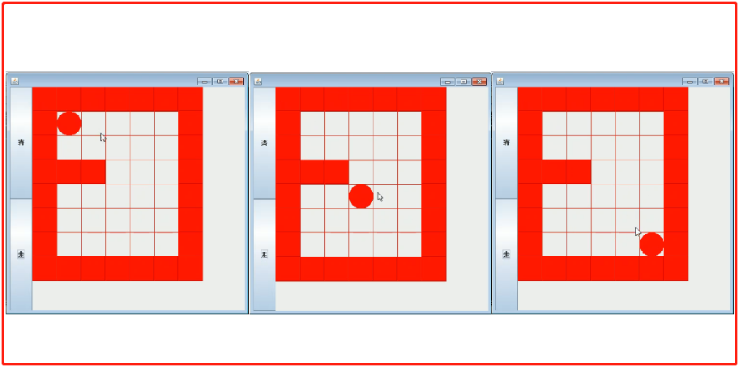
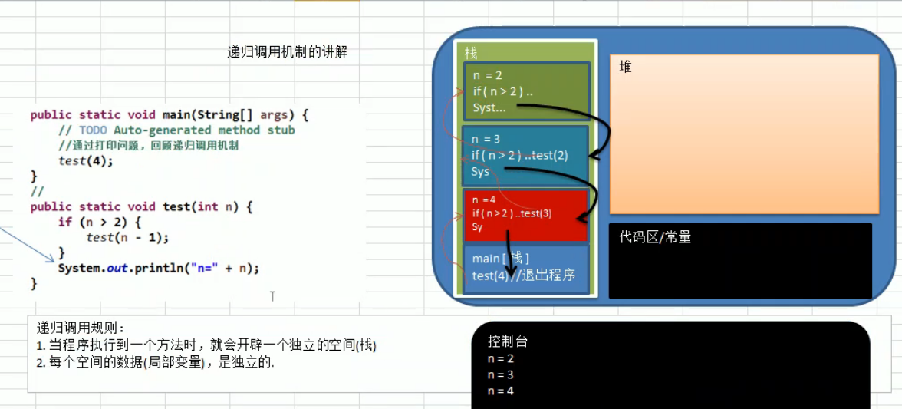

<!-- TOC -->

- [1. 递归](#1-递归)
  - [1.1. 递归的应用](#11-递归的应用)
    - [1.1.1. 迷宫问题](#111-迷宫问题)
  - [1.2. 递归的定义](#12-递归的定义)
  - [1.3. 递归调用机制](#13-递归调用机制)
  - [1.4. 递归可以解决什么样的问题](#14-递归可以解决什么样的问题)
  - [1.5. 递归需要遵守的重要规则](#15-递归需要遵守的重要规则)

<!-- /TOC -->

****
[博主的 Github 地址](https://github.com/leon9dragon)
****

## 1. 递归

### 1.1. 递归的应用

#### 1.1.1. 迷宫问题
- 如下图. 小球从左上角走到右下角, 需要用到递归来处理.
- 这是递归经典应用, 迷宫问题(回溯), 递归(recursion)

****

### 1.2. 递归的定义
- 递归就是方法自己调用自己, 每次调用时传入不同的变量
- 递归有助于编程者解决复杂问题, 同时让代码变得简洁

****

### 1.3. 递归调用机制
- 当程序执行到一个方法时, 就会开辟一个独立的空间(实质是栈)
- 每个空间的数据(局部变量)是独立的
- 然后从栈顶依次执行每个空间内定义的过程
- 执行完栈中最后一个空间的过程后就退出程序

****

### 1.4. 递归可以解决什么样的问题
- 各种数学问题: 八皇后问题, 汉诺塔问题, 阶乘问题, 迷宫问题, 球和篮子问题
- 各种算法中也会使用到递归, 比如快排, 归并排序, 二分查找, 分治算法等
- 将用栈解决问题 -> 递归代码比较简洁

****

### 1.5. 递归需要遵守的重要规则
- 执行一个方法时, 就创建一个新的受保护的独立空间(栈空间)
- 方法的局部变量是独立的, 不会相互影响
- 如果方法中使用的是引用类型变量(如数组), 将会在每次递归中共享该数据
- 递归必须向退出递归的条件逼近, 否则就是死循环, 会出现栈溢出错误
- 当一个栈中的方法执行完毕或者遇到 return, 就会返回到调用它的位置,  
  遵守谁调用, 就将结果返回给谁. 
- 当一个栈中的方法执行完毕或返回时, 这个栈的方法也就执行完毕, 当前栈出栈