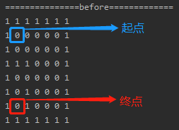
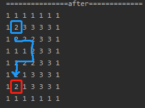

<!-- TOC -->

- [1. 迷宫问题说明](#1-迷宫问题说明)
- [2. 迷宫问题代码实现](#2-迷宫问题代码实现)
  - [2.1. 前要说明](#21-前要说明)
  - [2.2. 迷宫代码](#22-迷宫代码)
  - [2.3. 迷宫测试](#23-迷宫测试)
    - [2.3.1. 起点](#231-起点)
    - [2.3.2. 终点](#232-终点)

<!-- /TOC -->

****
[博主的 Github 地址](https://github.com/leon9dragon)
****

## 1. 迷宫问题说明


1) 小球得到的路径, 和编程者设置的找路策略有关  
   即找路的上下左右的顺序相关
2) 在得到小球路径时, 可以先使用(下右上左),  
   再改成使用(上右下左), 看看路径是否有变化
3) 测试回溯现象, 求出最短路径

## 2. 迷宫问题代码实现

### 2.1. 前要说明
- 在找路的方法中, 采用策略下右上左的走法进行寻路.  
- 递归的规则就是:  
  把墙设为 1, 通路为 2, 不通为 3, 可走为 0,  
  因此实际上在进行寻路的时候, 只有 0 的点是可以走的.  
  - 从起点开始寻路, 分别按照策略依序向周围四个方向进行寻路.  
    即策略是下右上左的话, 则先走下再走右然后走上最后走左
  - 在走向某条路的末端若该点四个方向都走不通,  
    则将该点标为不通, 相当于将该点变成墙.   
  - 然后退回上一点, 继续测试另外的三个方向,  
    直到走通或走不同为止.
  - 最后若能走到终点, 将终点设为 2, 退出递归;   
    或者当路线上能走的点全都为 3, 退出递归.

****

### 2.2. 迷宫代码
```java
package com.leo9.dc09.maze_question;

public class Maze {
    public static void main(String[] args) {
        //创建一个二维数组, 用以模拟迷宫地图
        int[][] map = new int[8][7];
        //使用1表示墙
        //上下全部置为1
        for(int i = 0; i < 7; i++){
            map[0][i] = 1;
            map[7][i] = 1;
        }
        //左右全部置为1
        for(int i = 0; i < 8; i++){
            map[i][0] = 1;
            map[i][6] = 1;
        }

        //设置挡板, 用1表示
        map[3][1] = 1;
        map[3][2] = 1;
        map[5][2] = 1;
        map[6][2] = 1;

        //输出地图
        System.out.println("===============before=============");
        for(int i = 0; i < 8; i++){
            for(int j = 0; j < 7; j++){
                System.out.print(map[i][j] + " ");
            }
            System.out.println();
        }

        //开始寻路
        setWay(map,1,1);

        //输出地图
        System.out.println("===============after=============");
        for(int i = 0; i < 8; i++){
            for(int j = 0; j < 7; j++){
                System.out.print(map[i][j] + " ");
            }
            System.out.println();
        }
    }

    //region 使用递归回溯来给小球找路
    /*
    * @description:
    *   (1) map表示地图
    *   (2) i,j 表示从地图的哪个位置出发, 从(1,1)左上角出发
    *   (3) 如果小球能到map[6][5]位置, 则说明有通路
    *   (4) 约定: 当map[i][j]的值为0表示改点没有走过, 为1表示墙,
    *             为2表示通路可走, 为3表示该点走过但走不通.
    *   (5) 在走迷宫时需要确定策略(方法), 下->右->上->左, 如果该点走不通, 则回溯
    * @param: map 表示地图
    * @param: i 初始位置的行号
    * @param: j 初始位置的列号
    * @return: 如果找到通路返回true, 找不到则返回false
    */
    public static boolean setWay(int[][] map, int i, int j){
        if(map[6][1] == 2){
            //当终点为2时说明走通了
            return true;
        }
        else{
            if(map[i][j] == 0){
                //如果当前点没有走过, 则按照策略 下->右->上->左 的方式走
                //先假定该点可以走通
                map[i][j] = 2;
                if(setWay(map, i + 1, j)){
                    //在这个点基础下向下走, 行数i + 1
                    return true;
                }
                
                else if(setWay(map, i, j + 1)){
                    //在这个点基础下向右走, 列数j + 1
                    return true;
                }

                else if(setWay(map, i - 1, j)){
                    //在这个点基础下向上走, 列数i - 1
                    return true;
                }

                else if(setWay(map, i, j - 1)){
                    //在这个点基础下向左走, 列数j - 1
                    return true;
                }

                else {
                    //如果以上4个条件都不成立, 将该点置成3, 并返回false
                    map[i][j] = 3;
                    return false;
                }
            }
            else{
                //如果map[i][j] != 0, 可能为1, 2, 3
                return false;
            }
        }
    }
    //endregion
}

```

****

### 2.3. 迷宫测试

#### 2.3.1. 起点
- 起点在(1,1), 如下所示, 是未开始寻路的迷宫
 


#### 2.3.2. 终点
- 终点设置在(6,1), 如下所示, 是寻路完后的迷宫


