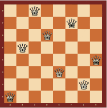
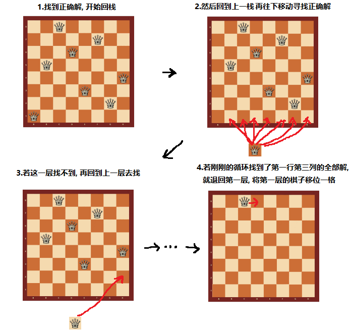
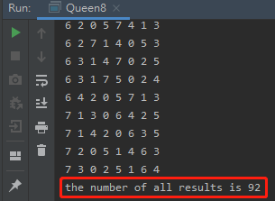

<!-- TOC -->

- [1. 八皇后问题整体分析](#1-八皇后问题整体分析)
  - [1.1. 八皇后问题介绍](#11-八皇后问题介绍)
  - [1.2. 八皇后问题算法思路分析](#12-八皇后问题算法思路分析)
  - [1.3. 回溯问题的图解](#13-回溯问题的图解)
- [2. 八皇后问题代码实现](#2-八皇后问题代码实现)
  - [2.1. 整体代码](#21-整体代码)
  - [2.2. 测试结果](#22-测试结果)

<!-- /TOC -->

****
[博主的 Github 地址](https://github.com/leon9dragon)
****

## 1. 八皇后问题整体分析

### 1.1. 八皇后问题介绍
- 八皇后问题是回溯算法的典型案例   
- 该问题由国际象棋棋手马克斯贝瑟于1848年提出</br>
  
- 在 8*8 格的国际象棋棋盘上摆放 8 个皇后,  
  使其不能互相攻击, 能有多少种摆法?
- 即任意两个皇后都不能处于同一行, 同一列或同一斜线上,  
  一共有多少种情况可以出现.

****

### 1.2. 八皇后问题算法思路分析
1. 第一个皇后先放第一行第一列
   
2. 第二个皇后放在第二行第一列, 然后判断是否 OK,  
   如果不 OK, 继续放在第二列, 第三列...  
   依次放完所有列, 找到一个合适为止.

3. 继续第三个皇后, 还是第一列, 第二列...的顺序依次摆放,  
   直到第 8 个皇后能放在一个不冲突的位置, 这样算一个正确解

4. 当得到一个正确解时就将栈回退到上一个栈, 开始进行回溯,  
   即将第一个皇后, 放到第一列的所有正确解全部得到

5. 然后回头继续第一个皇后放第一行第二列,  
   后面继续循环执行 1, 2, 3, 4 的步骤.

- **说明:**  
  理论上应该创建一个二维数组来表示棋盘,  
  但实际上可以通过算法用一个一维数组解决问题.  
  一维数组的下标对应行号, 数组的成员对应列号.  
  
  - 即存在数组 arr, 数组中存在 `arr[i] = val`  
  val+1 表示的是第 i+1 个皇后所放位置的列号  
  i+1 则表示第 i+1 个皇后所放位置的行号

****

### 1.3. 回溯问题的图解


****

## 2. 八皇后问题代码实现

### 2.1. 整体代码
- 实现细节看代码注释
```java
package com.leo9.dc10.eight_queens;

public class Queen8 {
    //定义一个max表示有多少个皇后
    int max = 8;
    //定义一维数组arr作为棋盘, 保存结果
    int[] array = new int[max];
    //定义变量res记录正确结果次数
    static int res = 0;

    public static void main(String[] args) {
        new Queen8().check(0);
        System.out.println("the number of all results is " + res);
    }

    //定义方法, 放置第n个皇后
    private void check(int n){
        //判断是否放完八个皇后
        if(n == max){
            //当n等于8的时候, 已经超出数组范围, 即放的是第九个皇后
            //因此说明前八个皇后条件满足, 可以输出结果
            print();
            res++;
            return;
        }

        //依次放入皇后, 并判断是否冲突
        //用循环将每一行的每种结果都循环八次, 将所有结果找出
        for (int i = 0; i < max; i++) {
            //先把当前这个皇后n, 放到当前行的第i列, i从0开始
            array[n] = i;
            //判断放放置第n个皇后到第i列时, 是否冲突
            if(judge(n)){
                //如果不冲突, 接着放下一个
                check(n+1);
            }
            //如果冲突, 就会回到循环开头, 将n往下一列放
        }
    }

    //定义方法, 查看当放置第n个皇后时, 当前皇后是否和之前皇后冲突
    private boolean judge(int n){
        for (int i = 0; i < n; i++) {
            //判断是否同列和同斜线
            /*
            * 如果同一列, 则两个数组成员的值相等
            * 如果同一斜线, 则两个数组成员的行号相减的绝对值等于列号相减的绝对值
                *棋盘中若两点在同一斜线会构成等腰直角三角形, 两条短边是相等的
            * */
            if(array[i] == array[n] || Math.abs(n-i) == Math.abs(array[n] - array[i])) {
                return false;
            }
        }
        return true;
    }

    //定义方法, 将每次数组保存的正确结果输出
    private void print(){
        for (int i = 0; i < array.length; i++) {
            System.out.print(array[i] + " ");
        }
        System.out.println();
    }
}

```

****

### 2.2. 测试结果
- 显而易见, 已将 92 种结果成功输出
- 备注:  
  算法效率很低, 要判断 15720 次才能得出结果, 需要后续优化  
  


