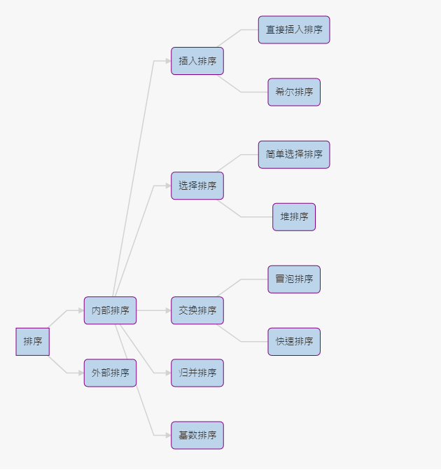

<!-- TOC -->

- [1. 排序算法的介绍](#1-排序算法的介绍)
  - [1.1. 排序的分类](#11-排序的分类)
    - [1.1.1. 内部排序](#111-内部排序)
    - [1.1.2. 外部排序法](#112-外部排序法)
    - [1.1.3. 常见的排序算法分类图](#113-常见的排序算法分类图)

<!-- /TOC -->

****
[博主的 Github 地址](https://github.com/leon9dragon)
****

## 1. 排序算法的介绍
- 排序也称排序算法(sort algorithm),  
  是将一组数据依指定的顺序进行排列的过程

****

### 1.1. 排序的分类

#### 1.1.1. 内部排序
- 指将需要处理的所有数据都加载到内部存储器中进行排序

#### 1.1.2. 外部排序法
- 数据量过大无法全部加载到内存中, 需要借助外部存储进行排序

#### 1.1.3. 常见的排序算法分类图
```
//mermaid 代码
graph LR  
    A[排序] --> A1(内部排序)
    A --> A2(外部排序)
    A1 --> B1(插入排序)
    B1 --- B11(直接插入排序)
    B1 --- B12(希尔排序)
    A1 --> B2(选择排序)
    B2 --- B21(简单选择排序)
    B2 --- B22(堆排序)
    A1 --> B3(交换排序)
    B3 --- B31(冒泡排序)
    B3 --- B32(快速排序)
    A1 --> B4(归并排序)
    A1 --> B5(基数排序)
```



