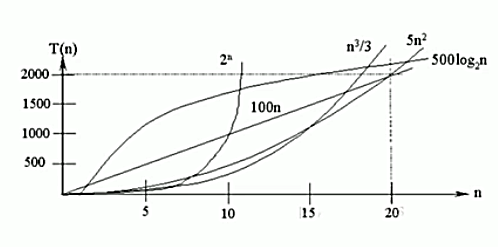

<!-- TOC -->

- [1. 时间复杂度](#1-时间复杂度)
  - [1.1. 计算时间复杂度的方法](#11-计算时间复杂度的方法)
  - [1.2. 常见的时间复杂度](#12-常见的时间复杂度)
    - [1.2.1. 常数阶 O(1)](#121-常数阶-o1)
    - [1.2.2. 对数阶 O(log<sub>2</sub>n)](#122-对数阶-ologsub2subn)
    - [1.2.3. 线性阶 O(n)](#123-线性阶-on)
    - [1.2.4. 线性对数阶 O(n*log<sub>2</sub>n)](#124-线性对数阶-onlogsub2subn)
    - [1.2.5. 平方阶 O(n<sup>2</sup>)](#125-平方阶-onsup2sup)

<!-- /TOC -->

****
[博主的 Github 地址](https://github.com/leon9dragon)
****

## 1. 时间复杂度
- 一般情况下, 算法中的基本操作语句的重复执行次数是问题规模 n 的某个函数,  
用 T(n) 表示, 若有某个辅助函数 f(n), 使得当 n 趋近于无穷大时,  
T(n)/f(n) 的极限值为不等于零的常数, 则称 f(n) 是 T(n) 的同数量级函数.  
记作 T(n) = O(f(n)), 称 O(f(n)) 为算法的渐进时间复杂度, 简称时间复杂度.

- T(n) 不同, 但时间复杂度可能相同.  
  如 T(n)=n<sup>2</sup>+7n+6 和 T(n)=3n<sup>2</sup>+2n+2, 它们的 T(n) 不同, 但时间复杂度相同, 都为 O(n<sup>2</sup>)

****

### 1.1. 计算时间复杂度的方法
- 用常数 1 代替运行时间中的所有加法常数
- 修改后的运行次数函数中, 只保留最高阶项
- 去除最高阶项的系数

  - 示例:  
    - 原式: T(n) = 3n<sup>2</sup>+2n+6
    - 第一步转换: T(n) = 3n<sup>2</sup>+2n+1
    - 第二步转换: T(n) = 3n<sup>2</sup>
    - 第三步转换: T(n) = n<sup>2</sup>
    - 最后得出时间复杂度为 O(n<sup>2</sup>)

****

### 1.2. 常见的时间复杂度



1) 常数阶 O(1)
2) 对数阶 O(log<sub>2</sub>n)
3) 线性阶 O(n)
4) 线性对数阶 O(n*log<sub>2</sub>n)
5) 平方阶 O(n<sup>2</sup>)
6) 立方阶 O(n<sup>3</sup>)
7) k 次方阶 O(n<sup>k</sup>)
8) 指数阶 O(2<sup>n</sup>)

- 说明:  
  - 常见的算法时间复杂度由小到大排序依次为:  
  O(1) < O(log<sub>2</sub>n) < O(n) < O(n*log<sub>2</sub>n) < O(n<sup>2</sup>) < O(n<sup>3</sup>) < O(n<sup>k</sup>) < O(2<sup>n</sup>)  
  随着问题规模 n 的不断增大, 上述的时间复杂度不断增大, 算法执行效率越低
  - 由图可见, 应该尽量避免使用指数阶的算法

 
#### 1.2.1. 常数阶 O(1)

```java
  int i = 1;
  int j = 2;
  i++;
  ++j;
  int m = i + j;
```

- 无论代码执行了多少行, 只要没有循环等复杂结构, 那程序的时间复杂度就都是 O(1)  

- 如上代码所示, 它执行时消耗的时间并不随着某一变量增长而增长,  
  那么无论这类代码有多长, 都可以用 O(1) 表示其时间复杂度.


#### 1.2.2. 对数阶 O(log<sub>2</sub>n)

```java
  int i = 1;
  while(i < n){
    i = i * 2;
  }
```

- 如上代码所示, 在每次循环中都将 i 乘以 2, 乘完后 i 距离 n 就会靠近.  
- 假设循环 x 次后使得 i>=n, 也就是说此时 2<sup>x</sup>=n.
- 那么, x = log<sub>2</sub>n, 也就是循环 log<sub>2</sub>n 次之后循环结束
- 所以, 程序的时间复杂度就是 O(log<sub>2</sub>n).  
  对数的底数是根据程序而变化的, 若令 i*3 时间复杂度就是 O(log<sub>3</sub>n)

#### 1.2.3. 线性阶 O(n)

```java
  for(int i = 1; i <= n; i++){
    j = i;
    j++;
  }
```

- 上述代码中 for 循环里的代码会执行 n 次, 可见它消耗的时间是随 n 变化而变化的  
- 因此这类代码可以用 O(n) 来表示时间复杂度


#### 1.2.4. 线性对数阶 O(n*log<sub>2</sub>n)

```java
  for(int c = 1; c <= n; c++){
    int i = 1;
    while(i < n){
      i = i * 2;
    }
  }
```

- 将时间复杂度为 O(log<sub>2</sub>n) 的程序循环 n 次, 它的时间复杂度就会变成 O(n*log<sub>2</sub>n).


#### 1.2.5. 平方阶 O(n<sup>2</sup>)

```java
  int count = 0;
  for(int i = 0; i < n; i++){
    for(int j = 0; j < n; j++){
      count ++;
    }
  }
```

- 平方阶就是把 O(n) 的代码嵌套循环跑 n 遍, 时间复杂度就是 O(n<sup>2</sup>)
- 以此类推两层循环的时间复杂度实际上是 O(n*m)
- 因此多次方阶也可类比得出