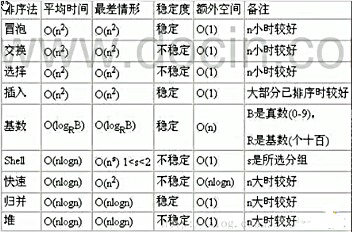

<!-- TOC -->

- [1. 平均时间复杂度和最坏时间复杂度](#1-平均时间复杂度和最坏时间复杂度)
  - [1.1. 平均时间复杂度的概念](#11-平均时间复杂度的概念)
  - [1.2. 最坏时间复杂度的概念](#12-最坏时间复杂度的概念)
  - [1.3. 一些算法的时间复杂度](#13-一些算法的时间复杂度)
  - [1.4. 算法空间复杂度的概念](#14-算法空间复杂度的概念)

<!-- /TOC -->

****
[博主的 Github 地址](https://github.com/leon9dragon)
****

## 1. 平均时间复杂度和最坏时间复杂度  

### 1.1. 平均时间复杂度的概念
- 指的是所有可能的输入实例以均等概率出现的情况下, 算法的运行运行时间

### 1.2. 最坏时间复杂度的概念
- 最坏情况下的时间复杂度称为最坏时间复杂度  
- 一般讨论的时间复杂度是最坏情况下的时间复杂度
- 因为最坏情况下的时间复杂度是算法在任 何输入实例上的运行时间界限  
  这就保证了算法的运行时间不会比最坏情况更长

### 1.3. 一些算法的时间复杂度
- 平均时间复杂度和最坏时间复杂度是否一致, 和算法本身有关

### 1.4. 算法空间复杂度的概念
- 算法的空间复杂度定义为该算法所耗费的存储空间, 也是问题规模 n 的函数.

- 空间复杂度是对一个算法在运行过程中临时占用存储空间大小的量度.  

- 做算法分析时主要讨论时间复杂度, 因为用户体验更看重的是速度.  
一些缓存产品(redis, memcache)和算法(基数排序)本质上就是用空间换时间.