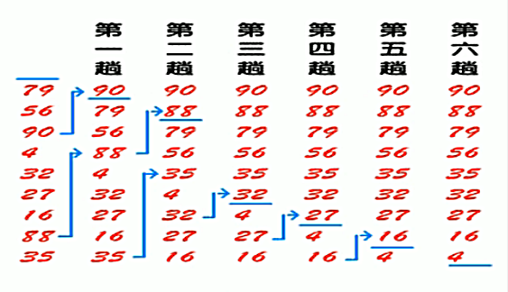
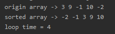
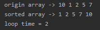

<!-- TOC -->

- [1. 冒泡排序整体分析](#1-冒泡排序整体分析)
  - [1.1. 基本介绍](#11-基本介绍)
  - [1.2. 优化方式](#12-优化方式)
  - [1.3. 排序图解](#13-排序图解)
- [2. 冒泡排序代码实现](#2-冒泡排序代码实现)
  - [2.1. 优化后的冒泡排序代码](#21-优化后的冒泡排序代码)
  - [2.2. 测试结果](#22-测试结果)
    - [2.2.1. 数组1](#221-数组1)
    - [2.2.2. 数组2](#222-数组2)
    - [2.2.3. 测试 8 万个数据](#223-测试-8-万个数据)

<!-- /TOC -->

****
[博主的 Github 地址](https://github.com/leon9dragon)
****

## 1. 冒泡排序整体分析

### 1.1. 基本介绍
冒泡排序(bubble sorting)的基本思想是:  
- 通过对 "待排序序列" 从前到后(从下标较小的元素开始)依次比较相邻元素的值
  - 若发现逆序则交换, 让值较大的元素向后移
  
  - 若没有逆序则保持不变, 继续向后进行比较 

****

### 1.2. 优化方式  
- 排序的过程中, 各元素不断接近自己的位置,  
  若一轮比较下来并无发生交换, 说明序列有序.
    
- 因此需要在排序过程中设置一个标志, 判断元素是否进行过交换,  
  从而减少不必要的循环队列进行元素比较.

****

### 1.3. 排序图解
- 如下图所示, 最顶上是队尾, 最底下是队首, 从下到上从小到大排序
- 图中省略了最后两趟的重复排序, 这两次排序并无发生交换
- 一共会发生数组长度减一次排序, 下图对应数组是 8 次
- 每次排序需要比较的数在逐渐减少, 第 i 次排序确立数组中第 i 大的元素


****

## 2. 冒泡排序代码实现

### 2.1. 优化后的冒泡排序代码
- 具体的实现细节看代码注释即可
```java
package com.leo9.dc11.bubble_sorting;

import java.util.Arrays;

public class BubbleSort {
    static private int count = 0;

    public static void main(String[] args) {
        //定义用来排序的数组
        //int[] arr = {3, 9, -1, 10, -2};
        int[] arr = {10, 1, 2, 5, 7};
        //输出原数组
        System.out.println("origin array -> " + Arrays.toString(arr));

        //开始排序,然后输出
        sortArray(arr);
        System.out.println("sorted array -> " + Arrays.toString(arr));
        System.out.println("loop time = " + count);
    }

    //数组排序的方法
    public static void sortArray(int[] arr){
        //获取传入数组的长度
        int arr_length = arr.length;
        //开始循环, 外层总共要循环数组长度减一次
        for(int i = 0; i < arr_length - 1; i++){
            //设置标志位用以判断是否产生交换
            int ifchange = 0;
            //外层每循环一次, 需要比较的数组成员就少一个, 因此循环次数要再减 i 次
            for (int j = 0; j < arr_length - 1 - i; j++) {
                //比较是否逆序, 是就开始交换
                if(arr[j] > arr[j + 1]){
                    int temp = arr[j + 1];
                    arr[j + 1] = arr[j];
                    arr[j] = temp;
                    ifchange++;
                }
            }
            count ++;
            //如果一轮比较下来并没有发生交换, 直接跳出循环.
            if(ifchange == 0){
                break;
            }
        }
    }

```

****

### 2.2. 测试结果

#### 2.2.1. 数组1
- 循环了 4 次



#### 2.2.2. 数组2 
- 循环了 2 次, 至少要循环 1 次来检测是否没有发生元素交换



#### 2.2.3. 测试 8 万个数据
- 用数组长度为 80000 的随机整形数组进行冒泡排序
- 得出的时间大概是 20s 左右