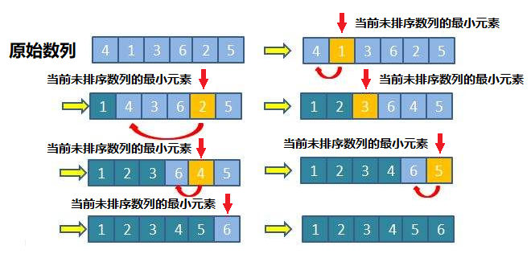
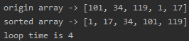

<!-- TOC -->

- [1. 选择排序整体分析](#1-选择排序整体分析)
  - [1.1. 基本介绍](#11-基本介绍)
  - [1.2. 排序思想](#12-排序思想)
  - [1.3. 排序图解](#13-排序图解)
  - [1.4. 排序总结](#14-排序总结)
- [2. 选择排序代码实现](#2-选择排序代码实现)
  - [2.1. 选择排序整体代码](#21-选择排序整体代码)
  - [2.2. 测试结果](#22-测试结果)
    - [2.2.1. 数组1](#221-数组1)
    - [2.2.2. 测试 8 万个数据的随机数组](#222-测试-8-万个数据的随机数组)

<!-- /TOC -->

****
[博主的 Github 地址](https://github.com/leon9dragon)
****

## 1. 选择排序整体分析

### 1.1. 基本介绍
选择式排序也属于内部排序法, 是从待排序的数据中,  
按指定的规则选出某一元素, 再依规定交换位置后达到排序的目的

### 1.2. 排序思想
- 选择排序(select sorting)也是一种简单的排序方法

- 它的基本思想是:  
  - 第一轮先从 arr[0]~arr[n-1] 中取最小值, 与 arr[0] 互换

  - 第二轮再从 arr[1]~arr[n-1] 中取最小值, 与 arr[1] 互换

  - 依次类推, 第 i 轮循环时取 arr[i-1]~arr[n-1] 中的最小值, 和 arr[i-1] 互换

  - 直到 i-1 = n-1 就停止循环, 总共排序了 n-1 次得到由小到大排序的数组  

****

### 1.3. 排序图解


****

### 1.4. 排序总结
- 若数组长度为 n, 则选择排序会进行 n-1 轮外层循环
- 每轮排序会根据外循环次数 i 以 arr[i] 作为起点(注: 这里的 i 从零开始计算)

****

## 2. 选择排序代码实现

### 2.1. 选择排序整体代码
```java
package com.leo9.dc12.select_sorting;

import java.util.Arrays;

public class SelectSort {
    private static int count = 0;
    public static void main(String[] args) {
        //定义要排序的数组
        int[] arr = {101, 34, 119, 1, 17};
        //int[] arr = {1, 2, 5, 10 ,7};

        //开始排序并输出
        System.out.println("origin array -> " + Arrays.toString(arr));
        sortArray(arr);
        System.out.println("sorted array -> " + Arrays.toString(arr));
        System.out.println("loop time is " + count);
    }

    //定义选择排序方法
    public static void sortArray(int[] arr){
        //获取数组长度
        int arr_length = arr.length;
        //定义变量以获取最小值和其对应的数组编号
        int min, num;
        //外层循环次数为数组长度减一, 因为最后一位元素后面并没有元素可以和它进行比较
        for (int i = 0; i < arr_length - 1; i++) {
            //初始化最小值和其角标, 默认为本轮循环的起始元素
            min = arr[i];
            num = i;
            //内层循环从外层循环的起始元素的下一位开始, 直到获取完数组剩余元素为止
            for (int j = i + 1; j < arr_length; j++) {
                //出现更小的值则开始进行更新最小值和角标
                if(min > arr[j]){
                    min = arr[j];
                    num = j;
                }
            }
            //计数表++
            count ++;
            //如果有更小的值就进行调换
            if(num != i){
                arr[num] = arr[i];
                arr[i] = min;
            }
        }
    }
}

```

****

### 2.2. 测试结果

#### 2.2.1. 数组1


#### 2.2.2. 测试 8 万个数据的随机数组
平均时间是 2s