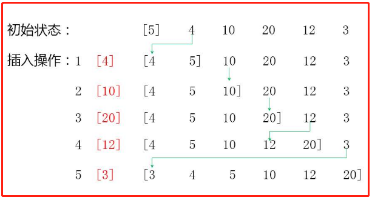
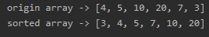

<!-- TOC -->

- [1. 插入排序整体分析](#1-插入排序整体分析)
  - [1.1. 基本介绍](#11-基本介绍)
  - [1.2. 排序思想](#12-排序思想)
  - [1.3. 排序图解](#13-排序图解)
- [2. 插入排序代码实现](#2-插入排序代码实现)
  - [2.1. 插入排序整体代码](#21-插入排序整体代码)
  - [2.2. 测试结果](#22-测试结果)
    - [2.2.1. 数组1](#221-数组1)
    - [2.2.2. 测试 8 万条随机数数组](#222-测试-8-万条随机数数组)

<!-- /TOC -->

****
[博主的 Github 地址](https://github.com/leon9dragon)
****

## 1. 插入排序整体分析

### 1.1. 基本介绍
- 插入式排序(insertion sorting)属于内部排序法 
- 是将待排序数组的元素以插入的方式去寻找适当的位置, 以达到排序的目的

****

### 1.2. 排序思想
插入排序的基本思想是:  
- 把 n 个待排序的元素看成一个有序表和一个无序表

- 开始时有序表中只包含一个元素, 无序表中包含有 n-1 个元素

- 排序过程中每次从无序表中取出第一个元素,  
  把它的排序码依次与有序表元素的排序码进行比较  
  将它插入到有序表中的适当位置, 使之成为新的有序表

****

### 1.3. 排序图解


****

## 2. 插入排序代码实现

### 2.1. 插入排序整体代码
- 算法细节看注释即可
```java
package com.leo9.dc13.insertion_sort;

import java.util.Arrays;

public class InsertionSort {
    public static void main(String[] args) {
        int[] arr = {4, 5, 10, 20, 7, 3};
        System.out.println("origin array -> " + Arrays.toString(arr));
        sortArray(arr);
        System.out.println("sorted array -> " + Arrays.toString(arr));
    }

    //编写插入排序算法
    public static void sortArray(int[] arr){
        //获取数组长度
        int arr_length = arr.length;
        //要获取除了第一个数的每个数与前面的值进行比较, 因此循环次数为数组长度减一
        for (int i = 1; i < arr_length; i++) {
            //要插入值从数组第二个元素开始, 第一个元素默认有序
            int insertVal = arr[i];
            //从当前要插入元素的上一位到数组首位开始逐一比较, 因此插入的比较索引为当前插入值索引减一
            int insertIndex = i - 1;
            //防止索引出界超出首位元素之前, 因此要大于0
            //若当前要插入元素小于比较位元素, 比较位元素向后一位复制, 相当于后移
            //即若有数组为[3,4,5,1]进行插入排序, 第一次移位变成[3,4,5,5], 第二次移位变成[3,4,4,5], 第三次移位是[3,3,4,5], 插入位置是最后一次比较位的前一位, 当前最后一位是-1, 前一位则是0
            //因为是从数组后端开始进行比较, 且对插入元素用变量进行保存, 因此元素后移并不会导致元素缺失.
            while(insertIndex >= 0 && insertVal < arr[insertIndex]){
                arr[insertIndex + 1] = arr[insertIndex];
                //索引向前移动
                insertIndex --;
            }
            //索引值发生改变则进行插入, 插入位置是最后一次比较位的前一位
            if(insertIndex != i - 1){
                arr[insertIndex + 1] = insertVal;
            }
        }
    }
}

```

### 2.2. 测试结果

#### 2.2.1. 数组1


#### 2.2.2. 测试 8 万条随机数数组
平均时间是 5s