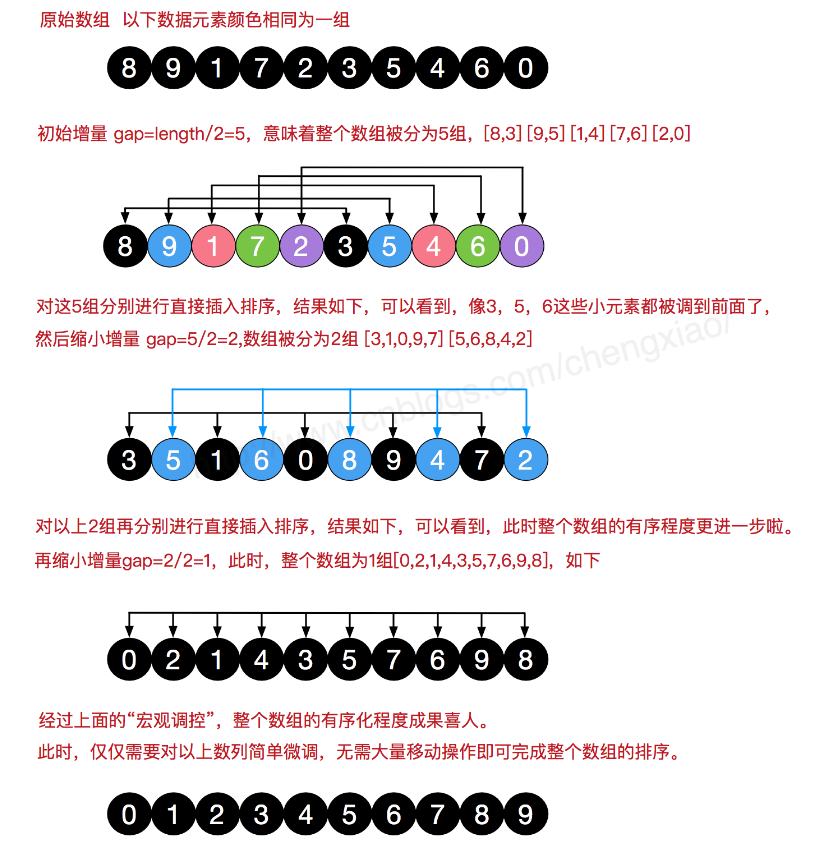
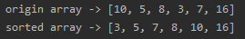

<!-- TOC -->

- [1. 希尔排序整体分析](#1-希尔排序整体分析)
  - [1.1. 直接插入排序存在的问题](#11-直接插入排序存在的问题)
    - [1.1.1. 一个简单的实例](#111-一个简单的实例)
    - [1.1.2. 结论](#112-结论)
  - [1.2. 希尔排序介绍](#12-希尔排序介绍)
  - [1.3. 希尔排序基本思想](#13-希尔排序基本思想)
  - [1.4. 希尔排序图解](#14-希尔排序图解)
  - [1.5. 希尔排序分析](#15-希尔排序分析)
- [2. 希尔排序代码实现](#2-希尔排序代码实现)
  - [2.1. 整体代码](#21-整体代码)
  - [2.2. 测试结果](#22-测试结果)
    - [2.2.1. 数组1](#221-数组1)
    - [2.2.2. 测试 8 万个数据的随机数组](#222-测试-8-万个数据的随机数组)

<!-- /TOC -->

****
[博主的 Github 地址](https://github.com/leon9dragon)
****

## 1. 希尔排序整体分析

### 1.1. 直接插入排序存在的问题

#### 1.1.1. 一个简单的实例  
对于 `arr = [2, 3, 4, 5, 6, 1]` 这种数组来说, 这它现在需要插入的值是 1  
然而要将 1 这个元素插入到数组中时, 要把前面 5 个元素都移位, 效率会很低

#### 1.1.2. 结论
直接插入排序在插入的数是较小的数时, 元素后移次数明显增多, 对效率有很大影响

****

### 1.2. 希尔排序介绍
- 希尔排序是希尔(DonaldShell)于 1959 年提出的一种排序算法

- 希尔排序是直接插入排序经过改进过后的版本, 也称为缩小增量排序

****

### 1.3. 希尔排序基本思想 
- 希尔排序是把记录按下标的一定增量分组, 对每组使用直接插入排序; 

- 随着增量逐渐减少, 每组包含的关键词越来越多

- 当增量减至 1 时, 整个文件恰好被分成一组, 算法结束

****

### 1.4. 希尔排序图解


****

### 1.5. 希尔排序分析
- 希尔排序一定程度上优化了插入排序, 因为插入排序对大部分排好的数列性能最优;  
   
- 希尔排序是先让数组大部分变得有序, 最后步长变为 1 的时候就是最优直接插入排序;

- 希尔排序的步长取值方案会直接影响算法性能:  
  - 最初 Shell 提出的是初始时 `step = array.length/2` 每轮结束再 `step /= 2` 折半,  
  直到 `step / 2 = 0` 为止结束循环.
  - 但是要直到 `step / 2 = 1` 时, 奇偶数位才开始互相比较, 导致性能低下;
  - 后来 Knuth 提出 `step / 3 + 1` 的方式, 也有人认为取奇数好,  
  也有人认为 step 间取互质的数好

- 希尔排序是一种不稳定的算法, 它的最坏时间复杂度为 O(n<sup>2</sup>),  
  一些经过优化的增量序列可使最坏时间复杂度达到 O(n<sup>3/2</sup>)

****

## 2. 希尔排序代码实现

### 2.1. 整体代码
```java
package com.leo9.dc14.shell_sort;

import java.util.Arrays;

public class ShellSort {
    public static void main(String[] args) {
        int[] arr = {10, 5, 8, 3, 7, 16};
        System.out.println("origin array -> " + Arrays.toString(arr));
        sortArray(arr);
        System.out.println("sorted array -> " + Arrays.toString(arr));
    }

    //编写希尔排序算法
    public static void sortArray(int[] arr){
        //最外层循环确定每轮的步长, 每次循环步长折半, 直到整除为0为止
        for (int step = arr.length/2; step > 0; step/=2) {
            //中层和内层循环根据直接插入排序进行修改, 由之前的步长为1, 修改为动态步长
            for (int i = step; i < arr.length; i++) {
                int insertVal = arr[i];
                int insertIndex = i - step;
                while(insertIndex >= 0 && insertVal < arr[insertIndex]){
                    arr[insertIndex + step] = arr[insertIndex];
                    insertIndex -=step;
                }
                if(insertIndex != i - step){
                    arr[insertIndex + step] = insertVal;
                }
            }
        }
    }
}

```

### 2.2. 测试结果

#### 2.2.1. 数组1


#### 2.2.2. 测试 8 万个数据的随机数组
平均时间为 2s 但不稳定