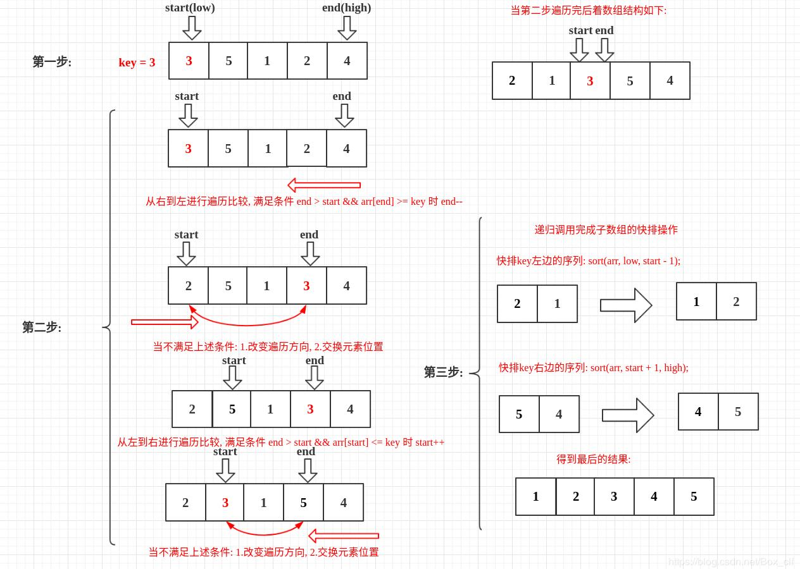
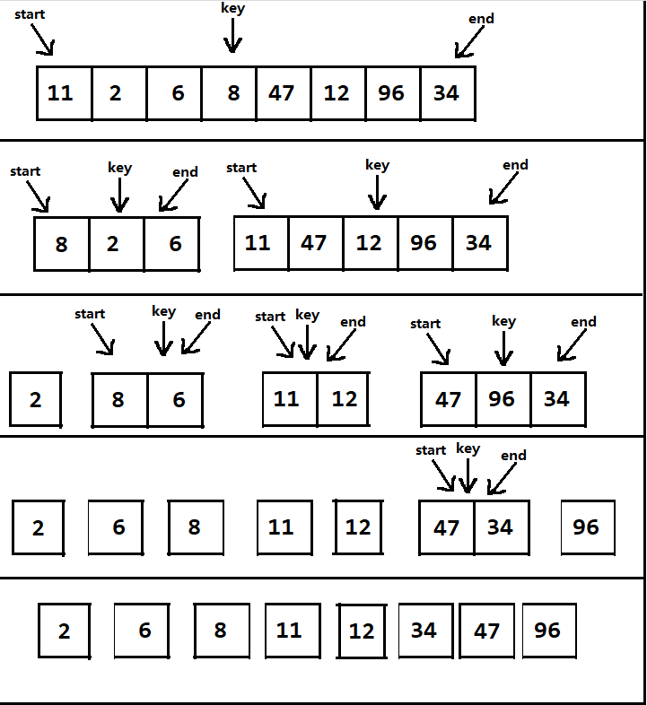
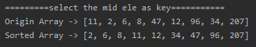
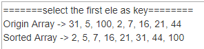

<!-- TOC -->

- [1. 快速排序整体分析](#1-快速排序整体分析)
  - [1.1. 基本介绍](#11-基本介绍)
    - [1.1.1. 基本思想](#111-基本思想)
  - [1.2. 快排图解](#12-快排图解)
    - [1.2.1. 选数组首位作为 key 的情况](#121-选数组首位作为-key-的情况)
    - [1.2.2. 选数组中轴作为 key 的情况](#122-选数组中轴作为-key-的情况)
  - [1.3. 快排总结(选数组中轴作为 key 的情况)](#13-快排总结选数组中轴作为-key-的情况)
- [2. 快速排序代码实现](#2-快速排序代码实现)
  - [2.1. 快速排序(选择中轴元素作为 key 的情况)](#21-快速排序选择中轴元素作为-key-的情况)
  - [2.2. 快速排序(选择数组首位作为 key 的情况)](#22-快速排序选择数组首位作为-key-的情况)
  - [2.3. 测试结果](#23-测试结果)
    - [2.3.1. 选中间值作为 key](#231-选中间值作为-key)
    - [2.3.2. 选首位值作为 key](#232-选首位值作为-key)
    - [2.3.3. 测试 8 万个数据的随机数组(以中间值为 key)](#233-测试-8-万个数据的随机数组以中间值为-key)

<!-- /TOC -->

****
[博主的 Github 地址](https://github.com/leon9dragon)
****

## 1. 快速排序整体分析

### 1.1. 基本介绍
- 快速排序(QuickSort)是对冒泡排序的一种改进

#### 1.1.1. 基本思想  
- 通过一趟排序将要排序的数据分割成独立的两部分

- 其中一部分的所有数据都比另一部分的所有数据小

- 然后再按此方法对这两部分分别进行快速排序

- 整个排序过程可以递归进行, 最终将整个数据变成有序序列

****

### 1.2. 快排图解

#### 1.2.1. 选数组首位作为 key 的情况


#### 1.2.2. 选数组中轴作为 key 的情况
- 首先指定头尾指针 start 和 end, 第一次的头尾指针分别是数组的首末位
- 然后指定 key 值, 是头尾指针相加整除 即 (start+end)/2
- 头指针 start 向下移位遍历, 直到 arr[start] >= key 为止
- 尾指针 end 向上移位遍历, 直到 arr[end] <= key 为止
- 当 end > start 时, 两位互换, 然后 end-- 以及 start++
- 循环以上步骤 直到 end <= start 跳出循环
- 数组拆分, 然后再递归重复上述步骤


****

### 1.3. 快排总结(选数组中轴作为 key 的情况)
- 快排的每一次递归调用其实是为了将选中的中轴元素排到数组中正确的位置
  - 指针移动最终都要定位到中轴身上, 因为中轴是正确位置, 下次递归的位置要根据中轴确立

- 每一轮当数组没有被分割到单元素时, 都会确立一个中轴元素的正确位置
  - 若已经被分割成单元素, 则单元素是顺序的

- 进入递归的前提是开始结束指针相等
  - 若没发生相等, 就依据条件进行元素位置互换, 然后继续循环检查, 直到指针相等
  - 当数组中轴前后元素都满足条件时, 指针挪动最终会让开始结束指针相等

- 直到数组被拆分成单个元素不能再拆分, 排序算法才会结束, 此时得到有序的数组

****

## 2. 快速排序代码实现

### 2.1. 快速排序(选择中轴元素作为 key 的情况)
- **只有数组中没有重复元素的情况下才能使用**
- 实现细节看代码注释
```java
package com.leo9.dc15.quick_sort;

import java.util.Arrays;

public class QuickSort {
    public static void main(String[] args) {
        int[] arr = {11, 2, 6, 8, 47, 12, 96, 34, 207};
        System.out.println("Origin Array -> " + Arrays.toString(arr));
        sortArray(arr, 0, arr.length - 1);
        System.out.println("Sorted Array -> " + Arrays.toString(arr));
    }

    public static void sortArray(int[] arr, int low, int high){
        //指定开始结束指针
        int start = low;
        int end = high;
        //指定key值, 一定要在这里直接等于arr[(low + high)/2], 因为后面交换可能会交换到这个位置的值
        //因此一定不可以用 key = (low + high)/2 然后用 arr[key] 比较, 这样绝对会出错, 因为这个位置的值在交换过程中可能会发生改变
        int key = arr[(low + high)/2];
        //指定临时变量, 用于交换的时候用
        int temp;

        //开始循环, 当开始指针在结束指针后面时执行
        while(end > start){
            //开始指针向下移动
            while(arr[start] < key){
                start ++;
            }
            //结束指针向上移动
            while(arr[end] > key){
                end --;
            }
            //当开始结束指针相等的时候跳出循环
            if(end == start){
                break;
            }
            //若开始结束指针没有相等, 就将开始结束指针指向的元素位置互换
            else {
                temp = arr[start];
                arr[start] = arr[end];
                arr[end] = temp;
            }
        }

        //当结束指针还没指到数组首位时就继续进行分割数组递归排序
        //开始指针要下移一位, 结束指针则要上移一位, 然后判断是否越界, 再进行递归
        if(end > low){
            sortArray(arr, low, end-1);
        }
        //当开始指针还没指到数组末位时就继续进行分割数组递归排序
        if(start < high){
            sortArray(arr, start+1, high);
        }
    }
}

```

****

### 2.2. 快速排序(选择数组首位作为 key 的情况)
- 这个算法调整的是 key 自身的位置, 总有一个指针会一直指向 key 并帮助它进行调整
- 因此该算法可以用于有重复元素时进行操作
- 相对中轴 key 来说, 中轴 key 是调整 key 两边的元素, 一旦出现重复元素就会死循环
```java
/**
 * 快速排序:
 * 选择一个关键值作为基准值。比基准值小的都在左边序列(一般是无序的),
 * 比基准值大的都在右边(一般是无序的)。一般选择序列的第一个元素。
 */
public class QuickSort {
    public static void main(String[] args) {
        int arr[] = new int[]{3, 5, 1, 2, 4};
        sort(arr, 0, a.length - 1);
        printArr(a);
    }
 
    public static void sort(int arr[], int low, int high){
        int start = low;//指定开始的索引
        int end = high;//指定结束的索引
        int key = arr[low];//设置比较值为
        while (end > start){
            //从后往前比较
            while (end > start && arr[end] >= key){
                //如果没有比关键值小的,比较下一个,直到有比关键值小的交换位置,然后又从前往后比较
                end--;
            }
            //将 arr[end] 和 arr[start] 进行交换
            if(arr[end]<=key){
                int temp = arr[end];
                arr[end] = arr[start];
                arr[start] = temp;
            }
            //从前往后比较
            while(end > start && arr[start] <= key){
                //如果没有比关键值大的,比较下一个,直到有比关键值大的交换位置
                start++;
            }
            //将 arr[end] 和 arr[start] 进行交换
            if(arr[start]>=key){
                int temp = arr[start];
                arr[start] = arr[end];
                arr[end] = temp;
            }
        }
        //递归进行左侧快排
        if(start > low){
            sort(arr, low, start - 1);//左边序列。第一个索引位置到关键值索引-1
        }
        //递归进行右侧快排
        if(end < high){
            sort(arr, end + 1, high);//右边序列。从关键值索引+1 到最后一个
        }
    }
 
    public static void printArr(int arr[]){
        for (int i = 0; i < arr.length; i++) {
            if (i == arr.length - 1){
                System.out.print(arr[i]);
            }else {
                System.out.print(arr[i] + ", ");
            }
        }
    }
}
```

****

### 2.3. 测试结果

#### 2.3.1. 选中间值作为 key


#### 2.3.2. 选首位值作为 key


#### 2.3.3. 测试 8 万个数据的随机数组(以中间值为 key)
执行时间平均为 1s 以内