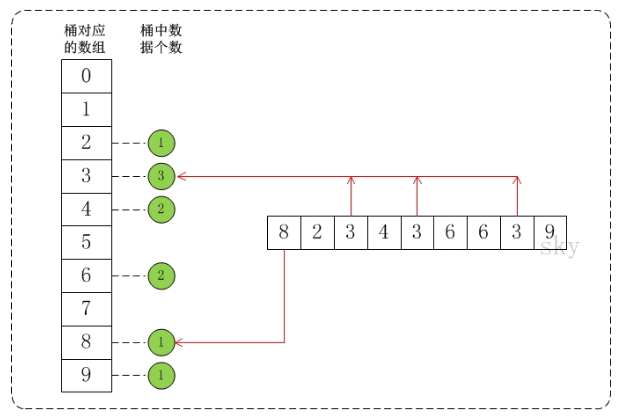

<!-- TOC -->

- [1. 桶排序](#1-桶排序)
  - [1.1. 基本介绍](#11-基本介绍)
  - [1.2. 算法图解](#12-算法图解)
  - [1.3. 代码实现](#13-代码实现)

<!-- /TOC -->

****
[博主的 Github 地址](https://github.com/leon9dragon)
****

## 1. 桶排序

### 1.1. 基本介绍
- 桶排序(Bucket Sort)的原理很简单, 它是将数组分到有限数量的桶子里.

- 假设待排序的数组 a 中共有 N 个整数, 并且已知数组 a 中数据的范围 [0, MAX).
    
- 在桶排序时, 创建容量为 MAX 的桶数组 r, 并将桶数组元素都初始化为 0;  
  - 将容量为 MAX 的桶数组中的每一个单元都看作一个 "桶".  

- 在排序时, 逐个遍历数组 a, 将数组 a 的值, 作为 "桶数组 r" 的下标.  
  - 当a中数据被读取时, 就将桶的值加 1.  
  - 例如, 读取到数组 a[3]=5, 则将 r[5] 的值 +1.


****

### 1.2. 算法图解
- 假设 `a={8,2,3,4,3,6,6,3,9}`, 此时可知最大值是 9, 因此设定 `max=10`.  
- 此时, 将数组 a 的所有数据都放到数值为 0-9 的桶中. 桶中默认值为 0.  
- 每在数组 a 中遍历一个数字, 该数字所对应的桶数值加一.  
- 最后将桶中的数据提取出来并转换成有序数组, 得到正确结果.

如下图:


****

### 1.3. 代码实现

```java

public class BucketSort {

    /*
     * 桶排序
     *
     * 参数说明：
     *     a -- 待排序数组
     *     max -- 数组a中最大值的范围
     */
    public static void bucketSort(int[] a, int max) {
        int[] buckets;

        if (a==null || max<1)
            return ;

        // 创建一个容量为max的数组buckets，并且将buckets中的所有数据都初始化为0。
        buckets = new int[max];

        // 1. 计数
        for(int i = 0; i < a.length; i++)
            buckets[a[i]]++;

        // 2. 排序
        for (int i = 0, j = 0; i < max; i++) {
            while( (buckets[i]--) >0 ) {
                a[j++] = i;
            }
        }

        buckets = null;
    }

    public static void main(String[] args) {
        int i;
        int a[] = {8,2,3,4,3,6,6,3,9};

        System.out.printf("before sort:");
        for (i=0; i<a.length; i++)
            System.out.printf("%d ", a[i]);
        System.out.printf("\n");

        bucketSort(a, 10); // 桶排序

        System.out.printf("after  sort:");
        for (i=0; i<a.length; i++)
            System.out.printf("%d ", a[i]);
        System.out.printf("\n");
    }
}
```