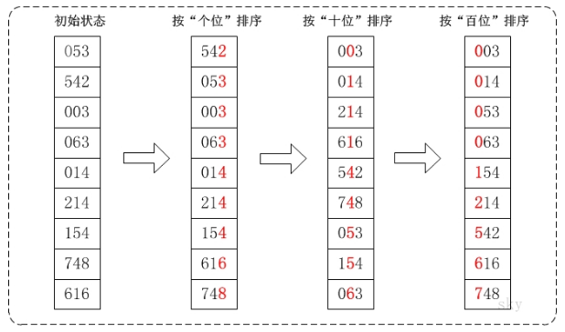
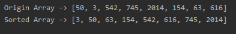
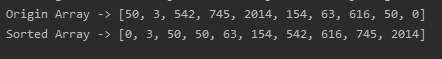

<!-- TOC -->

- [1. 基数排序整体分析](#1-基数排序整体分析)
  - [1.1. 基本介绍](#11-基本介绍)
  - [1.2. 基本思想](#12-基本思想)
  - [1.3. 图文说明](#13-图文说明)
  - [1.4. 注意事项](#14-注意事项)
- [2. 基数排序代码实现](#2-基数排序代码实现)
  - [2.1. 代码实现](#21-代码实现)
  - [2.2. 测试结果](#22-测试结果)
    - [2.2.1. 数组1](#221-数组1)
    - [2.2.2. 数组2](#222-数组2)
    - [2.2.3. 测试 800 万个数据的随机数组](#223-测试-800-万个数据的随机数组)

<!-- /TOC -->

****
[博主的 Github 地址](https://github.com/leon9dragon)
****

## 1. 基数排序整体分析

### 1.1. 基本介绍
基数排序(radix sort)属于 "分配式排序"(distribution sort), 又称 "桶子法"(bucket sort),  
顾名思义, 它是通过键值的各个位的值, 将要排序的元素分配至某些桶中, 达到排序的作用.

基数排序法是稳定的排序, 而且是效率高的稳定排序法.

基数排序是桶排序的扩展, 是赫尔曼何乐礼在 1887 年发明的.

它通过将整数按位数切割成不同的数字, 然后按每个位数分别比较.


****

### 1.2. 基本思想
- 将所有待比较数值统一为同样的数位长度, 数位较短的数前面补零.

- 然后从最低位开始, 依次进行一次排序, 直到最高位排序完成.

- 最后到最高位排序完成后, 数列就变成有序序列.


****

### 1.3. 图文说明
对数组 `{53, 3, 542, 748, 14, 214, 154, 63, 616}` 进行基数排序,   
它的示意图如下:  


在上图中, 首先将所有待比较树脂统一为统一位数长度, 接着从最低位开始, 依次进行排序.
1. 按照个位数进行排序.
2. 按照十位数进行排序.
3. 按照百位数进行排序.
排序后, 数列就变成了一个有序序列.

****

### 1.4. 注意事项
1. 基数排序是经典的空间换时间的方式, 占用内存很大,  
   对海量数据进行排序时容易出现 OutOfMemoryError 内存不足

2. 基数排序是稳定的排序算法.
   
3. 算法稳定的定义:  
     - 若在待排序数据中, 存在多个具有相同的关键字的记录,  
       经过排序后这些记录的相对次序保持不变, 算法就是稳定的.
        
     - 即在原序列中 r[i]=r[j], 且 r[i] 在 r[j] 之前,  
       在排序过后, r[i] 仍在 r[j] 之前, 则算法稳定,  
       否则算法就是不稳定的.

4. 有负数的数组, 不用基数排序进行排序,  
   如果需要支持负数, 需要进行修改调整.

****

## 2. 基数排序代码实现

### 2.1. 代码实现
- 注意: 这个算法目前不支持负数, 只支持正整数
  
```java
package com.leo9.dc17.bucket_sort;

import java.util.Arrays;

public class BucketSort {
    public static void main(String[] args){
        int[] arr = {50, 3, 542, 745, 2014, 154, 63, 616};
        System.out.println("Origin Array -> " + Arrays.toString(arr));
        radixSort(arr);
        System.out.println("Sorted Array -> " + Arrays.toString(arr));
    }

    //基数排序方法
    public static void radixSort(int[] arr){
        //获取最大值, 遍历数组
        int maxNum = arr[0];
        for (int i = 1; i < arr.length; i++) {
            if(arr[i] > maxNum)
                maxNum = arr[i];
        }

        //建立水桶数组, 二维数组, 每个子数组长度为 arr.length + 1
        //子数组的第0位用来记录该数组存在的元素个数
        int[][] bucketArr = new int[10][arr.length + 1];

        //取出不同位上的数字, 由 i 决定取什么位, 从 10^0 位开始
        for (int i = 1; maxNum / i > 0 ; i *= 10) {
            //开始遍历目标数组的每一位将其当前要求的指数位数值取出并判断, 将其放入所对应的桶中
            for (int j = 0; j < arr.length; j++) {
                //记录这个桶中数的数量, 每个水桶第0位都是计数位
                bucketArr[arr[j] / i % 10][0]++;
                //在这个桶中的第 bucketArr[arr[j] / i % 10][0] 位, 放入目标数组的当前元素
                bucketArr[arr[j] / i % 10][bucketArr[arr[j] / i % 10][0]] = arr[j];
            }

            //进行当前指数位的排序, 初始化指向指针.
            //实际上只是按顺序从小到大输出水桶数组到原数组从而完成排序
            int point = 0;
            for (int j = 0; j < 10; j++) {
                //当前指数位数值是j所对应的桶内有多少个元素, 从0开始
                int temp = bucketArr[j][0];
                for (int k = 0; k < temp; k++) {
                    arr[point] = bucketArr[j][k+1];
                    point++;
                }
                //还原水桶计数位
                bucketArr[j][0] = 0;
            }
        }
    }
}

```

****

### 2.2. 测试结果

#### 2.2.1. 数组1


#### 2.2.2. 数组2


#### 2.2.3. 测试 800 万个数据的随机数组
大约耗时 1s