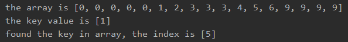

<!-- TOC -->

- [1. 二分查找算法](#1-二分查找算法)
  - [1.1. 二分查找思路](#11-二分查找思路)
  - [1.2. 代码实现](#12-代码实现)
  - [1.3. 测试结果](#13-测试结果)
- [2. 二分查找优化和多元素查找](#2-二分查找优化和多元素查找)
  - [2.1. 多个相同元素查找](#21-多个相同元素查找)
  - [2.2. 实现思路](#22-实现思路)
  - [2.3. 代码实现](#23-代码实现)
  - [2.4. 测试结果](#24-测试结果)
    - [2.4.1. 数组开头的重复数值](#241-数组开头的重复数值)
    - [2.4.2. 数组中间的重复数值](#242-数组中间的重复数值)
    - [2.4.3. 数组结尾的重复数值](#243-数组结尾的重复数值)
    - [2.4.4. 目标只有一个时](#244-目标只有一个时)
    - [2.4.5. 目标不存在时](#245-目标不存在时)

<!-- /TOC -->

****
[博主的 Github 地址](https://github.com/leon9dragon)
****

## 1. 二分查找算法
- 二分查找算法只能对有序数组使用, 以下案例是依据数组由小到大排序进行分析的.

### 1.1. 二分查找思路
0. 先将目标数组元素由小到大排序, `arr = {1, 8, 10, 89, 1000, 1234}`

1. 首先确定该数组的中间元素的下标 `mid = ( left + right ) / 2`

2. 然后让需要查找的目标 keyVal 和 arr[mid] 进行比较
   - 若 keyVal > arr[mid], 说明目标可能在数组右边, 递归向右查找;
   - 若 keyVal < arr[mid], 说明目标可能在数组左边, 递归向左查找;
   - 若 keyVal == arr[mid], 找到目标, 返回 mid.

3. 结束递归的条件
   - 如果找到目标, 返回序号, 递归结束
   - 若找不到目标, 索引越界, 递归结束

### 1.2. 代码实现
- 实现细节在注释已说明

```java
package com.leo9.dc18.binary_search;

public class BinarySearch {
    public static void main(String[] args) {
        int[] arr = {1,2,3,4,5,6,9};
        int key = 9;
        searchKey(arr, key, 0, arr.length-1);
    }

    public static void searchKey(int[] arr, int key, int left, int right){
        //索引越界时输出并跳出递归
        if(left > right){
            System.out.println("not found");
            return;
        }

        //获取中间索引
        int mid = (left+right)/2;

        if(arr[mid] == key){
            //找到目标值输出并返回
            System.out.printf("found in arr[%d] = %d", mid, arr[mid]);
            return;
        }
        else if(key > arr[mid]){
            //左边界变为mid+1, 保留右边界不变, 因为arr[mid]没必要再比较所以右移一位, 同时右移一位能保证最终可以获取到右边界
            searchKey(arr, key, mid+1, right);
        }
        else if(key < arr[mid]){
            //右边界变为mid-1, 保留左边界不变, 理由同上
            searchKey(arr, key, left, mid-1);
        }
    }
}

```

### 1.3. 测试结果
自行验证即可

****

## 2. 二分查找优化和多元素查找

### 2.1. 多个相同元素查找
当一个数组中存在多个相同的元素时, 例如 arr = {1,1,1,3,4,5,6}.  
若此时 key = 1, 要进行二分查找, 输出的也只有 arr[0] 这一个,  
因此需要对原有的算法做调整, 将所有数值都找出来

### 2.2. 实现思路
在找到目标值 key 的下标时, 不需要立即返回,  
将 key 前后的元素都进行筛选, 因为是有序数组,  
所以要是前后元素相等, 则可以将全部相同元素筛选出来.  
筛选时直接等值比较即可, 将下表放到一个集合中就完成查找了.

### 2.3. 代码实现
- 实现细节可在注释中查找, 只在取得索引值的判断处进行了修改, 其它地方代码不变

```java
package com.leo9.dc18.binary_search;

import java.util.ArrayList;
import java.util.Arrays;
import java.util.Collections;

public class BinarySearch {
    public static void main(String[] args) {
        int[] arr = {0,0,0,0,0,1,2,3,3,3,4,5,6,9,9,9,9};
        int key = 3;
        System.out.printf("the array is " + Arrays.toString(arr) + "\n" + "the key value is [%d]\n", key);
        searchKey(arr, key, 0, arr.length-1);
    }

    public static void searchKey(int[] arr, int key, int left, int right){
        //索引越界时输出并跳出递归
        if(left > right){
            System.out.println("not found");
            return;
        }

        //获取中间索引
        int mid = (left+right)/2;

        if(arr[mid] == key){
            //找出所有相同元素值, 并将它们的索引放入集合中
            ArrayList<Integer> keyIndex = new ArrayList<Integer>();

            //先将第一次找到的索引存入
            keyIndex.add(mid);

            //目标向左查找
            for (int i = mid - 1; i >= 0 ; i--) {
                if(arr[i] == key){
                    keyIndex.add(i);
                }
            }

            //目标向右查找
            for (int i = mid + 1; i < arr.length ; i++) {
                if(arr[i] == key){
                    keyIndex.add(i);
                }
            }

            //先给索引集合排序, 然后再输出
            Collections.sort(keyIndex);
            System.out.printf("found the key in array, the index is " + keyIndex.toString());
        }
        else if(key > arr[mid]){
            //左边界变为mid+1, 保留右边界不变, 因为arr[mid]没必要再比较所以右移一位, 同时右移一位能保证最终可以获取到右边界
            searchKey(arr, key, mid+1, right);
        }
        else if(key < arr[mid]){
            //右边界变为mid-1, 保留左边界不变, 理由同上
            searchKey(arr, key, left, mid-1);
        }
    }
}

```

### 2.4. 测试结果

#### 2.4.1. 数组开头的重复数值


#### 2.4.2. 数组中间的重复数值


#### 2.4.3. 数组结尾的重复数值


#### 2.4.4. 目标只有一个时


#### 2.4.5. 目标不存在时
