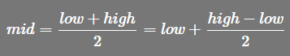
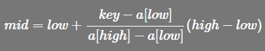
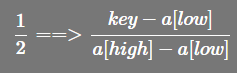

<!-- TOC -->

- [1. 插值查找算法](#1-插值查找算法)
  - [1.1. 原理介绍](#11-原理介绍)
  - [1.2. 公式分析](#12-公式分析)
    - [1.2.1. 系数改变](#121-系数改变)
    - [1.2.2. 公式改变后的性能](#122-公式改变后的性能)
    - [1.2.3. 简单总结](#123-简单总结)
  - [1.3. 代码实现](#13-代码实现)
  - [1.4. 测试结果](#14-测试结果)

<!-- /TOC -->

****
[博主的 Github 地址](https://github.com/leon9dragon)
****

## 1. 插值查找算法

### 1.1. 原理介绍
- 插值查找类似于二分查找, 不同在于插值查找每次从自适应 mid 处开始查找

- 从二分查找中的求 mid 的索引公式修改得出插值查找的索引公式  
  其中 low 表示左索引, high 表示右索引  
  - 二分查找的 mid 索引公式  
    

  - 插值查找的 mid 索引公式  
    

****

### 1.2. 公式分析

#### 1.2.1. 系数改变
- 上述公式中主要改变的是 `(high - low)` 的系数  
  - 如下图所转换 系数从 `1/2` 转换成 `(key-a[low])/(a[high]-a[low])`  
  

#### 1.2.2. 公式改变后的性能  
  - 从时间复杂度来说, 其最坏时间复杂度也是 O(log<sub>2</sub>n).  
  - 不过对于表长较大且关键字分布比较均匀的表来说,  
    其平均性能要比二分查找好的多.  
  - 但是如果表中关键字分布极端不均匀,  
    此时插值查找性能不如二分查找.
  - 数据均匀指的是数据之间的跳跃性, 跳跃性越小越均匀

#### 1.2.3. 简单总结  
  - 插值查找就是根据要查找的关键字 key 与查找表中最大最小值比较后的查找方法,  
  - 其核心在于插值的计算公式, 将查找点的选择改进为自适应选择, 从而提高效率


****

### 1.3. 代码实现
- 实现细节可在注释中查找, 只在索引值 mid 公式处进行了修改, 其它代码与二分查找一样

```java
package com.leo9.dc19.insert_search;

import java.util.ArrayList;
import java.util.Arrays;
import java.util.Collections;

public class InsertSearch {
    public static void main(String[] args) {
        int[] arr = {0,0,0,0,0,1,2,3,3,3,4,5,6,9,9,9,9};
        int key = 3;
        System.out.printf("the array is " + Arrays.toString(arr) + "\n" + "the key value is [%d]\n", key);
        searchKey(arr, key, 0, arr.length-1);
    }

    public static void searchKey(int[] arr, int key, int left, int right){
        //索引越界时输出并跳出递归
        if(left > right){
            System.out.println("not found");
            return;
        }

        //获取中间索引, 插值查找进行了修改, 改为自适应索引
        int mid = left + (right - left) * (key - arr[left]) / (arr[right] - arr[left]);

        if(arr[mid] == key){
            //找出所有相同元素值, 并将它们的索引放入集合中
            ArrayList<Integer> keyIndex = new ArrayList<Integer>();

            //先将第一次找到的索引存入
            keyIndex.add(mid);

            //目标向左查找
            for (int i = mid - 1; i >= 0 ; i--) {
                if(arr[i] == key){
                    keyIndex.add(i);
                }
            }

            //目标向右查找
            for (int i = mid + 1; i < arr.length ; i++) {
                if(arr[i] == key){
                    keyIndex.add(i);
                }
            }

            //先给索引集合排序, 然后再输出
            Collections.sort(keyIndex);
            System.out.printf("found the key in array, the index is " + keyIndex.toString());
        }
        else if(key > arr[mid]){
            //左边界变为mid+1, 保留右边界不变, 因为arr[mid]没必要再比较所以右移一位, 同时右移一位能保证最终可以获取到右边界
            searchKey(arr, key, mid+1, right);
        }
        else if(key < arr[mid]){
            //右边界变为mid-1, 保留左边界不变, 理由同上
            searchKey(arr, key, left, mid-1);
        }
    }
}

```

### 1.4. 测试结果
- 自行检验, 实际在显示结果上与二分查找无异