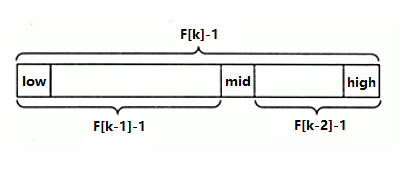
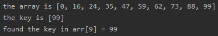
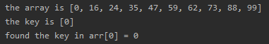
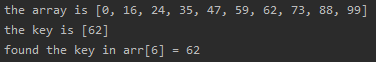
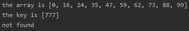

<!-- TOC -->

- [1. 斐波那契(黄金分割法)查找](#1-斐波那契黄金分割法查找)
  - [1.1. 基本介绍](#11-基本介绍)
  - [1.2. 算法原理](#12-算法原理)
  - [1.3. 对 F(k-1)-1 的理解](#13-对-fk-1-1-的理解)
  - [1.4. 斐波那契算法总结](#14-斐波那契算法总结)
  - [1.5. 代码实现](#15-代码实现)
  - [1.6. 测试结果](#16-测试结果)
    - [1.6.1. 数组末端](#161-数组末端)
    - [1.6.2. 数组首端](#162-数组首端)
    - [1.6.3. 数组任意位置](#163-数组任意位置)
    - [1.6.4. 不存在的数](#164-不存在的数)

<!-- /TOC -->

****
[博主的 Github 地址](https://github.com/leon9dragon)
****

## 1. 斐波那契(黄金分割法)查找

### 1.1. 基本介绍
- 黄金分割点是指将一条线段分为两部分,  
  使其中一部分与全长之比等于另一部分与这部分之比.  
  取其前三位数字的近似值是 0.618, 也称为中外比.

- 在斐波那契数列中发现数列中的两个相邻数的比值,  
  无限接近黄金分割值 0.618.

****

### 1.2. 算法原理
- 斐波那契算法原理与二分和插值查找类似, 仅仅改变了中间结点 mid 的位置

- mid 不再是中间或者插值得到, 而是位于黄金分割点附近.  

- 即 `mid = low + F[k-1] - 1`, 其中 F 代表斐波那契数列.  
  

****

### 1.3. 对 F(k-1)-1 的理解
1. 由斐波那契数列 `F[k] = F[k-1] + F[k-2]` 的性质,  
   可以得到 `F[k]-1 = (F[k-1]-1) + (F[k-2]-1) + 1`  

2. 由此说明: 只要顺序表长度为 `F[k] - 1`, 就可将其分解,  
   分解成长度为`F[k-1] - 1` 和 `F[k-2] - 1` 的两段.  
   如上图所示, 从而得到中间位置 `mid = low + F[k-1] - 1`

3. 因此类似的, 每一子段也可以用相同的方式进行分割.

4. 但顺序表的长度 n 并不一定就刚好等于 `F[k] - 1`,  
   因此需要将原来的顺序表长度 n 增加到 `F[k] - 1`.  
   这里的 k 值只要能让 `F[k] - 1` 恰好大于等于 n 即可,  
   由以下代码得到, fib() 为斐波那契数列函数,   
   ```java
   while(n>fib(k)-1)
     k++;
   ```
   顺序表长度增加后,  
   新增位置从 `n+1` 到 `F[k] - 1` 都赋为 n 位置的值即可.
   
****   

### 1.4. 斐波那契算法总结
斐波那契查找是折半查找的升级版, 那么也要求序列是有序的序列;

在最坏情况下, 斐波那契查找的时间复杂度还是 O(log<sub>2</sub>n), 且其期望复杂度也为 O(log<sub>2</sub>n),

但是与折半查找相比, 斐波那契查找的优点是它只涉及加法和减法运算, 而不用除法,

而除法比加减法要占用更多的时间, 因此,斐波那契查找的运行时间理论上比折半查找小,

但是还是得视具体情况而定.

****

### 1.5. 代码实现
- 实现细节在代码注释

```java
package com.leo9.dc20.fibonacci_search;

import java.util.Arrays;

public class FibonacciSearch {
    public static int MAXSIZE = 20;
    public static void main(String[] args) {
        int[] arr = {0,16,24,35,47,59,62,73,88,99};
        int key = 99;
        int res = fibSearch(arr, key);
        System.out.printf("the array is" + Arrays.toString(arr) + "\nthe key is [%d]", key);
        if(res != -1){
            System.out.printf("\nfound the key in arr[%d] = %d", res, arr[res]);
        }
        else {
            System.out.println("\nnot found");
        }
    }

    //因为后面定位mid要用到斐波那契数列, 因此需要先获取到一个斐波那契数列
    //非递归方法获取斐波那契数列
    public static int[] fib(){
        int[] f = new int[MAXSIZE];
        f[0] = 1;
        f[1] = 1;
        for(int i = 2; i < MAXSIZE; i++){
            f[i] = f[i-1] + f[i-2];
        }
        return f;
    }

    //编写斐波那契查找算法
    /**
     * @param a 目标数组
     * @param key 目标数值
     * @return 返回对应的下标, 找不到则为-1
     * */
    public static int fibSearch(int[] a, int key){
        int low = 0;
        int high = a.length - 1;
        //定义k表示斐波那契分割数值的下标
        int k = 0;
        //定义mid存放mid值
        int mid = 0;
        //获取斐波那契数列
        int f[] = fib();
        //获取到斐波那契分割数值的下标
        while (high > f[k] - 1){
            k++;
        }
        //因为f[k]的值可能大于数组长度, 因此需要构造新的数组并指向temp数组
        //如下新数组多出来的部分会用0填充
        int[] temp = Arrays.copyOf(a, f[k]);
        //将多出来的部分用原数组最后一位填充
        for (int i = high + 1; i < temp.length; i++){
            temp[i] = a[high];
        }
        //使用while来循环处理, 找到目标key
        while (low <= high){
            mid = low + f[k - 1] - 1;
            //向数组左边查找
            if(key < temp[mid]){
                //数组末端向左收缩
                high = mid - 1;
                //继续拆分数组,
                //数组由两部分组成 f[k] - 1 = f[k-1]-1 + f[k-2]-1 + 1
                //斐波那契查找的核心就是在mid前面的长度为f[k-1]-1,在mid的后面的长度为f[k-2]-1
                //左边部分是 f[k-1]-1, 中间的mid则为最后的+1
                k--;
            }
            //向数组右边查找
            else if(key > temp[mid]){
                //数组首端向右收缩
                low = mid + 1;
                //继续拆分数组
                //数组右边部分是f[k-2]-1
                k -= 2;
            }
            else{
                //找到key, 确定返回下标
                if(mid <= high){
                    return mid;
                }
                else {
                    return high;
                }
            }
        }
        //找不到key, 返回-1
        return -1;
    }
}

```

****

### 1.6. 测试结果

#### 1.6.1. 数组末端


#### 1.6.2. 数组首端


#### 1.6.3. 数组任意位置


#### 1.6.4. 不存在的数
