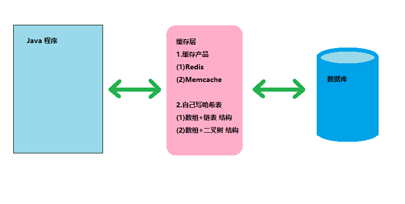
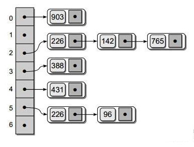
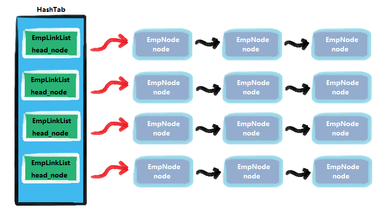
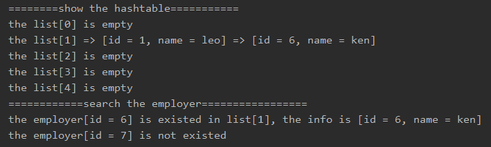

<!-- TOC -->

- [1. 哈希表的介绍和内存布局](#1-哈希表的介绍和内存布局)
  - [1.1. 哈希表的基本介绍](#11-哈希表的基本介绍)
  - [1.2. 哈希表的由来](#12-哈希表的由来)
    - [1.2.1. 直接连接数据库的缺点](#121-直接连接数据库的缺点)
    - [1.2.2. 通过哈希表建立缓存提升速度](#122-通过哈希表建立缓存提升速度)
  - [1.3. 哈希表的内存结构](#13-哈希表的内存结构)
    - [1.3.1. 数组加链表形式的哈希表](#131-数组加链表形式的哈希表)
- [2. 哈希表的应用实例](#2-哈希表的应用实例)
  - [2.1. 谷歌的上机题](#21-谷歌的上机题)
  - [2.2. 思路分析](#22-思路分析)
    - [2.2.1. 链表类](#221-链表类)
    - [2.2.2. 结点类](#222-结点类)
    - [2.2.3. 哈希表类](#223-哈希表类)
  - [2.3. 代码实现](#23-代码实现)
    - [2.3.1. 结点类](#231-结点类)
    - [2.3.2. 链表类](#232-链表类)
    - [2.3.3. 哈希表类](#233-哈希表类)
    - [2.3.4. 测试类](#234-测试类)
  - [2.4. 测试结果](#24-测试结果)

<!-- /TOC -->

****
[博主的 Github 地址](https://github.com/leon9dragon)
****

## 1. 哈希表的介绍和内存布局

### 1.1. 哈希表的基本介绍
- 哈希表(Hash Table)也叫散列表  

- 是根据关键码值(Key Value)而直接进行访问的数据结构

- 即哈希表通过吧关键码值映射到表中一个位置来访问记录, 从而加快查找的速度.

- 这个映射函数叫做散列函数, 存放记录的数组叫做散列表

****

### 1.2. 哈希表的由来
  

#### 1.2.1. 直接连接数据库的缺点
- 通常来说 Java 程序操作数据最基础的方式是直接连数据库进行发送操作指令
- 在数据库接收到指令后处理相关数据并最终返回给 Java 程序
- 但这种操作存在着缺陷, 有时候需要对数据库频繁进行操作, 会导致速度变慢

#### 1.2.2. 通过哈希表建立缓存提升速度
- 因此可以在程序和数据库之间建立一个缓存层, 将一些常用数据放入其中  
- 在缓存层操作数据可以减少对数据库的操作, 从而提升了速度
- 缓存层可以使用缓存产品或者自建哈希表来进行构建
- 自建哈希表有两种形式, 分别是数组加链表的结构, 以及数组加二叉树的结构.
- 而且若一级缓存不够还可以加二级缓存

****

### 1.3. 哈希表的内存结构

#### 1.3.1. 数组加链表形式的哈希表
  
- 在数组中每个元素存放的是一条链表
- 当查找数据的时候会根据查找的 ID 通过散列函数进行计算
- 然后找出目标可能会在哪一条链表中出现, 再去确定是否存在

****

## 2. 哈希表的应用实例

### 2.1. 谷歌的上机题
- 题目  
有一个公司, 当有新的员工来报到时, 要求将该员工的信息加入,  
员工信息包括 id, 名字, 性别, 年龄, 住址等,  
当输入该员工的 id 时要查找到该员工的所有信息.

- 要求  
  - 不使用数据库, 速度越快越好 (即要求使用哈希表)
  - 添加时, 保证按照 id 从低到高插入

****

### 2.2. 思路分析


- 如上图所示, 用哈希表来管理雇员信息需要构建三个类
  
#### 2.2.1. 链表类
构建链表类, 主要用来实现存放每个链表对应的头结点和增删查改结点的方法

#### 2.2.2. 结点类
构建结点类, 主要用于实现每个结点内存放雇员的 id, 姓名等信息


#### 2.2.3. 哈希表类
构建哈希表类, 主要用于实现链表数组用于存放每个链表的头结点,   
以及实现调用增删查改结点和构建散列函数使 id 对应到相应链表的方法

****

### 2.3. 代码实现
- 实现细节看注释

#### 2.3.1. 结点类
```java
package com.leo9.dc21.hash_table;

//定义员工结点类, 用来存放员工信息
//同时链表是单链表, 所以只需要定义指向下一结点
public class EmpNode {
    public int id;
    public String name;
    public EmpNode next_emp;

    public EmpNode(int id, String name) {
        this.id = id;
        this.name = name;
    }
}

```

#### 2.3.2. 链表类
```java
package com.leo9.dc21.hash_table;

//定义员工链表类, 存放每个链表的头结点, 和实现链表增删查改的方法
public class EmpLinkList {
    //头结点, 指向当前链表的第一个员工, 因此头结点是有效结点
    private EmpNode head_node;

    //定义添加新员工结点的方法
    //假定添加员工时, id是自增长的, 即id总是从小到大
    //因此直接将新结点添加到链表尾部即可
    public void addEmployer(EmpNode new_node){
        //先判断头结点是否为空
        if(head_node == null){
            head_node = new_node;
            return;
        }

        //如果不是当前链表的第一个员工, 使用辅助指针帮助定位
        EmpNode cur_node = head_node;
        while(true){
            if(cur_node.next_emp != null){
                cur_node = cur_node.next_emp;
            }else {
                cur_node.next_emp = new_node;
                break;
            }
        }
    }

    //遍历链表的雇员信息
    public void viewList(int no){
        //判断头结点是否为空, 如果为空则链表为空
        if(head_node == null){
            System.out.printf("the list[%d] is empty\n", no);
            return;
        }
        System.out.printf("the list[%d] ", no);
        EmpNode cur_node = head_node;
        while(true){
            //输出结点信息
            System.out.printf("=> [id = %d, name = %s]\t", cur_node.id, cur_node.name);
            //判断当前结点下一位是否为空, 为空则跳出循环
            if(cur_node.next_emp == null){
                break;
            }
            //后移一位
            cur_node = cur_node.next_emp;
        }
        System.out.println();
    }

    //根据id查找员工
    //如果找到就返回员工相应信息, 如果没找到就返回null
    public EmpNode searchEmpById(int id){
        //先判断当前链表是否为空
        if(head_node == null){
            //System.out.println("this list is empty");
            return null;
        }

        //遍历链表寻找是否存在员工
        EmpNode cur_node = head_node;
        while(true){
            //找到则跳出循环, 然后返回该员工结点.
            if(cur_node.id == id){
                break;
            }
            //全表遍历完仍找不到则返回空
            if(cur_node.next_emp == null){
                //System.out.println("this employer is not existed");
                return null;
            }
            cur_node = cur_node.next_emp;
        }
        return cur_node;
    }
}

```

#### 2.3.3. 哈希表类
```java
package com.leo9.dc21.hash_table;

//定义HashTable 管理多条链表
public class EmpHashTable {
    private EmpLinkList[] empLinkListsArray;
    //定义一个尺寸表示该哈希表中存放有多少条链表
    private int size;

    //构造器, 指定哈希表有多少条链表, 并进行初始化
    public EmpHashTable(int size){
        this.size = size;
        //根据尺寸构建哈希表
        empLinkListsArray = new EmpLinkList[size];
        //初始化哈希表内的每一条链表
        for (int i = 0; i < size; i++) {
            empLinkListsArray[i] = new EmpLinkList();
        }
    }

    //编写散列函数, 使用取模法进行编写
    public int hashFun(int id){
        return id % size;
    }

    //添加员工
    public void add(EmpNode emp_node){
        //根据员工的id, 得到该员工应当添加到哪条链表
        int empLinkListNO = hashFun(emp_node.id);
        //将员工结点添加到对应的链表中
        empLinkListsArray[empLinkListNO].addEmployer(emp_node);
    }

    //遍历哈希表的所有链表
    public void viewList(){
        for(int i = 0; i < size; i++){
            empLinkListsArray[i].viewList(i);
        }
    }

    //查找员工
    public void searchEmpById(int id){
        EmpNode node = empLinkListsArray[hashFun(id)].searchEmpById(id);
        if(node != null){
            System.out.printf("the employer[id = %d] is existed in list[%d], the info is [id = %d, name = %s]\n", id, hashFun(id), node.id, node.name);
        }
        else {
            System.out.printf("the employer[id = %d] is not existed\n", id);
        }
    }
}

```

#### 2.3.4. 测试类
```java
package com.leo9.dc21.hash_table;

public class TestDemoHT {
    public static void main(String[] args) {
        EmpHashTable emp_table = new EmpHashTable(5);
        emp_table.add(new EmpNode(1,"leo"));
        emp_table.add(new EmpNode(6,"ken"));
        emp_table.viewList();
        emp_table.searchEmpById(6);
        emp_table.searchEmpById(7);
    }
}

```

****

### 2.4. 测试结果
