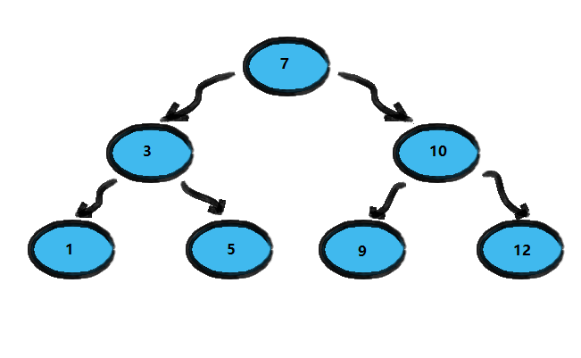
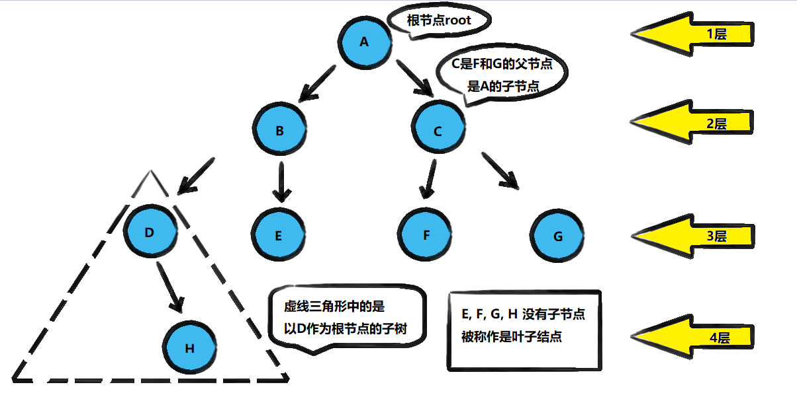
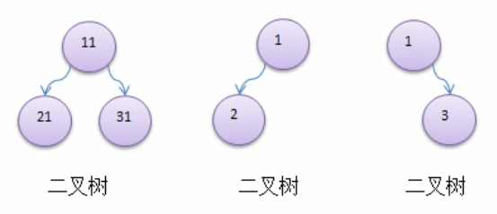
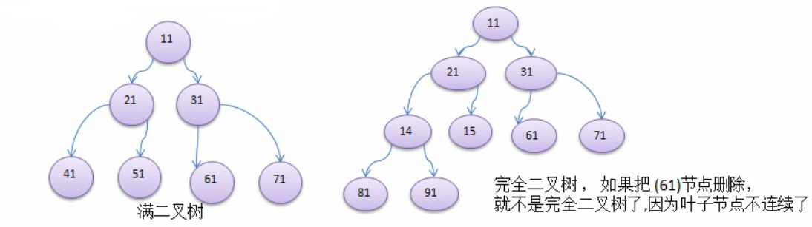

<!-- TOC -->

- [1. 数组, 链表, 树的存储方式分析](#1-数组-链表-树的存储方式分析)
  - [1.1. 数组存储方式的分析](#11-数组存储方式的分析)
  - [1.2. 链式存储方式的分析](#12-链式存储方式的分析)
  - [1.3. 树存储方式的分析(以二叉树为例)](#13-树存储方式的分析以二叉树为例)
    - [1.3.1. 二叉排序树存储案例](#131-二叉排序树存储案例)
    - [1.3.2. 简单总结](#132-简单总结)
- [2. 二叉树的原理](#2-二叉树的原理)
  - [2.1. 树的常用术语](#21-树的常用术语)
  - [2.2. 二叉树的定义](#22-二叉树的定义)

<!-- /TOC -->

****
[博主的 Github 地址](https://github.com/leon9dragon)
****

## 1. 数组, 链表, 树的存储方式分析

### 1.1. 数组存储方式的分析
- **优点**:  
  通过下标方式访问元素, 速度快. 对于有序数组, 还可以用二分查找提高检索速度.
  
- **缺点**:  
  如果要检索具体某个值, 或者插入值(按一定顺序)会整体移动, 效率较低  
    - 在插入值的时候会发生数组扩容, 本质上是开辟新数组复制旧数组
    - 然后插入值的时候会将数组排序后再放入新数组, 效率较低
    - ArrayList 底层本质上其实也是数组扩容

****

### 1.2. 链式存储方式的分析
- **优点**:  
  在一定程度上对数组存储方式有优化, 比如插入一个数值结点,  
  只需要将插入结点连接到链表中即可, 删除效率也很好.

- **缺点**:  
  在进行检索时, 效率仍然较低, 比如在检索某个值时, 需要从头结点开始遍历.

****

### 1.3. 树存储方式的分析(以二叉树为例)
能提高数据存储, 读取的效率, 比如利用二叉排序树(Binary Sort Tree),  
即可以保证数据的检索速度, 也可以保证数据的插入删除修改速度.

#### 1.3.1. 二叉排序树存储案例
将数组 `[7,3,10,1,5,9,12]` 用二叉排序树进行存储  

- **需求 1: 查找元素 [12]**
  - 先和 [7] 比较, 发现目标比 [7] 大, 向 [7] 右边寻找
  - 找到 [10], 发现目标依旧比 [10] 大, 继续向 [10] 右边寻找
  - 找到[12], 发现寻找目标, 经过两轮比较, 成功完成检索.

- **需求 2: 添加元素 [13]**  
  - 先进行比较, 找到比 [13] 小的元素中最大的那一位
  - 找到 [12], 直接将 [13] 挂在 [12] 的右边结点即可

- **需求 3: 删除元素[1]**  
  - 找到元素 [1], 并找到元素 [1] 的父结点 [3]
  - 直接将父结点 [3] 对 [1] 的指向引用去掉即可

#### 1.3.2. 简单总结
- 树的结构存储很方便, 同时解决了查找元素效率低的问题

****

## 2. 二叉树的原理

### 2.1. 树的常用术语
 

**树的常用术语** 
- 结点
- 根结点
- 父结点
- 子结点
- 叶子结点(没有子结点的结点)
- 结点的权(结点值)
- 路径(从根结点找到目标结点的路线)
- 层
- 子树
- 树的高度(最大层数)
- 森林(多少颗子树构成森林)

****

### 2.2. 二叉树的定义
1) 树有很多种, 每个结点最多只能有两个子结点的一种形式称为二叉树

2) 二叉树的子结点分为左结点和右结点

3) 如果该二叉树的所有叶子结点都在最后一层, 并且结点总数为 2n-1 (n 为层数), 则称该二叉树为满二叉树.

4) 如果该二叉树的所有叶子结点都在最后一层或倒数第二层,  
   且最后一层的叶子结点在左边连续, 倒数第二层的叶子结点在右边连续,  
   则称该二叉树为完全二叉树

