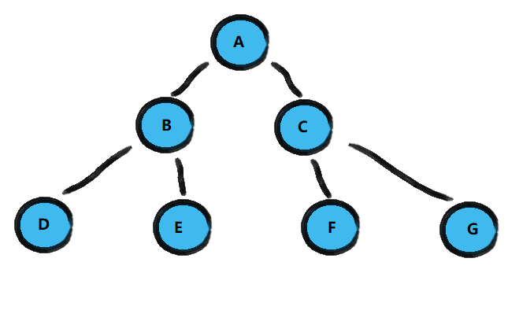
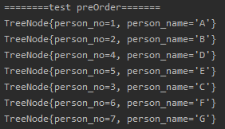
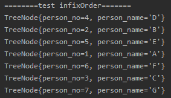
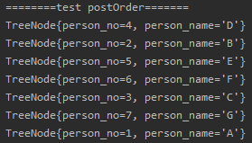

<!-- TOC -->

- [1. 二叉树的创建和遍历](#1-二叉树的创建和遍历)
  - [1.1. 二叉树的创建](#11-二叉树的创建)
  - [1.2. 二叉树结点遍历的分类](#12-二叉树结点遍历的分类)
  - [1.3. 分析二叉树的前序中序后序遍历步骤](#13-分析二叉树的前序中序后序遍历步骤)
    - [1.3.1. 前序遍历步骤](#131-前序遍历步骤)
    - [1.3.2. 中序遍历步骤](#132-中序遍历步骤)
    - [1.3.3. 后序遍历步骤](#133-后序遍历步骤)
  - [1.4. 二叉树创建和遍历代码实现](#14-二叉树创建和遍历代码实现)
    - [1.4.1. 结点类](#141-结点类)
    - [1.4.2. 二叉树类](#142-二叉树类)
    - [1.4.3. 测试类](#143-测试类)
  - [1.5. 二叉树遍历测试](#15-二叉树遍历测试)

<!-- /TOC -->

****
[博主的 Github 地址](https://github.com/leon9dragon)
****

## 1. 二叉树的创建和遍历

### 1.1. 二叉树的创建
- 需要创建一个结点类, 成员有结点的信息以及左右子结点,  
  成员方法包括一些对结点的操作.  
  (因为结点操作的主要对象是结点, 因此放在结点类比较好)
- 需要创建一个二叉树类, 主要用于存放根结点和去封装调用结点操作.

### 1.2. 二叉树结点遍历的分类
根据输出父结点的顺序, 分别有三种方式对二叉树进行遍历
- 前序遍历: 先输出父结点, 再遍历左子树和右子树
- 中序遍历: 先遍历左子树, 再输出父结点, 再遍历右子树
- 后序遍历: 先遍历左子树, 再遍历右子树, 最后输出父结点

****

### 1.3. 分析二叉树的前序中序后序遍历步骤
- 在遍历前都要先创建一棵二叉树

#### 1.3.1. 前序遍历步骤
从根结点开始进入递归, 流程如下:
- 输出当前结点
- 若当前结点的左子结点不为空, 则递归继续前序遍历
- 若当前结点的右子结点不为空, 则递归继续前序遍历

#### 1.3.2. 中序遍历步骤
从根结点开始进入递归, 流程如下:
- 若当前结点的左子结点不为空, 则递归中序遍历
- 输出当前结点
- 若当前结点的右子结点不为空, 则递归中序遍历

#### 1.3.3. 后序遍历步骤
从根结点开始进入递归, 流程如下:
- 若当前结点的左子结点不为空, 则递归中序遍历
- 若当前结点的右子结点不为空, 则递归中序遍历
- 输出当前结点

****

### 1.4. 二叉树创建和遍历代码实现

#### 1.4.1. 结点类
```java
package com.leo9.dc22.binary_tree;

//创建结点类, 用来存放结点信息和结点的左右子结点信息
public class TreeNode {
    //结点存放的信息
    private int person_no;
    private String person_name;

    //结点的子结点
    private TreeNode left_node;
    private TreeNode right_node;

    //结点构造器
    public TreeNode(int person_no, String person_name) {
        this.person_no = person_no;
        this.person_name = person_name;
    }

    //结点成员的getter和setter方法
    public int getPerson_no() {
        return person_no;
    }

    public void setPerson_no(int person_no) {
        this.person_no = person_no;
    }

    public String getPerson_name() {
        return person_name;
    }

    public void setPerson_name(String person_name) {
        this.person_name = person_name;
    }

    public TreeNode getLeft_node() {
        return left_node;
    }

    public void setLeft_node(TreeNode left_node) {
        this.left_node = left_node;
    }

    public TreeNode getRight_node() {
        return right_node;
    }

    public void setRight_node(TreeNode right_node) {
        this.right_node = right_node;
    }

    //重载结点的toString方法
    @Override
    public String toString() {
        return "TreeNode{" +
                "person_no=" + person_no +
                ", person_name='" + person_name + '\'' +
                '}';
    }

    //前序遍历方法
    public void preOrder(){
        //先输出当前结点
        System.out.println(this);
        //然后递归向左子树
        if (this.left_node != null){
            this.left_node.preOrder();
        }
        //再递归向右子树
        if (this.right_node != null){
            this.right_node.preOrder();
        }
    }

    //中序遍历方法
    public void infixOrder(){
        //先递归向左子树
        if(this.left_node != null){
            this.left_node.infixOrder();
        }
        //再输出当前结点
        System.out.println(this);
        //再递归向右子树
        if (this.right_node != null){
            this.right_node.infixOrder();
        }
    }

    //后续遍历方法
    public void postOrder(){
        //先递归向左子树
        if(this.left_node != null){
            this.left_node.infixOrder();
        }
        //再递归向右子树
        if (this.right_node != null){
            this.right_node.infixOrder();
        }
        //再输出当前结点
        System.out.println(this);
    }
}

```

#### 1.4.2. 二叉树类
```java
package com.leo9.dc22.binary_tree;

//创建二叉树类. 主要用于存放根结点.
public class BinaryTree {
    //成员只需定义根结点即可, 结点相关操作实际由结点类完成
    private TreeNode root_node;
    //定义设置根结点的方法
    public void setRoot_node(TreeNode root_node) {
        this.root_node = root_node;
    }
    public void setRoot_node(int person_no, String person_name) {
        root_node = new TreeNode(person_no, person_name);
    }

    //二叉树前序遍历
    public void preOrder(){
        if(this.root_node != null){
            this.root_node.preOrder();
        }
    }
    //二叉树中序遍历
    public void infixOrder(){
        if(this.root_node != null){
            this.root_node.infixOrder();
        }
    }
    //二叉树后序遍历
    public void postOrder(){
        if(this.root_node != null){
            this.root_node.postOrder();
        }
    }
}

```

#### 1.4.3. 测试类
```java
package com.leo9.dc22.binary_tree;

public class TestDemoBT {
    public static void main(String[] args) {
        //手动创建一棵二叉树的所有结点
        TreeNode nodeA = new TreeNode(1,"A");
        TreeNode nodeB = new TreeNode(2,"B");
        TreeNode nodeC = new TreeNode(3,"C");
        TreeNode nodeD = new TreeNode(4,"D");
        TreeNode nodeE = new TreeNode(5,"E");
        TreeNode nodeF = new TreeNode(6,"F");
        TreeNode nodeG = new TreeNode(7,"G");

        //手动连接各个结点
        nodeA.setLeft_node(nodeB);
        nodeA.setRight_node(nodeC);
        nodeB.setLeft_node(nodeD);
        nodeB.setRight_node(nodeE);
        nodeC.setLeft_node(nodeF);
        nodeC.setRight_node(nodeG);

        //将根结点放入二叉树
        BinaryTree testTree = new BinaryTree();
        testTree.setRoot_node(nodeA);

        //测试前序遍历
        System.out.println("========test preOrder=======");
        testTree.preOrder();
        //测试中序遍历
        System.out.println("========test infixOrder=======");
        testTree.infixOrder();
        //测试后序遍历
        System.out.println("========test postOrder=======");
        testTree.postOrder();
    }
}

```


****

### 1.5. 二叉树遍历测试
- **创建二叉树**  
  - 这次创建是手动创建, 后续会有递归方式增加结点


- **测试前序遍历**  

- **测试中序遍历**  

- **测试后序遍历**  
