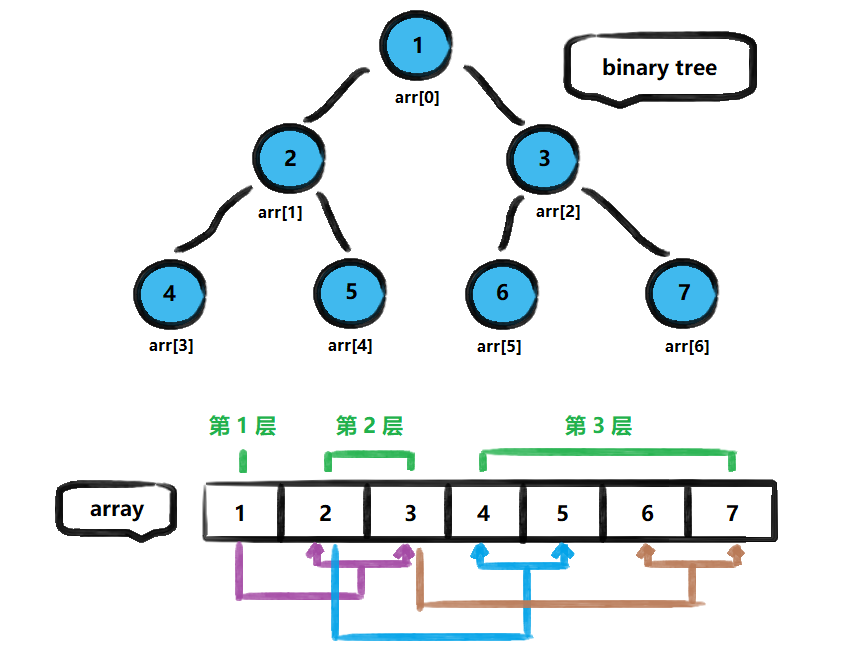
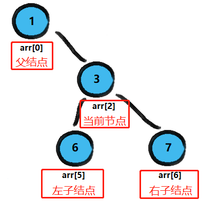
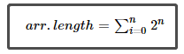
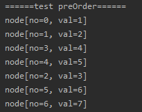
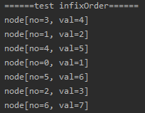
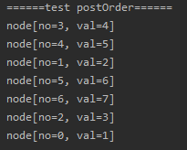

<!-- TOC -->

- [1. 顺序存储二叉树的概念](#1-顺序存储二叉树的概念)
  - [1.1. 基本说明](#11-基本说明)
  - [1.2. 操作要求](#12-操作要求)
  - [1.3. 结构特点](#13-结构特点)
    - [1.3.1. 示例](#131-示例)
- [2. 遍历顺序存储二叉树的代码实现](#2-遍历顺序存储二叉树的代码实现)
  - [2.1. 数组二叉树类](#21-数组二叉树类)
  - [2.2. 测试类](#22-测试类)
  - [2.3. 测试结果](#23-测试结果)
    - [2.3.1. 前序遍历](#231-前序遍历)
    - [2.3.2. 中序遍历](#232-中序遍历)
    - [2.3.3. 后序遍历](#233-后序遍历)

<!-- /TOC -->

****
[博主的 Github 地址](https://github.com/leon9dragon)
****

## 1. 顺序存储二叉树的概念

### 1.1. 基本说明
从数据存储来看, 数组存储方式和树的存储方式可以互相转换,  
即数组可以转换成树, 树也可以转换成数组, 如下示意图所示.  



### 1.2. 操作要求
1. 上图的二叉树的结点, 要求以数组的方式进行存放,  
   即存储为数组 `arr = [1,2,3,4,5,6,7]`

2. 要求在遍历数组 arr 时, 仍可以用遍历二叉树的方式进行,  
   即可以用前序遍历, 中序遍历和后序遍历的方式完成结点遍历.

### 1.3. 结构特点
- 顺序二叉树通常只考虑完全二叉树
- 用 n 表示二叉树中的第几个元素  
  (编号从 0 开始, 实际就是结点对应的数组下标)
- 第 n 个元素的左子结点为 `2*n+1` 
- 第 n 个元素的右子结点为 `2*n+2` 
- 第 n 个元素的父结点为 `(n-1)/2`


#### 1.3.1. 示例
  
- 如上图所示, 当前结点为 3 号结点, 对应的数组下标为 2,  
  - 它的左子结点对应的数组下标为 `2*2+1=5`,  
  - 它的右子结点对应的数组下标为 `2*2+2=6`,  
  - 它的父结点对应的数组下标为 `(2-1)/2=0`.

****

## 2. 遍历顺序存储二叉树的代码实现
- 实际上是在数组中实现二叉树遍历
- 目前数组大小只考虑完全二叉树对应结点个数
-  
- 不过即便不传完全二叉树也能运行

### 2.1. 数组二叉树类
- 遍历方法定义在类的成员方法中, 包括前序中序和后序遍历

```java
package com.leo9.dc23.array_binary_tree;

//编写一个类实现顺序存储二叉树遍历
public class ArrayBinaryTree {
    //定义成员变量用以接收数组二叉树
    private int[] arr_btree;

    public ArrayBinaryTree(int[] arr_btree) {
        this.arr_btree = arr_btree;
    }

    //定义setter方法用以接收数组
    public void setArr_btree(int[] arr_btree) {
        this.arr_btree = arr_btree;
    }

    //region 编写方法来完成顺序存储二叉树的遍历
    //1.完成前序遍历的方法, 需要传入每次开始结点的下标
    public void preOrder(int begin_num){
        //输出当前结点
        System.out.printf("node[no=%d, val=%d]\n", begin_num, arr_btree[begin_num]);

        //判断当前结点的左子结点 2*n+1 是否存在
        //只要小于等于数组下标最大值, 结点就存在
        if(2*begin_num+1 <= arr_btree.length-1){
            preOrder(2*begin_num+1);
        }

        //判断当前结点的右子结点 2*n+2 是否存在
        //只要小于等于数组下标最大值, 结点就存在
        if(2*begin_num+2 <= arr_btree.length-1){
            preOrder(2*begin_num+2);
        }
    }

    //2.完成中序遍历的方法, 需要传入每次开始结点的下标
    public void infixOrder(int begin_num){
        //判断当前结点的左子结点 2*n+1 是否存在
        //只要小于等于数组下标最大值, 结点就存在
        if(2*begin_num+1 <= arr_btree.length-1){
            infixOrder(2*begin_num+1);
        }

        //输出当前结点
        System.out.printf("node[no=%d, val=%d]\n", begin_num, arr_btree[begin_num]);

        //判断当前结点的右子结点 2*n+2 是否存在
        //只要小于等于数组下标最大值, 结点就存在
        if(2*begin_num+2 <= arr_btree.length-1){
            infixOrder(2*begin_num+2);
        }
    }

    //3.完成后序遍历的方法, 需要传入每次开始结点的下标
    public void postOrder(int begin_num){
        //判断当前结点的左子结点 2*n+1 是否存在
        //只要小于等于数组下标最大值, 结点就存在
        if(2*begin_num+1 <= arr_btree.length-1){
            postOrder(2*begin_num+1);
        }

        //判断当前结点的右子结点 2*n+2 是否存在
        //只要小于等于数组下标最大值, 结点就存在
        if(2*begin_num+2 <= arr_btree.length-1){
            postOrder(2*begin_num+2);
        }

        //输出当前结点
        System.out.printf("node[no=%d, val=%d]\n", begin_num, arr_btree[begin_num]);
    }
    //endregion
}

```

### 2.2. 测试类
```java
package com.leo9.dc23.array_binary_tree;

public class TestDemoABT {
    public static void main(String[] args) {
        int[] test_array = {1,2,3,4,5,6,7};
        ArrayBinaryTree arr_tree = new ArrayBinaryTree(test_array);
        System.out.println("======test preOrder======");
        arr_tree.preOrder(0);
        System.out.println("======test infixOrder======");
        arr_tree.infixOrder(0);
        System.out.println("======test postOrder======");
        arr_tree.postOrder(0);
    }
}

```

### 2.3. 测试结果
- no 为结点对应的数组下标, val 为结点值

#### 2.3.1. 前序遍历


#### 2.3.2. 中序遍历


#### 2.3.3. 后序遍历
