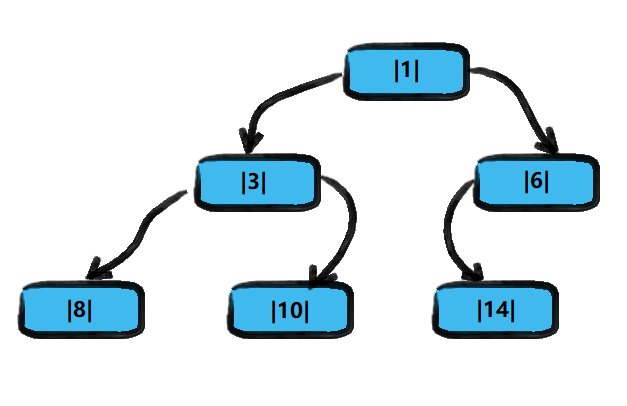
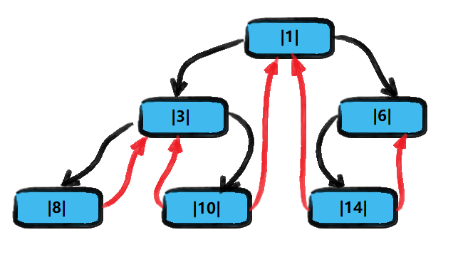
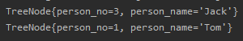
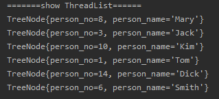

<!-- TOC -->

- [1. 线索化二叉树的概念](#1-线索化二叉树的概念)
  - [1.1. 基本介绍](#11-基本介绍)
  - [1.2. 线索二叉树应用案例](#12-线索二叉树应用案例)
    - [1.2.1. 图解分析](#121-图解分析)
    - [1.2.2. 后续说明](#122-后续说明)
- [2. 线索化二叉树的代码实现](#2-线索化二叉树的代码实现)
  - [2.1. 结点类](#21-结点类)
  - [2.2. 二叉树类](#22-二叉树类)
  - [2.3. 测试类](#23-测试类)
  - [2.4. 测试结果](#24-测试结果)
    - [2.4.1. 测试 10 号结点](#241-测试-10-号结点)
- [3. 遍历线索化二叉树](#3-遍历线索化二叉树)
  - [3.1. 思路分析](#31-思路分析)
  - [3.2. 代码实现](#32-代码实现)
  - [3.3. 测试结果](#33-测试结果)

<!-- /TOC -->

****
[博主的 Github 地址](https://github.com/leon9dragon)
****

## 1. 线索化二叉树的概念

### 1.1. 基本介绍
- n 个结点的二叉链表中含有 n+1 个空指针域  
  - 由公式 `2n-(n-1)=n+1` 得出  
  - 2n 指的是所有结点所有指针个数
  - n-1 指的是实际非空指针的个数
- 利用二叉链表中的空指针域, 存放指向该结点在某种遍历次序下的前驱和后继结点指针
- 这种附加的指针称为"线索" 
  </br></br>
- 这种加上了线索的二叉链表称为线索链表 
- 相应的二叉树称为线索二叉树(Threaded Binary Tree)
- 根据线索性质的不同, 线索二叉树有三种, 可分为前序/中序/后序线索二叉树
  </br></br>
- 一个结点的前一个结点, 称为前驱结点
- 一个结点的后一个结点, 称为后继结点

### 1.2. 线索二叉树应用案例

#### 1.2.1. 图解分析
- 将下面的二叉树, 进行中序线索二叉树.  
- 中序遍历的数列为 {8,3,10,1,14,6}.  

**原二叉树**  
- 黑色指针是实际使用的指针 
- 每个结点都有左右两个指针


**中序线索二叉树**  
- 红色指针指向当前结点的前驱和后继结点 
- 只有当结点左右指针有空位时才产生线索   
- 线索可以为空指针, 空指针在图中并没标出,  
  实际上结点 8 的前驱指针和结点 6 的后继指针, 都为 null


#### 1.2.2. 后续说明
**当线索化二叉树后, Node 结点的属性 left 和 right, 有如下情况:**  
- left 指向的是左子树, 也可能是指向前驱结点.  
  比如 1 结点 left 指向的左子树,  
  而 10 结点的 left 指向的是前驱结点.
- right 指向的是右子树, 也可能是指向后继结点.  
  比如 1 结点 right 指向的右子树,  
  而 10 结点的 right 指向的是后继结点.


## 2. 线索化二叉树的代码实现
- 本次实现以中序线索二叉树为主
  
### 2.1. 结点类
- 根据之前创建的二叉树的结点类进行了修改得到
- 没用到的方法都删掉了, 这里只展示新增方法和要用到的成员


```java
package com.leo9.dc24.threaded_binary_tree;

//创建结点类, 用来存放结点信息和结点的左右子结点信息
public class TreeNode {
    //结点存放的信息
    private int person_no;
    private String person_name;

    //结点的子结点
    private TreeNode left_node;
    private TreeNode right_node;

    //结点的指针属性
    //如果left_type == 0 表示左指针指向的是左子树, 如果为 1 则指向前驱结点
    //如果right_type == 0 表示右指针指向的是右子树, 如果为 1 则指向后继结点
    private int left_type;
    private int right_type;

    //结点构造器
    public TreeNode(int person_no, String person_name) {
        this.person_no = person_no;
        this.person_name = person_name;
    }

    //结点成员的getter和setter方法

    public int getLeft_type() {
        return left_type;
    }

    public void setLeft_type(int left_type) {
        this.left_type = left_type;
    }

    public int getRight_type() {
        return right_type;
    }

    public void setRight_type(int right_type) {
        this.right_type = right_type;
    }

    public int getPerson_no() {
        return person_no;
    }

    public void setPerson_no(int person_no) {
        this.person_no = person_no;
    }

    public String getPerson_name() {
        return person_name;
    }

    public void setPerson_name(String person_name) {
        this.person_name = person_name;
    }

    public TreeNode getLeft_node() {
        return left_node;
    }

    public void setLeft_node(TreeNode left_node) {
        this.left_node = left_node;
    }

    public TreeNode getRight_node() {
        return right_node;
    }

    public void setRight_node(TreeNode right_node) {
        this.right_node = right_node;
    }

    //重载结点的toString方法
    @Override
    public String toString() {
        return "TreeNode{" +
                "person_no=" + person_no +
                ", person_name='" + person_name + '\'' +
                '}';
    }
}
```

### 2.2. 二叉树类
- 依旧是之前的二叉树类修改得到
- 没用到的方法都删掉了, 这里只展示新增方法和要用到的成员

```java
package com.leo9.dc24.threaded_binary_tree;

public class ThreadBinaryTree {
    //成员只需定义根节点即可, 节点相关操作实际由节点类完成
    private TreeNode root_node;

    //为了实现线索化, 需要创建指向当前结点的前驱结点的指针
    //在递归进行线索化时, pre_node 总是保留前一个结点
    private TreeNode pre_node = null;

    //定义设置根节点的方法
    public void setRoot_node(TreeNode root_node) {
        this.root_node = root_node;
    }
    public void setRoot_node(int person_no, String person_name) {
        root_node = new TreeNode(person_no, person_name);
    }

    //编写对二叉树实现中序线索化的方法, 需传入结点进行判断
    public void threadedNode(TreeNode node){
        //如果node==null, 不能线索化
        if(node == null){
            return;
        }
        //1.先线索化左子树
        threadedNode(node.getLeft_node());

        //2.再线索化当前结点
        //2.1.处理当前结点的前驱结点
        if(node.getLeft_node() == null){
            //如果当前结点的左指针为空, 则可以附加线索
            //让当前结点的左指针指向前驱结点
            node.setLeft_node(pre_node);
            //再让结点的左指针类型置为 1
            node.setLeft_type(1);
        }
        //2.2.处理前驱结点指向的后继结点
        if(pre_node != null &&pre_node.getRight_node() == null){
            //如果前驱结点的右指针为空, 则可以附加线索
            //让前驱结点的右指针指向它的后继结点
            pre_node.setRight_node(node);
            //再让前驱结点的右指针类型置为 1
            pre_node.setRight_type(1);
        }

        //每处理完一次当前结点, 便将前驱结点重新定向一次
        //让当前结点成为下一轮递归的结点的前驱结点
        //因为二叉树是单向的, 当前结点并不能通过自己的指针找到其上一个结点
        pre_node = node;

        //3.再线索化右子树
        threadedNode(node.getRight_node());
    }


```

### 2.3. 测试类

```java
package com.leo9.dc24.threaded_binary_tree;

public class TestDemoTBT {
    public static void main(String[] args) {
        //测试中序线索二叉树的功能
        //二叉树后续会递归创建, 这里测试先手动进行创建
        TreeNode node1 = new TreeNode(1,"Tom");
        TreeNode node2 = new TreeNode(3,"Jack");
        TreeNode node3 = new TreeNode(6,"Smith");
        TreeNode node4 = new TreeNode(8,"Mary");
        TreeNode node5 = new TreeNode(10,"Kim");
        TreeNode node6 = new TreeNode(14,"Dick");

        //手动连接各个结点间的关系
        node1.setLeft_node(node2);
        node1.setRight_node(node3);
        node2.setLeft_node(node4);
        node2.setRight_node(node5);
        node3.setLeft_node(node6);

        //测试线索化
        ThreadBinaryTree testTree = new ThreadBinaryTree();
        testTree.setRoot_node(node1);
        testTree.threadedNode(node1);

        //以10号结点测试, 看其前驱和后继结点是否为3号和1号
        System.out.println(node5.getLeft_node());
        System.out.println(node5.getRight_node());

    }
}

```

### 2.4. 测试结果

#### 2.4.1. 测试 10 号结点
- 以 10 号结点测试, 看其前驱和后继结点是否为 3 号和 1 号
- 显而易见, 答案是正确的.  


****

## 3. 遍历线索化二叉树

### 3.1. 思路分析
因为二叉树进行线索化之后, 各个结点的指向有变化, 因此原来的遍历方式不再适用.  
这时需要使用新的方式进行遍历线索化二叉树, 各个结点可以通过线型方式进行遍历.  

因为使用线型方式可以遍历线索化二叉树而不需要递归遍历, 因而提升了遍历的效率.  
线型遍历的得出的遍历顺序应当跟中序遍历(对应的遍历方式)的顺序保持一致.

### 3.2. 代码实现
- 如下给出的是遍历方法, 直接加在前面的遍历二叉树类中即可使用

```java
    //遍历线索化二叉树
    public void threadedList(){
        TreeNode node_pointer = root_node;
        while(node_pointer != null){
            while(node_pointer.getLeft_type() == 0){
                node_pointer = node_pointer.getLeft_node();
            }
            System.out.println(node_pointer);
            while (node_pointer.getRight_type() == 1){
                node_pointer = node_pointer.getRight_node();
                System.out.println(node_pointer);
            }
            node_pointer = node_pointer.getRight_node();
        }
    }
```

### 3.3. 测试结果
- 中序遍历的数列为 {8,3,10,1,14,6}  
- 遍历线索二叉树的结果如下, 跟中序遍历的顺序一致, 结果正确  
