<!-- TOC -->

- [1. 哈夫曼编码的原理](#1-哈夫曼编码的原理)
  - [1.1. 基本介绍](#11-基本介绍)
  - [1.2. 编码方式](#12-编码方式)
    - [1.2.1. 定长编码](#121-定长编码)
    - [1.2.2. 变长编码](#122-变长编码)
    - [1.2.3. 哈夫曼编码](#123-哈夫曼编码)
  - [1.3. 原理剖析](#13-原理剖析)
    - [1.3.1. 编码步骤](#131-编码步骤)
- [2. 哈夫曼编码的实现](#2-哈夫曼编码的实现)
  - [2.1. 实现思路](#21-实现思路)
  - [2.2. 代码实现编码和解码](#22-代码实现编码和解码)
    - [2.2.1. 结点类](#221-结点类)
    - [2.2.2. 哈夫曼编码类](#222-哈夫曼编码类)
    - [2.2.3. 哈夫曼解码方法](#223-哈夫曼解码方法)
- [3. 测试结果](#3-测试结果)
  - [3.1. 哈夫曼编码对字符串进行压缩](#31-哈夫曼编码对字符串进行压缩)
    - [3.1.1. 获取示例字符串的byte字节数组](#311-获取示例字符串的byte字节数组)
    - [3.1.2. 将字节数组转换成结点列表](#312-将字节数组转换成结点列表)
    - [3.1.3. 根据结点列表生成哈夫曼树并前序遍历](#313-根据结点列表生成哈夫曼树并前序遍历)
    - [3.1.4. 获取哈夫曼编码并存储在Map当中](#314-获取哈夫曼编码并存储在map当中)
    - [3.1.5. 转换原字节数组为二进制字符串](#315-转换原字节数组为二进制字符串)
    - [3.1.6. 根据哈夫曼编码表对二进制字符串转换成压缩后的byte字节数组](#316-根据哈夫曼编码表对二进制字符串转换成压缩后的byte字节数组)
  - [3.2. 哈夫曼编码解码被压缩的字节数组](#32-哈夫曼编码解码被压缩的字节数组)
    - [3.2.1. 将压缩数组转换成二进制编码字符串](#321-将压缩数组转换成二进制编码字符串)
    - [3.2.2. 反转哈夫曼编码表并解码二进制字符串得到原字符串](#322-反转哈夫曼编码表并解码二进制字符串得到原字符串)

<!-- /TOC -->

****
[博主的 Github 地址](https://github.com/leon9dragon)
****

## 1. 哈夫曼编码的原理

### 1.1. 基本介绍
- 哈夫曼编码(Huffman Coding)是一种编码方式, 属于一种程序算法
- 哈夫曼编码是哈夫曼树在电讯通信中经典应用之一
- 哈夫曼编码广泛地用于数据文件解缩压缩. 压缩率通常在 20-90% 之间  
- 哈夫曼编码是可变字长编码(VLC)的一种.  
- 是哈夫曼于 1952 年提出一种编码方法, 称之为最佳编码.  

### 1.2. 编码方式
通讯领域中信息处理的方式通常有 3 种

#### 1.2.1. 定长编码
存在着占用太多位的问题  
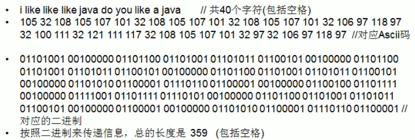


#### 1.2.2. 变长编码
存在着解码可能产生二义性的问题  
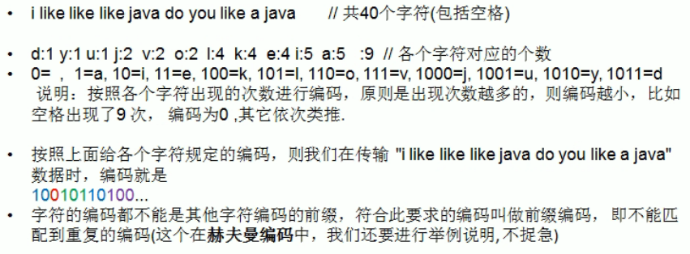

#### 1.2.3. 哈夫曼编码


### 1.3. 原理剖析
以上述案例来进行示范

#### 1.3.1. 编码步骤
- 首先用上述例子的字符串进行传输, 即字符串  
  >"i like like like java do you like a java"

- 然后确定各个字符出现的次数, 如下:  
  >"d":1 "y":1 "u":1 "j":2 "v":2 "o":2  
  >"l":4 "k":4 "e":4 "i":5 "a":5 " ":9

- 按照上面字符出现的次数构建一棵哈夫曼树, 次数作为权值.  
  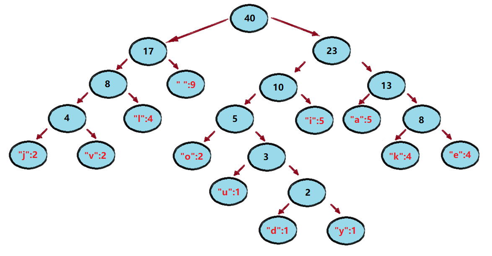

- 然后每个左右指针分别做标识, 左指针为"0", 右指针为"1".  
  

- 最后依次得出每个字母的哈夫曼编码的编码序列.  
  这个编码属于前缀编码,各个编码间的前缀并不会重复.
  
  |字符|编码|字符|编码|字符|编码|字符|编码|字符|编码|
  |--|--|--|--|--|--|--|--|--|--|
  |" "|01|"l"|001|"j"|0000|"u"|10010|"d"|100110|
  |-|-|"i"|101|"v"|0001|-|-|"y"|100111|
  |-|-|"a"|110|"o"|1000|-|-|-|-|
  |-|-|-|-|"k"|1110|-|-|-|-|
  |-|-|-|-|"e"|1111|-|-|-|-|
  
  
- 按照上面的哈夫曼编码, 最终可将字符串转换成如下编码  
  (这里使用无损压缩, 得到的编码长度为 133)  
  > 1010100110111101111010011011110111101001  
  > 1011110111101000011000011100110011010000  
  > 1100111100010010010011011110111101110000  
  > 01100001110

- 得到的最终编码进行匹配解码的时候,  
  可直接按照前缀来逐段比较, 因为前缀不重复,  
  不会造成匹配二义性, 所以最终必定将全部编码匹配完成.  
  原来用定长编码的长度是 359, 压缩率算出为 (359-133)/359=0.629

- 注意:  
  以上例子可能会根据哈夫曼排序方法不同, 得出编码不一样.  
  因为存在多个权值相同的结点, 其排序顺序可能并不一样.
  但是排序得到的哈夫曼树的 WPL 是一样的, 都是最小的.
  因此最终得到的编码长度都是相同的, 并无影响.

## 2. 哈夫曼编码的实现

### 2.1. 实现思路
1. 先创建一个结点类, 结点成员有四个, 分别是:  
   data 存放字符对应的 ASCII 码, weight 存放权值,  
   left 和 right 存放左右子结点.

2. 得到目标字符串对应的 byte[] 数组, 用以统计得出权值.

3. 编写方法, 将准备构建哈夫曼树的结点放到 List 中.  

4. 通过构建的 List 来创建对应的哈夫曼树.
   
### 2.2. 代码实现编码和解码
- 实现细节均在代码注释当中

#### 2.2.1. 结点类
```java
package com.leo9.dc27.huffman_code;
//创建结点类, 用以存放每个字符的数据
public class TreeNode implements Comparable<TreeNode>{
    //存放字符的数据
    Byte char_data;
    //存放字符的出现次数, 即结点的权值
    int char_weight;
    //定义左右子结点
    TreeNode left_node;
    TreeNode right_node;

    //定义构造函数
    public TreeNode(Byte char_data, int char_weight) {
        this.char_data = char_data;
        this.char_weight = char_weight;
    }

    @Override
    //定义排序
    public int compareTo(TreeNode o) {
        //从小到大排序
        return this.char_weight - o.char_weight;
    }

    @Override
    public String toString() {
        return "TreeNode{" +
                "char_data=" + char_data +
                ", char_weight=" + char_weight +
                '}';
    }

    //前序遍历结点
    public void preOrder(){
        System.out.println(this);
        if(this.left_node != null){
            this.left_node.preOrder();
        }
        if(this.right_node != null){
            this.right_node.preOrder();
        }
    }
}

```
****

#### 2.2.2. 哈夫曼编码类
```java
package com.leo9.dc27.huffman_code;

import javafx.print.Collation;

import java.util.*;

//构建哈夫曼编码类, 对字符串对应的字节数组进行编码和压缩, 以及解码.
public class HuffmanCode {

    //region 封装调用的方法, 最终返回一个压缩过后的byte字节数组
    public static byte[] getHuffmanCodeByte(String sample_str) {
        //获取示例字符串的byte字节数组
        byte[] byte_arr = sample_str.getBytes();
        System.out.println("====================================");
        System.out.println("the length of byte array: " + byte_arr.length);
        System.out.println("the byte array: " + Arrays.toString(byte_arr));

        //将字节数组转换成结点列表
        List<TreeNode> node_list = getNodes(byte_arr);
        System.out.println("====================================");
        System.out.println("the node list:\n" + node_list);

        //根据结点列表生成哈夫曼树
        TreeNode huffman_tree_root = createHuffmanTreeByList(node_list);
        System.out.println("====================================" + "\npre order huffman tree:");
        huffman_tree_root.preOrder();

        //获取哈夫曼编码并存储在Map当中
        Map<Byte, String> the_huffman_code = getHuffmanCode(huffman_tree_root);
        System.out.println("====================================");
        System.out.println("the huffman code is:\n" + the_huffman_code);

        //根据哈夫曼编码表来取得新的压缩后的byte字节数组
        byte[] zip_byte_arr = transByteArray(byte_arr, the_huffman_code);
        System.out.println("====================================");
        System.out.println("the length of zip byte array: " + zip_byte_arr.length);
        System.out.println("the zip byte array: " + Arrays.toString(zip_byte_arr));

        return zip_byte_arr;
    }
    //endregion

    //region 定义获取结点方法, 并将结点存放于一个结点列表当中
    private static List<TreeNode> getNodes(byte[] bytes) {
        //1. 创建一个ArrayList, 存放结点列表
        ArrayList<TreeNode> node_list = new ArrayList<TreeNode>();

        //2. 遍历byte_arr, 统计每个byte出现的次数, 用map来处理
        Map<Byte, Integer> counts = new HashMap<>();
        for (byte b : bytes) {
            Integer count = counts.get(b);
            if (count == null) {
                //Map还没有这个字符数据, 第一次
                counts.put(b, 1);
            } else {
                counts.put(b, count + 1);
            }
        }

        //3. 遍历Map并将Map中的每个键值对转换成TreeNode对象, 并加入到node_list中
        for (Map.Entry<Byte, Integer> entry : counts.entrySet()) {
            node_list.add(new TreeNode(entry.getKey(), entry.getValue()));
        }

        return node_list;
    }
    //endregion

    //region 定义根据List结点列表来创建哈夫曼树的方法
    private static TreeNode createHuffmanTreeByList(List<TreeNode> nodes) {
        while (nodes.size() > 1) {
            //从小到大排序
            Collections.sort(nodes);
            //取出第一棵最小的二叉树
            TreeNode leftNode = nodes.get(0);
            //取出第二棵最小的二叉树
            TreeNode rightNode = nodes.get(1);
            //创建一棵新的二叉树, 注意它只有叶子结点有 char_data 其它没有.
            TreeNode parentNode = new TreeNode(null, leftNode.char_weight + rightNode.char_weight);
            parentNode.left_node = leftNode;
            parentNode.right_node = rightNode;
            //将已经处理的二叉树从结点列表中删除, 并将新的二叉树加入列表
            nodes.remove(leftNode);
            nodes.remove(rightNode);
            nodes.add(parentNode);
        }

        //返回哈夫曼树的根结点
        return nodes.get(0);
    }
    //endregion

    //region 生成哈夫曼树对应的哈夫曼编码
    //1. 将哈夫曼编码存放在一个Map当中, Map<Byte, String>
    //   形如 [32->01, 97->100, 100->11000]
    static Map<Byte, String> huffman_code = new HashMap<Byte, String>();

    //2. 在生成哈夫曼编码表时, 需要去拼接路径, 定义StringBuilder存放某个叶子结点的路径
    static StringBuilder leave_node_code = new StringBuilder();

    //3. 定义方法获取传入的哈夫曼树的根结点下的所有叶子结点的哈夫曼编码并放入到huffman_code中

    /**
     * @param node            传入的哈夫曼树结点
     * @param code            路径值, 左子结点为0, 右子结点为1
     * @param leave_node_code 用于拼接路径
     */
    private static void getHuffmanCode(TreeNode node, String code, StringBuilder leave_node_code) {
        StringBuilder build_code = new StringBuilder(leave_node_code);
        //将code加入到build_code
        build_code.append(code);

        //判断结点是否为空, 为空则不处理
        if (node != null) {
            //判断当前节点是叶子结点还是非叶子结点
            if (node.char_data == null) {
                //如果是非叶子结点, 就开始继续递归
                //向左递归
                getHuffmanCode(node.left_node, "0", build_code);
                //向右递归
                getHuffmanCode(node.right_node, "1", build_code);
            } else {
                //如果是叶子结点, 表示该叶子结点对应的字符的编码已经完成
                //将该叶子结点对应的字符数据和编码值转换成的字符串存入huffman_code即可
                huffman_code.put(node.char_data, build_code.toString());
            }
        }
    }

    //封装上述流程, 使调用更方便
    private static Map<Byte, String> getHuffmanCode(TreeNode the_root) {
        if (the_root == null) {
            return null;
        }
        getHuffmanCode(the_root, "", leave_node_code);
        return huffman_code;
    }
    //endregion

    //region 编写方法来转换byte数组
    //即将原byte数组根据生成的哈夫曼编码表来进行转换然后得到一个转码后的byte数组

    /**
     * @param origin_group 未被哈夫曼编码转换的原字节数组
     * @param huffman_code 上面步骤生成得到的哈夫曼编码表
     * @return 返回的是二进制字符串"10101000..."以8位为一组转换成byte数据的byte数组
     * 即先将原来的byte数组的每一个成员根据哈夫曼编码先转成二进制的字符串
     * 然后再将这个二进制字符串再以8位一组的形式, 再转换成一个压缩后的byte数组
     */
    private static byte[] transByteArray(byte[] origin_group, Map<Byte, String> huffman_code) {
        //1. 利用得到的哈夫曼编码表将原byte数组转换成二进制的转码字符串
        //1.1. 因为要拼接字符串, 因此先创建一个StringBuilder
        StringBuilder build_huffman_string = new StringBuilder();
        //1.2.遍历原byte数组
        for (byte b : origin_group) {
            build_huffman_string.append(huffman_code.get(b));
        }
        //1.3.这里已经得到了对应的转码字符串了, 可进行输出测试.
        //    这个哈夫曼编码字符串是133长度
        System.out.println("====================================\nthe huffman code string is:");
        System.out.println(build_huffman_string.toString());
        System.out.println("the length of the huffman code string is: " + build_huffman_string.length());

        //2. 将得到的哈夫曼编码字符串转换成byte数组以缩减长度
        //   转换后的byte数组长度是17, 长度从40缩减17, 压缩率57%

        //2.1. 计算哈夫曼编码字符串模8后的结果, 能被整除或有余数.
        //     根据不同的结果来得出不同的数组长度以创建新的byte数组
        int new_array_length;
        if (build_huffman_string.length() % 8 == 0) {
            new_array_length = build_huffman_string.length() / 8;
        } else {
            new_array_length = build_huffman_string.length() / 8 + 1;
        }

        //2.2. 得出新的数组长度后, 即可创建新的byte数组, 用以存放转码压缩后的数据
        //2.2.1. 先创建一个临时数组, 用以遍历存储数据.
        //       同时创建一个数组索引, 用以记录存放数据的位置.
        byte[] new_byte_array = new byte[new_array_length];
        int array_index = 0;

        //2.2.2. 遍历string builder并进行截取转码存入新的byte数组,
        //       遍历的步长为8, 因为要每8位对应一个字节byte进行压缩.
        for (int i = 0; i < build_huffman_string.length(); i = i + 8) {
            String str2byte;
            //每8位对哈夫曼编码字符串进行截取
            //如果最后一次截取不足8位, 则直接从当前位置截取到末位即可
            if (i + 8 > build_huffman_string.length()) {
                str2byte = build_huffman_string.substring(i);
            } else {
                str2byte = build_huffman_string.substring(i, i + 8);
            }

            //将截取的字符串转码变为byte并存入新的byte数组当中, 存放一次索引后移一次.
            new_byte_array[array_index] = (byte) Integer.parseInt(str2byte, 2);
            array_index++;
        }

        return new_byte_array;
    }
    //endregion
}

```

****

#### 2.2.3. 哈夫曼解码方法
- 为了避免版面太长, 因此解码方法单独拿出来展示
- 使用时将这部分方法加在上面的哈夫曼编码类中即可
  
```java
    //region 封装调用方法成为哈夫曼解码方法, 返回未经压缩的原byte字节数组
    public static byte[] decodeHuffmanCodeByteArray(byte[] zip_byte_arr) {
        byte[] origin_byte_arr = decodeByteArray(huffman_code, zip_byte_arr);
        System.out.println("====================================");
        System.out.println("the length of origin byte arr: " + origin_byte_arr.length);
        System.out.println("the origin byte arr: " + Arrays.toString(origin_byte_arr));
        System.out.println("the origin str: " + new String(origin_byte_arr));
        return origin_byte_arr;
    }
    //endregion

    //region 编写方法来将一个byte转换成一个二进制字符串

    /**
     * @param flag   标志是否需要补高位, true则补位, false则不补位
     * @param a_byte 传入的byte字节
     * @return 是传入的byte对应的二进制字符串(注意是按照补码来操作的)
     */
    private static String transByteToBitString(boolean flag, byte a_byte) {
        //使用临时变量保存byte
        int temp = a_byte;

        //如果temp是正数还存在补高位的问题
        if (flag) {
            temp |= 256;
        }

        //用一个字符串去接受temp返回的二进制编码字符串
        //但实际上返回的是temp对应的二进制码的补码
        String str = Integer.toBinaryString(temp);

        if (flag) {
            return str.substring(str.length() - 8);
        } else {
            return str;
        }
    }
    //endregion

    //region 编写方法, 完成对二进制字符串的解码

    /**
     * @param huffman_code 哈夫曼编码表, Map键值对
     * @param zip_byte_arr 经过哈夫曼编码表转码后得到的压缩byte数组
     * @return 返回压缩byte数组解码过后的未被压缩的byte数组
     */
    private static byte[] decodeByteArray(Map<Byte, String> huffman_code, byte[] zip_byte_arr) {
        //1. 先得到哈夫曼编码表对应的二进制字符串
        //1.1. 将压缩过byte数组转换成二进制的字符串
        StringBuilder stringBuilder = new StringBuilder();
        boolean flag = true;
        for (int i = 0; i < zip_byte_arr.length; i++) {
            //如果是数组最后一位, 就不需要对其进行补位, 防止编码出错多出几位.
            if (i == zip_byte_arr.length - 1) {
                flag = false;
            }
            //将byte数组每一位获取到的二进制字符串进行拼接
            stringBuilder.append(transByteToBitString(flag, zip_byte_arr[i]));
        }
        System.out.println("====================================");
        System.out.println("the string of zip array is: " + stringBuilder.toString());

        //2. 将字符串按照指定的哈夫曼编码表进行解码
        //2.1. 将哈夫曼编码表进行键值对反转调换, 因为反向查询编码对应的char值
        Map<String, Byte> reverse_map = new HashMap<String, Byte>();
        for (Map.Entry<Byte, String> entry : huffman_code.entrySet()) {
            reverse_map.put(entry.getValue(), entry.getKey());
        }
        System.out.println("====================================");
        System.out.println("the reverse map is:\n" + reverse_map);

        //2.2. 创建一个集合, 存放byte
        List<Byte> byte_list = new ArrayList<>();

        //2.3. 逐位对二进制字符串进行扫描, 并逐个对比反转编码表获取byte值
        //定义字符串位置计数器, 从0开始, 要超出stringBuilder长度则终止循环
        int sign_of_scan = 0;
        while (sign_of_scan < stringBuilder.length()) {
            //定义循环标识符, 用以控制循环是否要结束.
            boolean sign = true;

            //定义一个Byte进行获取匹配值, 同时定义count来作为移位计数器
            Byte the_byte = null;
            int count = 1;

            while (sign) {
                //递增的从二进制字符串中逐位取出一段key和翻转表进行匹配
                String key = stringBuilder.substring(sign_of_scan, sign_of_scan + count);
                the_byte = reverse_map.get(key);
                //如果没有匹配到值, count自增, 然后继续循环
                if (the_byte == null) {
                    count++;
                }
                //如果匹配到了值, 就结束while循环
                else {
                    sign = false;
                }
            }
            //字节列表中加入匹配到的值
            byte_list.add(the_byte);
            //i也进行移位, 移到被截取位后一位
            sign_of_scan += count;
        }

        //3. 当for循环结束后, byte_list中就存储了所有的未压缩byte数组的成员
        //3.1. 将byte_list转换为一个byte数组, 数组长度和byte_list的size相同
        byte[] origin_byte_arr = new byte[byte_list.size()];
        for (int i = 0; i < origin_byte_arr.length; i++) {
            origin_byte_arr[i] = byte_list.get(i);
        }

        return origin_byte_arr;
    }
    //endregion
```
****

## 3. 测试结果
- 定义一个字符串用作测试 `String sample_str = "i like like like java do you like a java";`
****

### 3.1. 哈夫曼编码对字符串进行压缩
- 最终获得一个被压缩的字节数组, 和原字符串对应的字节数组相比, 长度从 40 变为 17

#### 3.1.1. 获取示例字符串的byte字节数组
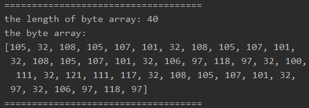

#### 3.1.2. 将字节数组转换成结点列表
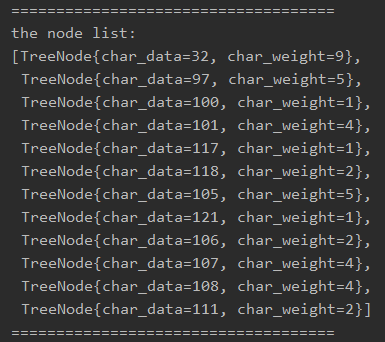

#### 3.1.3. 根据结点列表生成哈夫曼树并前序遍历
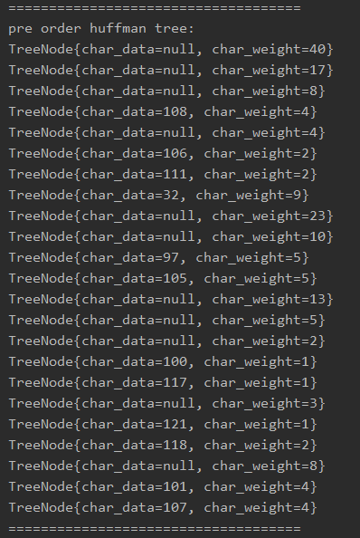

#### 3.1.4. 获取哈夫曼编码并存储在Map当中
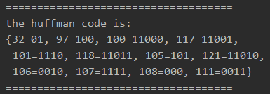

#### 3.1.5. 转换原字节数组为二进制字符串
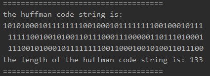  

#### 3.1.6. 根据哈夫曼编码表对二进制字符串转换成压缩后的byte字节数组
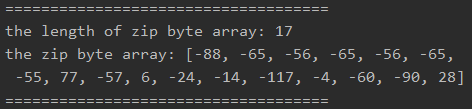

****

### 3.2. 哈夫曼编码解码被压缩的字节数组
- 最终解码返回原字符串

#### 3.2.1. 将压缩数组转换成二进制编码字符串 
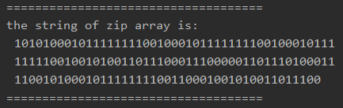

#### 3.2.2. 反转哈夫曼编码表并解码二进制字符串得到原字符串
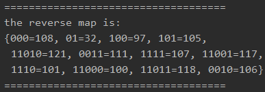  
