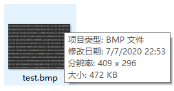
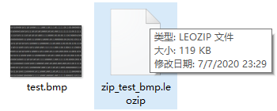
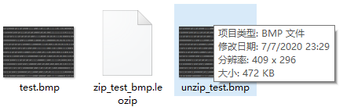

<!-- TOC -->

- [1. 哈夫曼编码实现文件压缩](#1-哈夫曼编码实现文件压缩)
  - [1.1. 代码实现](#11-代码实现)
    - [1.1.1. 压缩方法](#111-压缩方法)
- [2. 哈夫曼编码实现文件解压](#2-哈夫曼编码实现文件解压)
  - [2.1. 代码实现](#21-代码实现)
    - [2.1.1. 解压方法](#211-解压方法)
- [3. 哈夫曼编码对文件的压缩和解压测试](#3-哈夫曼编码对文件的压缩和解压测试)
- [4. 哈夫曼编码解压缩文件注意事项](#4-哈夫曼编码解压缩文件注意事项)

<!-- /TOC -->

****
[博主的 Github 地址](https://github.com/leon9dragon)
****

- **注意:**  
  本篇哈夫曼编码的实现代码依赖于上一篇的内容,  
  本文是在上篇的基础上增加哈夫曼编码实现解压缩的内容.

## 1. 哈夫曼编码实现文件压缩
- **要求**  
  给定一个图片文件, 对其进行无损压缩  

- **思路**  
  读取文件 -> 得到哈夫曼编码表 -> 完成压缩

### 1.1. 代码实现
- 以下类方法均放入上一篇中的 `HuffmanCode.java` 中即可使用

#### 1.1.1. 压缩方法
```java
//region 编写方法, 将一个文件进行压缩

    /**
     * @param srcFilePath 传入目标文件的路径
     * @param dstFilePath 压缩后存放文件的路径
     */
    public static void zipFile(String srcFilePath, String dstFilePath) {
        //定义一个文件输入流
        FileInputStream is = null;
        //定义一个文件输出流
        OutputStream os = null;
        ObjectOutputStream oos = null;
        try {
            //region 0. 先创建文件的输入流和输出流
            //创建文件输入流
            is = new FileInputStream(srcFilePath);
            //创建文件输出流
            os = new FileOutputStream(dstFilePath);
            //endregion

            //region 1. 对源文件进行压缩
            //创建一个和源文件大小一致的字节数组
            byte[] file_arr = new byte[is.available()];
            //读取文件
            is.read(file_arr);
            //将字节数组转换成结点列表
            List<TreeNode> node_list = getNodes(file_arr);
            //根据结点列表生成哈夫曼树
            TreeNode huffman_tree_root = createHuffmanTreeByList(node_list);
            //获取哈夫曼编码并存储在Map当中
            Map<Byte, String> the_huffman_code = getHuffmanCode(huffman_tree_root);
            //根据哈夫曼编码表来取得新的压缩后的byte字节数组
            byte[] zip_file_arr = transByteArray(file_arr, the_huffman_code);
            //endregion

            //region 输出并存放压缩文件
            //创建一个和文件输出流关联的ObjectOutputStream
            oos = new ObjectOutputStream(os);
            //把哈夫曼编码后的字节数组写入压缩文件
            oos.writeObject(zip_file_arr);
            //以对象流的方式写入哈夫曼编码, 为了以后恢复源文件时使用, 一定要写入, 否则文件恢复不了
            oos.writeObject(the_huffman_code);
            //endregion

        } catch (Exception e) {
            System.out.println(e.getMessage());
        } finally {
            try {
                //关闭文件输入流
                is.close();
                //关闭文件输出流
                os.close();
                oos.close();
            } catch (Exception e) {
                System.out.println(e.getMessage());
            }
        }
    }
    //endregion
```

****

## 2. 哈夫曼编码实现文件解压
- **要求** 
  将上面利用哈夫曼编码进行压缩的文件恢复为原来的文件

- **思路**   
  读取压缩文件(包括数据和哈夫曼编码表) -> 完成解压, 文件恢复

### 2.1. 代码实现

#### 2.1.1. 解压方法
```java
    //region 编写方法完成对压缩文件的解压

    /**
     * @param zipFilePath 压缩文件的路径
     * @param unzipToPath 解压后存放恢复文件的路径
     */
    public static void unzipFile(String zipFilePath, String unzipToPath) {
        //定义文件的输入流
        InputStream is = null;
        //定义对象输入流
        ObjectInputStream ois = null;
        //定义文件的输出流
        OutputStream os = null;

        try {
            //region 0. 先创建输入输出流, 并读取压缩后的字节数组和哈夫曼编码表
            //创建文件输入流
            is = new FileInputStream(zipFilePath);
            //创建一个和is关联的对象输入流
            ois = new ObjectInputStream(is);
            //读取字节数组 zip_file_arr
            byte[] zip_file_arr = (byte[]) ois.readObject();
            //读取哈夫曼编码表 the_huffman_code
            Map<Byte, String> the_huffman_code = (Map<Byte, String>) ois.readObject();
            //endregion

            //region 1. 对压缩后的字节数组进行解码同时恢复和输出文件
            //对文件进行解码
            byte[] origin_file_arr = decodeByteArray(the_huffman_code, zip_file_arr);
            //将解码后的源文件数组输出
            os = new FileOutputStream(unzipToPath);
            os.write(origin_file_arr);
            //endregion
        } catch (Exception e) {
            System.out.println(e.getMessage());
        } finally {
            try {
                //关闭文件输入输出流
                os.close();
                ois.close();
                is.close();
            } catch (Exception e) {
                System.out.println(e.getMessage());
            }
        }
    }
    //endregion
```

****

## 3. 哈夫曼编码对文件的压缩和解压测试
- **测试流程用到的代码**
```java
    //测试哈夫曼编码压缩文件
    //输入源文件的路径, 这里的源文件是一个大小为473KB的图片
    String srcFilePath = "d://test.bmp";
    //定义一个输出压缩文件的路径
    String zipFilePath = "d://zip_test_bmp.leozip";
    //调用压缩文件的方法, 压缩后得到一个120KB的文件
    HuffmanCode.zipFile(srcFilePath, zipFilePath);

    //定义一个输出解压后的源文件的路径
    String unzipToPath = "d://unzip_test.bmp";
    //调用解压文件的方法, 解压后获取得源文件
    HuffmanCode.unzipFile(zipFilePath, unzipToPath);
```

- **获取一个图片文件**  
  - 源文件大小是 472KB  
  

- **对文件进行压缩**  
  - 文件压缩后大小变为 119KB  
  

- **对文件进行解压**
  - 解压后获取到源文件 大小一致 为472KB  
  

****

## 4. 哈夫曼编码解压缩文件注意事项
1. 若文件本身已是经压缩处理的, 再使用哈夫曼编码压缩效率不会有明显变化  
   (比如视频, ppt 等文件)

2. 哈夫曼编码是按字节来处理的, 因此可处理所有的文件  
   (二进制文件, 文本文件等)

3. 若一个文件中的内容重复的数据不多, 压缩的效果也不会很明显  
   (图片简单像素重复多, 压缩率则随之增高)