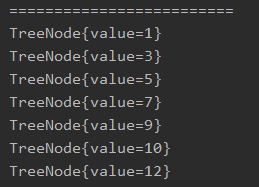

<!-- TOC -->

- [1. 二叉排序树的案例引入](#1-二叉排序树的案例引入)
  - [1.1. 需求](#11-需求)
  - [1.2. 分析](#12-分析)
- [2. 二叉排序树(BST)的原理](#2-二叉排序树bst的原理)
  - [2.1. 基本介绍](#21-基本介绍)
- [3. 二叉排序树的创建和遍历](#3-二叉排序树的创建和遍历)
  - [3.1. 思路分析](#31-思路分析)
  - [3.2. 代码实现](#32-代码实现)
    - [3.2.1. 结点类](#321-结点类)
    - [3.2.2. 二叉树类](#322-二叉树类)
    - [3.2.3. 测试类](#323-测试类)
  - [3.3. 排序二叉树建立和遍历测试结果](#33-排序二叉树建立和遍历测试结果)
- [4. 二叉树删除结点的思路和实现](#4-二叉树删除结点的思路和实现)
  - [4.1. 思路分析](#41-思路分析)
    - [4.1.1. 情况一: 删除叶子结点](#411-情况一-删除叶子结点)
    - [4.1.2. 情况二: 删除只有一棵子树的结点](#412-情况二-删除只有一棵子树的结点)
    - [4.1.3. 情况三: 删除有两棵子树的结点](#413-情况三-删除有两棵子树的结点)
  - [4.2. 代码实现](#42-代码实现)
    - [4.2.1. 结点类新增方法](#421-结点类新增方法)
    - [4.2.2. 二叉树类新增方法](#422-二叉树类新增方法)
  - [4.3. 排序二叉树删除结点测试结果](#43-排序二叉树删除结点测试结果)
    - [4.3.1. 情况一: 删除叶子结点](#431-情况一-删除叶子结点)
    - [4.3.2. 情况二: 删除有一个子结点的结点](#432-情况二-删除有一个子结点的结点)
    - [4.3.3. 情况三: 删除有两个子结点的结点](#433-情况三-删除有两个子结点的结点)

<!-- /TOC -->

****
[博主的 Github 地址](https://github.com/leon9dragon)
****

## 1. 二叉排序树的案例引入

### 1.1. 需求
给定数列 `arr = {7,3,10,12,5,1,9}`,  
要求能高效的完成对数据的查询和添加.

### 1.2. 分析
- **使用数组**    
> - 数组未排序
>   - 优点: 直接在数组尾部添加, 速度快
>   - 缺点: 查找元素的速度慢
> - 数组已排序
>   - 优点: 可以使用二分查找, 查找速度快
>   - 缺点: 为保证数组有序, 插入新数据都要重新排序,   
>     每次排序都要使数据插入位后的数据整体后移, 速度慢

- **使用链式存储-链表**  
> 优点: 添加数据速度比数组快, 不需要数据整体移动.  
> 缺点: 不管链表是否有序, 查找速度都慢.

- **使用二叉排序树**
> 下面开始进行介绍

****

## 2. 二叉排序树(BST)的原理

### 2.1. 基本介绍
- 二叉排序树 Binary Sort(Search) Tree, 简称 BST.  

- 对于二叉排序树的任何一个非叶子结点而言,  
  要求左子结点的值比父结点的值小, 右子结点的值比父结点的值大.  
  如果子结点的值和父结点相同, 可以左右任意放置该子结点.

- 针对前面需求所给出的数组 `arr = {7,3,10,12,5,1,9}` 
  - 对应的二叉排序树如下图所示:  
     
  - 插入一个结点 2 后的图示:  
  

****

## 3. 二叉排序树的创建和遍历

### 3.1. 思路分析
- 插入新的结点的时候与调用插入方法的结点进行比较  
  - 如果小于等于调用结点, 则向左进行
    - 若调用方法的结点的左子结点为空, 则直接将新结点挂上去即可
    - 若调用方法的结点的左子结点非空, 则利用其左子结点调用方法
  - 如果大于调用结点, 则向右进行
    - 若调用方法的结点的右子结点为空, 则直接将新结点挂上去即可
    - 若调用方法的结点的右子结点非空, 则利用其右子结点调用方法

### 3.2. 代码实现

#### 3.2.1. 结点类
```java
package com.leo9.dc28.binary_sort_tree;

public class TreeNode {
    public int value;
    public TreeNode left_node;
    public TreeNode right_node;

    public TreeNode(int value) {
        this.value = value;
    }

    //region 添加结点的方法
    //递归形式添加结点, 注意需要满足二叉排序树的要求
    public void addNode(TreeNode new_node) {
        //若传入空结点则直接返回即可
        if (new_node == null) {
            return;
        }

        //region 判断传入的结点的值, 和当前调用方法的结点的值关系
        //如果新结点的值小于等于当前调用结点的值
        if (new_node.value <= this.value) {
            //如果当前调用结点的左子结点为空, 则直接将新结点接在其左子结点即可
            if (this.left_node == null) {
                this.left_node = new_node;
            }
            //如果不为空, 递归向左添加
            else {
                this.left_node.addNode(new_node);
            }
        }
        //如果新结点的值大于当前调用结点的值
        else {
            //如果当前调用结点的右子结点为空, 则直接将新结点接在其右子结点即可
            if (this.right_node == null) {
                this.right_node = new_node;
            }
            //如果不为空, 递归向右添加
            else {
                this.right_node.addNode(new_node);
            }
        }
        //endregion
    }
    //endregion


    @Override
    public String toString() {
        return "TreeNode{" +
                "value=" + value +
                '}';
    }

    //region 中序遍历
    public void infixOrder() {
        if (this.left_node != null) {
            this.left_node.infixOrder();
        }

        System.out.println(this);

        if (this.right_node != null) {
            this.right_node.infixOrder();
        }
    }
    //endregion
}

```

****

#### 3.2.2. 二叉树类
```java
package com.leo9.dc28.binary_sort_tree;

public class BinarySortTree {
    private TreeNode root_node;

    //region 定义添加结点的方法
    public void addNode(TreeNode new_node) {
        //如果根结点为空, 新结点直接成为根结点
        if (root_node == null) {
            root_node = new_node;
        }
        //如果根结点不为空, 则根结点调用增加结点方法
        else {
            root_node.addNode(new_node);
        }
    }
    //endregion

    //region 定义中序遍历方法
    public void infixOrder(){
        if(root_node == null){
            System.out.println("the tree is null!");
            return;
        }
        root_node.infixOrder();
    }
    //endregion
}

```

****

#### 3.2.3. 测试类
```java
package com.leo9.dc28.binary_sort_tree;

public class TestDemoBST {
    public static void main(String[] args) {
        int[] arr = {7, 3, 10, 12, 5, 1, 9};
        BinarySortTree binarySortTree = new BinarySortTree();
        //循环添加结点到二叉排序树
        for (int i = 0; i < arr.length; i++) {
            binarySortTree.addNode(new TreeNode(arr[i]));
        }
        //中序遍历二叉排序树
        System.out.println("=========================");
        binarySortTree.infixOrder();
    }

}

```

### 3.3. 排序二叉树建立和遍历测试结果
- 中序遍历后输出结果为顺序输出结点  


****

## 4. 二叉树删除结点的思路和实现
- 拿下图作为实例进行讲解  


- 二叉排序树的删除情况比较复杂, 有下面三种情况需要考虑
  - 删除叶子节点(比如结点: 2, 5, 9, 12)
  - 删除只有一棵子树的结点(比如结点: 1)
  - 删除有两棵子树的结点(比如结点: 7, 3, 10)

### 4.1. 思路分析

#### 4.1.1. 情况一: 删除叶子结点
- 首先要找到目标删除结点(targetNode)是否存在 
- 再找到 targetNode 的父结点(parentNode), 并确定是否存在
- 确定 targetNode 对应 parentNode 的左子结点或是右子结点
- 根据前面的条件进行对应删除操作, 将 parentNode 的左或右子结点置空即可

#### 4.1.2. 情况二: 删除只有一棵子树的结点
- 首先要找到目标删除结点(targetNode)是否存在 
- 再找到 targetNode 的父结点(parentNode), 并确定是否存在
- 确定 targetNode 对应 parentNode 的左子结点或是右子结点
- 如果 targetNode 是 parentNode 的左(右)子结点
  - 将 targetNode 的唯一子节点赋给 parentNode 的左(右)子结点
  - 再将 targetNode 的唯一子结点置空

#### 4.1.3. 情况三: 删除有两棵子树的结点
- 首先要找到目标删除结点(targetNode)是否存在 
- 再找到 targetNode 的父结点(parentNode), 并确定是否存在
- 再从 targetNode 的右子树找到最小的结点(或从左子树中找到最大的结点)
- 然后用一个临时变量, 将找到的右子树最小结点(左子树最大结点)的值进行保存
- 然后将右子树最小结点(左子树最大结点)进行删除
- 最后将 targetNode 的值改为临时变量保存的值即可

****

### 4.2. 代码实现

#### 4.2.1. 结点类新增方法
- 新增方法直接加到上面的结点类中即可

```java
    //region 查找要删除的结点

    /**
     * @param node_val 目标结点的value值
     * @return 如果找到目标结点, 则返回目标结点, 否则返回null
     */
    public TreeNode searchTargetNode(int node_val) {
        //与当前调用节点的值进行比较
        //如果相等, 就返回当前调用结点
        if (node_val == this.value) {
            return this;
        }
        //如果小于当前调用结点的值, 则用当前结点的左子结点进行调用查找方法
        else if (node_val < this.value) {
            if (this.left_node != null) {
                return this.left_node.searchTargetNode(node_val);
            } else {
                System.out.println("the target node is not existed!");
                return null;
            }
        }
        //如果大于当前调用结点的值, 则用当前结点的右子结点进行调用查找方法
        else {
            if (this.right_node != null) {
                return this.right_node.searchTargetNode(node_val);
            } else {
                System.out.println("the target node is not existed!");
                return null;
            }
        }
    }
    //endregion

    //region 查找目标结点的父结点

    /**
     * @param node_val 目标结点本身的value值
     * @return 要返回的目标结点的父结点, 如果没有则返回null
     */
    public TreeNode searchParentNode(int node_val) {
        //如果当前结点的左(右)子结点不为空, 且它的左(右)子结点的值就等于目标值, 则当前结点是父结点
        if ((this.left_node != null && this.left_node.value == node_val) || (this.right_node != null && this.right_node.value == node_val)) {
            return this;
        } else {
            //如果查找的值小于等于当前结点的值, 且当前结点的左子结点非空, 则递归向左查找
            if (this.left_node != null && node_val <= this.value) {
                return this.left_node.searchParentNode(node_val);
            }
            //如果查找的值大于当前结点的值, 且当前结点的右子结点非空, 则递归向右查找
            else if (this.right_node != null && node_val > this.value) {
                return this.right_node.searchParentNode(node_val);
            }
            //如果上述条件都不满足, 则找不到父结点
            else {
                return null;
            }
        }
    }
    //endregion
```

#### 4.2.2. 二叉树类新增方法
- 同上, 将这些方法放到上面的二叉树类中即可

```java
    //region 查找目标结点方法
    public TreeNode searchTargetNode(int node_val) {
        if (root_node == null) {
            System.out.println("the root node is null!");
            return null;
        } else {
            return root_node.searchTargetNode(node_val);
        }
    }
    //endregion

    //region 查找父结点方法
    public TreeNode searchParentNode(int node_val) {
        if (root_node == null) {
            System.out.println("the root node is null!");
            return null;
        } else {
            return root_node.searchParentNode(node_val);
        }
    }
    //endregion

    //region 删除结点方法
    public void delTargetNode(int node_val) {
        if (root_node == null) {
            System.out.println("the root node is null!");
            return;
        } else {
            //region 先判断目标节点是否存在并且其父结点是否存在
            //1.需要先找到要删除的目标结点是否存在
            TreeNode target_node = searchTargetNode(node_val);
            if (target_node == null) {
                return;
            }

            //2.若target_node存在则查找target_node的父结点是否存在
            //2.1.如果target_node就是根节点
            if (node_val == root_node.value) {
                root_node = null;
            }
            //2.2.若target_node非根节点, 则调用查找父结点方法
            TreeNode parent_node = root_node.searchParentNode(node_val);

            //endregion

            //region 情况1: 删除的是叶子结点
            //如果目标结点的左右子结点都为空, 可以确定它为叶子结点
            if (target_node.left_node == null && target_node.right_node == null) {
                //判断目标结点是父结点的左子结点还是右子结点
                //如果目标结点是父结点的左子结点
                if (parent_node.left_node != null && parent_node.left_node.value == node_val) {
                    parent_node.left_node = null;
                }
                //如果目标结点是父结点的右子结点
                if (parent_node.right_node != null && parent_node.right_node.value == node_val) {
                    parent_node.right_node = null;
                }
            }

            //endregion

            //region 情况3: 删除的是有两个子结点的结点
            //情况3提前是为了少些判断条件, 将剩余情况归类于情况2
            else if (target_node.left_node != null && target_node.right_node != null) {
                //取得右子树最小权值结点的权值, 并在二叉树中删除这个最小权值结点
                int right_min_val = delRightTreeMinNode(target_node);
                //将目标删除结点的权值替换成这个最小权值结点的权值, 即可完成对目标结点的删除
                target_node.value = right_min_val;
            }
            //endregion

            //region 情况2: 删除的是有一个子结点的结点
            else {
                //如果要删除的目标结点有左子结点
                if (target_node.left_node != null) {
                    //如果删除的是根结点, 且恰好根结点下只有一个子结点, 则让子结点成为新的根结点
                    if (parent_node != null) {
                        //如果目标结点是其父结点的左子结点
                        if (parent_node.left_node.value == node_val) {
                            parent_node.left_node = target_node.left_node;
                        }
                        //如果目标结点是其父结点的右子结点
                        else {
                            parent_node.right_node = target_node.left_node;
                        }
                    } else {
                        root_node = target_node.left_node;
                    }
                }
                //如果要删除的目标结点有右子结点
                else {
                    if (parent_node != null) {
                        //如果目标结点是其父结点的左子结点
                        if (parent_node.left_node.value == node_val) {
                            parent_node.left_node = target_node.right_node;
                        }
                        //如果目标结点是其父结点的右子结点
                        else {
                            parent_node.right_node = target_node.right_node;
                        }
                    } else {
                        root_node = target_node.left_node;
                    }
                }
            }
            //endregion
        }
    }
    //endregion

    //region 寻找调用结点右子树下的权值最小结点, 保存其权值并删除结点, 最后返回这个最小权值
    //注意: 是查找以目标结点的右子结点为根节点的右子树下的最小权值结点
    //      因此这棵右子树的最左的叶子结点就是最小权值节点
    public int delRightTreeMinNode(TreeNode the_node) {
        //定义临时结点用以存储最小结点, 后续循环进行替换
        //先假定最小结点是调用结点的右子结点, 即右子树的根节点
        TreeNode min_node = the_node.right_node;
        //循环查找左子结点, 找到最小权值的左子结点
        while (min_node.left_node != null) {
            min_node = min_node.left_node;
        }
        //然后在二叉树中删除这个结点
        delTargetNode(min_node.value);
        //最后返回这个右子树下的最小最小权值
        return min_node.value;
    }
    //endregion
```

****

### 4.3. 排序二叉树删除结点测试结果

- 以这棵二叉树为实例进行测试  
- 原遍历结果为  
  

#### 4.3.1. 情况一: 删除叶子结点
- 删除结点 2 后再进行一次中序遍历
- 理论上删除后的遍历结果为 `1->3->5->7->9->10->12`
- 实际遍历顺序为  
  

#### 4.3.2. 情况二: 删除有一个子结点的结点
- 删除结点 1 后进行一次中序遍历
- 理论上删除后的遍历结果为 `2->3->5->7->9->10->12`
- 实际遍历顺序为   
  

#### 4.3.3. 情况三: 删除有两个子结点的结点
- 删除结点 10 后进行一次中序遍历
- 理论上删除后的遍历结果为 `1->2->3->5->7->9->12`
- 实际遍历顺序为   
  
****
- 删除结点 3 后进行一次中序遍历
- 理论上删除后的遍历结果为 `1->2->5->7->9->10->12`
- 实际遍历顺序为   
  