<!-- TOC -->

- [1. 二叉树排序树的缺陷](#1-二叉树排序树的缺陷)
  - [1.1. 存在的问题](#11-存在的问题)
    - [1.1.1. 问题分析](#111-问题分析)
- [2. 平衡二叉树的原理](#2-平衡二叉树的原理)
  - [2.1. 基本介绍](#21-基本介绍)
- [3. 左旋转 AVL 树案例](#3-左旋转-avl-树案例)
  - [3.1. 思路分析](#31-思路分析)
    - [3.1.1. 左旋转进行的步骤如下:](#311-左旋转进行的步骤如下)
    - [3.1.2. 注意事项:](#312-注意事项)
- [4. 右旋转 AVL 树案例](#4-右旋转-avl-树案例)
  - [4.1. 思路分析](#41-思路分析)
    - [4.1.1. 右旋转步骤如下](#411-右旋转步骤如下)
- [5. 双旋转 AVL 树](#5-双旋转-avl-树)
  - [5.1. 双旋转情况分析](#51-双旋转情况分析)
    - [5.1.1. 情况一](#511-情况一)
    - [5.1.2. 情况二](#512-情况二)
- [6. AVL 树代码实现](#6-avl-树代码实现)
  - [6.1. 结点类](#61-结点类)
  - [6.2. 二叉树类](#62-二叉树类)
  - [6.3. 测试类](#63-测试类)
  - [6.4. 测试结果](#64-测试结果)

<!-- /TOC -->

****
[博主的 Github 地址](https://github.com/leon9dragon)
****

## 1. 二叉树排序树的缺陷

### 1.1. 存在的问题
- 给定数列 `arr = {1,2,3,4,5,6}` 创建二叉排序树
- 创建出来的二叉排序树如下图所示  
  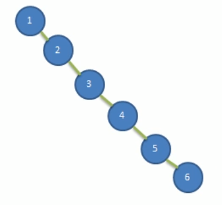

#### 1.1.1. 问题分析
- 左子树全部为空, 从形式上看更像是单链表
- 这种树对插入新结点的速度并不受影响
- 查询速度却会明显下降, 因为要依次比较, 不能发挥 BST 的优势  
  因为每次还要比较左子树, 其查询速度比单链表还要慢

## 2. 平衡二叉树的原理

### 2.1. 基本介绍
- 平衡二叉树也叫平衡二叉搜索树 (Self-balancing binary search tree)  
  又被称为 AVL 树, 可以保证有较高的查询效率  

- 具有如下特点: 
  - 首先它本身是二叉排序树, 是二叉排序树的改进  
  - 它是一棵空树或它的左右两个子树的高度差绝对值好不超过 1  
  - 并且它的左右两个子树都是一棵平衡二叉树

- 平衡二叉树常用的实现方法有: 红黑树, AVL, 替罪羊树, Treap, 伸展树等.  

****

## 3. 左旋转 AVL 树案例
- 要求: 给定数列, 创建出对应的平衡二叉树, `arr = {4,3,6,5,7,8}`

### 3.1. 思路分析
- 首先用数列 `arr = {4,3,6,5,7,8}` 进行构造二叉排序树, 如下图进行排列.  
  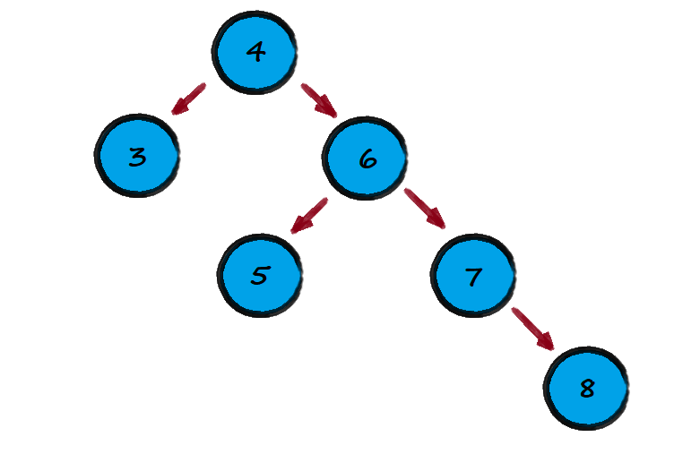 

- 然后问题就出现于此, 此时正常构建的二叉排序树的右子树的高度为 3,  
  左子树的高度则为 1, 并不满足平衡二叉树的定义, 因此要进行左旋转.

#### 3.1.1. 左旋转进行的步骤如下:  
- 创建一个新结点, 权值等于当前二叉树的根结点, 即权值等于 4.   
  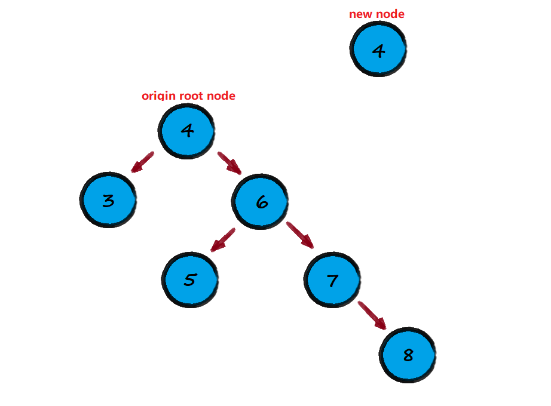
  
- 把新结点的左子结点设置为原根结点的左子结点  
  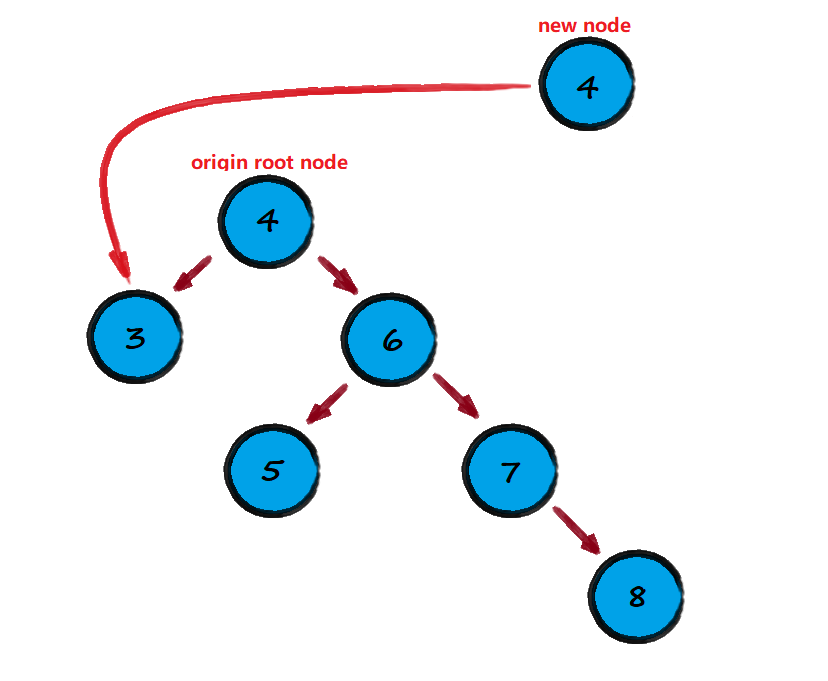

- 把新结点的右子树设置为原根结点的右子结点的左子结点  
  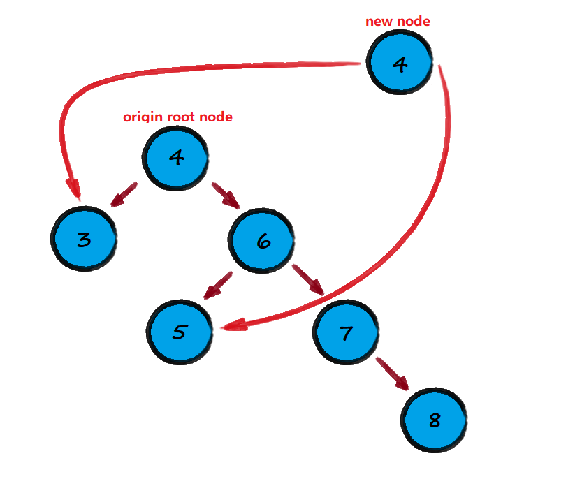

- 把原根结点的权值替换成原根结点的右子结点的权值  
  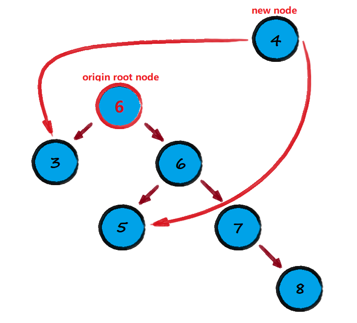  

  位置进行调整和优化  

  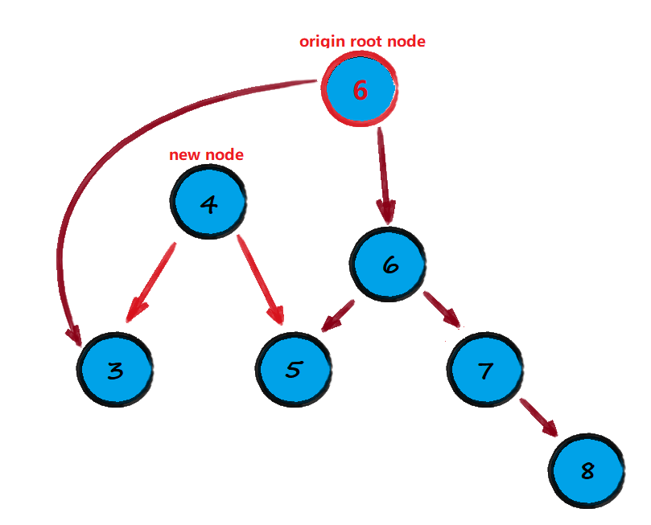

- 把原根结点的右子树设置成其右子结点的右子结点  
  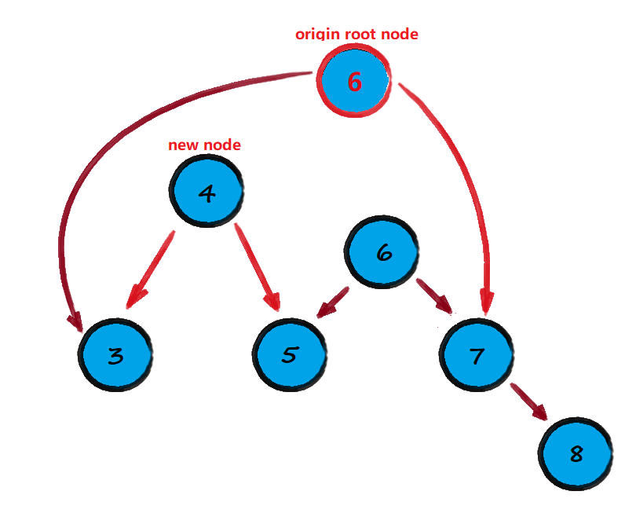
  
- 把原根结点的左子树设置为新结点  
  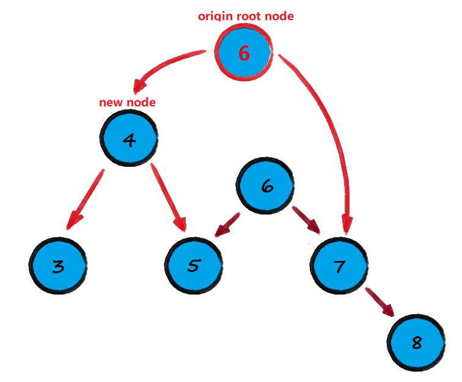

- 调整后得到新的平衡二叉树  
  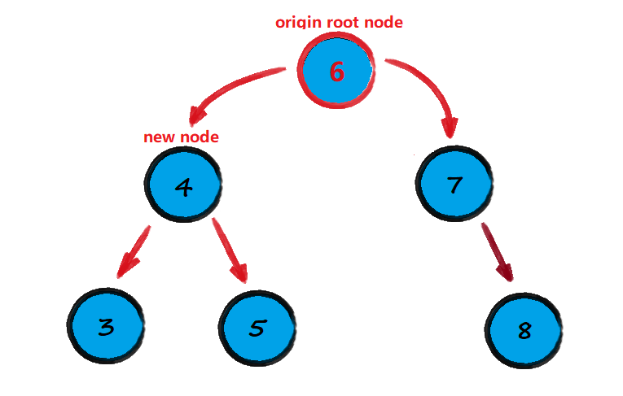
  
****

#### 3.1.2. 注意事项:  
- 在分析过程中左右子树的高度是关键判断是否旋转的标准,  
  当发现左右子树的高度差绝对值大于 1 的时候就进行旋转.  

- 即当新结点进行插入的时候, 若发现二叉树不再是 AVL 树的时候,  
  就根据条件情况进行判断进行左旋转或右旋转.

- 因此在旋转前, 需要统计出二叉树的高度及其左右子树各自的高度

****

## 4. 右旋转 AVL 树案例
- 要求给定数列, 创建出对应的平衡二叉树, `arr = {10,12,8,9,7,6}`

### 4.1. 思路分析
- 首先用数列创建出对应的排序二叉树, 如下图所示.  
  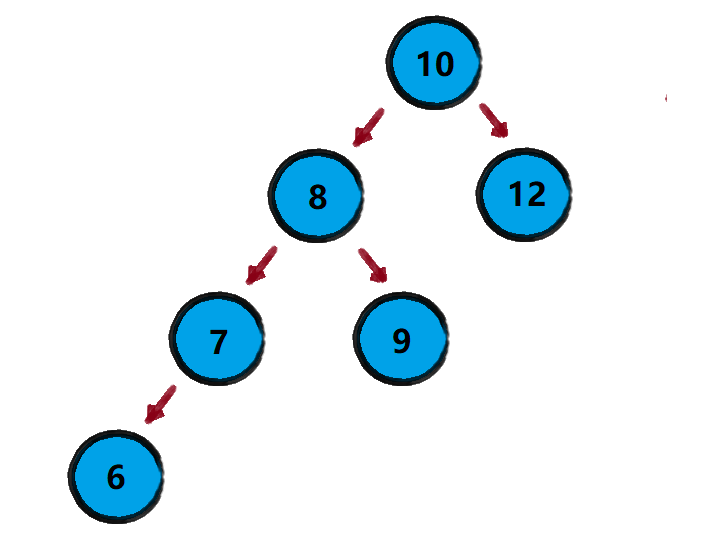

#### 4.1.1. 右旋转步骤如下
- 创建一个新的结点, 权值等于当前二叉树根结点的权值
- 把新的结点的右子结点设置为原根结点的右子结点
- 把新的结点的左子结点设置为原根结点的左子结点的右子结点
- 把原根结点的权值换成原根结点的左子结点的权值
- 把原根结点的左子结点设置为其左子结点的左子结点
- 把原根结点的右子结点设置为新结点
- 最后得出 AVL 树  
  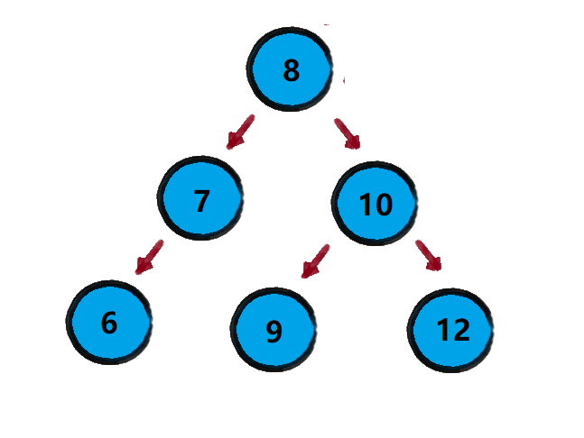

****

## 5. 双旋转 AVL 树
- 在某些情况下单旋转并不能完成平衡二叉树的转换
- 比如数列 `arr = {10,11,7,6,8,9}` 以及数列 `arr = {2,1,6,5,7,3}`
- 如下图分析所示:  
  - 单旋转过后 `arr = {10,11,7,6,8,9}` 并没有成功转换成平衡二叉树
    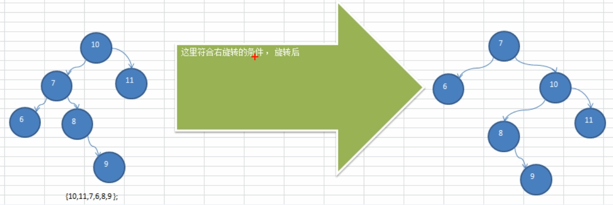

### 5.1. 双旋转情况分析

#### 5.1.1. 情况一
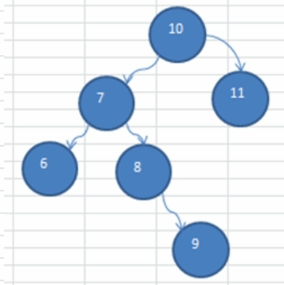  
- 当符合右旋转的条件时
- 若二叉树的左子树的右子树高度大于其左子树的左子树高度
- 则先对这棵二叉树的左子树进行左旋转
- 再对这棵二叉树本身进行右旋转即可

#### 5.1.2. 情况二
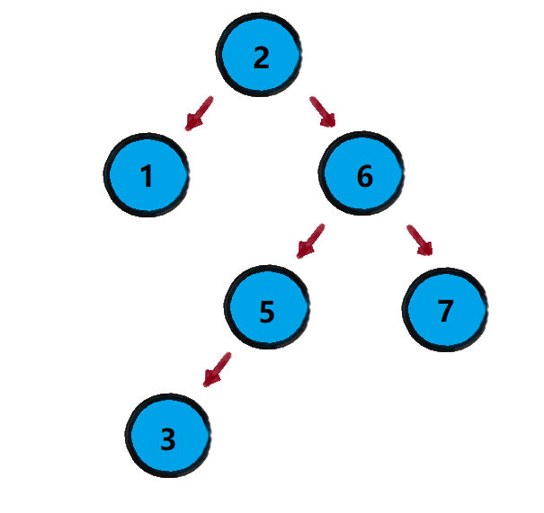  
- 当符合左旋转的条件时
- 若二叉树的右子树的左子树高度大于其右子树的右子树高度
- 则先对这棵二叉树的右子树进行右旋转
- 再对这棵二叉树本身进行左旋转即可

## 6. AVL 树代码实现
- 大部分代码与二叉排序树重合, 但结点类有很大程度更改和新增

### 6.1. 结点类
```java
package com.leo9.dc29.avl_tree;

public class TreeNode {
    public int value;
    public TreeNode left_node;
    public TreeNode right_node;

    public TreeNode(int value) {
        this.value = value;
    }

    //region 添加结点的方法
    //递归形式添加结点, 注意需要满足二叉排序树的要求
    public void addNode(TreeNode new_node) {
        //若传入空结点则直接返回即可
        if (new_node == null) {
            return;
        }

        //region 判断传入的结点的值, 和当前调用方法的结点的值关系
        //如果新结点的值小于等于当前调用结点的值
        if (new_node.value <= this.value) {
            //如果当前调用结点的左子结点为空, 则直接将新结点接在其左子结点即可
            if (this.left_node == null) {
                this.left_node = new_node;
            }
            //如果不为空, 递归向左添加
            else {
                this.left_node.addNode(new_node);
            }
        }
        //如果新结点的值大于当前调用结点的值
        else {
            //如果当前调用结点的右子结点为空, 则直接将新结点接在其右子结点即可
            if (this.right_node == null) {
                this.right_node = new_node;
            }
            //如果不为空, 递归向右添加
            else {
                this.right_node.addNode(new_node);
            }
        }
        //endregion

        /**----------新增部分-----------*/
        //region 判断是否需要左旋转
        //如果 (右子树高度-左子树高度) > 1, 进行左旋转
        if (getRightHeight() - getLeftHeight() > 1) {
            //如果它的右子树的左子树高度大于它的右子树的右子树高度
            //则先对右子树进行一次右旋转, 再执行对二叉树本身的左旋转
            if (right_node != null && right_node.getLeftHeight() > right_node.getRightHeight()) {
                right_node.rightRotate();
            }
            leftRotate();
            return;
        }
        //endregion

        //region 判断是否需要右旋转
        //如果 (左子树高度-右子树高度) > 1, 进行右旋转
        if (getLeftHeight() - getRightHeight() > 1) {
            //如果它的左子树的右子树高度大于它的左子树的左子树高度
            //则先对左子树进行一次左旋转, 再执行对二叉树本身的右旋转
            if (left_node != null && left_node.getRightHeight() > left_node.getLeftHeight()) {
                left_node.leftRotate();
            }
            rightRotate();
            return;
        }
        //endregion
        /**----------------------*/
    }
    //endregion


    @Override
    public String toString() {
        return "TreeNode{" +
                "value=" + value +
                '}';
    }

    //region 中序遍历
    public void infixOrder() {
        if (this.left_node != null) {
            this.left_node.infixOrder();
        }

        System.out.println(this);

        if (this.right_node != null) {
            this.right_node.infixOrder();
        }
    }
    //endregion

    //region 查找要删除的结点

    /**
     * @param node_val 目标结点的value值
     * @return 如果找到目标结点, 则返回目标结点, 否则返回null
     */
    public TreeNode searchTargetNode(int node_val) {
        //与当前调用节点的值进行比较
        //如果相等, 就返回当前调用结点
        if (node_val == this.value) {
            return this;
        }
        //如果小于当前调用结点的值, 则用当前结点的左子结点进行调用查找方法
        else if (node_val < this.value) {
            if (this.left_node != null) {
                return this.left_node.searchTargetNode(node_val);
            } else {
                System.out.println("the target node is not existed!");
                return null;
            }
        }
        //如果大于当前调用结点的值, 则用当前结点的右子结点进行调用查找方法
        else {
            if (this.right_node != null) {
                return this.right_node.searchTargetNode(node_val);
            } else {
                System.out.println("the target node is not existed!");
                return null;
            }
        }
    }
    //endregion

    //region 查找目标结点的父结点

    /**
     * @param node_val 目标结点本身的value值
     * @return 要返回的目标结点的父结点, 如果没有则返回null
     */
    public TreeNode searchParentNode(int node_val) {
        //如果当前结点的左(右)子结点不为空, 且它的左(右)子结点的值就等于目标值, 则当前结点是父结点
        if ((this.left_node != null && this.left_node.value == node_val) || (this.right_node != null && this.right_node.value == node_val)) {
            return this;
        } else {
            //如果查找的值小于等于当前结点的值, 且当前结点的左子结点非空, 则递归向左查找
            if (this.left_node != null && node_val <= this.value) {
                return this.left_node.searchParentNode(node_val);
            }
            //如果查找的值大于当前结点的值, 且当前结点的右子结点非空, 则递归向右查找
            else if (this.right_node != null && node_val > this.value) {
                return this.right_node.searchParentNode(node_val);
            }
            //如果上述条件都不满足, 则找不到父结点
            else {
                return null;
            }
        }
    }
    //endregion

    /**
     * -------------以下是新增部分--------------
     */
    //region 返回以当前结点为根节点的树的高度
    public int getHeight() {
        //递归调用方法获取最大的树的高度, 末尾加一是因为本身结点自己算一层
        return Math.max(left_node == null ? 0 : left_node.getHeight(), right_node == null ? 0 : right_node.getHeight()) + 1;
    }
    //endregion

    //region 返回左子树的高度
    public int getLeftHeight() {
        if (left_node == null) {
            return 0;
        }
        return left_node.getHeight();
    }
    //endregion

    //region 返回右子树的高度
    public int getRightHeight() {
        if (right_node == null) {
            return 0;
        }
        return right_node.getHeight();
    }
    //endregion

    //region 左旋转排序二叉树, 转换为平衡二叉树
    private void leftRotate() {
        //当前结点是根节点, 该方法在增加结点方法中被调用,
        //而在二叉树类中封装好的新增结点方法是由根结点调用的
        //创建新的结点, 以当前节点的权值创建
        TreeNode new_node = new TreeNode(value);
        //把新的结点的左子结点设置成当前结点的左子结点
        new_node.left_node = left_node;
        //把新结点的右子结点设置成当前结点的右子结点的左子结点
        new_node.right_node = right_node.left_node;
        //把当前结点的值替换成其右子结点的值
        value = right_node.value;
        //把当前结点的右子结点设置成当前结点的右子结点的右子结点
        right_node = right_node.right_node;
        //把当前结点的左子结点设置为前面定义的新结点
        left_node = new_node;
    }
    //endregion

    //region 右旋转排序二叉树, 转换为平衡二叉树
    private void rightRotate() {
        //当前结点是根节点, 该方法在增加结点方法中被调用,
        //而在二叉树类中封装好的新增结点方法是由根结点调用的
        TreeNode new_node = new TreeNode(value);
        new_node.right_node = right_node;
        new_node.left_node = left_node.right_node;
        value = left_node.value;
        left_node = left_node.left_node;
        right_node = new_node;
    }
    //endregion
}


```

### 6.2. 二叉树类
```java
package com.leo9.dc29.avl_tree;

public class AVLTree {
    private TreeNode root_node;

    //region 定义添加结点的方法
    public void addNode(TreeNode new_node) {
        //如果根结点为空, 新结点直接成为根结点
        if (root_node == null) {
            root_node = new_node;
        }
        //如果根结点不为空, 则根结点调用增加结点方法
        else {
            root_node.addNode(new_node);
        }
    }
    //endregion

    //region 定义中序遍历方法
    public void infixOrder() {
        if (root_node == null) {
            System.out.println("the tree is null!");
            return;
        }
        root_node.infixOrder();
    }
    //endregion

    //region 查找目标结点方法
    public TreeNode searchTargetNode(int node_val) {
        if (root_node == null) {
            System.out.println("the root node is null!");
            return null;
        } else {
            return root_node.searchTargetNode(node_val);
        }
    }
    //endregion

    //region 查找父结点方法
    public TreeNode searchParentNode(int node_val) {
        if (root_node == null) {
            System.out.println("the root node is null!");
            return null;
        } else {
            return root_node.searchParentNode(node_val);
        }
    }
    //endregion

    //region 删除结点方法
    public void delTargetNode(int node_val) {
        if (root_node == null) {
            System.out.println("the root node is null!");
            return;
        } else {
            //region 先判断目标节点是否存在并且其父结点是否存在
            //1.需要先找到要删除的目标结点是否存在
            TreeNode target_node = searchTargetNode(node_val);
            if (target_node == null) {
                return;
            }

            //2.若target_node存在则查找target_node的父结点是否存在
            //2.1.如果target_node就是根节点
            if (node_val == root_node.value) {
                root_node = null;
            }
            //2.2.若target_node非根节点, 则调用查找父结点方法
            TreeNode parent_node = root_node.searchParentNode(node_val);

            //endregion

            //region 情况1: 删除的是叶子结点
            //如果目标结点的左右子结点都为空, 可以确定它为叶子结点
            if (target_node.left_node == null && target_node.right_node == null) {
                //判断目标结点是父结点的左子结点还是右子结点
                //如果目标结点是父结点的左子结点
                if (parent_node.left_node != null && parent_node.left_node.value == node_val) {
                    parent_node.left_node = null;
                }
                //如果目标结点是父结点的右子结点
                if (parent_node.right_node != null && parent_node.right_node.value == node_val) {
                    parent_node.right_node = null;
                }
            }

            //endregion

            //region 情况3: 删除的是有两个子结点的结点
            //情况3提前是为了少些判断条件, 将剩余情况归类于情况2
            else if (target_node.left_node != null && target_node.right_node != null) {
                //取得右子树最小权值结点的权值, 并在二叉树中删除这个最小权值结点
                int right_min_val = delRightTreeMinNode(target_node);
                //将目标删除结点的权值替换成这个最小权值结点的权值, 即可完成对目标结点的删除
                target_node.value = right_min_val;
            }
            //endregion

            //region 情况2: 删除的是有一个子结点的结点
            else {
                //如果要删除的目标结点有左子结点
                if (target_node.left_node != null) {
                    //如果删除的是根结点, 且恰好根结点下只有一个子结点, 则让子结点成为新的根结点
                    if (parent_node != null) {
                        //如果目标结点是其父结点的左子结点
                        if (parent_node.left_node.value == node_val) {
                            parent_node.left_node = target_node.left_node;
                        }
                        //如果目标结点是其父结点的右子结点
                        else {
                            parent_node.right_node = target_node.left_node;
                        }
                    } else {
                        root_node = target_node.left_node;
                    }
                }
                //如果要删除的目标结点有右子结点
                else {
                    if (parent_node != null) {
                        //如果目标结点是其父结点的左子结点
                        if (parent_node.left_node.value == node_val) {
                            parent_node.left_node = target_node.right_node;
                        }
                        //如果目标结点是其父结点的右子结点
                        else {
                            parent_node.right_node = target_node.right_node;
                        }
                    } else {
                        root_node = target_node.left_node;
                    }
                }
            }
            //endregion
        }
    }
    //endregion

    //region 寻找调用结点右子树下的权值最小结点, 保存其权值并删除结点, 最后返回这个最小权值
    //注意: 是查找以目标结点的右子结点为根节点的右子树下的最小权值结点
    //      因此这棵右子树的最左的叶子结点就是最小权值节点
    public int delRightTreeMinNode(TreeNode the_node) {
        //定义临时结点用以存储最小结点, 后续循环进行替换
        //先假定最小结点是调用结点的右子结点, 即右子树的根节点
        TreeNode min_node = the_node.right_node;
        //循环查找左子结点, 找到最小权值的左子结点
        while (min_node.left_node != null) {
            min_node = min_node.left_node;
        }
        //然后在二叉树中删除这个结点
        delTargetNode(min_node.value);
        //最后返回这个右子树下的最小最小权值
        return min_node.value;
    }
    //endregion

    /**
     * 新增部分
     */
    public TreeNode getRoot() {
        return root_node;
    }
}

```

### 6.3. 测试类
```java
package com.leo9.dc29.avl_tree;

public class TestDemoAVL {
    public static void main(String[] args) {
        //int[] sample_arr = {4, 3, 6, 5, 7, 8};
        int[] sample_arr = {10, 12, 8, 9, 7, 6};
        AVLTree sample_tree = new AVLTree();
        for (int i = 0; i < sample_arr.length; i++) {
            sample_tree.addNode(new TreeNode(sample_arr[i]));
        }

        System.out.println("============================\n" + "the result of infix order");
        sample_tree.infixOrder();

        System.out.println("============================\n" + "the height of the origin binary tree is: " + sample_tree.getRoot().getHeight());
        System.out.println("the height of the origin tree's left child tree is: " + sample_tree.getRoot().getLeftHeight());
        System.out.println("the height of the origin tree's right child tree is: " + sample_tree.getRoot().getRightHeight());


    }
}

```

### 6.4. 测试结果
略...