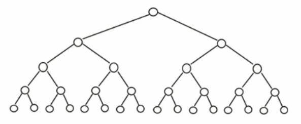
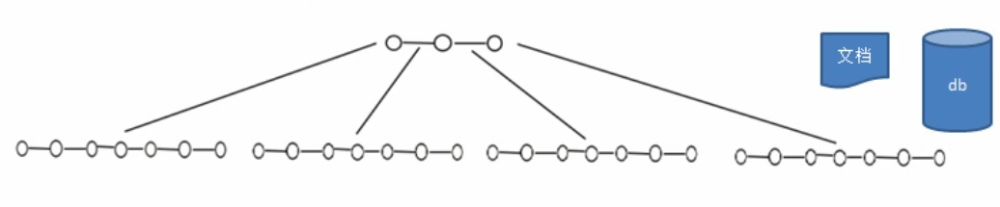
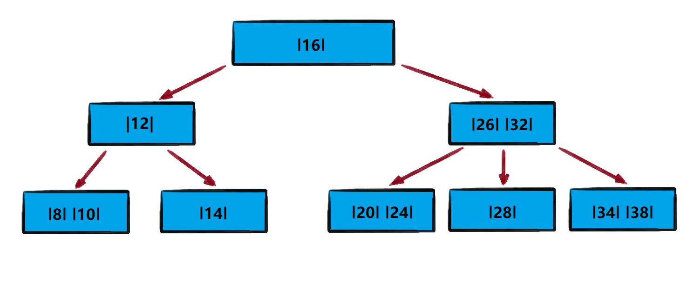
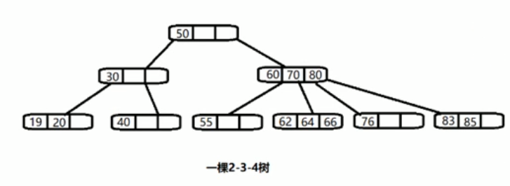
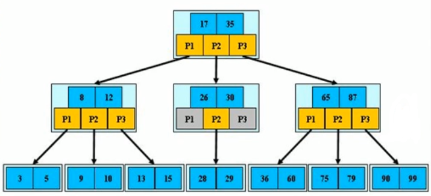
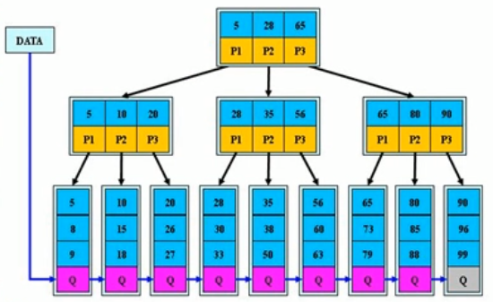
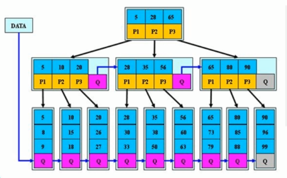

<!-- TOC -->

- [1. 二叉树与 B 树](#1-二叉树与-b-树)
  - [1.1. 二叉树缺陷分析](#11-二叉树缺陷分析)
  - [1.2. 多叉树的概念](#12-多叉树的概念)
  - [1.3. B 树的基本介绍](#13-b-树的基本介绍)
- [2. 2-3 树和 2-3-4 树](#2-2-3-树和-2-3-4-树)
  - [2.1. 2-3 树基本介绍](#21-2-3-树基本介绍)
  - [2.2. 2-3 树应用案例](#22-2-3-树应用案例)
  - [2.3. 2-3-4 树的说明](#23-2-3-4-树的说明)
- [3. B 树, B+ 树和 B* 树](#3-b-树-b-树和-b-树)
  - [3.1. B 树](#31-b-树)
    - [3.1.1. 基本介绍](#311-基本介绍)
    - [3.1.2. B 树的说明](#312-b-树的说明)
  - [3.2. B+ 树](#32-b-树)
    - [3.2.1. 基本介绍](#321-基本介绍)
    - [3.2.2. B+ 树的说明](#322-b-树的说明)
  - [3.3. B* 树](#33-b-树)
    - [3.3.1. 基本介绍](#331-基本介绍)
    - [3.3.2. B* 树的说明](#332-b-树的说明)

<!-- /TOC -->

****
[博主的 Github 地址](https://github.com/leon9dragon)
****

## 1. 二叉树与 B 树

### 1.1. 二叉树缺陷分析
**二叉树的操作效率较高, 但是也存在如下问题**
- 如下给出一棵二叉树作为示例
  - 二叉树高度: 5  
  - 结点数量: 2^5-1 = 31  

- 二叉树需要加载到内存, 如果二叉树的结点少, 则不会有影响  
  但二叉树的结点过多, 例如一亿个结点, 就会出现如下情况:  

  - 情况 1:  
    在构建二叉树时, 需要多次进行 I/O 操作,  
    海量数据存在数据库或文件中, 造成会生成海量结点,  
    对构建二叉树的速度有很大影响.
    
  - 情况 2:  
    当出现海量结点时, 二叉树的高度也会随之增高,  
    当高度变得很高时, 对二叉树的操作速度会变慢.

### 1.2. 多叉树的概念
- 在二叉树中每个结点有数据项, 最多有两个子结点.  

- 如果允许每个结点可以有更多的数据项和子结点, 就是多叉树(multiway tree)

- 多叉树通过重新组织结点, 减少了树的高度, 能对二叉树进行优化.

### 1.3. B 树的基本介绍
  
- B 树通过重新组织结点, 降低树的高度, 并且减少 I/O 读写次数来提升效率.

- 文件系统及数据库系统的设计者利用了磁盘预读原理,  
  将一个结点的大小设为等同于一个页(页的大小通常为 4k)  
  这样每个结点只需要一次 I/O 就可以完全载入

- 将树的度 M 设置为 1024, 在 600 亿个元素中最多只需要四次 I/O 操作  
  就可以读取到想要的元素, B 树 B+ 树广泛应用于文件存储系统及数据库系统中.

## 2. 2-3 树和 2-3-4 树

### 2.1. 2-3 树基本介绍
**2-3 树是最简单的 B 树结构, 具有如下特点:**  
- 2-3 树的所有叶子结点都在同一层(只要是 B 树都满足这个条件)
- 有两个子结点的结点叫二结点, 二结点要么没有子结点, 要么就有两个子结点
- 有三个子结点的结点叫三结点, 三结点要么没有子结点, 要么就有三个子结点
- 2-3 树是由二结点和三结点构成的树

### 2.2. 2-3 树应用案例
- 将数列 `arr = {16,24,12,32,14,26,34,10,8,28,38,20}` 构成 2-3 树, 并保证数据插入的大小顺序.  

- **结点插入规则:**  
  - 2-3 树的所有叶子结点都在同一层(只要是 B 树都满足这个条件)
  
  - 有两个子结点的结点叫二结点, 二结点要么没有子结点, 要么就有两个子结点
  
  - 有三个子结点的结点叫三结点, 三结点要么没有子结点, 要么就有三个子结点

  - 当按照规则插入一个数据到某个结点时, 若不能满足以上三个要求, 就需要拆解,  
    先向上拆解, 如果上层满了, 就拆本层, 拆后仍需满足上述三个要求.  

  - 对于三结点的子树的值大小仍然遵守二叉排序树的规则.

### 2.3. 2-3-4 树的说明
2-3-4 树本质上和 2-3 树类似, 但多了一种类型的结点--四结点.  
此处不再过多介绍.  

## 3. B 树, B+ 树和 B* 树

### 3.1. B 树

#### 3.1.1. 基本介绍
- B-tree 即 B 树, B 代表 balanced, 平衡的意思.  
- 有人会把 B-tree 翻译为 B- 树, 会产生误解, 实际上 B- 树就是 B 树.  
- 前面介绍的 2-3 树和 2-3-4 树, 其实都是 B 树.

  

#### 3.1.2. B 树的说明
- B 树的阶:  
  结点的最大子结点个数. 如 2-3 树的阶是 3, 2-3-4的阶是4.  

- B 树的搜索, 从根结点开始, 对结点内的关键字(有序)序列进行二分查找  
  - 若命中则结束查找, 不再执行下面过程;  
  - 若没命中, 则进入查询关键字所属范围的子结点;  
  - 重复查找步骤, 直到所对应的子结点指针为空, 或已经是叶子结点.

- 关键字集合分布在整棵树中, 即叶子结点和非叶子结点都存放数据.  

- 搜索有可能会在非叶子结点就命中从而结束搜索, 因为每个结点都能存放数据.

- 其搜索性能等价于在关键字全集内做一次二分查找.

### 3.2. B+ 树

#### 3.2.1. 基本介绍
B+ 树是 B 树的变体, 也是一种多路搜索数.

#### 3.2.2. B+ 树的说明
- B+ 树的搜索与 B 树也基本相同, 区别是 B+ 树只有达到叶子节点才命中  
  而 B 树是可在任意结点命中, 其性能等价于在关键字全集做一次二分查找

- 所有关键字都出现在叶子结点的链表中, 即数据只能在叶子节点,  
  也叫稠密索引, 且链表中的关键字(数据)恰好是有序的.  

- 搜索不可能在非叶子结点中命中, 因为只有叶子结点才能存放数据.

- 非叶子结点相当于是叶子结点的索引(稀疏索引),  
  叶子结点相当于是存储(关键字)数据的数据层.  

- B+ 树更适合文件索引系统

- B 树和 B+ 树各有自己的应用场景, 两种树各有优势, 并无优劣之分.

### 3.3. B* 树

#### 3.3.1. 基本介绍
B* 树是 B+ 树的变体, 在 B+ 树的非根和非叶子结点再增加指向兄弟结点的指针.  

#### 3.3.2. B* 树的说明
- B* 树定义的非叶子结点关键字个数至少为 (2/3)*M, 即块的最低使用率为 2/3,  
  而 B+ 树的块的最低使用率为 B+ 树的 1/2.

- 从上面的特点可以看出, B* 树分配新结点的概率比 B+ 树要低, 空间使用率更高.