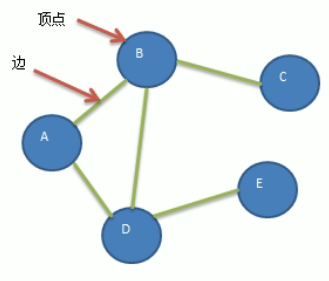

<!-- TOC -->

- [1. 图的概念](#1-图的概念)
  - [1.1. 图的必要性](#11-图的必要性)
  - [1.2. 图的示例](#12-图的示例)
  - [1.3. 图的常用概念](#13-图的常用概念)
  - [1.4. 图的表示方式](#14-图的表示方式)
    - [1.4.1. 邻接矩阵](#141-邻接矩阵)
    - [1.4.2. 邻接表](#142-邻接表)
- [2. 图的实现(邻接矩阵)](#2-图的实现邻接矩阵)
  - [2.1. 图的快速入门案例](#21-图的快速入门案例)
  - [2.2. 代码实现](#22-代码实现)
    - [2.2.1. 邻接矩阵类](#221-邻接矩阵类)
    - [2.2.2. 测试类](#222-测试类)
  - [2.3. 测试结果](#23-测试结果)

<!-- /TOC -->

****
[博主的 Github 地址](https://github.com/leon9dragon)
****

## 1. 图的概念

### 1.1. 图的必要性
- 线性表局限于一个直接前驱和一个直接后继的关系
- 树结构也只能有一个直接前驱即父结点
- 当需要表示多对多的关系时, 需要用到图结构

### 1.2. 图的示例
- 图是一种数据结构, 其结点可以具有零个或多个相邻元素.
- 两个结点之间的连接称为边, 结点也可以称为顶点.  


****

### 1.3. 图的常用概念  
- 顶点(vertex):  
  - 即结点, 如 A,B,C 顶点

- 边(edge):  
  - 两个结点之间的连接即为边

- 路径:
  - 比如从 D 到 C 的路径, 有如下两种:  
    - D->B->C
    - D->A->B->C

- 无向图(如下图):  
  - 无向图的顶点之间的连接没有方向, 如 A 到 B 的路径,  
    即可以是 A->B, 也可以是 B->A



- 有向图(如下图):  
  - 有向图的顶点之间的连接有方向, 比如 A 到 B 的路径,  
    只能是 A->B, 不能 B->A.  


- 带权图(如下图):  
  - 带权图的每条边都带有权值, 带权图也叫做网.  


****

### 1.4. 图的表示方式
- 图的表示方式有两种:  
  - 二维数组表示, 也叫做邻接矩阵
  - 链表表示, 也叫做邻接表

#### 1.4.1. 邻接矩阵

- 邻接矩阵是表示图形中顶点之间相邻关系的矩阵.
- 对于 n 个顶点的图而言, 矩阵是 n 行 n 列的二维数组.  
- 它的 row 和 col 表示的是 1...n 个点.

  

#### 1.4.2. 邻接表

- 邻接矩阵需要为每个顶点都分配 n 条边的空间,  
  实际上有很多边可能是不存在的, 会造成空间浪费.

- 邻接表的实现只关心存在的边, 不关心不存在的边.  
  因此不会造成空间的浪费.  

- 邻接表由数组 + 链表的形式构成.

  

> 关于上述示例的说明: 
> - 标号为 0 的结点的相关联结点为 1, 2, 3, 4  
> - 标号为 1 的结点的相关联结点为 0, 4  
> - 标号为 2 的结点的相关联结点为 0, 4, 5  
> - 标号为 3 的结点的相关联结点为 0, 5  
> - 标号为 4 的结点的相关联结点为 0, 1, 2, 5
> - 标号为 5 的结点的相关联结点为 2, 3, 4

## 2. 图的实现(邻接矩阵)

### 2.1. 图的快速入门案例
- **要求:**   
  代码实现如下图结构.  
    

- **思路分析:**  
  (1)存储顶点: 顶点是 String 类型使用 ArrayList 存储即可  
  (2)保存矩阵: 用 int 类型的二维数组保存即可  

### 2.2. 代码实现

#### 2.2.1. 邻接矩阵类
```java
package com.leo9.dc30.graph;

import java.util.ArrayList;
import java.util.Arrays;

public class GraphMatrix {
    //定义一个 ArrayList 用来存储图中的顶点的数据集合
    private ArrayList<String> graph_vertex_list;
    //定义一个二维数组存储图对应的邻接矩阵
    private int[][] graph_edge_arr;
    //定义变量存储图中的边的数目
    private int edge_num;

    //region 构造器, 参数是顶点数量
    public GraphMatrix(int vertex_num) {
        //初始化邻接矩阵和顶点集合, 边的数目
        //如果顶点有n个, 邻接矩阵就是n*n的矩阵
        graph_edge_arr = new int[vertex_num][vertex_num];
        //定义顶点集合的容量, 和顶点数量一致
        graph_vertex_list = new ArrayList<String>(vertex_num);
        //因为一开始并不知道有多少条边, 初始化的时候为0即可(这一步不写也可以)
        edge_num = 0;
    }
    //endregion

    //region 定义添加结点方法, 参数是结点对应的字符串
    public void insertVertex(String vertex_str) {
        //直接添加到集合即可
        graph_vertex_list.add(vertex_str);
    }
    //endregion

    //region 定义添加边的方法

    /**
     * @param vertex1     结点1在集合中的编号, 即顶点在集合中的下标[0~n]
     * @param vertex2     结点2在集合中的编号, 即顶点在集合中的下标[0~n]
     * @param edge_weight 两个结点之间边的权值, 默认为 0 不连通, 大于 0 就连通
     */
    public void insertEdge(int vertex1, int vertex2, int edge_weight) {
        //因为是无向图. 因此顶点间的两个方向的边都要进行定义
        graph_edge_arr[vertex1][vertex2] = edge_weight;
        graph_edge_arr[vertex2][vertex1] = edge_weight;
        //边产生之后, 边的数目自增
        edge_num++;
    }
    //endregion

    //region 图中常用的方法
    //region 返回结点的个数
    public int getVertexNum(){
        //直接返回顶点集合的size即可
        return graph_vertex_list.size();
    }
    //endregion

    //region 返回边的数目
    public int getEdgeNum(){
        //直接返回边的数目即可
        return edge_num;
    }
    //endregion

    //region 返回结点下标对应的结点数据, 例如 0 号结点对应结点数据为 "A"
    public String getValByIndex(int vertex_index){
        return graph_vertex_list.get(vertex_index);
    }
    //endregion

    //region 返回vertex1和vertex2构成的边的权值
    public int getEdgeWeight(int vertex1, int vertex2){
        //直接返回二维数组的对应下标成员即可
        return graph_edge_arr[vertex1][vertex2];
    }
    //endregion

    //region 显示图所对应的邻接矩阵
    public void showGraphMatrix(){
        for(int[] link : graph_edge_arr){
            System.out.println(Arrays.toString(link));
        }
    }
    //endregion

    //endregion
}

```

#### 2.2.2. 测试类
```java
package com.leo9.dc30.graph;

public class TestGraphMatrix {
    public static void main(String[] args) {
        //结点个数
        int vertex_num = 5;
        //用字符串数组存放结点值
        String[] VertexVal = {"A", "B", "C", "D", "E"};
        //创建图对象
        GraphMatrix graph_matrix = new GraphMatrix(vertex_num);
        //循环添加顶点
        for(String vertex_val: VertexVal){
            graph_matrix.insertVertex(vertex_val);
        }
        //添加边, 因为是无向图, 添加一次即可
        //A-B A-C B-C B-D B-E
        graph_matrix.insertEdge(0,1,1);
        graph_matrix.insertEdge(0,2,1);
        graph_matrix.insertEdge(1,2,1);
        graph_matrix.insertEdge(1,3,1);
        graph_matrix.insertEdge(1,4,1);

        //列印邻接矩阵
        graph_matrix.showGraphMatrix();
    }
}

```

### 2.3. 测试结果
- 直接输出案例图中的邻接矩阵  
  