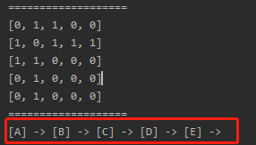

<!-- TOC -->

- [1. 图的深度优先(DFS)算法的原理](#1-图的深度优先dfs算法的原理)
  - [1.1. 图的两种遍历策略](#11-图的两种遍历策略)
  - [1.2. 深度优先遍历基本思想](#12-深度优先遍历基本思想)
  - [1.3. 深度优先遍历算法步骤](#13-深度优先遍历算法步骤)
  - [1.4. 深度优先遍历案例分析](#14-深度优先遍历案例分析)
- [2. 图的深度优先(DFS)算法的代码实现](#2-图的深度优先dfs算法的代码实现)
  - [2.1. 图的邻接矩阵类](#21-图的邻接矩阵类)
  - [2.2. 测试类](#22-测试类)
  - [2.3. 深度优先遍历测试结果](#23-深度优先遍历测试结果)

<!-- /TOC -->

****
[博主的 Github 地址](https://github.com/leon9dragon)
****

## 1. 图的深度优先(DFS)算法的原理

### 1.1. 图的两种遍历策略
- 所谓图的遍历, 就是对结点的访问.
- 遍历图的结点, 一般有两种访问策略:  
  - 深度优先遍历(Depth First Search)
  - 广度优先遍历(Board First Search)

### 1.2. 深度优先遍历基本思想
- 深度优先遍历, 从初始访问结点出发, 初始访问结点可能有多个邻接结点,  
  深度优先遍历的策略就是首先访问第一个邻接结点,  
  然后再以这个被访问的邻接结点作为初始结点, 访问它的第一个邻接结点.  

- 可以这样理解: 每次都在访问完当前结点后首先访问当前结点的第一个邻接结点.

- 因此这种访问策略是优先往纵向挖掘深入,  
  而不是对一个结点的所有邻接结点进行横向访问.

- 显然, 深度优先搜索是一个递归的过程.

### 1.3. 深度优先遍历算法步骤
1) 访问初始结点 V, 并标记结点 V 为已访问.  

2) 查找结点 V 的第一个邻接结点 W.  

3) 若 W 存在, 则执行步骤 4;  
   若 W 不存在, 则返回步骤 1, 将从 V 的下一个结点继续.

4) 若 W 未被访问, 对 W 进行深度优先遍历递归.  
   即把 W 当做另一个 V, 然后执行步骤 1/2/3. 

5) 若 W 已经被访问, 则查找结点 W 的下一个邻接结点, 转到步骤 3.

### 1.4. 深度优先遍历案例分析 
  
**步骤:**  
- 首先设置初始结点是 A, 然后开始遍历, 输出结果为: A;

- A 的下一个邻接结点是 B, A 与 B 之间存在边, 输出结果为: A-B;

- B 结点变为新的初始结点, 对 B 进行深度优先遍历递归,  
  下一个邻接结点则为 C, B 与 C 之间存在边, 输出结果为: A-B-C;

- C 结点成为新的初始结点, 对 C 进行递归遍历,  
  下一个邻接结点为 D, 但不存在边, 因此返回上一步.

- B 结点的下一个结点为 D, B 与 D 之间存在边, 输出结果为: A-B-C-D;

- D 结点成为新的初始结点, 对 D 进行递归遍历,  
  下一个邻接结点为 E, D 与 E 之间存在边, 输出结果为 A-B-C-D-E;  
  
- 至此, 全部结点输出完毕, 遍历结束.

## 2. 图的深度优先(DFS)算法的代码实现
- 从上一篇中的代码中新增即可, 下面给出完整代码.

### 2.1. 图的邻接矩阵类
```java
package com.leo9.dc30.graph;

import java.util.ArrayList;
import java.util.Arrays;

public class GraphMatrix {
    //定义一个 ArrayList 用来存储图中的顶点的数据集合
    private ArrayList<String> graph_vertex_list;
    //定义一个二维数组存储图对应的邻接矩阵
    private int[][] graph_edge_arr;
    //定义变量存储图中的边的数目
    private int edge_num;
    //定义数组来记录某个结点是否已被访问
    private boolean[] isVisited;

    //region 构造器, 参数是顶点数量
    public GraphMatrix(int vertex_num) {
        //初始化邻接矩阵和顶点集合, 边的数目
        //如果顶点有n个, 邻接矩阵就是n*n的矩阵
        graph_edge_arr = new int[vertex_num][vertex_num];
        //定义顶点集合的容量, 和顶点数量一致
        graph_vertex_list = new ArrayList<String>(vertex_num);
        //因为一开始并不知道有多少条边, 初始化的时候为0即可(这一步不写也可以)
        edge_num = 0;
        //定义记录数组的容量
        isVisited = new boolean[vertex_num];
    }
    //endregion

    //region 定义添加结点方法, 参数是结点对应的字符串
    public void insertVertex(String vertex_str) {
        //直接添加到集合即可
        graph_vertex_list.add(vertex_str);
    }
    //endregion

    //region 定义添加边的方法

    /**
     * @param vertex1     结点1在集合中的编号, 即顶点在集合中的下标[0~n]
     * @param vertex2     结点2在集合中的编号, 即顶点在集合中的下标[0~n]
     * @param edge_weight 两个结点之间边的权值, 默认为 0 不连通, 大于 0 就连通
     */
    public void insertEdge(int vertex1, int vertex2, int edge_weight) {
        //因为是无向图. 因此顶点间的两个方向的边都要进行定义
        graph_edge_arr[vertex1][vertex2] = edge_weight;
        graph_edge_arr[vertex2][vertex1] = edge_weight;
        //边产生之后, 边的数目自增
        edge_num++;
    }
    //endregion

    //region 图中常用的方法
    //region 返回结点的个数
    public int getVertexNum() {
        //直接返回顶点集合的size即可
        return graph_vertex_list.size();
    }
    //endregion

    //region 返回边的数目
    public int getEdgeNum() {
        //直接返回边的数目即可
        return edge_num;
    }
    //endregion

    //region 返回结点下标对应的结点数据, 例如 0 号结点对应结点数据为 "A"
    public String getValByIndex(int vertex_index) {
        return graph_vertex_list.get(vertex_index);
    }
    //endregion

    //region 返回vertex1和vertex2构成的边的权值
    public int getEdgeWeight(int vertex1, int vertex2) {
        //直接返回二维数组的对应下标成员即可
        return graph_edge_arr[vertex1][vertex2];
    }
    //endregion

    //region 显示图所对应的邻接矩阵
    public void showGraphMatrix() {
        for (int[] link : graph_edge_arr) {
            System.out.println(Arrays.toString(link));
        }
    }
    //endregion

    //endregion

    //region 深度优先遍历的相关方法
    //region 获取目标结点的第一个邻接结点的下标

    /**
     * @param target 目标结点的下标
     * @return 遍历邻接矩阵找出与目标结点构成边的第一个结点,
     * 有则返回第一个邻接结点下标;
     * 没有则返回 -1.
     */
    public int getFirstNeighbour(int target) {
        for (int i = 0; i < graph_vertex_list.size(); i++) {
            if (graph_edge_arr[target][i] > 0) {
                return i;
            }
        }
        return -1;
    }
    //endregion

    //region 根据目标结点的前一个邻接结点的下标获取下一个邻接结点的下标

    /**
     * @param target        目标结点
     * @param pre_neighbour 目标结点的上一个邻接结点的下标
     * @return 若存在下一个邻接结点, 则返回其下标, 否则返回 -1
     */
    public int getNextNeighbour(int target, int pre_neighbour) {
        for (int i = pre_neighbour + 1; i < graph_vertex_list.size(); i++) {
            if (graph_edge_arr[target][i] > 0) {
                return i;
            }
        }
        return -1;
    }
    //endregion

    //region 深度优先遍历, 第一部分
    private void searchByDepthFirst(boolean[] isVisited, int init_vertex) {
        //先访问第一个结点, 并输出
        System.out.printf("[%s] -> ", getValByIndex(init_vertex));
        //将结点设置成已访问状态
        isVisited[init_vertex] = true;
        //获取初始结点的第一个邻接结点
        int the_neighbour = getFirstNeighbour(init_vertex);
        //判断这个邻接结点是否存在, 存在则开始循环
        while (the_neighbour != -1) {
            //如果这个结点没被访问过, 则递归遍历
            if (!isVisited[the_neighbour]) {
                searchByDepthFirst(isVisited, the_neighbour);
            }
            //如果这个节点已经访问过, 则寻找下一个邻接结点, 并替换当前邻接结点的下标
            else {
                the_neighbour = getNextNeighbour(init_vertex, the_neighbour);
            }
        }
    }
    //endregion

    //region 深度优先遍历, 第二部分
    //重载第一部分的方法, 用作当邻接结点不存在时的递归策略
    //遍历所有的结点, 进行深度优先遍历, 默认初始结点为 0 号结点
    public void searchByDepthFirst() {
        for (int i = 0; i < getVertexNum(); i++) {
            if (!isVisited[i]) {
                searchByDepthFirst(isVisited, i);
            }
        }
    }
    //endregion
    //endregion
}

```

### 2.2. 测试类
```java
package com.leo9.dc30.graph;

public class TestGraphMatrix {
    public static void main(String[] args) {
        //结点个数
        int vertex_num = 5;
        //用字符串数组存放结点值
        String[] VertexVal = {"A", "B", "C", "D", "E"};
        //创建图对象
        GraphMatrix graph_matrix = new GraphMatrix(vertex_num);
        //循环添加顶点
        for(String vertex_val: VertexVal){
            graph_matrix.insertVertex(vertex_val);
        }
        //添加边, 因为是无向图, 添加一次即可
        //A-B A-C B-C B-D B-E
        graph_matrix.insertEdge(0,1,1);
        graph_matrix.insertEdge(0,2,1);
        graph_matrix.insertEdge(1,2,1);
        graph_matrix.insertEdge(1,3,1);
        graph_matrix.insertEdge(1,4,1);

        //列印邻接矩阵
        System.out.println("===================");
        graph_matrix.showGraphMatrix();
        //深度优先遍历
        System.out.println("===================");
        graph_matrix.searchByDepthFirst();
    }
}

```

### 2.3. 深度优先遍历测试结果
- 如下图结果所示, 已成功遍历所有结点.  
