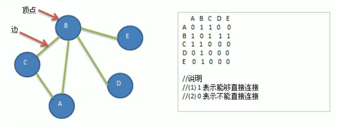

<!-- TOC -->

- [1. 广度优先算法的原理](#1-广度优先算法的原理)
  - [1.1. 广度优先遍历基本思想](#11-广度优先遍历基本思想)
  - [1.2. 广度优先遍历算法步骤](#12-广度优先遍历算法步骤)
  - [1.3. 广度优先遍历案例分析](#13-广度优先遍历案例分析)
- [2. 广度优先算法的代码实现](#2-广度优先算法的代码实现)
  - [2.1. 图的邻接矩阵类](#21-图的邻接矩阵类)
  - [2.2. 测试类](#22-测试类)
  - [2.3. 测试结果](#23-测试结果)

<!-- /TOC -->

****
[博主的 Github 地址](https://github.com/leon9dragon)
****

## 1. 广度优先算法的原理

### 1.1. 广度优先遍历基本思想
- 广度优先遍历(Board First Search)类似于分层搜索.
- 广度优先遍历需要使用一个队列以保存访问过的结点的顺序,  
  以便按照这个顺序来访问这些结点的邻接结点.

### 1.2. 广度优先遍历算法步骤
1) 访问初始节点 V 并标记结点 V 为已访问

2) 结点 V 入队列.

3) 当队列非空时, 继续执行, 否则算法结束.

4) 队列第一个结点出队, 取得队头结点 U.

5) 查找结点 U 的第一个邻接结点 W.

6) 若结点 U 的邻接结点 W 不存在, 则跳转到步骤 3;  
   否则执行以下三个步骤:  
   1) 若结点 W 未被访问, 则访问结点 W 并标记为已访问, 结点 W 入队列;
      若结点 W 已被访问, 直接执行下一步.
   2) 查找结点 U 的继 W 邻接结点后的下一个邻接结点 W;  
   3) 跳转到步骤 6 进行循环执行直到跳出.

### 1.3. 广度优先遍历案例分析
  
- 首先设置初始结点为 A, 结点 A 进入了队列, 输出: A
- 队列中的第一个结点出队, 即结点 A 出列, 并以结点 A 访问其邻接结点
- 访问 A 的第一个邻接结点 B, 发现能够连通, B 进入队列, 输出: A-B
- 访问 A 的下一个邻接结点 C, 发现能够联通, C 进入队列, 输出 A-B-C
- 访问 A 的下一个邻接结点 D, 发现不能联通, 则返回队列.
- 此时队列中第一个结点是结点 B, 因此结点 B 出列, 并以结点 B 来查找其邻接结点
- 访问 B 的邻接结点, A-C 都已经被访问过则继续查询直到出现或没有邻接结点为止
- 访问 B 的下一个邻接结点 D, 发现能够联通, D 进入队列, 输出 A-B-C-D
- 访问 B 的下一个邻接结点 E, 发现能够联通, E 进入队列, 输出 A-B-C-D-E
- 至此, 所有结点均被遍历输出, 遍历结束.

## 2. 广度优先算法的代码实现
- 均在图的基础代码上进行修改

### 2.1. 图的邻接矩阵类
```java
package com.leo9.dc30.graph;

import java.util.ArrayList;
import java.util.Arrays;
import java.util.LinkedList;

public class GraphMatrix {
    //定义一个 ArrayList 用来存储图中的顶点的数据集合
    private ArrayList<String> graph_vertex_list;
    //定义一个二维数组存储图对应的邻接矩阵
    private int[][] graph_edge_arr;
    //定义变量存储图中的边的数目
    private int edge_num;
    //定义数组来记录某个结点是否已被访问
    private boolean[] isVisited;

    //region 构造器, 参数是顶点数量
    public GraphMatrix(int vertex_num) {
        //初始化邻接矩阵和顶点集合, 边的数目
        //如果顶点有n个, 邻接矩阵就是n*n的矩阵
        graph_edge_arr = new int[vertex_num][vertex_num];
        //定义顶点集合的容量, 和顶点数量一致
        graph_vertex_list = new ArrayList<String>(vertex_num);
        //因为一开始并不知道有多少条边, 初始化的时候为0即可(这一步不写也可以)
        edge_num = 0;
    }
    //endregion

    //region 定义添加结点方法, 参数是结点对应的字符串
    public void insertVertex(String vertex_str) {
        //直接添加到集合即可
        graph_vertex_list.add(vertex_str);
    }
    //endregion

    //region 定义添加边的方法

    /**
     * @param vertex1     结点1在集合中的编号, 即顶点在集合中的下标[0~n]
     * @param vertex2     结点2在集合中的编号, 即顶点在集合中的下标[0~n]
     * @param edge_weight 两个结点之间边的权值, 默认为 0 不连通, 大于 0 就连通
     */
    public void insertEdge(int vertex1, int vertex2, int edge_weight) {
        //因为是无向图. 因此顶点间的两个方向的边都要进行定义
        graph_edge_arr[vertex1][vertex2] = edge_weight;
        graph_edge_arr[vertex2][vertex1] = edge_weight;
        //边产生之后, 边的数目自增
        edge_num++;
    }
    //endregion

    //region 图中常用的方法
    //region 返回结点的个数
    public int getVertexNum() {
        //直接返回顶点集合的size即可
        return graph_vertex_list.size();
    }
    //endregion

    //region 返回边的数目
    public int getEdgeNum() {
        //直接返回边的数目即可
        return edge_num;
    }
    //endregion

    //region 返回结点下标对应的结点数据, 例如 0 号结点对应结点数据为 "A"
    public String getValByIndex(int vertex_index) {
        return graph_vertex_list.get(vertex_index);
    }
    //endregion

    //region 返回vertex1和vertex2构成的边的权值
    public int getEdgeWeight(int vertex1, int vertex2) {
        //直接返回二维数组的对应下标成员即可
        return graph_edge_arr[vertex1][vertex2];
    }
    //endregion

    //region 显示图所对应的邻接矩阵
    public void showGraphMatrix() {
        for (int[] link : graph_edge_arr) {
            System.out.println(Arrays.toString(link));
        }
    }
    //endregion

    //endregion

    //region 遍历中用到的通用方法
    //region 获取目标结点的第一个邻接结点的下标

    /**
     * @param target 目标结点的下标
     * @return 遍历邻接矩阵找出与目标结点构成边的第一个结点,
     * 有则返回第一个邻接结点下标;
     * 没有则返回 -1.
     */
    public int getFirstNeighbour(int target) {
        for (int i = 0; i < graph_vertex_list.size(); i++) {
            if (graph_edge_arr[target][i] > 0) {
                return i;
            }
        }
        return -1;
    }
    //endregion

    //region 根据目标结点的前一个邻接结点的下标获取下一个邻接结点的下标

    /**
     * @param target        目标结点
     * @param pre_neighbour 目标结点的上一个邻接结点的下标
     * @return 若存在下一个邻接结点, 则返回其下标, 否则返回 -1
     */
    public int getNextNeighbour(int target, int pre_neighbour) {
        for (int i = pre_neighbour + 1; i < graph_vertex_list.size(); i++) {
            if (graph_edge_arr[target][i] > 0) {
                return i;
            }
        }
        return -1;
    }
    //endregion
    //endregion

    //region 深度优先遍历的相关方法
    //region 深度优先遍历, 第一部分
    //对一个结点进行深度优先遍历
    private void searchByDepthFirst(boolean[] isVisited, int init_vertex) {
        //先访问第一个结点, 并输出
        System.out.printf("[%s] -> ", getValByIndex(init_vertex));
        //将结点设置成已访问状态
        isVisited[init_vertex] = true;
        //获取初始结点的第一个邻接结点
        int the_neighbour = getFirstNeighbour(init_vertex);
        //判断这个邻接结点是否存在, 存在则开始循环
        while (the_neighbour != -1) {
            //如果这个结点没被访问过, 则递归遍历
            if (!isVisited[the_neighbour]) {
                searchByDepthFirst(isVisited, the_neighbour);
            }
            //如果这个节点已经访问过, 则寻找下一个邻接结点, 并替换当前邻接结点的下标
            else {
                the_neighbour = getNextNeighbour(init_vertex, the_neighbour);
            }
        }
    }
    //endregion

    //region 深度优先遍历, 第二部分
    //重载第一部分的方法, 用作当邻接结点不存在时的递归策略
    //遍历所有的结点, 进行深度优先遍历, 默认初始结点为 0 号结点
    public void searchByDepthFirst() {
        //定义记录数组的容量
        isVisited = new boolean[graph_vertex_list.size()];
        for (int i = 0; i < getVertexNum(); i++) {
            if (!isVisited[i]) {
                searchByDepthFirst(isVisited, i);
            }
        }
    }
    //endregion
    //endregion

    //region 广度优先遍历相关方法
    //region 广度优先遍历, 第一部分
    //对一个节点进行广度优先遍历
    private void searchByBoardFirst(boolean[] isVisited, int init_vertex) {
        //定义变量用以存放队列第一个结点的下标
        int first_in_queue;
        //定义变量用以存放邻接结点的下标
        int neighbour_vertex;
        //定义队列用以存储结点访问顺序
        LinkedList queue = new LinkedList();
        //输出访问结果
        System.out.printf("[%s] -> ", getValByIndex(init_vertex));
        //将结点标记为已访问
        isVisited[init_vertex] = true;
        //将结点加入队列尾部
        queue.addLast(init_vertex);
        //当队列不为空, 则开始循环出队找邻接结点
        while (!queue.isEmpty()) {
            //取出队列中第一个结点
            first_in_queue = (Integer) queue.removeFirst();
            //取出队列中第一个结点的第一个邻接结点下标
            neighbour_vertex = getFirstNeighbour(first_in_queue);
            //当邻接结点存在时
            while (neighbour_vertex != -1) {
                //如果邻接结点没有被访问过, 已被访问则跳过
                if (!isVisited[neighbour_vertex]) {
                    //输出这个邻接结点, 将其标记已访问并将其放入队列
                    System.out.printf("[%s] -> ", getValByIndex(neighbour_vertex));
                    isVisited[neighbour_vertex] = true;
                    queue.addLast(neighbour_vertex);
                }
                //继续查找下一个邻接结点, 并替换当前邻接结点的下标
                neighbour_vertex = getNextNeighbour(first_in_queue, neighbour_vertex);
            }
        }
    }
    //endregion
    //region 广度优先遍历, 第二部分
    //对所有结点都进行广度优先遍历
    public void searchByBoardFirst(){
        //定义记录数组的容量
        isVisited = new boolean[graph_vertex_list.size()];
        for (int i = 0; i < getVertexNum(); i++) {
            if (!isVisited[i]) {
                searchByBoardFirst(isVisited, i);
            }
        }
    }
    //endregion
    //endregion
}

```

### 2.2. 测试类
```java
package com.leo9.dc30.graph;

public class TestGraphMatrix {
    public static void main(String[] args) {
        //结点个数
        int vertex_num = 5;
        //用字符串数组存放结点值
        String[] VertexVal = {"A", "B", "C", "D", "E"};
        //创建图对象
        GraphMatrix graph_matrix = new GraphMatrix(vertex_num);
        //循环添加顶点
        for(String vertex_val: VertexVal){
            graph_matrix.insertVertex(vertex_val);
        }
        //添加边, 因为是无向图, 添加一次即可
        //A-B A-C B-C B-D B-E
        graph_matrix.insertEdge(0,1,1);
        graph_matrix.insertEdge(0,2,1);
        graph_matrix.insertEdge(1,2,1);
        graph_matrix.insertEdge(1,3,1);
        graph_matrix.insertEdge(1,4,1);

        //列印邻接矩阵
        System.out.println("===================");
        graph_matrix.showGraphMatrix();
        //深度优先遍历
        //System.out.println("===================");
        //graph_matrix.searchByDepthFirst();
        //广度优先遍历
        System.out.println("===================");
        graph_matrix.searchByBoardFirst();
    }
}

```

### 2.3. 测试结果
- 如下图输出结果所示, 成功将所有的结点都遍历了一次.  
  