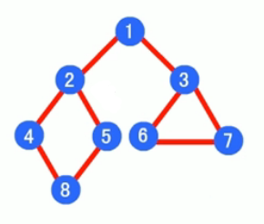
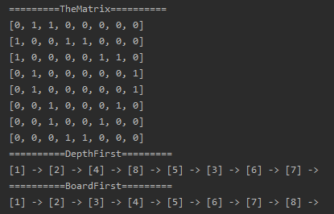

<!-- TOC -->

- [1. 图的深度优先与广度优先的对比](#1-图的深度优先与广度优先的对比)
  - [1.1. 测试类代码](#11-测试类代码)
  - [1.2. 测试结果](#12-测试结果)

<!-- /TOC -->

****
[博主的 Github 地址](https://github.com/leon9dragon)
****

## 1. 图的深度优先与广度优先的对比
- 用如下图进行示例, 让遍历结果更有区分度  
  

### 1.1. 测试类代码
- 图类的代码用上一篇的代码即可
```java
package com.leo9.dc30.graph;

public class TestGraphMatrix {
    public static void main(String[] args) {
        //结点个数
        int vertex_num = 8;
        //用字符串数组存放结点值
        String[] VertexVal = {"1", "2", "3", "4", "5", "6", "7", "8"};
        //创建图对象
        GraphMatrix graph_matrix = new GraphMatrix(vertex_num);
        //循环添加顶点
        for (String vertex_val : VertexVal) {
            graph_matrix.insertVertex(vertex_val);
        }
        //添加边, 因为是无向图, 添加一次即可
        //A-B A-C B-C B-D B-E
        graph_matrix.insertEdge(0, 1, 1);
        graph_matrix.insertEdge(0, 2, 1);
        graph_matrix.insertEdge(1, 3, 1);
        graph_matrix.insertEdge(1, 4, 1);
        graph_matrix.insertEdge(2, 5, 1);
        graph_matrix.insertEdge(2, 6, 1);
        graph_matrix.insertEdge(3, 7, 1);
        graph_matrix.insertEdge(4, 7, 1);
        graph_matrix.insertEdge(5, 6, 1);

        //列印邻接矩阵
        System.out.println("=========TheMatrix==========");
        graph_matrix.showGraphMatrix();
        //深度优先遍历
        System.out.println("==========DepthFirst=========");
        graph_matrix.searchByDepthFirst();
        //广度优先遍历
        System.out.println();
        System.out.println("==========BoardFirst=========");
        graph_matrix.searchByBoardFirst();
    }
}

```

### 1.2. 测试结果
- 通过结果可以看出:
  - 深度优先是纵向逐个递进的遍历  
  - 广度优先是横向一层一层的遍历  
  
