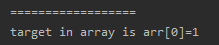
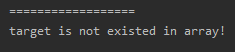

<!-- TOC -->

- [1. 二分查找算法(非递归)](#1-二分查找算法非递归)
  - [1.1. 基本介绍](#11-基本介绍)
  - [1.2. 思路分析](#12-思路分析)
  - [1.3. 代码实现](#13-代码实现)
  - [1.4. 测试结果](#14-测试结果)

<!-- /TOC -->

****
[博主的 Github 地址](https://github.com/leon9dragon)
****

## 1. 二分查找算法(非递归)

### 1.1. 基本介绍
- 前面介绍过的二分查找方式是利用递归进行查找的,  
  下面将使用非递归的方式来实现二分查找算法.

- 二分查找只适用于从有序的数列中进行查找,  
  比如数字和字母等, 需要将数列排序后再进行查找.

- 二分查找法的运行时间为对数时间 O(log<sub>2</sub>n),  
  即查找到需要的目标位置最多只需要 log<sub>2</sub>n 步,  
  假设从[0,99]的队列(100个数, 即 n=100)中寻到目标 30,  
  则需要查找步数为 log<sub>2</sub>100, 即最多需要找 7 次(2<sup>6</sup><100<2<sup>7</sup>)

### 1.2. 思路分析
- 以数组 `arr={1,3,8,10,11,67,100}` 为例, 用非递归方式实现二分查找.
- 思路和前面的二分查找一样, 不再赘述.

### 1.3. 代码实现
```java
package com.leo9.dc31.binary_search_without_recursion;

public class BinarySearchWR {
    public static void main(String[] args) {
        int[] arr = {1, 3, 8, 10, 11, 67, 100};
        int target = 1;
        int res = searchTarget(arr, target);
        if (res != -1) {
            System.out.println("==================");
            System.out.printf("target in array is arr[%d]=%d", res, arr[res]);
        } else {
            System.out.println("==================");
            System.out.println("target is not existed in array!");
        }
    }

    //二分查找的非递归实现

    /**
     * @param arr    待查找的数组
     * @param target 需要查找的目标数
     * @return 返回目标在数组中的下标, 若目标不存在于数组, 返回 -1
     */
    public static int searchTarget(int[] arr, int target) {
        //查找范围的左右两端的下标
        int left = 0;
        int right = arr.length - 1;
        //若左右边界不重合或交错, 则继续查找, 直到出现目标或找不到为止
        while (left <= right) {
            //找到数组中间元素的下标
            int mid = (left + right) / 2;
            //如果数组中间元素与目标相等, 则直接返回下标
            if (arr[mid] == target) {
                return mid;
            }
            //如果数组中间元素大于目标, 则右边界从中间元素的上一位开始, 向左查找
            else if (arr[mid] > target) {
                right = mid - 1;
            }
            //如果数组中间元素小于目标, 则左边界从中间元素的下一位开始, 向右查找
            else {
                left = mid + 1;
            }
        }
        //若最终找不到, 则返回 -1
        return -1;
    }
}

```

### 1.4. 测试结果
**以数组 `arr={1,3,8,10,11,67,100}` 为例**

- 设置目标为 1  
    

- 设置目标为 17  
  