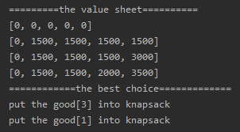

<!-- TOC -->

- [1. 动态规划算法的原理](#1-动态规划算法的原理)
  - [1.1. 动态规划算法应用场景-背包问题](#11-动态规划算法应用场景-背包问题)
  - [1.2. 动态规划算法介绍](#12-动态规划算法介绍)
- [2. 动态规划算法解决背包问题](#2-动态规划算法解决背包问题)
  - [2.1. 思路分析](#21-思路分析)
    - [2.1.1. 背包问题的概念](#211-背包问题的概念)
    - [2.1.2. 背包问题解决过程图解](#212-背包问题解决过程图解)
    - [2.1.3. 背包问题解决思路](#213-背包问题解决思路)
  - [2.2. 代码实现](#22-代码实现)
  - [2.3. 测试结果](#23-测试结果)

<!-- /TOC -->

****
[博主的 Github 地址](https://github.com/leon9dragon)
****

## 1. 动态规划算法的原理

### 1.1. 动态规划算法应用场景-背包问题
- 有一个背包, 容量为 4 磅, 现有如下物品:
  
|物品|重量|价格|
|--|--|--|
|吉他(G)|1|1500|
|音响(S)|4|3000|
|电脑(L)|3|2000|

- 要求达到的目标为装入的背包的总价值最大
- 要求装入背包的物品重量不能超出背包容量
- 要求装入的物品不能重复

### 1.2. 动态规划算法介绍
- 动态规划(Dynamic Programming)算法的核心思想是:  
  将大问题划分为小问题进行解决, 进而一步步获取最优解的处理算法.

- 动态规划算法与分治算法类似, 基本思想也是将待求解问题分解成若干个子问题,  
  先求解子问题, 然后从这些子问题的解得到原问题的解.  

- 与分治算法不同的是, 适用于动态规划求解的问题,  
  经分解得到子问题往往不是互相独立的.  
  即下一个子阶段的求解是建立在上一个子阶段的解的基础上, 进行进一步的求解.

- 动态规划可以通过填表的方式来逐步推进, 得到最优解.

## 2. 动态规划算法解决背包问题

### 2.1. 思路分析

#### 2.1.1. 背包问题的概念
- 背包问题主要指的是一个给定容量的背包和若干具有一定价值和重量的物品,  
  如何选择物品放入背包从而使物品的价值最大.

- 背包问题有分为 01 背包和完全背包两种
  - 01 背包: 每个物品最多只能放一个
  - 完全背包: 每种物品都有无限件可放
  - 完全背包是可以转化为 01 背包的.

#### 2.1.2. 背包问题解决过程图解
|物品|重量|价格|
|--|--|--|
|吉他(G)|1|1500|
|音响(S)|4|3000|
|电脑(L)|3|2000|

- 解决背包问题可以分解成一个个小问题进行解决
- 假设存在背包容量大小分别为 1/2/3/4 的各种容量的背包
- 分配容量的规则为最小重量的整数倍

|物品|0 磅|1 磅|2 磅|3 磅|4 磅|
|--|--|--|--|--|--|
|零个(N)|0|0|0|0|0|
|吉他(G)|0|1500(G)|1500(G)|1500(G)|1500(G)|
|音响(S)|0|1500(G)|1500(G)|1500(G)|3000(S)|
|电脑(L)|0|1500(G)|1500(G)|2000(L)|1500+2000(G+L)|

0) 假如一个物品都没有, 如表格第一行所示:  
   - 背包内物品价值始终为 0;

1) 假如只有"吉他(G)"一种物品, 如表格第二行所示:  
   - 这时不管背包容量多大, 都只能放一个吉他;

2) 假如有"吉他(G)"和"音响(S)", 如表格第三行所示:  
   - 当背包容量是 1-3 磅时, 都只能放入一把吉他;
   - 当背包容量是 4 磅时, 由于音响价值比吉他大, 因此放入音响;

3) 假如"吉他(G)"和"音响(S)""电脑(L)"都有, 如表格第四行所示:  
   - 当背包容量是 1-2 磅时, 都只能放入一把吉他;
   - 当背包容量是 3 磅时, 电脑价值更高, 因此放入电脑;
   - 当背包容量是 4 磅时, 吉他和电脑价值比音响高, 因此放入前者组合;

#### 2.1.3. 背包问题解决思路
- 算法的主要思想是利用动态规划解决.

- 设定 i 表示为可选的物品数量. 以上表中 i = 1 时, 只有吉他一个物品;  
  i = 2 时表示有吉他和音响; i = 3 时, 表示吉他音响电脑都可选.

- 对于给定的 n 个物品, 设 value[i] 和 weight[i] 两个数组,  
  分别为 i 个物品的价值和重量, 设定 C 为背包的容量.  

- 每次遍历物品数量 i 都会加一, 根据 value[i] 和 weight[i] 来确定是否需要将物品放入包中.  

- 再令 val_sheet[i][j] 表示在前 i 个物品中能够装入容量为 j 的背包中的最大价值.  

- 一维数组对应 物品|重量|价格 表, 二维数组对应 分治表.

- 因此会得出以下结果:  
  - `val_sheet[i][0] = val_sheet[0][j] = 0`,  
    表示填入表第一行和第一列是 0;  
  
  - 当 `weight[i] > j` ,  
    `val_sheet[i][j] = val_sheet[i-1][j]`;  
    即当准备加入的商品所需容量大于当前背包的容量时,  
    就直接使用当前格同一列的上一单元格的最大价值.  
    因为上一格的最大价值是对当前容量的最优选择.
  
  - 当 `j >= weight[i]` 时,  
    `val_sheet[i][j] = max{val_sheet[i-1][j], val_sheet[i-1][j-weight[i]]+value[i]}`,  
    当准备加入的商品所需容量小于等于当前背包的容量,  
    需要在上一最优选和当前选择之间进行比较, 取最大值.  
    `val_sheet[i-1][j]` 表示上一最优选;  
    `value[i] + val_sheet[i-1][j-weight[i]]` 表示当前选择.  
    value[i] 表示最新一种可选商品的价值,  
    val_sheet[i-1][j-weight[i]] 表示在放入最新商品后所剩容量的情况下,  
    可以放入的其余商品的最大价值.  


### 2.2. 代码实现
- 实现详情都在注解当中

```java
package com.leo9.dc33.knapsack_problem;

import java.util.Arrays;

public class KnapsackProblem {
    public static void main(String[] args) {
        //定义数组保存物品的重量
        int[] good_weight = {1, 4, 3};
        //定义数组保存物品的价值
        int[] good_value = {1500, 3000, 2000};
        //定义背包的容量
        int max_capacity = 4;
        //定义物品的个数, 直接获取上述任意数组长度即可
        int good_amount = good_weight.length;

        //定义一个对应的二维数组, 保存商品存放情况
        int[][] store_path = new int[good_amount + 1][max_capacity + 1];

        //创建二维数组, 表示分治表.
        //value_sheet[i][j] 的含义是:
        //表示前 i 个物品中能够放入容量为 j 的背包中的最大价值
        int[][] value_sheet = new int[good_amount + 1][max_capacity + 1];

        //初始化分治表第一行和第一列, 如果初始化为 0 可以不写, 以下展示过程;
        //第一行对应的是 0 个物品可选时的背包价值, 都为 0
        //第一列对应的是背包容量为 0 时的背包价值, 都为 0
        for (int i = 0; i < max_capacity; i++) {
            //第一行
            value_sheet[0][i] = 0;
        }
        for (int i = 0; i < good_amount; i++) {
            //第一列
            value_sheet[i][0] = 0;
        }

        //根据公式进行动态规划处理
        //第一层循环是抓取的行数, 但不处理第一行, 第一行已经初始化定义了
        //第二层循环是抓取的列数, 但不处理第一列, 第一列也已经初始化定义
        //因此临时变量 i 和 j 都是从 1 开始的.
        for (int i = 1; i < value_sheet.length; i++) {
            for (int j = 1; j < value_sheet[0].length; j++) {
                //程序中的 i 对应的是二维数组, 要与一维数组对应需要减一
                if (good_weight[i - 1] > j) {
                    value_sheet[i][j] = value_sheet[i - 1][j];
                } else {
                    //value_sheet[i][j] = Math.max(value_sheet[i - 1][j], good_value[i - 1] + value_sheet[i - 1][j - good_weight[i - 1]]);
                    //因为要记录商品存放情况, 不能用上面公式进行简单取值, 改为 if..else..形式
                    //用两个变量存储上一最优解和当前选择的价值
                    int last_choice = value_sheet[i - 1][j];
                    int now_choice = good_value[i - 1] + value_sheet[i - 1][j - good_weight[i - 1]];
                    //开始判断当前选择的价值和上一最优解的大小
                    //选出最大价值在分治表中进行记录, 并在另一张表中记录下存储的商品的编号
                    if (last_choice < now_choice) {
                        value_sheet[i][j] = now_choice;
                        store_path[i][j] = 1;
                    } else {
                        value_sheet[i][j] = last_choice;
                    }
                }
            }
        }


        //打印表格
        for (int[] row : value_sheet) {
            System.out.println(Arrays.toString(row));
        }
        
        //输出最佳原目标结果, 本质上是取的几个最优解的组合
        int i = store_path.length - 1;
        int j = store_path[0].length - 1;
        while (i > 0 && j > 0) {
            if (store_path[i][j] == 1) {
                System.out.printf("put the good[%d] into knapsack\n", i);
                j -= good_weight[i - 1];
            }
            i--;
        }
    }
}

```

### 2.3. 测试结果
