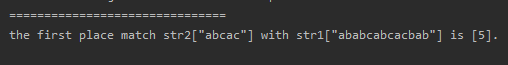

<!-- TOC -->

- [1. 暴力匹配算法的原理](#1-暴力匹配算法的原理)
  - [1.1. 暴力匹配算法应用场景-字符串匹配问题](#11-暴力匹配算法应用场景-字符串匹配问题)
  - [1.2. 暴力匹配算法解决思路](#12-暴力匹配算法解决思路)
    - [1.2.1. 暴力匹配的缺点](#121-暴力匹配的缺点)
  - [1.3. 暴力匹配算法的实现](#13-暴力匹配算法的实现)
  - [1.4. 暴力匹配算法测试结果](#14-暴力匹配算法测试结果)

<!-- /TOC -->

****
[博主的 Github 地址](https://github.com/leon9dragon)
****

## 1. 暴力匹配算法的原理

### 1.1. 暴力匹配算法应用场景-字符串匹配问题
1) 有一个字符串 `str1 = "ababcabcacbab"` 和 `str2 = "abcac"`  
     
2) 现在要盘对 str1 中是否包含 str2:  
   - 如果存在, 就返回 str2 在 str 1 中第一次出现的位置;  
   - 如果不存在, 就返回 -1;

### 1.2. 暴力匹配算法解决思路
假设现在 str1 匹配到了 i 位置, str2 匹配到了 j 位置, 则有如下情况:  
- 如果当前字符匹配成功, 即`str1[i] == str2[j]`,  
  则 `i++; j++;` 然后继续匹配下一个字符串.

- 如果匹配失败, 即`str1[i] != str2[j]`,  
  则令 `i=i-j+1; j=0;`, 相当于每次失败的时候 i 回溯,  
  然后 i 再加一到匹配前位置的下一位, 然后 j 重置为 0.

#### 1.2.1. 暴力匹配的缺点
用暴力匹配去解决字符串匹配的话, 会产生大量的回溯,  
每次匹配只移动了一位, 若是匹配不成功, 才移动到下一位,  
整一个匹配下来需要耗费大量的时间, 并不推荐可行.

### 1.3. 暴力匹配算法的实现
```java
package com.leo9.dc34.string_match;

public class ViolentMatch {
    public static void main(String[] args) {
        String str1 = "ababcabcacbab";
        String str2 = "abcac";
        int res_of_match = violentMatch(str1, str2);
        if (res_of_match == -1) {
            System.out.println("===============================");
            System.out.println("failed to match!");
        } else {
            System.out.println("===============================");
            System.out.printf("the first place match str2[\"%s\"] with str1[\"%s\"] is [%d].\n", str2, str1, res_of_match);
        }

    }

    public static int violentMatch(String str1, String str2) {
        //将字符串转化为字符数组
        char[] str1_array = str1.toCharArray();
        char[] str2_array = str2.toCharArray();

        //获取字符串的长度
        int str1_length = str1_array.length;
        int str2_length = str2_array.length;

        //定义两个索引分别指向两个字符串
        int str1_index = 0;
        int str2_index = 0;

        //开始循环匹配, 索引没有越界就一直循环
        while (str1_index < str1_length && str2_index < str2_length) {
            //当前字符匹配成功, 索引自加后移
            if (str1_array[str1_index] == str2_array[str2_index]) {
                str1_index++;
                str2_index++;
            }
            //当前字符匹配失败, str1的索引回溯并后移一位, str2的索引重置为零
            else {
                str1_index = str1_index - str2_index + 1;
                str2_index = 0;
            }
        }
        //根据 str2 的索引的位置来判断字符串匹配是否成功完成
        if (str2_index == str2_length) {
            //匹配成功则返回第一次str2在str1中出现的位置
            return str1_index - str2_index;
        }
        //匹配失败则返回 -1
        return -1;
    }
}

```


### 1.4. 暴力匹配算法测试结果
