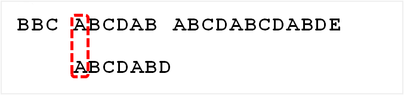

<!-- TOC -->

- [1. 字符串查找算法(KMP)的原理](#1-字符串查找算法kmp的原理)
  - [1.1. 基本介绍](#11-基本介绍)
  - [1.2. 算法应用](#12-算法应用)
  - [1.3. 算法思路 - next 数组部分](#13-算法思路---next-数组部分)
    - [1.3.1. next 数组作用](#131-next-数组作用)
    - [1.3.2. next 数组的创建和获取](#132-next-数组的创建和获取)
    - [1.3.3. next 数组创建图解](#133-next-数组创建图解)
    - [1.3.4. 获取 next 数组方法的代码](#134-获取-next-数组方法的代码)
  - [1.4. 算法思路 - KMP 算法匹配部分](#14-算法思路---kmp-算法匹配部分)
    - [1.4.1. 模式串和文本串的匹配过程](#141-模式串和文本串的匹配过程)
    - [1.4.2. 模式串文本串匹配图解](#142-模式串文本串匹配图解)
    - [1.4.3. KMP算法匹配过程的代码](#143-kmp算法匹配过程的代码)
- [2. 字符串查找算法(KMP)的实现和优化](#2-字符串查找算法kmp的实现和优化)
  - [2.1. 完整代码实现](#21-完整代码实现)
  - [2.2. 测试结果](#22-测试结果)
  - [2.3. 关于 next 数组获取的优化](#23-关于-next-数组获取的优化)
    - [2.3.1. 优化后的 next 数组获取方法](#231-优化后的-next-数组获取方法)

<!-- /TOC -->

****
[博主的 Github 地址](https://github.com/leon9dragon)
****

## 1. 字符串查找算法(KMP)的原理

### 1.1. 基本介绍
- KMP 是一个解决模式串在文本串是否出现过的经典算法,  
  它可以返回模式串在文本串中最早出现的位置的结果.

- Knuth-Morris-Pratt 字符串查找算法, 简称为"KMP"算法,  
  常用于在一个文本串 S 内查找一个模式串 P 出现的位置,  
  这个算法由 D.E.Knuth, J.H.Morris 和 V.R.Pratt 三人  
  于 1977 年联合发表, 因此取由这三人的姓氏命名此算法.

- KMP 算法可以利用之前判断过的信息, 通过一个 next 数组,  
  保存模式串中前后最常公共子序列的长度, 每次回溯时,  
  通过 next 数组找到前面匹配过的位置, 省去了大量的时间.

### 1.2. 算法应用
- **字符串匹配问题:**  
  - 有一个文本串 `S="BBC ABCDAB ABCDABCDABDE"` 和一个模式串 `P="ABCDABD"`
  
  - 现在要判断 S 是否有 P, 如果存在则返回第一次出现的位置, 否则返回 -1.

****  

### 1.3. 算法思路 - next 数组部分

#### 1.3.1. next 数组作用
- next 数组用于在模式串和文本串进行匹配时引导模式串指针的指向.
- 首先创建一个 next 数组, 数组长度和模式串字符数量一致.
- next 数组首位初始化为 -1, 用于当字符匹配失败时,  
  如果模式串的指针指向了 next 数组的首位, 会对指针产生新的引导,  
  此时模式串的指针指向模式串首位, 让文本串的指针指向下一位.  

- 一般情况下如果模式串和文本串字符匹配失败, 假设以下情况:  
  - 文本串现在指向了 i 位置, 模式串指向了 j 位置.
  - 则 i 保持不变, j 指针改变指向, 让 j = next[j], 重定向.
  - 改变了 j 指针指向模式串的位置后, 再用新指向位置的字符进行匹配
  - 如果匹配继续失败, 则继续改变指向, 直到 j 指向 next[0]
  - 若指向了 next 数组的 0 号位, 则 j 指针重置为 0, i 后移一位.

- 如果匹配成功则会出现以下情况:  
  - 文本串现在指向了 i 位置, 模式串指向了 j 位置.
  - 如果 S[i] == P[j], i 和 j 一直后移
  - 当匹配完成 i 和 j 都越界, 终止匹配

#### 1.3.2. next 数组的创建和获取
- 这里创建的 next 数组后续可以进一步优化(文末给出优化方法),  
  这个是初始的较为容易理解的版本.  

- 首先创建两个指针, 一个指针用于指向模式串的字符, 一个指针用于进行比较.

- 初始化 next 数组, 长度与模式串字符数相同, 初始化指针 k = -1, j = 0.

- 然后开始循环进行比较, 循环条件是 j 都小于模式串的长度 -1,  
  因为 j 是先自加后再用来给 next 数组赋值, 为防止越界因此上限是模式串长度 -1,  
  然后会出现以下 3 种情况:  
  - 当指针 k 的指向为 -1 或模式串中 P[k] == P[j] 时:  
    先让指针 k 和 j 进行自加, 然后令 next[j] = k;  
    即如果 k=0, j=n, 如果模式串从 n 位开始有 m 位与模式串从 0 位到 m 位相同,  
    则 next[j] 从 n 到 n+m 位一直自增,  
    让 next 数组记录下除去当前位之前的字符串前缀和后缀有多少位相同,  
    然后利用这个位数即可跳到指向前缀最后一个相同位的下一位.
  
  - 当以上两个条件不符合的时候, k 指针需要重定向:  
    k = next[k], 即利用 next 数组本身进行自递推,  
    这种情况是利用自身前缀作为模式串后缀作为文本串的形式进行匹配,  
    当不匹配的时候, k 指向前缀中和后缀重复位最后一位的下一位再匹配.

- 当 k 和 j 指针越界时, 循环跳出, next 数组也完成获取.

#### 1.3.3. next 数组创建图解
- 如果给定的模式串是:"ABCDABD", 从左至右遍历整个模式串,  
  其各个子串的前缀后缀分别如下表格所示:  
  

- 可以根据这个获取的最大公共元素长度表来取的 next 数组,  
  将最大长度表逐位右移, 首位设置为 -1, 即可取得 next 数组.  
  

- 右移的原理是最大公共元素长度是当前位作为后缀最后一位和  
  与之等长的前缀进行匹配取的长度,  
  长度是从一开始的, 而数组下标是从零开始的,  
  因此这个长度放到模式串的字符数组中,  
  对应的就是匹配的前缀最后一位的下一位,  
  即如果重新匹配模式串前面部分可以避开重复匹配的字符,  
  从非重复位开始进行新的匹配.  
  因此想要让不匹配位的指针跳转到非重复位,  
  则将最大公共元素长度表逐位右移即可取的每一位所对应的非重复位,  
  
- next 数组获取的原理就是这样的, 因此才需要两个指针进行错位比较.  
  如下图所示, 下图就是 k 指针和 j 指针在 next 数组生成过程中的  
  每一个字符匹配过程中指针 k 和指针 j 所对应的数值, 配合匹配过程进行理解:  
  

#### 1.3.4. 获取 next 数组方法的代码
```java
    //定义获取 next 数组的方法
    public static int[] getNextArray(String P) {
        //先将模式串 P 转换成字符数组
        char[] char_array_P = P.toCharArray();
        //定义next数组, 长度和字符数组的长度一致, 初始化第一位为 -1
        int[] next_array = new int[char_array_P.length];
        next_array[0] = -1;
        //定义两个指针, k 指针初始化 -1, j 指针初始化 0;
        //k 指针用来可重定向的指向数组位与 j 指针指向位进行比较
        //j 指针用于逐位后移指向数组每一位与 k 指针指向位进行比较
        int pointer_k = -1;
        int pointer_j = 0;
        //开始循环比较, j 要小于字符数组长度减一, 防止越界, 因为 j 是先自增再被用于 next 数组赋值
        while (pointer_j < char_array_P.length - 1) {
            //当指针 k 的指向为 -1 或模式串中 P[k] == P[j] 时
            if (pointer_k == -1 || char_array_P[pointer_k] == char_array_P[pointer_j]) {
                pointer_k++;
                pointer_j++;
                next_array[pointer_j] = pointer_k;
            }
            //当以上两个条件不符合的时候, k 指针需要重定向
            else {
                pointer_k = next_array[pointer_k];
            }
        }
        //最终返回 next 数组
        return next_array;
    }
```
****

### 1.4. 算法思路 - KMP 算法匹配部分

#### 1.4.1. 模式串和文本串的匹配过程
- 创建两个指针, i 指针对应文本串 S, j 指针对应模式串 P.  

- 初始化 i 和 j 指针, `i = 0, j = 0`.

- 开始循环, 循环条件是 i 小于文本串长度, 且 j 小于模式串长度.

- 如果 `j = -1`, 或者当前字符匹配成功, 即 `S[i] == P[j]`,  
  都令 `i++`, `j++`, 继续匹配下一个字符;

- 如果 `j != -1`, 且当前字符匹配失败, 即 `S[i] != P[j]`,  
  则令 i 不变, 令 j 指针进行重定向, `j = next[j]`.  
  即失配时, 模式串 P 的指针前移到前缀中与后缀相同位的最后一位的下一位,  
  然后重新开始进行匹配, 避免了对相同位的重复匹配.

#### 1.4.2. 模式串文本串匹配图解
- 文本串 `S="BBC ABCDAB ABCDABCDABDE"` 和模式串 `P="ABCDABD"` 进行匹配.

- 现已取得模式串的 next 数组, 如下图所示:  
  

- 初始化 i 和 j 指针, `i = 0, j = 0`.
  
  

- 最开始匹配时 P[0] 跟 S[0] 匹配失败.  
  - 此时 `j != -1`, 且当前字符失配 `S[i] != P[j]`, 则令 i 不变, `j = next[j]`.  
  - 再次进行匹配
  - 此时 `j = -1`, 则令 `i++, j++`, 得到 `i = 1, j = 0`,  
    此时 i 指针发生了移位指向了下一位, j 指针被重置为 0,  
    然后 P[0] 继续跟 S[1] 匹配. 

- P[0] 跟 S[1] 又失配, j 再次等于-1, i 指针和 j 指针继续自增,  
  从而 P[0] 跟S[2] 匹配. 

- P[0] 跟 S[2] 失配后, P[0] 又跟 S[3] 匹配. 

- P[0] 跟 S[3] 再失配, P[0] 继续跟下一位 S[4] 匹配.   



- P[0] 跟 S[4] 匹配成功,  
  当前字符匹配成功, 即 `S[i] == P[j]`, 则令 `i++, j++`.  
  此时 i 指针和 j 指针同时发生移位, 开始下一位 P[1] 和 S[5] 的匹配.


- P[1] 跟 S[5] 匹配成功, P[2]跟S[6]也匹配成功, ...,  
  直到当匹配到 P[6] 处的字符 D 时失配, 即S[10] != P[6],  
  此时 j 指针要根据 next 数组进行重定向, `j = next[j]`,  
  而 P[6] 处的 D 对应的 next 数组成员为 `next[6] = 2`,  
  因此 `j = 2`, 所以下一步用 P[2] 处的字符 C 继续跟 S[10] 匹配.

  

- P[2] 处的 C 再次失配, 由于 C 对应的 next 值为 0,  
  所以下一步用 P[0] 处的字符 A 继续跟 S[10] 匹配.

  

- P[0] 处的字符 A 跟 S[10] 的空格不匹配,  
  此时 i 指针后移一位, j 指针继续重置为 0.  
  下一步则是 P[0] 处的字符跟 S[11] 的字符匹配.

  

- P[6] 处的 D 再次失配, 因为 P[6] 对应的 next 值为2,  
  故下一步用 P[2] 继续跟文本串当前位字符 C 匹配.


- 最终发现匹配成功, 过程结束. 此时指针 j 也越界, 等于模式串长度.  
  
- 返回的值为 `res = i-j`, 对应的是第一次匹配成功的字符数组下标.  
  
- 若要换成字符串对应的第几个字符, 则返回 `res = i-j`,  
  因为数组下标是从 0 开始的, 指针也是, 指针直接相减即可得到对应下标,  
  而对应字符位置是从 1 开始的, 因此需要在下标的数值上加一.
  
#### 1.4.3. KMP算法匹配过程的代码

```java
    //定义KMP算法匹配字符串
    public static int matchByKMP(String S, String P) {
        //获取 next 数组
        int[] next_array = getNextArray(P);

        System.out.println("===========the next array===========");
        System.out.println(Arrays.toString(next_array));

        //先将字符串都转换成字符数组
        char[] char_array_S = S.toCharArray();
        char[] char_array_P = P.toCharArray();

        //定义两个指针, i 和 j 初始化都为 0
        int pointer_i = 0;
        int pointer_j = 0;

        //开始循环进行匹配, 循环条件是 i 小于文本串字符数组 S 的长度
        //以及 j 小于模式串字符数组 P 的长度, 越界则结束
        while (pointer_i < char_array_S.length && pointer_j < char_array_P.length) {
            //如果 j = -1, 或者当前字符匹配成功, 则 i j 指针后移, 继续匹配
            if (pointer_j == -1 || char_array_S[pointer_i] == char_array_P[pointer_j]) {
                pointer_j++;
                pointer_i++;
            }
            //匹配失败, 则 j 指针需要重定位
            else {
                pointer_j = next_array[pointer_j];
            }
        }

        //最后循环结束, 如果 j 指针越界, 说明匹配成功, 则第一次匹配成功的位置就在 i 指针剪去 j 指针的地方
        if (pointer_j == char_array_P.length) {
            return pointer_i - pointer_j;
        }
        //匹配失败返回 -1
        else {
            return -1;
        }
    }
```

****

## 2. 字符串查找算法(KMP)的实现和优化

### 2.1. 完整代码实现
- 实现细节请看代码注释
  
```java
package com.leo9.dc35.kmp_match;

import java.util.Arrays;

public class KMPMatch {
    public static void main(String[] args) {
        String S = "BBC ABCDAB ABCDABCDABDE";
        String P = "ABCDABD";
        int res = matchByKMP(S, P);
        System.out.println("===========the result of match===========");
        if (res != -1) {
            //指向字符串中的第几个字符从一开始, 而 res 是字符数组的下标从零开始, 因此加一即可.
            System.out.printf("success! the position in string is [%d]\n", res + 1);
        } else {
            System.out.println("failed! can not match!");
        }
    }

    //定义获取 next 数组的方法
    public static int[] getNextArray(String P) {
        //先将模式串 P 转换成字符数组
        char[] char_array_P = P.toCharArray();
        //定义next数组, 长度和字符数组的长度一致, 初始化第一位为 -1
        int[] next_array = new int[char_array_P.length];
        next_array[0] = -1;
        //定义两个指针, k 指针初始化 -1, j 指针初始化 0;
        //k 指针用来可重定向的指向数组位与 j 指针指向位进行比较
        //j 指针用于逐位后移指向数组每一位与 k 指针指向位进行比较
        int pointer_k = -1;
        int pointer_j = 0;
        //开始循环比较, j 要小于字符数组长度减一, 防止越界, 因为 j 是先自增再被用于 next 数组赋值
        while (pointer_j < char_array_P.length - 1) {
            //当指针 k 的指向为 -1 或模式串中 P[k] == P[j] 时
            if (pointer_k == -1 || char_array_P[pointer_k] == char_array_P[pointer_j]) {
                pointer_k++;
                pointer_j++;
                next_array[pointer_j] = pointer_k;
            }
            //当以上两个条件不符合的时候, k 指针需要重定向
            else {
                pointer_k = next_array[pointer_k];
            }
        }
        //最终返回 next 数组
        return next_array;
    }

    //定义KMP算法匹配字符串
    public static int matchByKMP(String S, String P) {
        //获取 next 数组
        int[] next_array = getNextArray(P);

        System.out.println("===========the next array===========");
        System.out.println(Arrays.toString(next_array));

        //先将字符串都转换成字符数组
        char[] char_array_S = S.toCharArray();
        char[] char_array_P = P.toCharArray();

        //定义两个指针, i 和 j 初始化都为 0
        int pointer_i = 0;
        int pointer_j = 0;

        //开始循环进行匹配, 循环条件是 i 小于文本串字符数组 S 的长度
        //以及 j 小于模式串字符数组 P 的长度, 越界则结束
        while (pointer_i < char_array_S.length && pointer_j < char_array_P.length) {
            //如果 j = -1, 或者当前字符匹配成功, 则 i j 指针后移, 继续匹配
            if (pointer_j == -1 || char_array_S[pointer_i] == char_array_P[pointer_j]) {
                pointer_j++;
                pointer_i++;
            }
            //匹配失败, 则 j 指针需要重定位
            else {
                pointer_j = next_array[pointer_j];
            }
        }

        //最后循环结束, 如果 j 指针越界, 说明匹配成功, 则第一次匹配成功的位置就在 i 指针剪去 j 指针的地方
        if (pointer_j == char_array_P.length) {
            return pointer_i - pointer_j;
        }
        //匹配失败返回 -1
        else {
            return -1;
        }
    }
}

```
****

### 2.2. 测试结果  
- 程序输出结果  
   

- 实际字符第一次成功匹配对应位置  
  

- 因此可见模式串和文本串匹配成功

****

### 2.3. 关于 next 数组获取的优化
- 如果用之前的 next 数组方法求模式串 "abab" 的 next 数组,  
  可得其 next 数组为 `-1 0 0 1`. (`0 0 1 2` 整体右移一位, 初值赋为 -1).  

- 当它跟下图中的文本串 "abacababc" 去匹配的时候,  
  发现b跟c失配, 于是模式串指针重定位 `j = 2`.  
  


- 重定位后再次得到字符 b, 字符 b 又跟 c失配.  
- 事实上, 因为在上一步的匹配中, 已经得知 `p[3] = b`, 与 `s[3] = c` 失配. 
- 而指针 j 重定位后, 让 p[ next[3] ] = p[1] = b 再跟s[3]匹配时, 必然失配.  
  


- 因此再重定位过程中不该出现 `p[j] = p[ next[j] ]`, 否则会造成再次失配,  
  而且这个再次失配是已知的能避免的重复失配, 所以在获取 next 数组时需要优化.  

- 优化的方式是, 如果重定向位和失配位的字符是一样的,  
  则重定向位应该指向重定向位自身的重定向位, 相当于再递归一次,  
  不过这种优化方式只能防止一次重复失配, 不排除有多个相同位.

#### 2.3.1. 优化后的 next 数组获取方法
```java
//定义优化后的获取 next 数组的方法
public static int[] getNextArray(String P) {
    //先将模式串 P 转换成字符数组
    char[] char_array_P = P.toCharArray();
    //定义next数组, 长度和字符数组的长度一致, 初始化第一位为 -1
    int[] next_array = new int[char_array_P.length];
    next_array[0] = -1;
    //定义两个指针, k 指针初始化 -1, j 指针初始化 0;
    //k 指针用来可重定向的指向数组位与 j 指针指向位进行比较
    //j 指针用于逐位后移指向数组每一位与 k 指针指向位进行比较
    int pointer_k = -1;
    int pointer_j = 0;
    //开始循环比较, j 要小于字符数组长度减一, 防止越界, 因为 j 是先自增再被用于 next 数组赋值
    while (pointer_j < char_array_P.length - 1) {
        //当指针 k 的指向为 -1 或模式串中 P[k] == P[j] 时
        if (pointer_k == -1 || char_array_P[pointer_k] == char_array_P[pointer_j]) {
            pointer_k++;
            pointer_j++;

            //============优化的地方====================
            //如果重定向位的字符和失配位字符并不一样, 则直接指向重定向位
            if (char_array_P[pointer_j] != char_array_P[pointer_k]) {
                next_array[pointer_j] = pointer_k;
            }
            //如果重定向位的字符和失配位字符一样, 则继续递归跳转到重定向位的重定向位
            //(但这种方式只能防一层重复失配)
            else {
                next_array[pointer_j] = next_array[pointer_k];
            }
            //==========================================
        }
        //当以上两个条件不符合的时候, k 指针需要重定向
        else {
            pointer_k = next_array[pointer_k];
        }
    }
    //最终返回 next 数组
    return next_array;
}
```