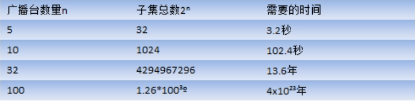
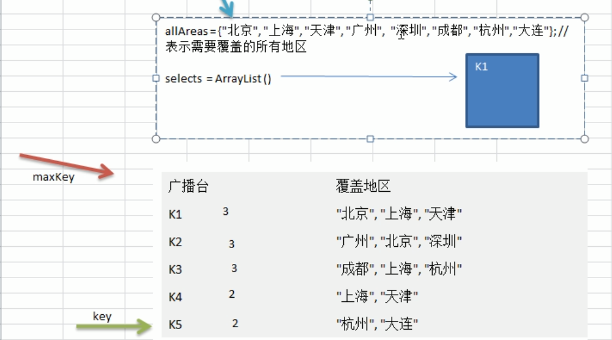
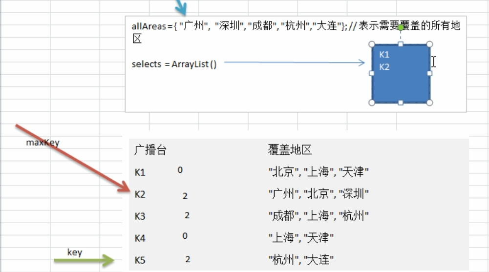
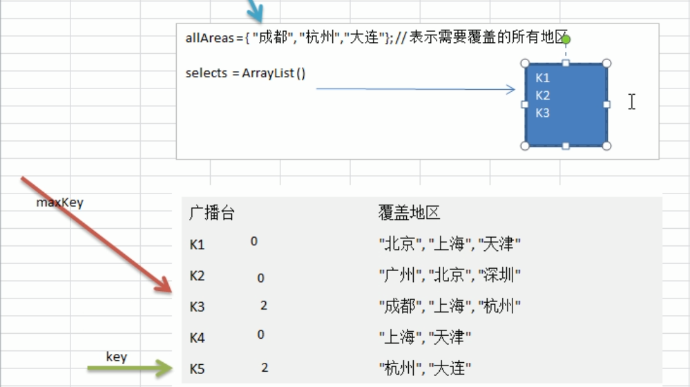
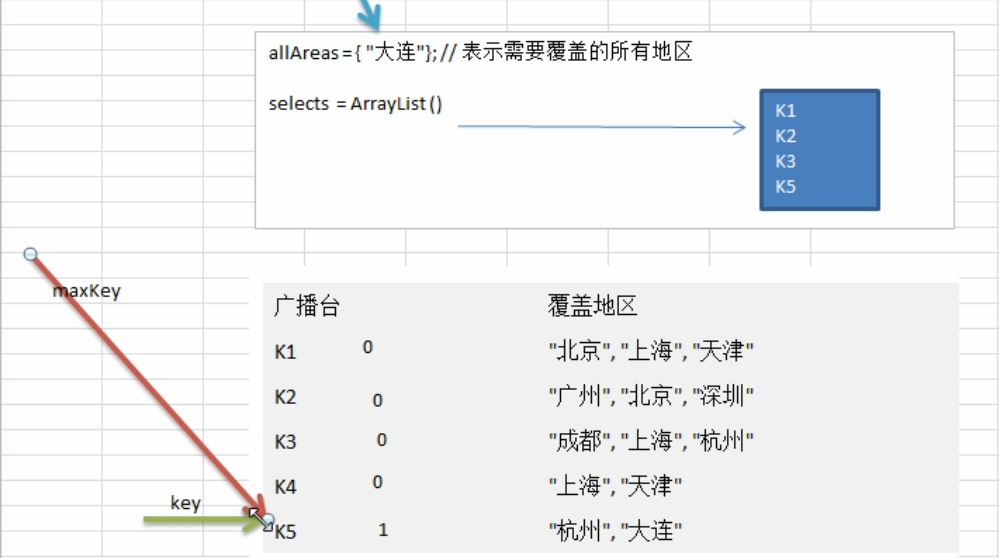
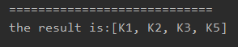

<!-- TOC -->

- [1. 贪心算法的原理](#1-贪心算法的原理)
  - [1.1. 应用场景-集合覆盖问题](#11-应用场景-集合覆盖问题)
  - [1.2. 基本介绍](#12-基本介绍)
  - [1.3. 穷举法解决集合覆盖的可行性](#13-穷举法解决集合覆盖的可行性)
  - [1.4. 贪心算法解决集合覆盖的思路分析](#14-贪心算法解决集合覆盖的思路分析)
  - [1.5. 贪心算法解决集合覆盖的步骤图解](#15-贪心算法解决集合覆盖的步骤图解)
- [2. 贪心算法解决集合覆盖问题的实现](#2-贪心算法解决集合覆盖问题的实现)
  - [2.1. 代码实现](#21-代码实现)
  - [2.2. 测试结果](#22-测试结果)
  - [2.3. 注意事项](#23-注意事项)

<!-- /TOC -->

****
[博主的 Github 地址](https://github.com/leon9dragon)
****

## 1. 贪心算法的原理

### 1.1. 应用场景-集合覆盖问题
- 假设存在下面需要付费的广播台, 以及广播信号可以覆盖的区域.  
- 如何选择最少的广播台, 让所有的地区都可以收到信号?

|广播台|覆盖地区|
|--|--|
|K1|北京, 上海, 天津|
|K2|广州, 北京, 深圳|
|K3|成都, 上海, 杭州|
|K4|上海, 天津|
|K5|杭州, 大连|

### 1.2. 基本介绍
1) 贪婪算法(贪心算法)是指在对问题进行求解时, 在每一步采取最好或最优的选择,  
   从而希望能够导致结果是最好或者最优(即最有利)的算法.

2) 贪婪算法所得到的结果不一定是最优的结果(有时候会是最优解),  
   但是都是相对近似(接近)最优解的结果.


### 1.3. 穷举法解决集合覆盖的可行性
- 可以通过穷举法找出覆盖所有地区的广播台的集合.  

- 列出每个可能的广播台的集合, 这杯成为幂集.  

- 假设总的有 n 个广播台, 则广播台的组合总共有 2<sup>n</sup>-1 个

- 假设每秒能计算十个子集, 如下图所示:   
    

- 可以看出, 用穷举法效率非常的低并不推荐.

### 1.4. 贪心算法解决集合覆盖的思路分析
- 使用贪婪算法, 效率高, 目前并没有算法可以快速计算得到准备的值,  
  使用贪心算法则可以得到非常接近的解, 并且效率高.

- 选择策略上, 因为需要覆盖全部地区的最小集合:  
  (1) 遍历所有的广播电台, 找到一个覆盖了最多未覆盖的地区的电台  
  (此电台可能包含一些已覆盖的地区, 但并不影响后续)  

  (2) 将这个电台加入到一个集合中(例如 ArrayList),   
  然后想办法把该电台覆盖的地区在下次比较时去掉.  

  (3) 重复第一个步骤直到覆盖了所有的地区.  

### 1.5. 贪心算法解决集合覆盖的步骤图解
- 首先定义地点集合 `allAreas={北京, 上海, 天津, 广州, 深圳, 成都, 杭州, 大连}`  
  该集合表示需要覆盖的所有地区.  

- 定义两个指针, 一个指针用于指向地点集合中的成员,  
  另一个指针则用于指向广播台覆盖区域的成员,  
  后面将会用指针对两者进行比较.  

- 再定义一个选择集合`selectList`, 用于记录每一次遍历得到的最大结果.

- 在第一轮遍历中:
     

  -  K1 是拥有最大覆盖区域的电台, 因此加入选择集合中.  
  
  - 同时在加入完后, 在地点集合中去掉 K1 中所包含的地点.  
    新的地点集合变为 `allAreas={广州, 深圳, 成都, 杭州, 大连}`  

- 在第二轮的遍历当中:  
     

  - K1 所包含的地点变为 0, 因为在地点集合中的地点已经改变,  
    因此 K1 中的地点并没有覆盖到地点集合中的地点, 所以为 0.  
  
  - K2 在这一轮是拥有最大覆盖区域的电台, 将 K2 加入到选择集合中.  

  - 并在地点集合中去掉 K2 所包含的地点. 新的地点集合变为 `allAreas={成都, 杭州, 大连}`.

- 在第三轮遍历当中:    
    

  - K3 是这一轮拥有最大的覆盖区域的电台, 因此将 K3 加入到选择集合当中.  
  
  - 并在地点集合中去掉 K3 所包含的地点. 新的地点集合变为 `allAreas={大连}`.

- 在第四轮遍历当中:  
    

  - K5 是这一轮中拥有最大的覆盖区域的电台, 因此将 K5 加入到选择集合当中.  

  - 并在地点集合中去掉 K5 所包含的地点. 新的地点集合变为 `allAreas={}`.  

  - 此时地点集合变成空集合, 因此全部区域都覆盖到了, 结束算法.

- 最终获得的结果如最后一轮的图所示为 `[K1, K2, K3, K5]`.


## 2. 贪心算法解决集合覆盖问题的实现

### 2.1. 代码实现
- 实现细节请看代码注释
  
```java
package com.leo9.dc36.greedy_algorithm;

import javax.management.MXBean;
import java.util.ArrayList;
import java.util.HashMap;
import java.util.HashSet;

public class GreedyAlgorithm {
    public static void main(String[] args) {
        //创建广播电台, 放到Map中
        HashMap<String, HashSet<String>> broadcast = new HashMap<String, HashSet<String>>();
        //定义各个电台, 并将各个电台放入到broadcast中
        HashSet<String> hashSet1 = new HashSet<String>();
        hashSet1.add("北京");
        hashSet1.add("上海");
        hashSet1.add("天津");

        HashSet<String> hashSet2 = new HashSet<String>();
        hashSet2.add("广州");
        hashSet2.add("北京");
        hashSet2.add("深圳");

        HashSet<String> hashSet3 = new HashSet<String>();
        hashSet3.add("成都");
        hashSet3.add("上海");
        hashSet3.add("杭州");

        HashSet<String> hashSet4 = new HashSet<String>();
        hashSet4.add("上海");
        hashSet4.add("天津");

        HashSet<String> hashSet5 = new HashSet<String>();
        hashSet5.add("杭州");
        hashSet5.add("大连");

        broadcast.put("K1", hashSet1);
        broadcast.put("K2", hashSet2);
        broadcast.put("K3", hashSet3);
        broadcast.put("K4", hashSet4);
        broadcast.put("K5", hashSet5);

        //定义地点集合存放所有的地区
        HashSet<String> all_areas = new HashSet<String>();
        all_areas.add("北京");
        all_areas.add("上海");
        all_areas.add("天津");
        all_areas.add("广州");
        all_areas.add("深圳");
        all_areas.add("成都");
        all_areas.add("杭州");
        all_areas.add("大连");

        //定义选择集合存放将来选择要加入的电台
        ArrayList<String> selectList = new ArrayList<String>();

        //定义临时集合, 存放遍历过程中的电台覆盖的区域和当前地点集合的交集
        HashSet<String> temp_set = new HashSet<String>();

        //定义 maxKey, 保存在一次遍历过程中能够覆盖最大未覆盖地区对应电台的key
        //如果 maxKey 不为 null, 则会加入到选择集合当中
        String max_key = null;

        while (all_areas.size() != 0) {
            //开始遍历, 如果地点集合的成员数量不为 0, 则表示还没覆盖到所有区域
            //每次循环前需要将 max_key 置空, 防止空指针异常
            max_key = null;

            //遍历电台列表, 取出对应的电台key
            for (String now_key : broadcast.keySet()) {
                //每次遍历前也需要将临时集合清空一次
                temp_set.clear();
                //取出当前key能够覆盖的区域
                HashSet<String> key_areas = broadcast.get(now_key);
                //在临时集合中加入当前key所覆盖的区域
                temp_set.addAll(key_areas);
                //将临时集合和地点集合进行取交集操作
                //这个交集会重新赋给临时集合
                //因此临时集合的成员数就是当前key所覆盖的区域数量
                temp_set.retainAll(all_areas);

                //当临时集合的地区数量不为0时, 并且max_key为空或者临时集合的地区数量大于当前max_key所对应的电台覆盖的地区数量
                //则 max_key 重新赋值
                if (temp_set.size() > 0 && (max_key == null || temp_set.size() > broadcast.get(max_key).size())) {
                    max_key = now_key;
                }
            }

            //经过一轮筛选过后, 如果max_key不为空, 则加入到选择集合当中
            if(max_key != null){
                selectList.add(max_key);
                //同时将max_key指向的广播电台覆盖的区域从地区集合中去除
                all_areas.removeAll(broadcast.get(max_key));
            }
        }

        //输出结果
        System.out.println("============================");
        System.out.println("the result is:" + selectList);
    }
}

```

### 2.2. 测试结果
- 如下图所示, 得到的结果和前面步骤图解所得到的是一样的结果, 说明代码正确



### 2.3. 注意事项
- 贪心算法所得到的结果并不一定是最优的结果(有时候会是最优解),  
  但都是相对近似(接近)最优解的结果.

- 例如上题的算法选出的结果是 [K1, K2, K3, K5], 符合了覆盖全部地区的条件.

- 但是 [K2, K3, K4, K5] 也一样可以覆盖全部地区, 也满足条件

- 因此当 K2 的使用成本低于 K1 时, 那么前面得出的结果并非最优解, 但满足条件.

- 当 K1 的使用成本高于 K2 的时候, 那么前面得到的结果就是最优解, 也满足条件.