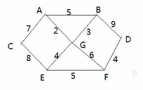
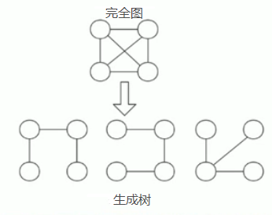
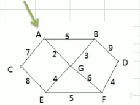
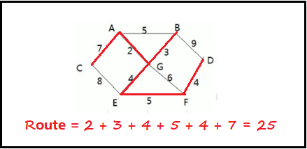
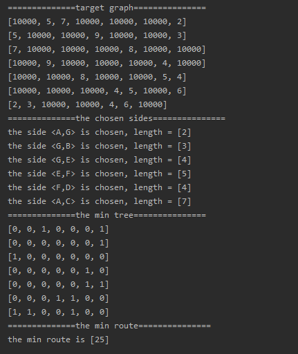

<!-- TOC -->

- [1. 普里姆算法的原理](#1-普里姆算法的原理)
  - [1.1. 应用场景-修路问题](#11-应用场景-修路问题)
  - [1.2. 修路问题的思路分析](#12-修路问题的思路分析)
  - [1.3. 修路问题的本质分析](#13-修路问题的本质分析)
    - [1.3.1. 最小生成树基本介绍](#131-最小生成树基本介绍)
  - [1.4. 普里姆算法的基本介绍](#14-普里姆算法的基本介绍)
  - [1.5. 普里姆算法的步骤详解](#15-普里姆算法的步骤详解)
  - [1.6. 普里姆算法的步骤图解](#16-普里姆算法的步骤图解)
- [2. 普里姆算法解决最小生成树问题的代码实现](#2-普里姆算法解决最小生成树问题的代码实现)
  - [2.1. 图类](#21-图类)
  - [2.2. 普里姆算法类](#22-普里姆算法类)
  - [2.3. 测试结果](#23-测试结果)

<!-- /TOC -->

****
[博主的 Github 地址](https://github.com/leon9dragon)
****

## 1. 普里姆算法的原理

### 1.1. 应用场景-修路问题
- 如下图所示的场景以及下面列出的问题  
  

1) 某地有 7 个村庄 `[A, B, C, D, E, F, G]`, 现需要修路将 7 个村庄连通.

2) 个个村庄的距离用边表示(权), 如 `A-B` 距离 5 公里.  

3) 如何修路保证各个村庄都能连通, 并且总的修建公路总里程最短?  

### 1.2. 修路问题的思路分析
- 如果直接将 10 条边都连接起来, 虽然能保证村庄连通,  
  但得到的总里程数并不是最小的, 因此这种方式不可行.

- 正确的思路应该是尽可能少地选择路线, 并且每条路线的长度最小,  
  在保证连通的前提下, 让每条路线的长度加起来的总里程数最小.

### 1.3. 修路问题的本质分析
修路问题实际是最小生成树问题, 最小生成树(Minimum Cost Spanning Tree), 简称 MST.  

#### 1.3.1. 最小生成树基本介绍


- 给定一个带权的无向连通图, 通过选取一棵生成树,  
  使树上所有边的权值总和最小, 这就是最小生成树.

- MST 如果有 N 个顶点, 那么一定会有 N-1 条边.

- MST 包含了完全图的全部顶点, N-1 条边都可在完全图中找到.

- 获取最小生成树的算法主要是普里姆算法和克鲁斯卡尔算法.

### 1.4. 普里姆算法的基本介绍
普里姆(Prim)算法求最小生成树, 也就是在包含 n 个顶点的连通图中,  
找出只有 n-1 条边包含所有 n 个顶点的连通子图, 也就是极小连通子图.

### 1.5. 普里姆算法的步骤详解
1) 设 `G={V, E}` 是连通网, `T={U, D}` 是最小生成树,  
   其中 V 和 U 是顶点集合, 而 E 和 D 是边的集合.

2) 若从顶点 `u[i]` 开始构造最小生成树,  
   则从集合 V 中取出顶点 `u[i]` 放入集合 U 中,  
   标记顶点 v 的 `visited[u[i]]=1`.

3) 若集合 U 中顶点 `u[i]` 与集合 V-U 中的顶点 `v[j]` 之间存在边,  
   则寻找这些边中权值最小的边, 但不能构成回路(即起点终点都是同一点),  
   将顶点 `v[j]` 放入集合 U 中, 将边 `(u[i], v[j])` 加入集合 D 中,  
   标记 `visited[v[j]]=1`.

4) 重复步骤 2, 直到 U 和 V 相等, 即所有顶点都标记为已访问,  
   此时 D 集合中存在着 `n-1` 条边.

### 1.6. 普里姆算法的步骤图解
  
- 假设从点 A 开始构造 MST:    
  - 将 A 先放入集合 U 中, 此时集合 `U = {A}`;  
  - 能跟 A 直接连通的顶点如下: `A-C[7], A-G[2], A-B[5]`;  
  - 其中 `A-G[2]` 的权值最小, 将 G 放入集合 U 中, `U = {A, G}`.

- 以 `U = {A, G}` 为子图继续构造:  
  - 将 A 和 G 顶点和它们相邻还没进行访问的顶点进行处理;
  - A 顶点未访问的顶点为 `A-C[7], A-B[5]`;
  - G 顶点未访问的顶点为 `G-B[3], G-E[4], G-F[6]`;
  - 其中 `G-B[3]` 权值最小, 将 B 放入 U 中, `U = {A, G, B}`.

- 以 `U = {A, G, B}` 为子图继续构造:  
  - 将 A 和 G, B 顶点和它们相邻还没进行访问的顶点进行处理;
  - A 顶点未访问的顶点为 `A-C[7]`;
  - G 顶点未访问的顶点为 `G-E[4], G-F[6]`;
  - B 顶点未访问的顶点为 `B-D[9]`;  
  - 其中 `G-E[4]` 权值最小, 将 E 放入 U 中, `U = {A, G, B, E}`.

- 以 `U = {A, G, B, E}` 为子图继续构造:  
  - 将 A 和 G, B, E 顶点和它们相邻还没进行访问的顶点进行处理;
  - A 顶点未访问的顶点为 `A-C[7]`;
  - G 顶点未访问的顶点为 `G-F[6]`;
  - B 顶点未访问的顶点为 `B-D[9]`;  
  - E 顶点未访问的顶点为 `E-C[8], E-F[5]`; 
  - 其中 `E-F[5]` 权值最小, 将 F 放入 U 中, `U = {A, G, B, E, F}`.  

- 以 `U = {A, G, B, E, F}` 为子图继续构造:  
  - 将 A 和 G, B, E 顶点和它们相邻还没进行访问的顶点进行处理;
  - A 顶点未访问的顶点为 `A-C[7]`;
  - G 顶点未访问的顶点为 `null`;
  - B 顶点未访问的顶点为 `B-D[9]`;  
  - E 顶点未访问的顶点为 `E-C[8]`;  
  - F 顶点未访问的顶点为 `F-D[4]`;
  - 其中 `F-D[4]` 权值最小, 将 D 放入 U 中, `U = {A, G, B, E, F, D}`.

- 以 `U = {A, G, B, E, F, D}` 为子图继续构造:  
  - 将 A 和 G, B, E 顶点和它们相邻还没进行访问的顶点进行处理;
  - A 顶点未访问的顶点为 `A-C[7]`;
  - G 顶点未访问的顶点为 `null`;
  - B 顶点未访问的顶点为 `null`;  
  - E 顶点未访问的顶点为 `E-C[8]`;  
  - F 顶点未访问的顶点为 `null`;  
  - D 顶点未访问的顶点为 `null`;  
  - 其中 `A-C[7]` 权值最小, 将 C 放入 U 中, `U = {A, G, B, E, F, D, C}`.

- 至此 `U {A, G, B, E, F, D, C} = V {A, B, C, D, E, F, G}`,  
  结束构造过程, 算法结束.  

- 最终得出的结果如下图所示, 红线为选择的通路, 总路程为 25.  
    


## 2. 普里姆算法解决最小生成树问题的代码实现
- 实现细节请看注释

### 2.1. 图类
```java
package com.leo9.dc37.prim_algorithm;

import java.util.Arrays;

//定义图类
public class MapGraph {
    //定义图的结点个数
    int vertex_num;
    //存放结点的数据
    char[] vertex_data;
    //邻接矩阵存放权值
    int[][] side_weight;

    //定义构造器, 初始化上述内容
    public MapGraph(int vertex_num) {
        this.vertex_num = vertex_num;
        vertex_data = new char[vertex_num];
        side_weight = new int[vertex_num][vertex_num];
    }

    /**
     * 初始化图的邻接矩阵
     *
     * @param map_graph   图对象
     * @param vertex_num  图的顶点个数
     * @param vertex_data 图的顶点值
     * @param side_weight 图的邻接矩阵
     */
    public void initMapGraph(MapGraph map_graph, int vertex_num, char[] vertex_data, int[][] side_weight) {
        int i, j;
        for (i = 0; i < vertex_num; i++) {
            map_graph.vertex_data[i] = vertex_data[i];
            for (j = 0; j < vertex_num; j++) {
                map_graph.side_weight[i][j] = side_weight[i][j];
            }
        }
    }

    //显示图的邻接矩阵
    public void showGraph() {
        for (int[] row : this.side_weight) {
            System.out.println(Arrays.toString(row));
        }
    }
}

```

### 2.2. 普里姆算法类
```java
package com.leo9.dc37.prim_algorithm;

import java.util.Arrays;

public class PrimAlgorithm {
    public static void main(String[] args) {
        //定义顶点数组
        char[] vertex_data = {'A', 'B', 'C', 'D', 'E', 'F', 'G'};
        int vertex_num = vertex_data.length;
        //邻接矩阵的关系用二维数组表示, 10000表示两点间不连通
        //因为权值很大的话, 就不会选择到这条边作为通路.
        int[][] side_weight = new int[][]{
                {10000, 5, 7, 10000, 10000, 10000, 2},
                {5, 10000, 10000, 9, 10000, 10000, 3},
                {7, 10000, 10000, 10000, 8, 10000, 10000},
                {10000, 9, 10000, 10000, 10000, 4, 10000},
                {10000, 10000, 8, 10000, 10000, 5, 4},
                {10000, 10000, 10000, 4, 5, 10000, 6},
                {2, 3, 10000, 10000, 4, 6, 10000}
        };

        //创建一个图对象, 并进行初始化
        MapGraph map_graph = new MapGraph(vertex_num);
        map_graph.initMapGraph(map_graph, vertex_num, vertex_data, side_weight);

        //打印初始的图
        System.out.println("==============target graph===============");
        map_graph.showGraph();

        //打印最小生成树相关信息, 从数组下标为0的点开始
        getMST(map_graph, 0);
    }

    /**
     * 编写普里姆算法,得到最小生成树
     *
     * @param map_graph    图对象
     * @param vertex_start 表示从第几个顶点开始生成 MST
     */
    public static void getMST(MapGraph map_graph, int vertex_start) {
        //定义数组, 标记结点是否被访问过, 默认元素值为 0, 表示没访问过
        int[] vertex_visited = new int[map_graph.vertex_num];

        //定义最小生成树的邻接矩阵, 用来存储边的权值, 通路为 1, 不通为 0
        int[][] min_tree = new int[map_graph.vertex_num][map_graph.vertex_num];

        //定义最短路径长度, 用来计算最小生成树所有通路的权值之和
        int min_route = 0;

        //将当前结点标记为已访问
        vertex_visited[vertex_start] = 1;

        //h1 和 h2 记录两个顶点的下标
        int h1 = -1;
        int h2 = -1;

        //将最小值初始化一个较大的数, 后面遍历的时候会被替换
        int min_weight = 10000;

        System.out.println("==============the chosen sides===============");
        //开始循环遍历, 因为最小连通子图的边数为 vertex_num-1
        //因此 k 初始值为 1, 遍历结束后就能获取顶点数减一条边
        for (int k = 1; k < map_graph.vertex_num; k++) {
            //寻找已被访问过的顶点与未被访问的顶点的连线的权值中的最小值
            //即选出当前已访问的顶点与未访问的顶点中的最小边
            //因为给定的邻接矩阵是完全图, 不连通的点之间的边的权值用大数值表示, 因此不会影响判断最小值
            for (int i = 0; i < map_graph.vertex_num; i++) {
                for (int j = 0; j < map_graph.vertex_num; j++) {
                    //通过遍历比较找到每一轮的最小边, 获取是哪两个顶点
                    //h1用来记录被访问顶点, h2用来记录未访问顶点
                    if (vertex_visited[i] == 1
                            && vertex_visited[j] == 0
                            && map_graph.side_weight[i][j] < min_weight) {
                        //找到最小边后替换最小值, 同时更新点的下标
                        min_weight = map_graph.side_weight[i][j];
                        h1 = i;
                        h2 = j;
                    }
                }
            }
            //中间的双重循环结束后能找出第 k 条边, 存储相应的数据
            //最小生成树的邻接矩阵记录边的权值, 因为是无向图, 所以两个方向的边权值都记为 1
            min_tree[h1][h2] = 1;
            min_tree[h2][h1] = 1;
            //最短路径长度进行累加
            min_route += map_graph.side_weight[h1][h2];
            //本轮新增边的另一个未被访问的端点记录已访问
            vertex_visited[h2] = 1;
            //输出边
            System.out.printf("the side <%c,%c> is chosen, length = [%d]\n", map_graph.vertex_data[h1], map_graph.vertex_data[h2], map_graph.side_weight[h1][h2]);
            //min_weight 重置, 防止后续对比出错
            min_weight = 10000;
        }
        //输出最小生成树
        System.out.println("==============the min tree===============");
        for (int[] row : min_tree) {
            System.out.println(Arrays.toString(row));
        }

        //输出最短路径
        System.out.println("==============the min route===============");
        System.out.printf("the min route is [%d]\n", min_route);
    }
}

```

### 2.3. 测试结果
- 显而易见, 最短路径长度是 25, 结果正确  
