<!-- TOC -->

- [1. 克鲁斯卡尔(Kruskal)算法的原理](#1-克鲁斯卡尔kruskal算法的原理)
  - [1.1. 算法应用场景-公交站问题](#11-算法应用场景-公交站问题)
  - [1.2. 算法基本介绍](#12-算法基本介绍)
  - [1.3. 算法图解说明](#13-算法图解说明)
    - [1.3.1. 最小连通子图的概念说明](#131-最小连通子图的概念说明)
    - [1.3.2. 构建最小连通子图的步骤](#132-构建最小连通子图的步骤)
    - [1.3.3. 算法的关键步骤分析](#133-算法的关键步骤分析)
    - [1.3.4. 对回路的概念和判断的说明](#134-对回路的概念和判断的说明)
- [2. 克鲁斯卡尔(Kruskal)算法的实现](#2-克鲁斯卡尔kruskal算法的实现)
  - [2.1. 边类](#21-边类)
  - [2.2. 算法类](#22-算法类)
  - [2.3. 测试结果](#23-测试结果)

<!-- /TOC -->

****
[博主的 Github 地址](https://github.com/leon9dragon)
****

## 1. 克鲁斯卡尔(Kruskal)算法的原理

### 1.1. 算法应用场景-公交站问题
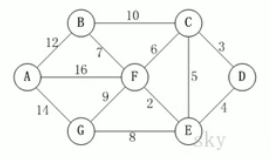  
- 某市新增 7 个站点 `{'A','B','C','D','E','F','G'}`, 现要把 7 个站点连通.
- 各个站点的距离用边线表示(权), 比如 `A-B` 距离 12 公里.  
- 如何修路保证各个站点都能连通, 并且修建的公路总里程最短?
- 本质上依旧是最小生成树问题.

### 1.2. 算法基本介绍
- 克鲁斯卡尔算法, 是用来求加权连通图的最小生成树的算法.

- 基本思想:  
  按照权值从小到大的顺序选择 n-1 条边, 并保证这些边不构成回路.

- 具体做法:  
  首先构造一个只含 n 个顶点的森林,  
  根据权值从小到大从连通网中选择边加入到森林中,  
  并使森灵中不产生回路, 直至森林变成一棵树为止.

### 1.3. 算法图解说明

#### 1.3.1. 最小连通子图的概念说明
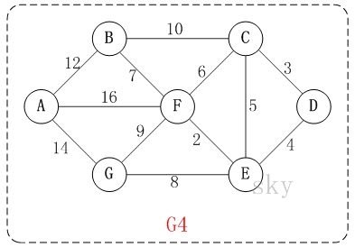  
- 在含有 n 个顶点的连通图中选择 `n-1` 条边, 构成极小连通子图,  
  并使该连通子图中 `n-1` 条边上的权值之和最小, 称为最小生成树.
  
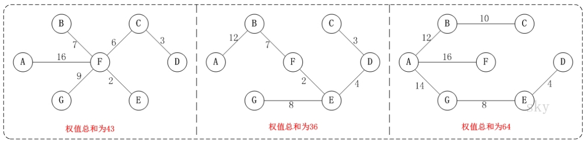  
- 如上图所示的连通网可以有多棵权值总和不相同的生成树.

#### 1.3.2. 构建最小连通子图的步骤
- 以上图为例, 来对克鲁斯卡尔进行演示(假设, 用数组 R 保存最小生成树结果).

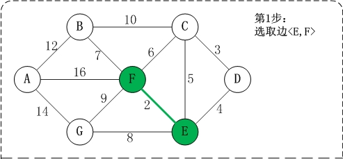
- 第1步: 将边 <E,F> 加入 R 中.   
    边 <E,F> 的权值最小, 因此将它加入到最小生成树结果R中.  

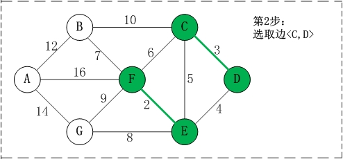
- 第2步: 将边 <C,D> 加入 R 中.    
    上一步操作之后, 边 <C,D> 的权值最小, 因此将它加入到最小生成树结果 R 中.  

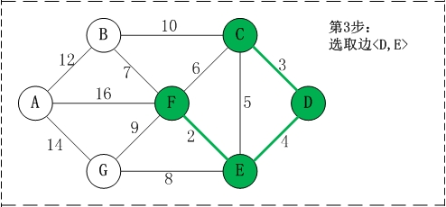
- 第3步: 将边 <D,E> 加入 R 中.  
    上一步操作之后, 边<D,E>的权值最小, 因此将它加入到最小生成树结果R中.  

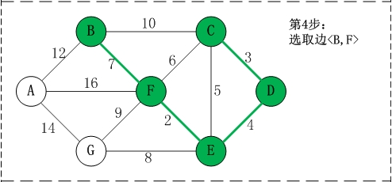
- 第4步: 将边<B,F>加入R中.  
    上一步操作之后, 边<C,E>的权值最小, 但<C,E>会和已有的边构成回路;   
    因此, 跳过边<C,E>. 同理, 跳过边<C,F>.  
    将边<B,F>加入到最小生成树结果R中.  

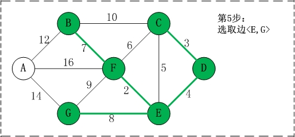
- 第5步: 将边<E,G>加入R中.  
    上一步操作之后, 边<E,G>的权值最小, 因此将它加入到最小生成树结果R中.  

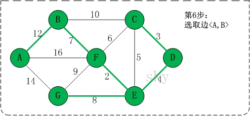
- 第6步: 将边<A,B>加入R中.  
    上一步操作之后, 边<F,G>的权值最小, 但<F,G>会和已有的边构成回路;  
    因此, 跳过边<F,G>. 同理，跳过边<B,C>.  
    将边<A,B>加入到最小生成树结果R中.

- 此时, 最小生成树构造完成.   
  它包括的边依次是: <E,F>, <C,D>, <D,E>, <B,F>, <E,G>, <A,B>.

#### 1.3.3. 算法的关键步骤分析
- 根据前面介绍的克鲁斯卡尔算法的基本思想和做法,   
  可知克鲁斯卡尔算法重点需要解决的以下两个问题:  
  - 问题一: 对图的所有边按照权值大小进行由小到大的排序.
  - 问题二: 将边添加到最小生成树中时, 如何判断是否形成回路.

- 问题一处理方式:  
  - 采用排序算法进行排序即可.

- 问题二处理方式:  
  - 记录顶点在最小生成树中的终点,  
  顶点的终点是在最小生成树中与它连通的最大顶点.  
  - 然后每次需要将一条边添加到最小生存树时,  
  判断该边的两个顶点的终点是否重合, 重合则会构成回路.

#### 1.3.4. 对回路的概念和判断的说明
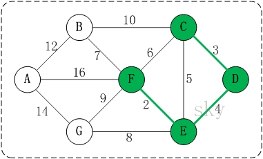  
- 将 <E,F> <C,D> <D,E> 加入到最小生成树后, 这几条边的顶点就有了终点:  
  - C的终点是F
  - D的终点是F
  - E的终点是F
  - F的终点是F

- 终点就是将所有顶点按照从小到大的顺序排列好之后;  
  这里按照 char 值进行排序, 因此这几个点最大的是 F.  
  所以某个顶点的终点就是与它连通的最大顶点.    

- 因此, 接下来要添加的下一条边的选择中:  
  虽然 <C,E> 是权值最小的边, 但是 C 和 E 的终点都是 F, 即它们的终点相同,  
  因此, 将 <C,E> 加入最小生成树的话, 会形成回路. 这就是判断回路的方式.

- 判断回路的方式就是:  
  在加入的边中的两个顶点, 它们不能指向同一个终点, 否则会构成回路.  

## 2. 克鲁斯卡尔(Kruskal)算法的实现
- 实现细节在注释中

### 2.1. 边类
```java
package com.leo9.dc38.kruskal_algorithm;

//创建一个边的类, 它的对象实例就表示一条边
public class SideData {
    //定义边的两个端点
    char start_point;
    char end_point;
    //定义边的权值
    int side_weight;

    public SideData(char start_point, char end_point, int side_weight) {
        this.start_point = start_point;
        this.end_point = end_point;
        this.side_weight = side_weight;
    }

    @Override
    public String toString() {
        return "<" + start_point +
                ", " + end_point +
                "> = " + side_weight;
    }
}

```

### 2.2. 算法类
```java
package com.leo9.dc38.kruskal_algorithm;

import java.util.Arrays;

public class KruskalAlgorithm {
    //定义边的数量
    private int side_num;
    //定义顶点值的数组
    private char[] vertex_data;
    //定义邻接矩阵
    private int[][] graph_matrix;
    //使用Integer的最大值来表示两点不连通, 即类似无穷远距离
    private static final int INF = Integer.MAX_VALUE;

    public static void main(String[] args) {
        char[] vertex_data = {'A', 'B', 'C', 'D', 'E', 'F', 'G'};
        int[][] graph_matrix = {
                /*A*//*B*//*C*//*D*//*E*//*F*//*G*/
                /*A*/ {0, 12, INF, INF, INF, 16, 14},
                /*B*/ {12, 0, 10, INF, INF, 7, INF},
                /*C*/ {INF, 10, 0, 3, 5, 6, INF},
                /*D*/ {INF, INF, 3, 0, 4, INF, INF},
                /*E*/ {INF, INF, 5, 4, 0, 2, 8},
                /*F*/ {16, 7, 6, INF, 2, 0, 9},
                /*G*/ {14, INF, INF, INF, 8, 9, 0}};

        KruskalAlgorithm algorithm_case = new KruskalAlgorithm(vertex_data, graph_matrix);
        algorithm_case.showMatrix();
        SideData[] mst_res = algorithm_case.getMST();
        System.out.println("\n============show the MST=============");
        showSide(mst_res);

    }

    //定义构造函数
    public KruskalAlgorithm(char[] vertex_data, int[][] graph_matrix) {
        //定义变量获取顶点数
        int vertex_num = vertex_data.length;

        //初始化顶点, 采用值传递的方式
        this.vertex_data = new char[vertex_num];
        for (int i = 0; i < vertex_num; i++) {
            this.vertex_data[i] = vertex_data[i];
        }

        //初始化边, 依然采用值传递方式
        this.graph_matrix = new int[vertex_num][vertex_num];
        for (int i = 0; i < vertex_num; i++) {
            for (int j = 0; j < vertex_num; j++) {
                this.graph_matrix[i][j] = graph_matrix[i][j];
            }
        }

        //统计边的数量, 因为是无向图, 获取一半的边就可以了
        for (int i = 0; i < vertex_num; i++) {
            for (int j = i + 1; j < vertex_num; j++) {
                if (graph_matrix[i][j] != INF) {
                    side_num++;
                }
            }
        }
    }

    //定义显示矩阵的方法
    public void showMatrix() {
        System.out.println("\n==========show matrix===========");
        for (int i = 0; i < 7; i++) {
            if (i == 0) {
                System.out.printf("%6c    ", 'A' + i);
            } else {
                System.out.printf("%-5c", 'A' + i);
            }
        }
        System.out.println();
        int index = 0;
        for (int[] row : graph_matrix) {
            System.out.printf("%-5c", 'A' + index);
            index++;
            for (int data : row) {
                if (data == INF) {
                    System.out.printf("%-5s", "INF");
                } else {
                    System.out.printf("%-5d", data);
                }

            }
            System.out.println();
        }
    }

    //定义方法对边进行排序, 传入的是边的集合
    private static void sortSide(SideData[] sides) {
        for (int i = 0; i < sides.length; i++) {
            for (int j = 0; j < sides.length - 1 - i; j++) {
                if (sides[j].side_weight > sides[j + 1].side_weight) {
                    SideData tmp = sides[j];
                    sides[j] = sides[j + 1];
                    sides[j + 1] = tmp;
                }
            }
        }
    }

    private static void showSide(SideData[] sides) {
        int count = 0;
        for (int i = 0; i < sides.length; i++) {
            System.out.printf("%-15s", sides[i]);
            count++;
            if (count == 3) {
                System.out.println();
                count = 0;
            }
        }
    }

    //定义方法返回传入顶点的下标, 找到则返回数组下标, 否则返回-1.
    private int getPosition(char vertex) {
        for (int i = 0; i < vertex_data.length; i++) {
            if (vertex_data[i] == vertex) {
                return i;
            }
        }
        return -1;
    }

    //定义方法获取图中的边, 放到边数组当中, 后续需要遍历该数组
    private SideData[] getSides() {
        //定义一个索引来给边数组遍历时进行使用
        int index = 0;
        //定义边数组
        SideData[] sides = new SideData[side_num];
        //循环遍历邻接矩阵, 获取边, 也是获取一半的就可以了
        for (int i = 0; i < vertex_data.length; i++) {
            for (int j = i + 1; j < vertex_data.length; j++) {
                if (graph_matrix[i][j] != INF) {
                    sides[index++] = new SideData(vertex_data[i], vertex_data[j], graph_matrix[i][j]);
                }
            }
        }
        return sides;
    }

    //定义方法获取下标为 i 的顶点的终点
    //用于后面进行判断两个顶点的终点是否相同而形成回路
    //ends[]数组是记录下标为 i 的顶点所对应的终点, 顶点数组和ends[]数组共用一套下标
    //递归遍历终点, 取的该顶点连通的边的最终点, 返回最终点下标, 若点未被连通返回点本身
    private int getVertexEnd(int[] ends, int i) {
        while (ends[i] != 0) {
            i = ends[i];
        }
        return i;
    }

    private SideData[] getMST() {
        //表示最终结果数组的索引
        int index = 0;
        //用于保存已有最小生成树中的每个顶点在最小生成树中的终点
        int[] ends = new int[side_num];
        //创建最终结果数组. 用于保存最小生成树.
        SideData[] mst_res = new SideData[vertex_data.length - 1];
        //获取图中所有边的集合, 并从小到大排序
        SideData[] sides = getSides();
        sortSide(sides);
        //输出当前图的边的集合
        System.out.println("\n============show graph's sides============");
        showSide(sides);

        //开始遍历边集合sides, 进行逐步构造最小生成树并判断即将加入的边是否构成回路
        for (int i = 0; i < side_num; i++) {
            //获取到第i条边的第一个顶点, 即边的起点
            int p1 = getPosition(sides[i].start_point);
            //获取到第i条边的第二个顶点, 即边的终点
            int p2 = getPosition(sides[i].end_point);

            //获取p1,p2两个顶点在已有的最小生成树中的终点
            int end_p1 = getVertexEnd(ends, p1);
            int end_p2 = getVertexEnd(ends, p2);

            //判断是否会构成回路
            if(end_p1 != end_p2){
                //如果没有构成回路, 则设置p1的终点为p2
                ends[end_p1] = end_p2;
                //同时将这条边加入最小生成树当中
                mst_res[index++] = sides[i];
            }
        }
        //最终返回最小生成树集合
        return mst_res;
    }
}

```

### 2.3. 测试结果
- 显而易见, 结果正确  
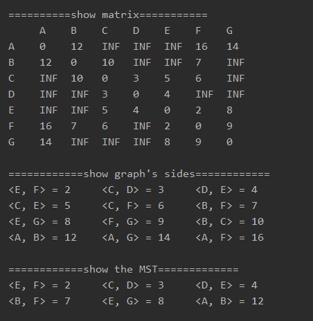