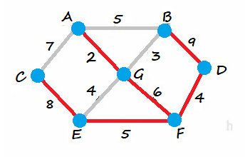

<!-- TOC -->

- [1. 迪杰斯特拉(Dijkstra)算法的原理](#1-迪杰斯特拉dijkstra算法的原理)
  - [1.1. 算法应用场景-最短路径问题](#11-算法应用场景-最短路径问题)
  - [1.2. 基本介绍](#12-基本介绍)
  - [1.3. 步骤详解](#13-步骤详解)
  - [1.4. 思路解析](#14-思路解析)
  - [1.5. 图解步骤](#15-图解步骤)
- [2. 迪杰斯特拉(Dijkstra)算法的实现](#2-迪杰斯特拉dijkstra算法的实现)
  - [2.1. 边类](#21-边类)
  - [2.2. 访问结点类](#22-访问结点类)
  - [2.3. 图类](#23-图类)
  - [2.4. 测试运行类](#24-测试运行类)
  - [2.5. 测试结果](#25-测试结果)
    - [2.5.1. 例图](#251-例图)
    - [2.5.2. 以 G 点为出发点进行测试](#252-以-g-点为出发点进行测试)
    - [2.5.3. 以 D 点为出发点进行测试](#253-以-d-点为出发点进行测试)

<!-- /TOC -->

****
[博主的 Github 地址](https://github.com/leon9dragon)
****

## 1. 迪杰斯特拉(Dijkstra)算法的原理

### 1.1. 算法应用场景-最短路径问题
  
- 战争时期, 胜利乡有 7 个村庄`{'A','B','C','D','E','F','G'}`,  
  现在有 6 个邮差, 从 G 点出发, 需要分别把邮件送往其余 6 个村庄.  

- 各个村庄的距离用变表示(权), 比如 `A-B` 距离 5 公里

- 如何计算出 G 村庄到其它各个村庄的最短距离?  

- 如果从其他村庄出发到各个村庄的最短距离又是多少?  

### 1.2. 基本介绍
- 迪杰斯特拉(Dijkstra)算法是典型最短路径算法, 用于计算一个结点到其它结点的最短路径.
- 它的主要特点是以起始点为中心向外层层扩展(广度优先搜索思想), 直到扩展到终点为止.

### 1.3. 步骤详解
- 设置出发点为 v, 顶点集合为 `V={v1,v2,vi...}`, v 到 V 中各点的距离构成距离集合 Dis.  

- `Dis={d1,d2,di...}`, Dis 集合记录着 v 到图中各顶点的距离, v 到自身可看做 0, v 到 vi 距离为 di.
  - 从 Dis 中选择值最小的 di 并移出 Dis 集合,  
    同时已出 V 集合中对应的顶点 vi,  
    此时的 v 到 vi 即为最短路径.

  - 更新 Dis 集合, 更新规则为: 比较 v 到 V 集合中顶点的距离值,  
    与 v 通过 vi 到 V 集合中顶点的距离值, 保留值较小的一个,  
    同时更新顶点的前驱结点为 vi, 表明是通过 vi 到达的.

  - 重复执行两步骤, 直到最短路径顶点为目标顶点即可结束.

### 1.4. 思路解析
- 要建立一个已访问顶点的类, 包含三个数组对访问信息进行记录

- 第一个是记录顶点是否被访问过的数组 `already_arr[]`,  
  已访问为 1, 未访问为 0, 会进行动态更新.  
  数组下标 i 对应的是第 i 个顶点,  
  数组成员 arr[i] 对应这个顶点是否被访问过.  

- 第二个是记录出发顶点到其它所有顶点的距离的数组 `dis[]`,  
  数组下标依旧对应的是第 i 个顶点, 数组成员则对应的是距离大小,  
  例如题中以 G 为出发点, 就会记录 G 到其它顶点的距离,  
  如 `arr[i] = n` 表示 G 到第 i 个顶点的距离为 n,  
  会动态进行更新, 求得的最短距离就会存放到数组中.
  
- 第三个是记录顶点的前驱结点的数组 `pre_visited[]`,  
  数组下标 i 对应的是第 i 个顶点,  
  数组成员 arr[i] 对应前驱结点在顶点数组中的下标.  
  例如 `arr[i] = j` 表示 第 i 个顶点的前驱结点是第 j 个顶点.    

### 1.5. 图解步骤

- 如下图所示, 下图是上述例题中的图的邻接矩阵.  
  

- 以 G 为起点进行访问的话, 是用广度优先的原则进行遍历.  
  因此会逐个对其邻接顶点进行访问, 访问的顶点为 `A,B,E,F`.

- 首先对三个数组进行初始化数值
  - `already_arr` 数组中出发点初始化为 1, 因为是从该点出发所以已经被访问;  
    其它成员初始化为 0, 表示这些顶点尚未作为起点进行遍历.   
  - `dis[]` 数组的出发顶点初始化值为 0, 表示到自身的距离为 0,  
    其它成员初始化为 65535, 表示所有顶点之间都不连通.  
  - `pre_visited[]` 数组的所有成员初始化为 null, 表示所有成员都没有前驱结点.  
    

- 然后以 G 为起点进行广度优先遍历, 并动态更新以上三个数组.  
  - 已访问数组中更新 `already_arr[i]=1` 表示点 G 已被作为起点访问过了.  
  - 距离数组中更新点 G 到各个点之间的权值, 点自己到自己的距离为 0,  
    能连通则写上边的权值, 不能连通则仍旧为 65535.  
  - 然后已被遍历的顶点的前驱结点的值, 即前驱结点的数组下标皆为 6.  
    

- 以此类推, 接下来以 `A,B,E,F` 作为起点分别对其邻接顶点进行访问,  
  注意是作为新的起点而非作为出发点进行遍历访问,  
  并从中比较 G 到剩余顶点的距离值, 与 G 通过 `A,B,E,F` 到 剩余顶点的距离值,  
  保留值较小的一个, 并将这个最小值放入距离数组中,  
  直到最短路径顶点为目标顶点即可结束, 即全部顶点都被访问过即可.  

## 2. 迪杰斯特拉(Dijkstra)算法的实现
- 实现细节都在注释当中有说明, 请务必看注释

### 2.1. 边类
```java
package com.leo9.dc39.dijkstra_algorithm;

public class SideRecord {
    //定义边的起点和终点
    char start_point;
    char end_point;
    //定义边的权值
    int side_weight;

    public SideRecord(char start_point, char end_point, int side_weight) {
        this.start_point = start_point;
        this.end_point = end_point;
        this.side_weight = side_weight;
    }

    @Override
    public String toString() {
        return "<" + start_point +
                ", " + end_point +
                "> = " + side_weight;
    }
}

```

### 2.2. 访问结点类
```java
package com.leo9.dc39.dijkstra_algorithm;

import java.util.Arrays;

public class VertexVisited {
    //定义数组记录各个顶点是否被访问过
    public int[] already_arr;
    //定义数组记录出发顶点到其他所有顶点的距离
    public int[] dis_arr;
    //定义数组记录每个结点对应的前驱结点
    public Integer[] pre_visited;

    //定义构造器, vertex_num 表示顶点个数, vertex_index 表示出发顶点的下标
    public VertexVisited(int vertex_num, int vertex_index) {
        this.already_arr = new int[vertex_num];
        this.dis_arr = new int[vertex_num];
        this.pre_visited = new Integer[vertex_num];
        //初始化距离数组, 并将起点到自身的距离设置为 0
        Arrays.fill(this.dis_arr, 65535);
        this.dis_arr[vertex_index] = 0;
        //再设置出发顶点为已访问
        already_arr[vertex_index] = 1;
    }

    //定义方法判断index顶点是否被访问过, 如果访问过, 返回true, 否则返回false.
    public boolean visitedOrNot(int vertex_index) {
        return already_arr[vertex_index] == 1;
    }

    //定义方法来更新距离数组, 更新的是出发顶点到index顶点的距离
    public void updateDis(int vertex_index, int new_distance) {
        dis_arr[vertex_index] = new_distance;
    }

    //定义方法来更新前驱结点数组, 更新的是index点的前驱结点,
    //前驱结点在结点数组的下标为 pre_index
    public void updatePre(int vertex_index, int pre_index) {
        pre_visited[vertex_index] = pre_index;
    }

    //定义方法来获取出发点到index顶点的距离
    public int getDis(int vertex_index) {
        return dis_arr[vertex_index];
    }

    //继续选择并返回新的访问顶点, 例如 G 访问完后, 就以 A,B,E,F 作为新的起点进行遍历访问
    public int updateStartPoint() {
        int min = 65535;
        int index = 0;
        //循环遍历, 从能连通的未被访问的顶点中选择路径最短的顶点出来作为下一个访问起点
        for (int i = 0; i < already_arr.length; i++) {
            if (already_arr[i] == 0 && dis_arr[i] < min) {
                min = dis_arr[i];
                index = i;
            }
        }
        //更新index顶点被访问过
        already_arr[index] = 1;
        return index;
    }
}

```

### 2.3. 图类
```java
package com.leo9.dc39.dijkstra_algorithm;

import java.util.ArrayList;
import java.util.Arrays;

//创建图类
public class Graph {
    //创建顶点数组
    private char[] vertex_data;
    //创建邻接矩阵
    private int[][] graph_matrix;
    //创建内置的顶点访问对象作为属性
    private VertexVisited vertex_visited;
    //定义边集合
    private ArrayList<SideRecord> side_record = new ArrayList<SideRecord>();

    //定义构造函数
    public Graph(char[] vertex_data, int[][] graph_matrix) {
        this.vertex_data = vertex_data;
        this.graph_matrix = graph_matrix;
    }

    //定义显示图的方法
    public void showGraph() {
        System.out.println("=========show the graph's matrix=========");
        for (int i = 0; i < graph_matrix[0].length; i++) {
            if (i == 0) {
                System.out.printf("%-3c", '\\');
            }
            System.out.printf("%-3c", 'A' + i);
        }
        System.out.println();
        for (int i = 0; i < graph_matrix.length; i++) {
            System.out.printf("%-3c", 'A' + i);
            for (int j = 0; j < graph_matrix[i].length; j++) {
                if (graph_matrix[i][j] == 65535) {
                    System.out.printf("%-3s", "N");
                } else {
                    System.out.printf("%-3d", graph_matrix[i][j]);
                }
            }
            System.out.println();
        }
    }


    //更新index下标顶点到周围顶点的距离和周围顶点的前驱结点
    private void updateData(int vertex_index) {
        int new_distance = 0;
        //遍历目标index起点所在的邻接矩阵那一行, 进行更新距离数组
        for (int i = 0; i < graph_matrix[vertex_index].length; i++) {
            //新距离的含义是: 先获取当前起点到其所有前驱结点的距离, 然后再加上当前起点到下一个顶点的距离.
            //所有前驱结点的距离的含义: 这个前驱结点的距离是不断累加的, 是从出发点一直连接到当前起点间的最短距离.
            new_distance = vertex_visited.getDis(vertex_index) + graph_matrix[vertex_index][i];

            //进行判断, 如果下一顶点未被访问过且当前新的距离比上次出发点到下一顶点的距离要小, 则进行距离更新
            //注意: 出发点一般来说都没有前驱结点, 在Integer数组中对应的前驱结点为NULL
            if (!vertex_visited.visitedOrNot(i) && new_distance < vertex_visited.getDis(i)) {
                vertex_visited.updatePre(i, vertex_index);
                vertex_visited.updateDis(i, new_distance);

                //这里加入对最小连通路径的记录, 记录每一条用于连通出发点到终点的连接边
                //删除被记录的边中重复结束端的边, 因为有比它更小的边加入了
                for (int j = 0; j < side_record.size(); j++) {
                    if (side_record.get(j).end_point == vertex_data[i]) {
                        side_record.remove(j);
                    }
                }

                //记录每一条被选中的边
                side_record.add(new SideRecord(vertex_data[vertex_index], vertex_data[i], graph_matrix[vertex_index][i]));
            }
        }
    }


    //定义实现迪杰斯特拉算法的方法, 传入的是出发起点的数组下标
    public void getMinRoute(int start_index) {
        //先定义一个顶点访问对象
        vertex_visited = new VertexVisited(vertex_data.length, start_index);
        //更新出发点到周围邻接点的距离
        updateData(start_index);
        //然后循环更新起点和距离, 因为上面已经有一个点被访问过了, 所以 i 从 1 开始
        for (int i = 1; i < vertex_data.length; i++) {
            start_index = vertex_visited.updateStartPoint();
            updateData(start_index);
        }
        //输出结果
        showResult();
    }

    //定义方法输出最终结果
    public void showResult() {
        System.out.println("===========show result===========");
        System.out.printf("%-15s", "the_vertex");
        for (char data : vertex_data) {
            System.out.printf("%-4c", data);
        }
        System.out.println();

        System.out.printf("%-15s", "last_vertex");
        for (Integer data : vertex_visited.pre_visited) {
            if (data != null) {
                System.out.printf("%-4d", data);
            } else {
                System.out.printf("%-4c", 'N');
            }
        }
        System.out.println();

        System.out.printf("%-15s", "min_route");
        for (int data : vertex_visited.dis_arr) {
            System.out.printf("%-4d", data);
        }
        System.out.println("\nNOTICE: this min route is the route from start point to end point!");
        System.out.println("EXAMPLE: route(G->C) = route(G->A) + route(A->C) = 2 + 7 = 9");

        System.out.println("===========show sides===========");
        int min_route = 0;
        for (int i = 0; i < side_record.size(); i++) {
            System.out.println(side_record.get(i));
            min_route += side_record.get(i).side_weight;
        }
        System.out.printf("\nall route = [%d]\n", min_route);
    }
}

```

### 2.4. 测试运行类
```java
package com.leo9.dc39.dijkstra_algorithm;

import java.util.Arrays;

public class DijkstraAlgorithm {
    public static void main(String[] args) {
        //定义顶点数组
        char[] vertex_data = {'A', 'B', 'C', 'D', 'E', 'F', 'G'};
        //定义邻接矩阵
        int[][] graph_matrix = new int[vertex_data.length][vertex_data.length];
        //定义最大值常量
        final int N = 65535;
        //初始化邻接矩阵
        graph_matrix[0] = new int[]{N, 5, 7, N, N, N, 2};
        graph_matrix[1] = new int[]{5, N, N, 9, N, N, 3};
        graph_matrix[2] = new int[]{7, N, N, N, 8, N, N};
        graph_matrix[3] = new int[]{N, 9, N, N, N, 4, N};
        graph_matrix[4] = new int[]{N, N, 8, N, N, 5, 4};
        graph_matrix[5] = new int[]{N, N, N, 4, 5, N, 6};
        graph_matrix[6] = new int[]{2, 3, N, N, 4, 6, N};

        //创建图对象
        Graph graph_case = new Graph(vertex_data, graph_matrix);
        //输出图的邻接矩阵
        graph_case.showGraph();
        //输出最短路径结果, 起点为 G 下标为 6
        graph_case.getMinRoute(6);
    }
}

```

### 2.5. 测试结果

#### 2.5.1. 例图
- 以下图为例, 进行测试  


#### 2.5.2. 以 G 点为出发点进行测试
- 输出结果  


- 实际图示  


****

#### 2.5.3. 以 D 点为出发点进行测试
- 输出结果  


- 实际图示  
