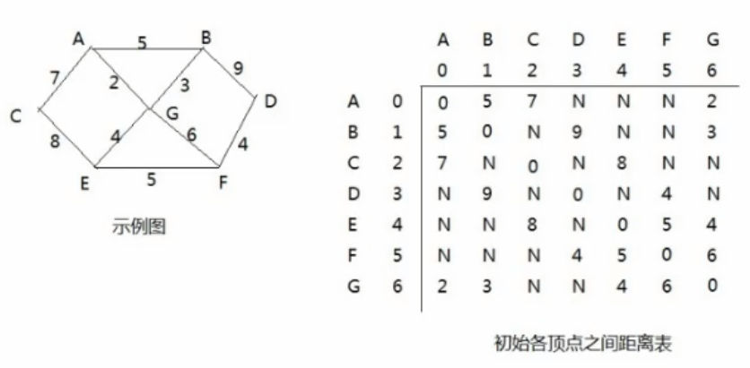
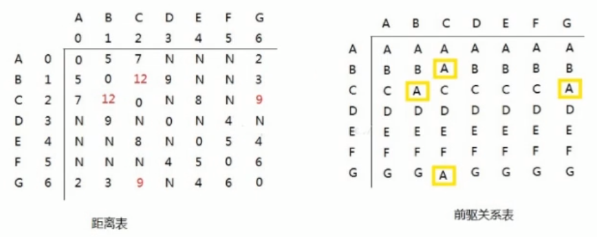
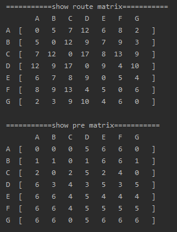

<!-- TOC -->

- [1. 弗洛伊德(Floyd)算法的原理](#1-弗洛伊德floyd算法的原理)
  - [1.1. 基本介绍](#11-基本介绍)
    - [1.1.1. 弗洛伊德算法和迪杰斯特拉算法比较](#111-弗洛伊德算法和迪杰斯特拉算法比较)
  - [1.2. 算法步骤](#12-算法步骤)
  - [1.3. 步骤图解](#13-步骤图解)
    - [1.3.1. 第一轮循环](#131-第一轮循环)
    - [1.3.2. 找出每个点作为中间结点的原理](#132-找出每个点作为中间结点的原理)
- [2. 弗洛伊德算法的实现](#2-弗洛伊德算法的实现)
  - [2.1. 图类](#21-图类)
  - [2.2. 测试类](#22-测试类)
  - [2.3. 测试结果](#23-测试结果)

<!-- /TOC -->

****
[博主的 Github 地址](https://github.com/leon9dragon)
****

## 1. 弗洛伊德(Floyd)算法的原理

### 1.1. 基本介绍
- 和迪杰斯特拉算法一样, 弗洛伊德(Floyd)算法也是一种用于寻找给定的加权图中顶点间最短路径的算法.

- 该算法名称以创始人之一, 1978 年图灵奖获得者, 斯坦福大学计算机科学系教授罗伯特弗洛伊德命名.

#### 1.1.1. 弗洛伊德算法和迪杰斯特拉算法比较
- 迪杰斯特拉算法计算图中图中某一顶点到其它顶点的最短路径.  
  迪杰斯特拉算法通过选定的被访问顶点,  
  算出从出发访问顶点到其它顶点的最短路径.

- 弗洛伊德算法计算图中各顶点到其它顶点之间的最短路径.  
  弗洛伊德算法中每一个顶点都是出发访问点,  
  所以需要将每一个顶点看作被访问顶点,  
  从而算出从每一个顶点到其他它顶点的最短路径.

### 1.2. 算法步骤
- 假设顶点 `v[i]` 到顶点 `v[k]` 的最短路径为已知的 `L[i][k]`,  
  顶点 `v[k]` 到 `v[j]` 的最短路径为已知的 `L[k][j]`,  
  顶点 `v[i]` 到 `v[j]` 的路径为 `L[i][j]`,  
  则 `v[i]` 到 `v[j]` 的最短路径为 `min{(L[i][k] + L[k][j]), L[i][j]}`,  
  `v[k]` 的取值为图中的所有顶点, 则可获得 `v[i]` 到 `v[j]` 的最短路径.  

- 至于 `v[i]` 到 `v[k]` 的最短路径 `L[i][k]` 或 `v[k]` 到 `v[j]` 的最短路径 `L[k][j]`,  
  是以上述同样的方式获得的.

### 1.3. 步骤图解
- 以下图为例进行步骤讲解, 下图是一张连通图和其邻接矩阵.  
  

- 下图是初始化的顶点间的前驱关系的矩阵.  
  在初始化的时候认为自身顶点到其它顶点的前驱结点都是自己.  
  此矩阵会后续进行动态更新来进行前驱结点的关系调整.
    

- 下面开始进行算法循环, 算法主要对点到点的距离表和前驱关系表进行动态操作.  

#### 1.3.1. 第一轮循环
在第一轮循环中, 以 A 点(下标为 0)作为中间结点, 两表更新如下.  
  
- 即把 A 点作为中间顶点的所有情况进行遍历, 以下列举情况.  
(1) `[C -> A -> B] = 12`  
(2) `[C -> A -> G] = 9`  
(3) `[B -> A -> G] = 7`  

- 然后在邻接矩阵 `graph_matrix[][]` 中的权值距离更新如下:  
  - `[C -> A -> B]` 对应的是 C 点到 B 点的距离,   
      - 原来两点间的距离为不连通或极大值, 而新值为 12 比原值要小, 因此进行替换.  
      
      - 因为是无向图, 所以中心对称位置的同样也要进行更新, 如下所示:  
      `graph_matrix[2][1] = N -> graph_matrix[2][1] = 12`  
      `graph_matrix[1][2] = N -> graph_matrix[1][2] = 12`  
      
      - 同时 C 到 B 之间的结点替换为 A. 同理 B 到 C 的也是.  
        即 C 到 B 之前要先到 A 点, B 到 C 之前要先到 A 点.

  - `[C -> A -> G]` 对应的是 C 点到 G 点的距离,   
      - 原来两点间的距离为不连通或极大值, 而新值为 9 比原值要小, 因此进行替换.  
      
      - 因为是无向图, 所以中心对称位置的同样也要进行更新, 如下所示:  
      `graph_matrix[2][6] = N -> graph_matrix[2][6] = 9`  
      `graph_matrix[6][2] = N -> graph_matrix[6][2] = 9`  
      
      - 同时 C 到 G 之间的结点替换为 A. 同理 G 到 C 的也是.  
        即 C 到 G 之前要先到 A 点, G 到 C 之前要先到 A 点.

  - `[B -> A -> G]` 对应的是 B 点到 G 点的距离,  
      - 原本点 B 到点 G 之间的距离为 3, 而 `[B -> A -> G]` 距离为 7,  
      
      - 以保留最短路径为原则, 原值比新值更小, 因此这里不需要替换原来的值.

#### 1.3.2. 找出每个点作为中间结点的原理  
- 有以下三个数组作为三层遍历的前提需要
  - 中间顶点 `mid_arr = {'A','B','C','D','E','F','G'}`
  - 出发顶点 `sta_arr = {'A','B','C','D','E','F','G'}`
  - 结束顶点 `end_arr = {'A','B','C','D','E','F','G'}`

- 首先第一层循环限定中间顶点, 给定 k 作为索引, k 从 0 开始,  
  k 最大值为数组长度减一.

- 然后第二层循环限定出发顶点, 给定 i 作为索引, i 从 0 开始,  
  i 最大值为数组长度减一.

- 接着第三层循环限定结束顶点, 给定 j 作为索引, j 从 0 开始,  
  j 最大值为数组长度减一.  

- 最后再在第三层循环的循环体内开始如下操作:  
  - 假设现在的中间顶点是 `mid_arr[k]`  
  - 先算出 `sta_arr[i]` 到 `end_arr[j]` 的距离, 定为 `Lse`.
  - 再算出 `sta_arr[i]` 到 `mid_arr[j]` 的距离, 定为 `Lsm`. 
  - 再算出 `mid_arr[j]` 到 `end_arr[j]` 的距离, 定位 `Lme`.
  - 其中 `Lsm + Lme` 就是起点经由中间点到终点的距离,  
    而 `Lse` 就是起点直接到终点的距离.
  - 接着对比 `Lse` 和 `Lsm + Lme` 的大小, 保留它们最小的那个.
  - 然后更新距离表中的值, 即 `graph_matrix[i][j] = min{Lse,(Lsm + Lme)}`
  - 最后再更新中间结点表即可.

- 当三层循环结束, 就能得到每个顶点到其它所有顶点的最短距离.

## 2. 弗洛伊德算法的实现
- 实现细节请务必看注释

### 2.1. 图类
```java
package com.leo9.dc40.floyd_algorithm;

import org.w3c.dom.ls.LSOutput;

import java.util.Arrays;

public class Graph {
    //存放顶点的数组
    private char[] vertex_data;
    //存放从各个顶点出发到其它顶点的距离, 最后结果也直接写入其中.
    private int[][] vertex_route;
    //存放到达目标顶点的前驱结点
    private int[][] vertex_pre;

    public Graph(char[] vertex_data, int[][] vertex_route) {
        //给顶点数组和距离矩阵赋值
        this.vertex_data = vertex_data;
        this.vertex_route = vertex_route;
        //初始化前驱结点数组
        this.vertex_pre = new int[vertex_data.length][vertex_data.length];
        for (int i = 0; i < vertex_data.length; i++) {
            Arrays.fill(vertex_pre[i], i);
        }
    }

    //实现弗洛伊德算法
    public void getRouteByFloydAlgorithm() {
        //定义临时变量保存最短路径
        int temp_route = 0;
        //开始三层循环, 第一层循环选的是中间顶点
        for (int k = 0; k < vertex_route.length; k++) {
            //第二层循环选的是出发顶点
            for (int i = 0; i < vertex_route.length; i++) {
                //第三层选择的是结束顶点
                for (int j = 0; j < vertex_route.length; j++) {
                    //获取顶点经过中间点再到终点的路径长度, 并赋给临时路径
                    temp_route = vertex_route[i][k] + vertex_route[k][j];
                    //然后用临时路径和起点到终点直连的路径比较
                    if (temp_route < vertex_route[i][j]) {
                        //如果临时路径比直连路径小, 则将直连路径重置为最小的临时路径
                        vertex_route[i][j] = temp_route;
                        //同时更新前驱结点
                        vertex_pre[i][j] = vertex_pre[k][j];
                    }
                }
            }
        }
    }


    //定义方法, 显示距离矩阵和前驱结点数组
    public void showArray() {
        System.out.println("===========show route matrix===========");
        for (int j = 0; j <= vertex_data.length; j++) {
            if (j - 1 < 0) {
                System.out.printf("%4c", ' ');
            } else {
                System.out.printf("%4c", vertex_data[j - 1]);
            }
        }
        System.out.println();
        //打印距离矩阵
        for (int i = 0; i < vertex_route.length; i++) {
            System.out.printf("%-3c[", 'A' + i);
            for (int j = 0; j < vertex_route.length; j++) {
                if (vertex_route[i][j] == 65535) {
                    System.out.printf("%4c", 'N');
                } else {
                    System.out.printf("%4d", vertex_route[i][j]);
                }
            }
            System.out.printf("   ]\n");
        }

        System.out.println();

        System.out.println("===========show pre matrix===========");
        for (int j = 0; j <= vertex_data.length; j++) {
            if (j - 1 < 0) {
                System.out.printf("%4c", ' ');
            } else {
                System.out.printf("%4c", vertex_data[j - 1]);
            }
        }
        System.out.println();
        //打印前驱结点矩阵
        for (int i = 0; i < vertex_pre.length; i++) {
            System.out.printf("%-3c[", 'A' + i);
            for (int j = 0; j < vertex_pre.length; j++) {
                System.out.printf("%4d", vertex_pre[i][j]);
            }
            System.out.printf("   ]\n");
        }
    }
}

```

### 2.2. 测试类
```java
package com.leo9.dc40.floyd_algorithm;

public class FloydAlgorithm {
    public static void main(String[] args) {
        char[] vertex_data = {'A', 'B', 'C', 'D', 'E', 'F', 'G'};
        int[][] vertex_route = new int[vertex_data.length][vertex_data.length];
        //定义最大值常量
        final int N = 65535;
        //初始化邻接矩阵
        vertex_route[0] = new int[]{0, 5, 7, N, N, N, 2};
        vertex_route[1] = new int[]{5, 0, N, 9, N, N, 3};
        vertex_route[2] = new int[]{7, N, 0, N, 8, N, N};
        vertex_route[3] = new int[]{N, 9, N, 0, N, 4, N};
        vertex_route[4] = new int[]{N, N, 8, N, 0, 5, 4};
        vertex_route[5] = new int[]{N, N, N, 4, 5, 0, 6};
        vertex_route[6] = new int[]{2, 3, N, N, 4, 6, 0};

        Graph graph_case = new Graph(vertex_data,vertex_route);
        graph_case.getRouteByFloydAlgorithm();
        graph_case.showArray();
    }
}

```

### 2.3. 测试结果
- 根据作者的自检验, 结果是正确的.  

