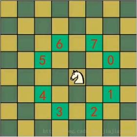
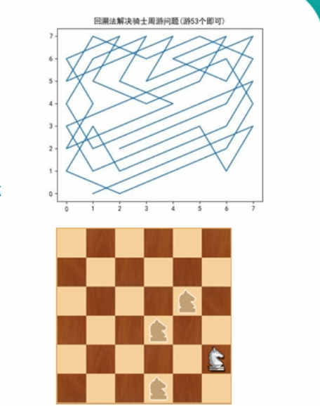
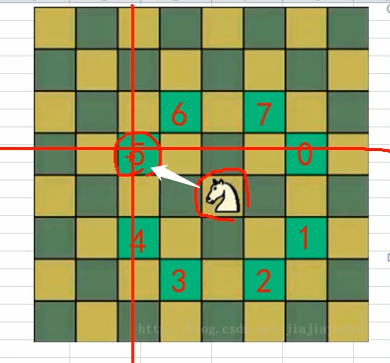
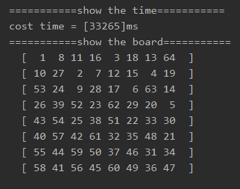
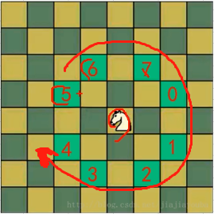
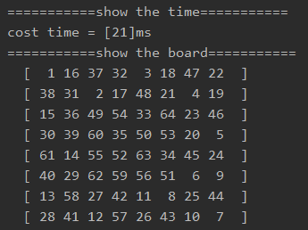

<!-- TOC -->

- [1. 马踏棋盘算法的原理](#1-马踏棋盘算法的原理)
  - [1.1. 基本介绍](#11-基本介绍)
  - [1.2. 原理分析](#12-原理分析)
  - [1.3. 解决思路](#13-解决思路)
  - [1.4. 实现图解](#14-实现图解)
- [2. 马踏棋盘算法的实现](#2-马踏棋盘算法的实现)
  - [2.1. 未经优化的算法](#21-未经优化的算法)
  - [2.2. 未经优化算法的测试结果](#22-未经优化算法的测试结果)
- [3. 马踏棋盘算法的贪心算法优化](#3-马踏棋盘算法的贪心算法优化)
  - [3.1. 未经优化的算法存在的缺陷](#31-未经优化的算法存在的缺陷)
  - [3.2. 贪心算法优化思路](#32-贪心算法优化思路)
  - [3.3. 优化后的代码](#33-优化后的代码)
  - [3.4. 优化后的算法的测试结果](#34-优化后的算法的测试结果)

<!-- /TOC -->

****
[博主的 Github 地址](https://github.com/leon9dragon)
****

## 1. 马踏棋盘算法的原理

### 1.1. 基本介绍
  
1) 马踏棋盘算法也被称为骑士周游问题.  
2) 将马随机放在国际象棋的 8×8 棋盘 `Board[0～7][0～7]`的  
   某个方格中, 马按走棋规则(马走日字)进行移动.  
   要求每个方格只进入一次, 走遍棋盘上全部 64 个方格.  

### 1.2. 原理分析
  
- 马踏棋盘问题实际上是图的深度优先遍历(DFS)的应用.

- 如果使用深度优先遍历来解决, 假设马走了 53 步.  
  如上图轨迹图所示, 走到第 53 步, 坐标为 (1,0),  
  发现已经走到了尽头, 没有办法继续, 则只能回溯,  
  然后查找其它路径, 于是就会在棋盘上不停的回溯.  

- 分析第一种方式的问题, 然后用贪心算法进行优化实现.

### 1.3. 解决思路
1. 创造棋盘 chessBoard, 是一个二维数组.  
   
2. 将当前位置设置为已访问, 然后根据当前位置,  
   计算马还能走的位置, 并放入到集合当中,  
   集合用 ArrayList, 最多有 8 个位置.  

3. 遍历 ArrayList 中存放的所有位置,  
   看哪一个位置可以走的通,  
   如果位置走的通, 则继续向前进行,  
   如果位置走不通, 则进行回溯还原.
     
4. 定义计数器 step 判断是否完成算法,  
   用 step 中的数和应该走的步数进行比较,  
   应该走的步数为棋盘格子数减一,  
   如果最后对比并不相等, 则没有完成算法,  
   则将棋盘置 0 表示棋盘无意义, 并不符合算法要求.  

- 注意: 马的不同走法回的到不同结果, 效率也会有一定的影响,  
  通过策略的优化对算法进行调整, 然后得出最好的效率.

### 1.4. 实现图解
- 判断马能走那个位置, 需要对 8 种情况进行判断.  

- 假设当前的马需要走向 5 号点, 如下图所示:  
  

- 以下代码就是对在马当前位置能不能走向 5 号点的判断
  - 横坐标 -2, 纵坐标 -1, 然后判断是否越界出棋盘.
  - 如果没有越界则加入备选位置的集合当中;  
    如果越界则不进行任何操作, 直接跳过即可.
  ``` java
  //创建一个 ArrayList 来存放马接下来的位置
  ArrayList<Point> point_list = new ArrayList<Point>();
  //创建一个 Point 对象, 用来接收下一个位置
  Point temp_point = new Point();
  //以当前位置的坐标进行判断, 计算出下一个位置, 判断 8 种情况
  //得到的位置没有越界出棋盘就可以加入集合当中进行备选
  if ((temp_point.x = curPoint.x - 2) >= 0 && (temp_point.y = curPoint.y - 1) >= 0) {
      point_list.add(temp_point);
  }
  ```

- 对 8 个位置的完整判断代码如下所示.  
  ```java
  // 5 号位的判断
  if ((temp_point.x = curPoint.x - 2) >= 0 && (temp_point.y = curPoint.y - 1) >= 0) {
      point_list.add(temp_point);
  }

  // 6 号位的判断
  if ((temp_point.x = curPoint.x - 1) >= 0 && (temp_point.y = curPoint.y - 2) >= 0) {
      point_list.add(temp_point);
  }

  // 7 号位的判断
  if ((temp_point.x = curPoint.x + 1) < X && (temp_point.y = curPoint.y - 2) >= 0) {
      point_list.add(temp_point);
  }

  // 0 号位的判断
  if ((temp_point.x = curPoint.x + 2) < X && (temp_point.y = curPoint.y - 1) >= 0) {
      point_list.add(temp_point);
  }

  // 1 号位的判断
  if ((temp_point.x = curPoint.x + 2) < X && (temp_point.y = curPoint.y + 1) < Y) {
      point_list.add(temp_point);
  }

  // 2 号位的判断
  if ((temp_point.x = curPoint.x + 1) < X && (temp_point.y = curPoint.y + 2) < Y) {
      point_list.add(temp_point);
  }

  // 3 号位的判断
  if ((temp_point.x = curPoint.x - 1) >= 0 && (temp_point.y = curPoint.y + 2) < Y) {
      point_list.add(temp_point);
  }

  // 4 号位的判断
  if ((temp_point.x = curPoint.x - 2) >= 0 && (temp_point.y = curPoint.y + 1) < Y) {
      point_list.add(temp_point);
  }
  ```


## 2. 马踏棋盘算法的实现

### 2.1. 未经优化的算法
```java
package com.leo9.knight_tour_problem;

import java.awt.*;
import java.util.ArrayList;
import java.util.Arrays;

public class KnightTour {
    //定义棋盘的行和列, X 为列数, Y 为行数
    private static int X;
    private static int Y;

    //创建一个数组, 标记棋盘各个位置是否被访问过
    private static boolean is_visited[];
    //使用一个属性, 标记是否棋盘的所有位置都已被访问
    private static boolean is_finished;

    public static void main(String[] args) {
        //下面开始进行测试
        //初始化棋盘, 为 8*8 的大小
        X = 8;
        Y = 8;

        //初始化马的第一步位置
        int init_row = 1;
        int init_col = 1;

        //初始化棋盘数组和访问数组
        int[][] chess_board = new int[X][Y];
        is_visited = new boolean[X * Y];

        //测试耗时
        long begin_time = System.currentTimeMillis();
        knightTour(chess_board, init_row - 1, init_col - 1, 1);
        long finish_time = System.currentTimeMillis();

        System.out.println("===========show the time===========");
        System.out.printf("cost time = [%d]ms\n", finish_time - begin_time);

        System.out.println("===========show the board===========");
        for (int[] row : chess_board) {
            System.out.printf("%3c", '[');
            for(int data : row){
                System.out.printf("%3d", data);
            }
            System.out.printf("%3c", ']');
            System.out.println();
        }
    }

    /**
     * 根据当前位置, 计算马还能走哪些位置, 并放入到集合当中, 最多有八个位置
     *
     * @param curPoint 表示当前位置
     * @return 返回的结果是下一个位置
     */
    public static ArrayList<Point> getNextPoint(Point curPoint) {
        //创建一个 ArrayList 来存放马接下来的位置
        ArrayList<Point> point_list = new ArrayList<Point>();
        //创建一个 Point 对象, 用来接收下一个位置
        Point temp_point = new Point();

        //以当前位置的坐标进行判断, 计算出下一个位置, 判断 8 种情况
        //得到的位置没有越界出棋盘就可以加入集合当中进行备选

        // 5 号位的判断
        if ((temp_point.x = curPoint.x - 2) >= 0 && (temp_point.y = curPoint.y - 1) >= 0) {
            point_list.add(new Point(temp_point));
        }

        // 6 号位的判断
        if ((temp_point.x = curPoint.x - 1) >= 0 && (temp_point.y = curPoint.y - 2) >= 0) {
            point_list.add(new Point(temp_point));
        }

        // 7 号位的判断
        if ((temp_point.x = curPoint.x + 1) < X && (temp_point.y = curPoint.y - 2) >= 0) {
            point_list.add(new Point(temp_point));
        }

        // 0 号位的判断
        if ((temp_point.x = curPoint.x + 2) < X && (temp_point.y = curPoint.y - 1) >= 0) {
            point_list.add(new Point(temp_point));
        }

        // 1 号位的判断
        if ((temp_point.x = curPoint.x + 2) < X && (temp_point.y = curPoint.y + 1) < Y) {
            point_list.add(new Point(temp_point));
        }

        // 2 号位的判断
        if ((temp_point.x = curPoint.x + 1) < X && (temp_point.y = curPoint.y + 2) < Y) {
            point_list.add(new Point(temp_point));
        }

        // 3 号位的判断
        if ((temp_point.x = curPoint.x - 1) >= 0 && (temp_point.y = curPoint.y + 2) < Y) {
            point_list.add(new Point(temp_point));
        }

        // 4 号位的判断
        if ((temp_point.x = curPoint.x - 2) >= 0 && (temp_point.y = curPoint.y + 1) < Y) {
            point_list.add(new Point(temp_point));
        }

        return point_list;
    }

    /**
     * 完成马踏棋盘算法
     *
     * @param chess_board 棋盘数组
     * @param cur_row     马当前位置的所在行, 行下标从 0 开始计算
     * @param cur_col     马当前位置的所在列, 列下标从 0 开始计算
     * @param step_num    表示马走的第几步, 初始位置是第 1 步, 第一步由 user 指定.
     */
    private static void knightTour(int[][] chess_board, int cur_row, int cur_col, int step_num) {
        //在棋盘上记录是第几步
        chess_board[cur_row][cur_col] = step_num;

        //更新访问数组, 令当前格子访问属性为已访问
        //访问数组下标表示的是第几个格子, 格子下标从 0 开始计算
        is_visited[cur_row * X + cur_col] = true;

        //获取当前位置可以走的下一个位置的集合
        //列对应横坐标, 行对应纵坐标
        ArrayList<Point> next_point = getNextPoint(new Point(cur_col, cur_row));

        //遍历下一个位置的集合, 集合不为空就能继续遍历.
        while (!next_point.isEmpty()) {
            //从集合中取出一个可以走的位置
            Point temp_point = next_point.remove(0);
            //判断该点是否已被访问, 没有被访问过则进行递归访问, 同时步数加一.
            if (!is_visited[temp_point.y * X + temp_point.x]) {
                knightTour(chess_board, temp_point.y, temp_point.x, step_num + 1);
            }
        }

        //判断算法是否完成
        if (step_num < X * Y && !is_finished) {
            //如果步数少于棋盘格子数, 则算法没有完成
            //需要重置棋盘格子的步数状态和访问状态

            //进入这个步骤说明有两种情况
            //1. 棋盘到目前位置, 仍然没有走完, 表示棋盘不满足要求, 导致算法失败.
            //2. 棋盘处于回溯状态, 需要将格子归零, 用于下一轮重新进行递归.
            chess_board[cur_row][cur_col] = 0;
            is_visited[cur_row * X + cur_col] = false;
        } else {
            //如果完成了算法, 就将完成状态置为真
            is_finished = true;
        }
    }
}

```

### 2.2. 未经优化算法的测试结果


## 3. 马踏棋盘算法的贪心算法优化

### 3.1. 未经优化的算法存在的缺陷
- 未优化的算法执行速度慢的原因是因为   

- 采用的步骤是按照 5-6-7-0-1-2-3-4 的方向顺时针进行  
    

- 这种策略没有考虑过走完这步后可能出现的下一步选择的个数,  
  如果下一步选择的个数越多, 回溯的次数也会越多, 因而耗时更长.

- 所以优化的方向则改为走下一步之后得到的可选择个数少的优先走

### 3.2. 贪心算法优化思路
- 先获取当前位置可以走的下一个位置的集合, 即 point_list

- 然后获取 point_list 中所有的 point 的下一步的选择的所有集合,  
  对这个集合根据集合成员的数量进行非递减排序, 即可完成优化.  


### 3.3. 优化后的代码
- 主要增加的是 sortArrayList 方法
- 方法在 knightTour 方法中获取 next_point 后  
  对这个集合后进行调用排序即可


```java
package com.leo9.knight_tour_problem;

import java.awt.*;
import java.util.ArrayList;
import java.util.Arrays;
import java.util.Comparator;

public class KnightTour {
    //定义棋盘的行和列, X 为列数, Y 为行数
    private static int X;
    private static int Y;

    //创建一个数组, 标记棋盘各个位置是否被访问过
    private static boolean is_visited[];
    //使用一个属性, 标记是否棋盘的所有位置都已被访问
    private static boolean is_finished;

    public static void main(String[] args) {
        //下面开始进行测试
        //初始化棋盘, 为 8*8 的大小
        X = 8;
        Y = 8;

        //初始化马的第一步位置
        int init_row = 1;
        int init_col = 1;

        //初始化棋盘数组和访问数组
        int[][] chess_board = new int[X][Y];
        is_visited = new boolean[X * Y];

        //测试耗时
        long begin_time = System.currentTimeMillis();
        knightTour(chess_board, init_row - 1, init_col - 1, 1);
        long finish_time = System.currentTimeMillis();

        System.out.println("===========show the time===========");
        System.out.printf("cost time = [%d]ms\n", finish_time - begin_time);

        System.out.println("===========show the board===========");
        for (int[] row : chess_board) {
            System.out.printf("%3c", '[');
            for (int data : row) {
                System.out.printf("%3d", data);
            }
            System.out.printf("%3c", ']');
            System.out.println();
        }
    }

    /**
     * 根据当前位置, 计算马还能走哪些位置, 并放入到集合当中, 最多有八个位置
     *
     * @param curPoint 表示当前位置
     * @return 返回的结果是下一个位置
     */
    public static ArrayList<Point> getNextPoint(Point curPoint) {
        //创建一个 ArrayList 来存放马接下来的位置
        ArrayList<Point> point_list = new ArrayList<Point>();
        //创建一个 Point 对象, 用来接收下一个位置
        Point temp_point = new Point();

        //以当前位置的坐标进行判断, 计算出下一个位置, 判断 8 种情况
        //得到的位置没有越界出棋盘就可以加入集合当中进行备选

        // 5 号位的判断
        if ((temp_point.x = curPoint.x - 2) >= 0 && (temp_point.y = curPoint.y - 1) >= 0) {
            point_list.add(new Point(temp_point));
        }

        // 6 号位的判断
        if ((temp_point.x = curPoint.x - 1) >= 0 && (temp_point.y = curPoint.y - 2) >= 0) {
            point_list.add(new Point(temp_point));
        }

        // 7 号位的判断
        if ((temp_point.x = curPoint.x + 1) < X && (temp_point.y = curPoint.y - 2) >= 0) {
            point_list.add(new Point(temp_point));
        }

        // 0 号位的判断
        if ((temp_point.x = curPoint.x + 2) < X && (temp_point.y = curPoint.y - 1) >= 0) {
            point_list.add(new Point(temp_point));
        }

        // 1 号位的判断
        if ((temp_point.x = curPoint.x + 2) < X && (temp_point.y = curPoint.y + 1) < Y) {
            point_list.add(new Point(temp_point));
        }

        // 2 号位的判断
        if ((temp_point.x = curPoint.x + 1) < X && (temp_point.y = curPoint.y + 2) < Y) {
            point_list.add(new Point(temp_point));
        }

        // 3 号位的判断
        if ((temp_point.x = curPoint.x - 1) >= 0 && (temp_point.y = curPoint.y + 2) < Y) {
            point_list.add(new Point(temp_point));
        }

        // 4 号位的判断
        if ((temp_point.x = curPoint.x - 2) >= 0 && (temp_point.y = curPoint.y + 1) < Y) {
            point_list.add(new Point(temp_point));
        }

        return point_list;
    }

    //先获取当前位置可以走的下一个位置的集合, 即 point_list
    //然后获取 point_list 中所有的 point 的下一步的选择的所有集合,
    //对这个集合根据集合成员的数量进行非递减排序.
    public static void sortArrayList(ArrayList<Point> point_list) {
        point_list.sort(new Comparator<Point>() {
            @Override
            public int compare(Point o1, Point o2) {
                //获取点o1的下一步的所有位置的个数
                int count1 = getNextPoint(o1).size();

                //获取点o2的下一步的所有位置的个数
                int count2 = getNextPoint(o2).size();

                if (count1 < count2) {
                    return -1;
                } else if (count1 == count2) {
                    return 0;
                } else {
                    return 1;
                }
            }
        });
    }

    /**
     * 完成马踏棋盘算法
     *
     * @param chess_board 棋盘数组
     * @param cur_row     马当前位置的所在行, 行下标从 0 开始计算
     * @param cur_col     马当前位置的所在列, 列下标从 0 开始计算
     * @param step_num    表示马走的第几步, 初始位置是第 1 步, 第一步由 user 指定.
     */
    private static void knightTour(int[][] chess_board, int cur_row, int cur_col, int step_num) {
        //在棋盘上记录是第几步
        chess_board[cur_row][cur_col] = step_num;

        //更新访问数组, 令当前格子访问属性为已访问
        //访问数组下标表示的是第几个格子, 格子下标从 0 开始计算
        is_visited[cur_row * X + cur_col] = true;

        //获取当前位置可以走的下一个位置的集合
        //列对应横坐标, 行对应纵坐标
        ArrayList<Point> next_point = getNextPoint(new Point(cur_col, cur_row));

        //对 next_point 集合中所有的成员的下一步的位置的数目进行非递减排序
        sortArrayList(next_point);

        //遍历下一个位置的集合, 集合不为空就能继续遍历.
        while (!next_point.isEmpty()) {
            //从集合中取出一个可以走的位置
            Point temp_point = next_point.remove(0);
            //判断该点是否已被访问, 没有被访问过则进行递归访问, 同时步数加一.
            if (!is_visited[temp_point.y * X + temp_point.x]) {
                knightTour(chess_board, temp_point.y, temp_point.x, step_num + 1);
            }
        }

        //判断算法是否完成
        if (step_num < X * Y && !is_finished) {
            //如果步数少于棋盘格子数, 则算法没有完成
            //需要重置棋盘格子的步数状态和访问状态

            //进入这个步骤说明有两种情况
            //1. 棋盘到目前位置, 仍然没有走完, 表示棋盘不满足要求, 导致算法失败.
            //2. 棋盘处于回溯状态, 需要将格子归零, 用于下一轮重新进行递归.
            chess_board[cur_row][cur_col] = 0;
            is_visited[cur_row * X + cur_col] = false;
        } else {
            //如果完成了算法, 就将完成状态置为真
            is_finished = true;
        }
    }
}

```

### 3.4. 优化后的算法的测试结果
- 速度有了明显的加快, 从原来 30000ms 变为 21ms  
- 优化效果非常显著.  
