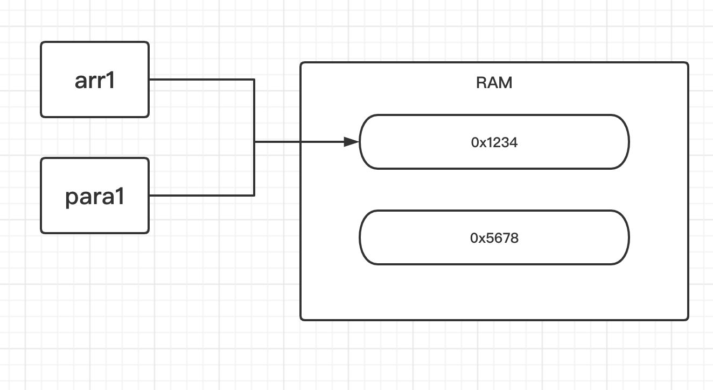
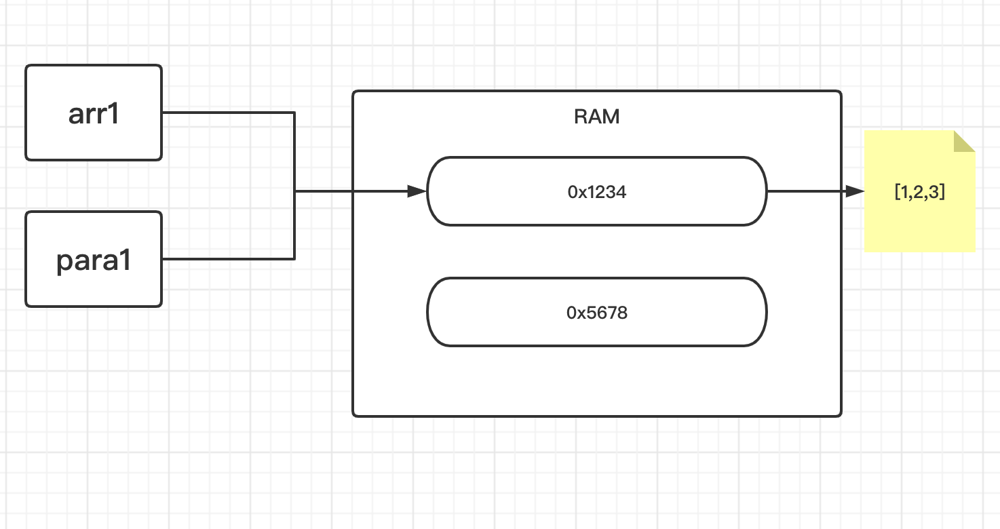
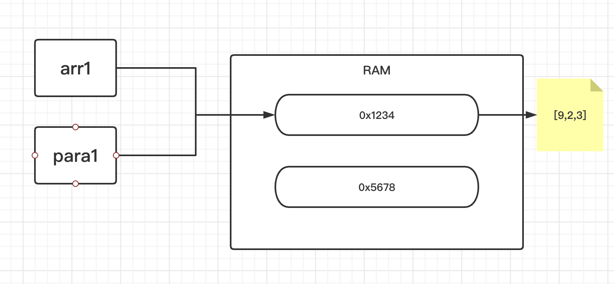
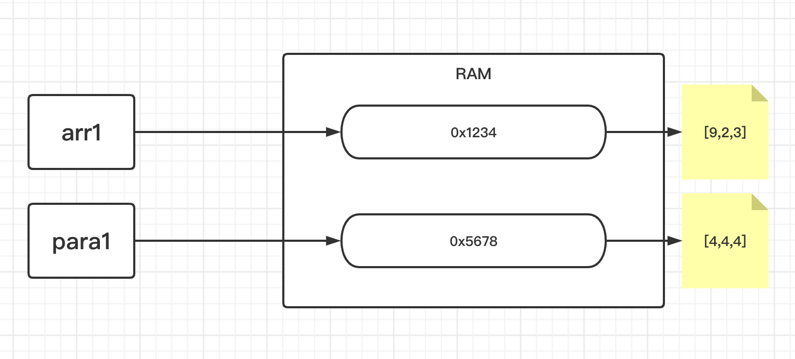
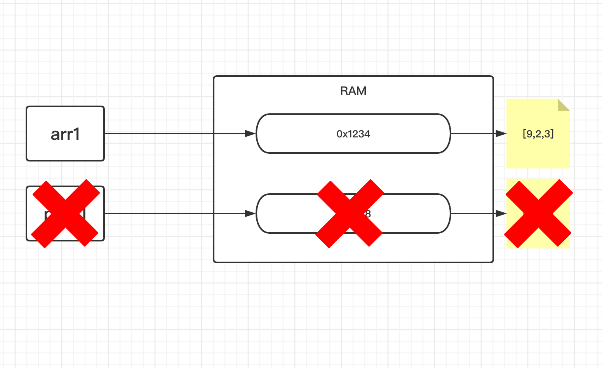

<!-- TOC -->

- [1. JAVA 中的值传递](#1-java-中的值传递)
  - [1.1. 基本数据类型的传递机制-值传递](#11-基本数据类型的传递机制-值传递)
  - [1.2. 引用数据类型的传递机制-引用传递](#12-引用数据类型的传递机制-引用传递)
  - [1.3. 关于形参中的引用传值](#13-关于形参中的引用传值)
    - [1.3.1. 图解传值机制](#131-图解传值机制)

<!-- /TOC -->

## 1. JAVA 中的值传递

### 1.1. 基本数据类型的传递机制-值传递


- 在方法被调用时, 实参通过形参把它的内容副本传入方法内部,  
此时形参接收到的内容是实参值的一个拷贝,  
因此在方法内对形参的任何操作, 都仅仅是对这个副本的操作,  
不影响原始值的内容.

- 实际上实参传递给形参的时候, 形参作为方法内部的变量,  
  会在栈里面重新开辟空间用来存储实参传递过来的值,  
  相当于在栈中有第二个和实参内容一样的空间, 但地址不同.  
  因此对形参的操作不会影响到实参,  
  形参在方法结束后其在栈中开辟的空间会被自动清理掉.

### 1.2. 引用数据类型的传递机制-引用传递


- "引用"也就是指向真实内容的地址值, 在方法调用时,  
  实参的地址通过方法调用被传递给相应的形参,  
  在方法体内形参和实参指向同一块内存地址,  
  对形参的操作会影响的真实内容. 

- 实际上, 引用传值也只是值传递, 具体流程和值传递类似,  
  因为实参给形参传递的是引用数据所在的堆空间的地址,  
  引用数据类型的存储都是在堆上进行分配和管理,  
  且引用值是通过堆空间地址的映射才能找到,  
  因此, 实参和形参虽然在栈空间中都开辟了空间且地址不一样,  
  但它们在栈中存储的指向的堆空间的地址却完全相同,  
  所以, 实参和形参都是指向同一块堆空间,  
  对形参值进行改变也会影响到实参值.  
  方法结束后删除形参的栈空间失去对堆空间的映射.

### 1.3. 关于形参中的引用传值
- 假设存在如下主函数:  
  ```java
  public static void main(String args[]){
    int[] arr1 = {1};
    int[] arr2 = {2};
    sampleFunction(arr1, arr2);
    System.out.println("arr1 = " + Arrays.toString(arr1));
    System.out.println("arr2 = " + Arrays.toString(arr2));
  }
  ```

- 假设存在一下实例函数:  
  ```java
  public void sampleFunction(int[] a1, int[] a2){
    int[] temp = a2;
    a2 = a1;
    a1 = a2;
  }
  ```

- 那么, 它们的执行结果如下:  
  ```java
  arr1 = [1]
  arr2 = [2]
  ```

- 预想中的交换结果并没有出现, 是因为如下原因:  
  - 首先 a1 和 a2 在函数被调用时是临时生成的变量,  
    它们最终会在函数结束调用时释放其内存空间.
  - 其次, 当 a1, a2 指向 arr1, arr2 的内存地址的时候,  
    这个时候直接对内存中的存储数据进行修改会影响到 arr1 和 arr2.
  - 但是一旦 a1, a2 改变的是地址指向, 就不会影响到 arr1 和 arr2 的指向,  
    因为引用传值影响的只是内存空间内的值, 而非变量所指向的内存空间地址.  
    因此单纯的改变内存空间的指向而不改变内存空间内的值,  
    这样是不会对 arr1, arr2 的值造成影响的.  
  - arr1, arr2 给 a1, a2 传递的只是内存地址, 实际上是值传递,  
    但共用的是同一个内存空间, 所以改变内存空间的值会对原数组造成影响.  
    但改变内存地址的指向, 就不会对原数组构成任何影响.

#### 1.3.1. 图解传值机制
- 在调用方法的时候, 会传递 `arr1` 数组的地址给形参 `para1`.  
  因此 `arr1` 和 `para1` 都会指向同一个地址所标记的内存空间.    
  

- 假设此时 `0x1234` 的地址空间中存放的数组是 `[1,2,3]`.  
  那么 arr1 和 para1 所代表的数组都是 `[1,2,3]`.  
  

- 如果此时对 `para1` 进行操作, 令 `para1[0] = 9`,  
  那么将会出现这个结果 `arr1 = {9,2,3}`,  
  因为它们共用一片内存空间, 内存空间的数据发生改变,  
  它们的值也会同时改变, 因为指向的都是同一个值.  
  


- 但是, 如果改变了 `para1` 的指向, 令 `para1 = {4,4,4}`,  
  此时 `para1` 就会指向新的一片内存空间 `0x5678`,  
  因为开辟了新内存空间给新的数组.  
  显而易见, 此时 `para1` 和 `arr1` 所指向的数据并不相同.
  

- 一旦方法调用结束, 就会释放形参的内存空间,  
  因此一旦形参跟实参指向的内存空间地址不同的时候,  
  不论形参后续作何修改都不会影响到实参的数值.  
  