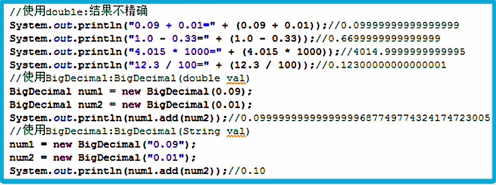

<!-- TOC -->

- [1. 常用类_数学相关类(java.math)](#1-常用类_数学相关类javamath)
  - [1.1. Math 类常用方法](#11-math-类常用方法)
    - [1.1.1. abs 方法](#111-abs-方法)
    - [1.1.2. max 方法](#112-max-方法)
    - [1.1.3. min 方法](#113-min-方法)
    - [1.1.4. random 方法](#114-random-方法)
  - [1.2. BigDecimal 类](#12-bigdecimal-类)
    - [1.2.1. 构造函数](#121-构造函数)
    - [1.2.2. add 方法(BigDecimal 类型加法)](#122-add-方法bigdecimal-类型加法)
    - [1.2.3. subtract 方法(BigDecimal 类型减法)](#123-subtract-方法bigdecimal-类型减法)
    - [1.2.4. multiply 方法(BigDecimal 类型乘法)](#124-multiply-方法bigdecimal-类型乘法)
    - [1.2.5. divide 方法(BigDecimal 类型除法)](#125-divide-方法bigdecimal-类型除法)
  - [1.3. BigInteger 类](#13-biginteger-类)

<!-- /TOC -->

## 1. 常用类_数学相关类(java.math)
- 在 `java.math` 中可以找到以下类.
- 常用的数学相关的类有三个:  
  - Math 类
  - BigDecimal 类
  - BigInteger 类

****

### 1.1. Math 类常用方法
- `Math` 类包含用于执行基本数学运算的方法, 如初等指数\对数\平方根和三角函数,  
  且该类中都是静态方法.

#### 1.1.1. abs 方法
- 方法定义:  
  - `public static XXX abs(double a)`
  - `XXX` 是数据类型, 仅支持: `int, double, long, float`.  
  

- 作用:  
  返回参数的绝对值.  

#### 1.1.2. max 方法 
- 方法定义:  
  - `public static XXX max(XXX a, XXX b)`
  - `XXX` 是数据类型, 仅支持: `int, double, long, float`.

- 作用:  
  返回两个参数中较大的那个.

#### 1.1.3. min 方法 
- 方法定义:  
  - `public static XXX min(XXX a, XXX b)`
  - `XXX` 是数据类型, 仅支持: `int, double, long, float`.

- 作用:  
  返回两个参数中较小的那个.

#### 1.1.4. random 方法
- 方法定义:  
  `public static double random()`  

- 作用:  
  返回带正号的 double 值, 该值大于等于 0.0 且小于 1.0.  
  返回值是一个伪随机选择的数, 在该范围内(近似)均匀分布.  

****

### 1.2. BigDecimal 类
- double 和 float 都不能精确的表示小数, 因此需要此类处理精度要求高的数据.
- 此类表示不可变的任意精度的有符号十进制数.

#### 1.2.1. 构造函数
- 这里介绍 double 类型和 String 类型的构造函数, 其它构造函数可看 api.

- double 类型构造函数

  - double 类型构造函数定义:  
    `public BigDecimal(double val)`

  - 作用:  
    将 double 转换为 BigDecimal.  
    后者是 double 的二进制浮点值准确的十进制表示形式.

  - 备注:  
    1. 此构造方法的结果有一定的不可预知性.  
       因为传入的值无法准确的表示为 double.  
       因此传入构造方法的值不会正好等于字面值.  

    2. 但是用 `String` 构造方法是完全可预知的.  
       因此建议优先使用 String 的构造方法.

- String 类型构造函数
  - String 类型构造函数定义:  
    `public BigDecimal(String val)`

  - 作用:  
    将 BigDecimal 的字符串表示形式转换为 BigDecimal.

#### 1.2.2. add 方法(BigDecimal 类型加法)
- 方法定义:  
  `public BigDecimal add(BigDecimal augend)`

- 作用:  
  返回一个 BigDecimal, 其值为 `(this + augend)`,  
  即两个 BigDecimal 的值想加, 返回相加之和,  
  其标度为 `max(this.scale(), augend.scale())`.

- 图例:  
  

#### 1.2.3. subtract 方法(BigDecimal 类型减法)

#### 1.2.4. multiply 方法(BigDecimal 类型乘法)

#### 1.2.5. divide 方法(BigDecimal 类型除法)

****

### 1.3. BigInteger 类
- 两个 long 类型的最大值相运算, 其结果会使得 long 类型存储不下.  
  因此需要大整型变量进行存储.  

- 该类表示不可变的任意精度的整数. 类中操作方法和 BigDecimal 类的方法相似.